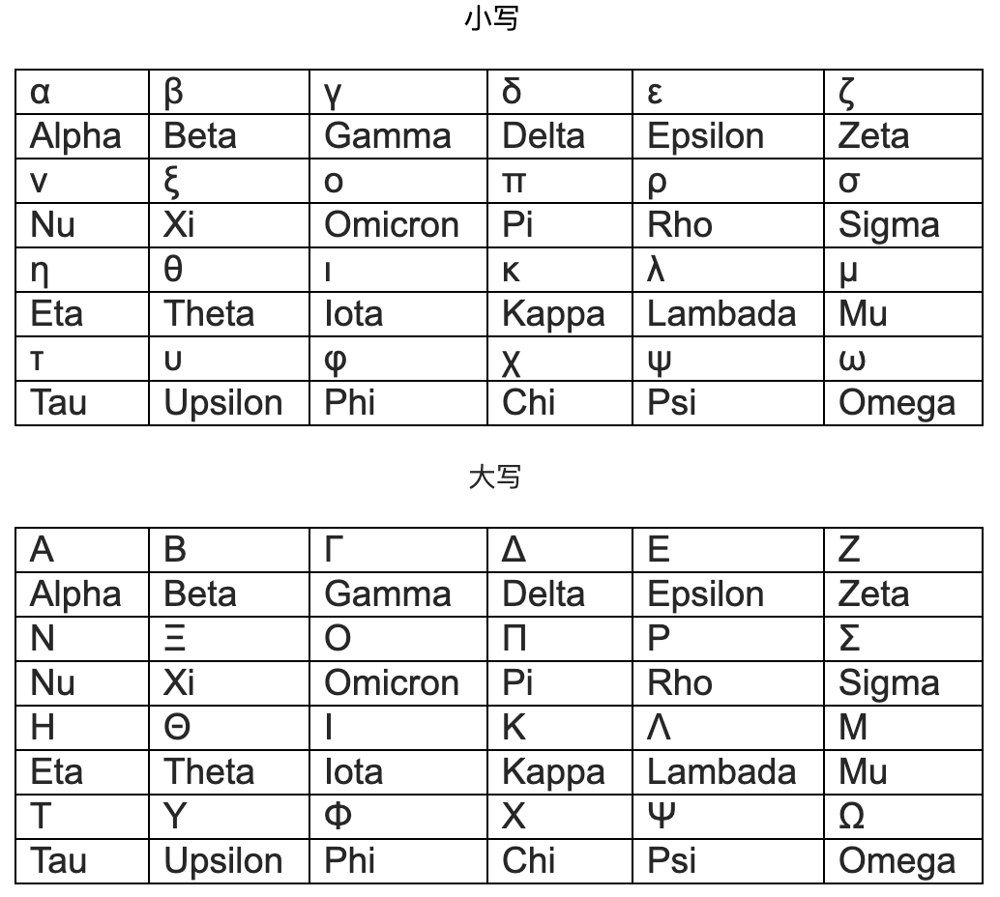

LaTeX 数学公式快速入门
数学 | 计算机 | 笔记
LaTeX 数学公式快速入门，通过一个简单的行间公式，简单地了解 LaTeX 数学公式的书写格式，能够写出简单的数学公式；然后列出了一些更高级的 LaTeX 格式，比如矩阵，矩阵分块，算式对齐，不同种类的字体等等。未完成。
2018-10-6


## 快速入门

如何打出下面这个式子？
$$
\sum_{y = 0}^{\infty}\lim_{x \to 0}\left(\sqrt{\frac{\alpha x}{\beta y}} + 1\right)^{e + 2} \left(\overrightarrow{AB} \cdot \overrightarrow{CD}\right)
$$

### 开始

$\TeX$ 软件一般都非常的大，公式入门只需要有一个支持 **MathJax**（一个跨浏览器的 JavaScript 库）的软件，这里推荐几个 Markdown 软件，它们都内置 MathJax。

[Typora](https://typora.io/)：Typora，所见即所得，全平台支持，最好用的免费的 Markdown 工具，功能完备，界面好看。

[Cmd Markdown](https://zybuluo.com/)：Cmd Markdown 编辑阅读器，同样全平台支持支持实时同步预览，区分写作和阅读模式，支持在线存储，分享文稿网址。


首先你要告诉编辑器你打的是数学公式。

如何表示`行间公式`，上下各两个 *\$* 符把代码框起来，像这样：

```mathematica
$$
E = MC^2
$$
```

效果:
$$
E = MC^2
$$

如果想在一行之间打公式，请用`行内公式`，左右各一个  *\$* 符把内容框起来。

像这样：*\$E = MC^2\$*，效果：$E = MC^2$，（typora 可能需要：设置 -> Markdwon -> 打开内联公式）

### 求和

#### 符号

第一个是求和符号，MathJax 中各种符号都用`反斜杠`开头 *\*，求和则是 *\sum*：下面是其他常用符号：

*\prod*，*\int*，*\iint*，*\bigcup*，*\bigcap*：$\prod$，$\int$，$\iint$，$\bigcup$，$\bigcap$

#### 上下限

MathJax 中上下限和角标的表示方法相同，使用`下划线`和`hat 符 ^`：

*X_0^2*：$X_0^2$（角标）、 *\sum_0^2*：$\sum_0^2$（上下限	）

当输入的是行间公式时，求和等符号的角标就会挪到正上下方：
$$
\sum_0^2 \quad \prod_0^2 \quad \bigcup_0^2 \quad \int_0^2
$$

`请注意：`

1. 当角标的长度大于 $1$ 时，请用 *{…}* 来表示它们是一组公式。比如，*X_{i + j}^e*：$X_{i + j}^e$，否则，*X_i + j^e*：$X_i + j^e$
2. 公式渲染时忽略你打的所有空格。想打空格怎么办，用反斜杠加 *, ; quad qquad*。*a\,b*， *a\;b* ，*a\quad b*， *a\qquad b*：$a \, b$，$a \; b$，$a \quad b$，$a \qquad b$

### 极限

**极限符号**，*\lim*：$\lim$

$x$ **趋近于** $0$：*x \to 0*：$x \to 0$；用 *\to* 来表示趋向箭头。

组合起来：*\lim_{x \to 0}*：$\lim_{x \to 0}$，类似的，如果是行间公式，$x \to 0$ 会挪到正下方。

##### 箭头符号

介绍一些其他的常用箭头。

*\to*, *\rightarrow*, *\leftarrow*, *\Rightarrow*, *\Leftarrow*, *\mapsto*, *\iff*

$\to$, $\rightarrow$, $\leftarrow$, $\Rightarrow$, $\Leftarrow$, $\mapsto$, $\iff$

### 开根、分数、希腊字母、括号

$$
\left(\sqrt{\frac{\alpha x}{\beta y}} + 1\right)^{e + 2}
$$
```markdown
\left(\sqrt{\frac{\alpha x}{\beta y}} + 1\right)^{e + 2}
```

我们一个一个来看。

#### 算术平方根

*\sqrt{x^3}*：$\sqrt{x^3}$

当然也能开其他次根，用 *[…]* 表示：*\sqrt[n]{x^3}*：$\sqrt[n]{x^3}$

#### 分数

分数用 *frac* 加上两个花括号表示分母和分子，*\frac{a}{b}*：$\frac{a}{b}$

分数里面也能套分数，*\frac{\frac{a}{b}}{c}*：$\frac{\frac{a}{b}}{c}$，但是这样太不美观，建议 *\frac{a / b}{c}*：$\frac{a / b}{c}$

#### 希腊字母

希腊字母同样用反斜杠 *\* 开头表示，后接名称，比如，*\alpha*：$\alpha$，*\beta*，$\beta$，*\sigma*：$\sigma$

首字母大写表示大写字母，比如，*\Gamma*：$\Gamma$，*\Delta*：$\Delta$

`请注意`：部分希腊字母就是**英文大写字母**，有一些软件不支持 *\Alpha* 这样的语法，请用英文字母 *A*。

下面是希腊字母表：



#### 括号

普通的括号 *()[]{}<>* 都在键盘上，这里讲的是一些特殊括号。

##### 自适应括号

我们发现：*(\sqrt{\frac{a}{b}})*：$(\sqrt{\frac{a}{b}})$ 并不是很美观。

可以修改为自适应括号来优化，用 *\left( … \right)* 将内容括起来，*\left(\sqrt{\frac{a}{b}}\right)*：$\left( \sqrt{\frac{a}{b}} \right)$

当然你也可以自己选择**不同大小的括号**：

*\Biggl(\biggl(\Bigl(\bigl((x)\bigr)\Bigr)\biggr)\Biggr)*：$\Biggl(\biggl(\Bigl(\bigl((x)\bigr)\Bigr)\biggr)\Biggr)$

##### 其他特殊括号

更好看的尖括号，*\langle x \rangle*：$\langle x \rangle$

向上取整：*\lceil x \rceil* ：$\lceil x \rceil$

向下取整：*\lfloor x \rfloor*： $\lfloor x \rfloor$

## 进阶符号

[手绘你想输入的符号](http://detexify.kirelabs.org/classify.html)

### 常用运算运算符号

大小关系：*\lt \gt \le \ge \neq*：$\lt \; \gt \; \le \; \ge \; \neq$

可以在前面添加 *\not*：*\not\lt*：$\not\lt$，但并不优美


四则运算：*\times \div \pm \mp \cdot*： $\times \; \div \; \pm \; \mp \; \cdot$

集合：
- *\setminus \subset \subseteq \subsetneq \supset \supseteq*： $\setminus  \; \subset \; \subseteq \; \subsetneq \; \supset \; \supseteq$
- *\cup \cap* ： $\cup \; \cap$ 
- *\in \notin \emptyset \varnothing*：$\in \; \notin \; \emptyset \; \varnothing$


组合数：*\binom{n+1}{2k}* ：$\binom{n+1}{2k}$

和与积分：*\sum* $\sum$，*\prod* $\prod$，*\int* $\int$，*\iint* $\iint$，*\bigcup* $\bigcup$，*\bigcap* $\bigcap$


等号：*\approx \sim \simeq \cong \equiv \prec \lhd \therefore*：$\approx \sim \simeq \cong \equiv \prec \lhd \therefore$

取模恒等：*a \equiv b\pmod n*：$a \equiv b\pmod n$

### 其他符号

省略号，*\ldots*：$\ldots$

比如：*a{1} + a{2} + \ldots + a{n}*：$a_{1} + a_{2} + \ldots + a_{n}$


$\TeX$ 专用符号：*\LaTeX*，*\TeX*：$\LaTeX$，$\TeX$


顶部符号：*\hat{xx}*：$\hat{x}$，*\widehat{xy}*：$\widehat{xy}$，*\bar{}*，$\bar{x}$，，*\overline{xyz}*：$\overline{xyz}$，*\vec{x}*：$\vec{x}$，*\overrightarrow{xy}*：$\overrightarrow{xy}$，*\overleftrightarrow{xy}*：$\overleftrightarrow{xy}$，*\dot{x}*：$\dot{x}$，*\ddot{x}*：$\ddot{x}$


音符：*\flat \sharp*：$\flat \quad \sharp$


其他：*\land \lor \lnot \forall \exists \top \bot \vdash \vDash*：$\land \lor \lnot \forall \exists \top \bot \vdash \vDash$

*\star \ast \oplus \circ \bullet*：$\star \ast \oplus \circ \bullet$

*\chi \infty \aleph_0*：$\chi \; \infty \; \aleph_0$

*\nabla \partial*：$\nabla \partial$

*\Im \Re*：$\Im \Re$

## 高级格式

### 文字说明

\text{…} 文字说明

*{x \in s | \text{x is extra large}\}*：$\{x \in s | \text{x is extra large}\}$

### 矩阵

**注意**：块级公式记得用 `\\` 表示换行

```
\begin{matrix}
1 & x & x^2 \\
1 & y & y^2 \\
1 & z & z^2 \\
\end{matrix}
```

$$
\begin{matrix}
    1 & x & x^2 \\
    1 & y & y^2 \\
    1 & z & z^2 \\
\end{matrix}
$$


在 *\begin{}* 和 *\end{}* 的花括号中加入相同的其他内容，还有更多的括号形式：*pmatrix*, *bmatrix*, *Bmatrix*, *vmatrix*, *Vmatrix*

效果：$\begin{pmatrix}1 & x & x^2 \\1 & y & y^2 \\1 & z & z^2 \\\end{pmatrix}$, $\begin{bmatrix}1 & x & x^2 \\1 & y & y^2 \\1 & z & z^2 \\\end{bmatrix}$, $\begin{Bmatrix}1 & x & x^2 \\1 & y & y^2 \\1 & z & z^2 \\\end{Bmatrix}$, $\begin{vmatrix}1 & x & x^2 \\1 & y & y^2 \\1 & z & z^2 \\\end{vmatrix}$, $\begin{Vmatrix}1 & x & x^2 \\1 & y & y^2 \\1 & z & z^2 \\\end{Vmatrix}$

#### 内容省略

使用 *cdots*, $\cdots$, *\ddots*, $\ddots$, *\vdots*, $\vdots$ 来表示省略内容：

效果：
$$
\begin{pmatrix}
    1 & a_1 & a_{1}^{2} & \cdots & a_{1}^{n} \\
    1 & a_{2} & a_{2}^{3} & \cdots & a_{2}^{n} \\
    \vdots & \vdots & \vdots & \ddots & \vdots \\
    1 & a_{m} & a_{m}^{2} & \cdots & a_{m}^{n} \\
\end{pmatrix}
$$


#### 矩阵分块

垂直：*{cc | ccc}*

```
\left[
\begin{array}{cc|c}
  1&2&3\\
  4&5&6
\end{array}
\right]
```

$$
\left[
\begin{array}{cc|c}
  1&2&3\\
  4&5&6
\end{array}
\right]
$$

水平：*\hline*

```
\begin{pmatrix}
a & b\\
c & d\\
\hline
1 & 0\\
0 & 1
\end{pmatrix}
```

$$
\begin{pmatrix}
    a & b\\
    c & d\\
  \hline
    1 & 0\\
    0 & 1
  \end{pmatrix}
$$


#### 小号矩阵

```
$\bigl(\begin{smallmatrix} ... \end{smallmatrix}\bigr)$
```

效果： $\bigl( \begin{smallmatrix} a & b \\ c & d \end{smallmatrix} \bigr)$

### 对齐

```
\begin{align}
\sqrt{37} & = \sqrt{\frac{73^2-1}{12^2}} \\
 & = \sqrt{\frac{73^2}{12^2}\cdot\frac{73^2-1}{73^2}} \\ 
 & = \sqrt{\frac{73^2}{12^2}}\sqrt{\frac{73^2-1}{73^2}} \\
 & = \frac{73}{12}\sqrt{1 - \frac{1}{73^2}} \\ 
 & \approx \frac{73}{12}\left(1 - \frac{1}{2\cdot73^2}\right)
\end{align}
```

$$
\begin{align}
\sqrt{37} & = \sqrt{\frac{73^2-1}{12^2}} \\
 & = \sqrt{\frac{73^2}{12^2}\cdot\frac{73^2-1}{73^2}} \\ 
 & = \sqrt{\frac{73^2}{12^2}}\sqrt{\frac{73^2-1}{73^2}} \\
 & = \frac{73}{12}\sqrt{1 - \frac{1}{73^2}} \\ 
 & \approx \frac{73}{12}\left(1 - \frac{1}{2\cdot73^2}\right)
\end{align}
$$


```
f(n) =
\begin{cases}
n/2,  & \text{if $n$ is even} \\
3n+1, & \text{if $n$ is odd}
\end{cases}
```

$$
f(n) =
\begin{cases}
n/2,  & \text{if $n$ is even} \\
3n+1, & \text{if $n$ is odd}
\end{cases}
$$


```
\left.
\begin{array}{l}
\text{if $n$ is even:}&n/2\\
\text{if $n$ is odd:}&3n+1
\end{array}
\right\}
=f(n)
```

$$
\left.
\begin{array}{l}
\text{if $n$ is even:}&n/2\\
\text{if $n$ is odd:}&3n+1
\end{array}
\right\}
=f(n)
$$

## 字体

- 空心：`\mathbb` $\mathbb{ABCDEFGHIJKLMNOPQRSTUVWXYZas}$
- 特技加粗：`\mathbf` $\mathbf{ABCDEFGHIJKLMNOPQRSTUVWXYZ}$
- 老式打字机：`\mathtt` $\mathtt{ABCDEFGHIJKLMNOPQRSTUVWXYZ}$
- 罗马文字：`\mathrm` $\mathrm{ABCDEFGHIJKLMNOPQRSTUVWXYZ}$
- 无衬线：`\mathsf` $\mathsf{ABCDEFGHIJKLMNOPQRSTUVWXYZ}$
- 书法：`\mathcal` $\mathcal{ABCDEFGHIJKLMNOPQRSTUVWXYZ}$
- 花体：`\mathscr` $\mathscr{ABCDEFGHIJKLMNOPQRSTUVWXYZ}$
- 老式德国字体：`\mathfrak` $\mathfrak{ABCDEFGHIJKLMNOPQRSTUVWXYZ}$
