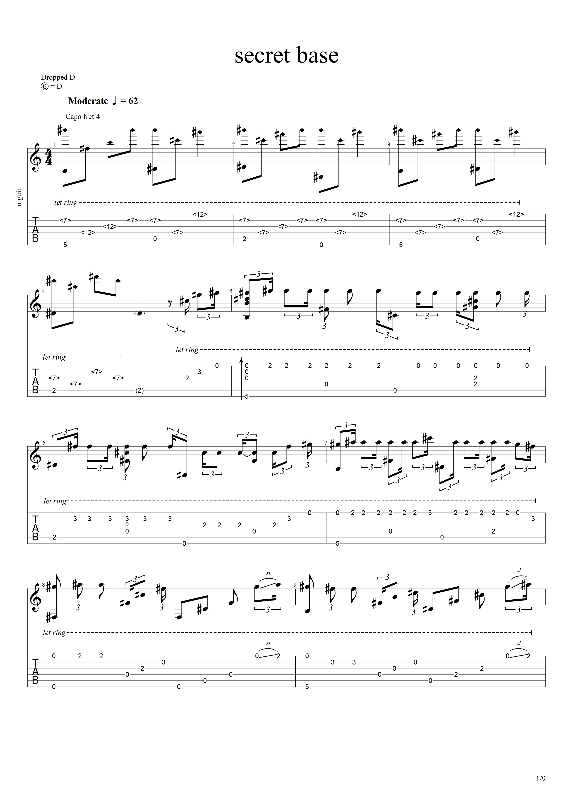
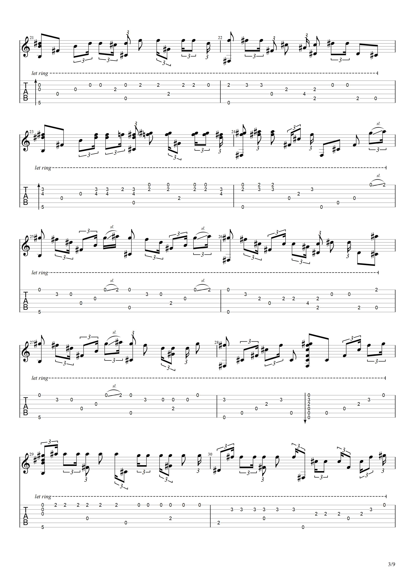
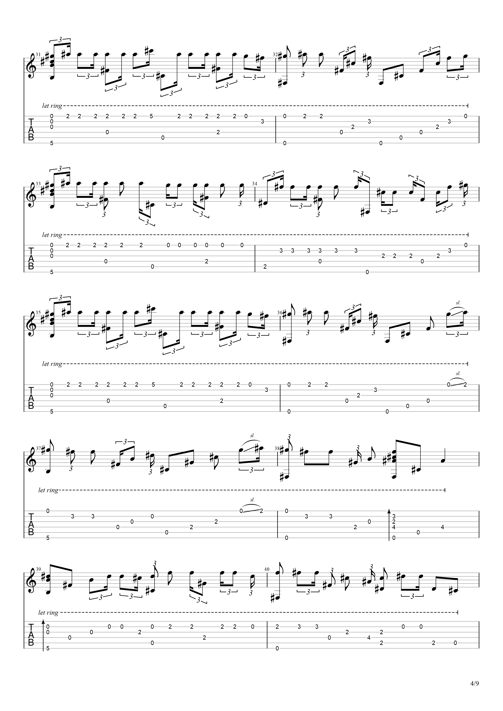
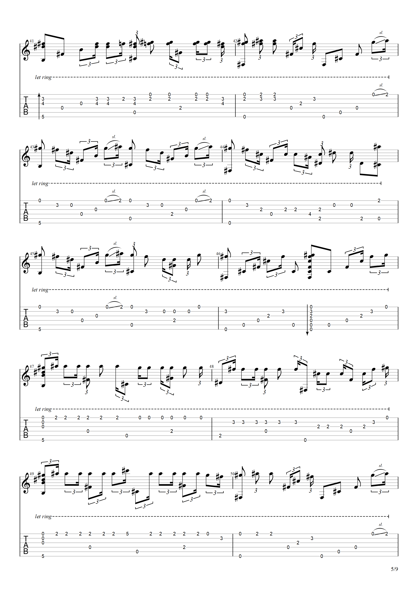
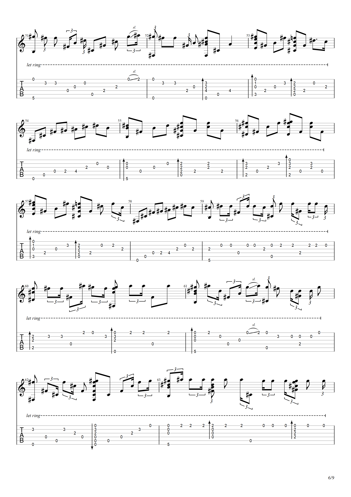
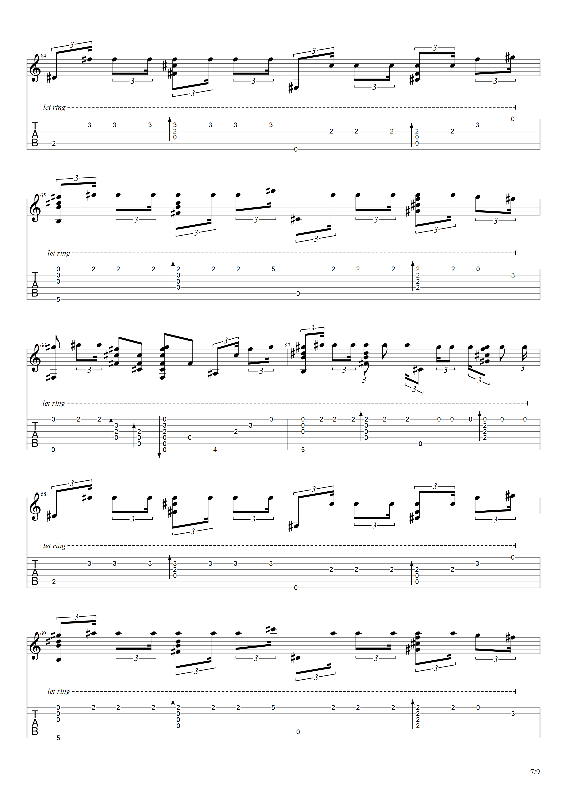
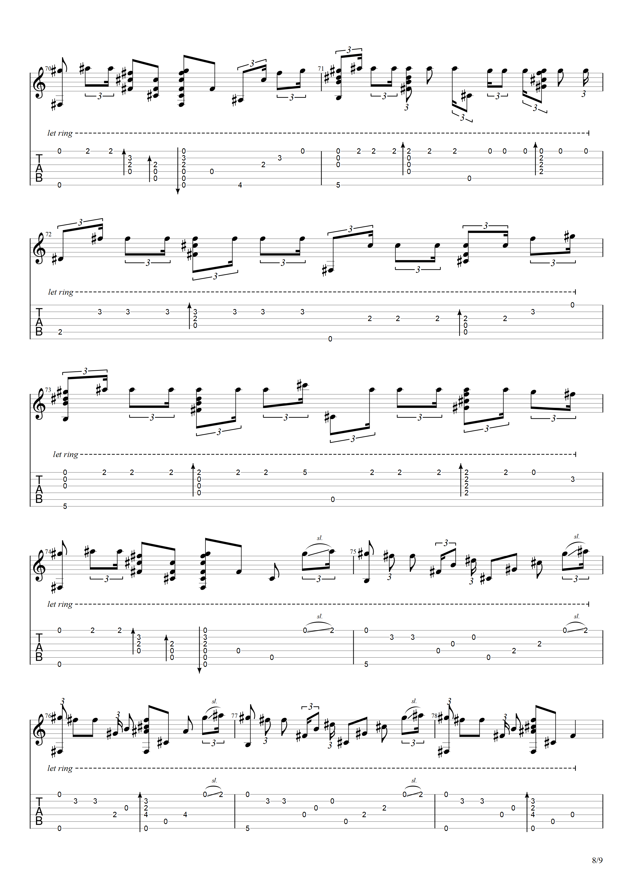

SECRET BASE
ACG | 日语 | 歌词 | 歌曲 | 曲谱 | 口琴 | 吉他
动漫《我们仍未知道那天所看见的花的名字》 ed 《secret base》歌词，演奏者：uBio 的指弹的吉他谱，以及非常简易的口琴谱
2018-10-7

## 歌词

君と夏の終わり 将来の夢

大きな希望 忘れない

10年後の8月

また出会えるのを 信じて

最高の思い出を…

出会いは ふっとした 瞬間 帰り道の交差点で

声をかけてくれたね 「一緒に帰ろう」

僕は 照れくさそうに カバンで顔を隠しながら

本当は とても とても 嬉しかったよ

あぁ 花火が夜空 きれいに咲いて ちょっとセツナク

あぁ 風が時間とともに 流れる

嬉しくって 楽しくって 冒険も いろいろしたね

二人の 秘密の 基地の中

君と夏の終わり 将来の夢 大きな希望 忘れない

10年後の8月 また出会えるのを 信じて

君が最後まで 心から 「ありがとう」叫んでいたこと

知っていたよ

涙をこらえて 笑顔でさようなら せつないよね

最高の思い出を…

あぁ 夏休みも あと少しで 終っちゃうから

あぁ 太陽と月 仲良くして

悲しくって 寂しくって 喧嘩も いろいろしたね

二人の 秘密の 基地の中

君が最後まで 心から 「ありがとう」叫んでいたこと

知っていたよ

涙をこらえて 笑顔でさようなら せつないよね

最高の思い出を…

突然の 転校で どうしようもなく

手紙 書くよ 電話もするよ 忘れないでね 僕のことを

いつまでも 二人の 基地の中

君と夏の終わり ずっと話して

夕日を見てから星を眺め

君の頬を 流れた涙は ずっと忘れない

君が最後まで 大きく手を振ってくれたこと

きっと忘れない

だから こうして 夢の中で ずっと永遠に…

君と夏の終わり 将来の夢 大きな希望 忘れない

10年後の8月 また出会えるのを 信じて

君が最後まで 心から 「ありがとう」叫んでいたこと

知っていたよ

涙をこらえて 笑顔でさようなら せつないよね

最高の思い出を…

最高の思い出を…

## 口琴谱

\#1 #4 #5 #5#6#6#6#6#6 #6#5#5#5#5#5

\#5#4#4#4#4#4 #4#4#1#1

\#1 #4 #5 #5#6#6#6#6#6 #6[#1] #6#6#6#5#4#5#6#6

\#5#6#5#4#4 #5#6#5#4#4

\#4#4#4#4#4#4#4 #4#3#1

\#1#4#4#4#4#4#4#4 #4#4#3#1

\#1#4#4#4#4#4#4#4 #5#1#1 #1(#6)#1#2#2

\#4#4#4#4#4#4#4 #4#3#1

\#1#4#4#4#4#4#4#4 #4#4#3#1

\#1#4#4#4#4#4#4#4 #5#1#1 #1(#6)#1#2#2

\#2 #2#2#1#2#3#3#3 #3#3#3 #3#4#4#4 #1#1(#6)#1#2#2

\#2 #2#2#1#2#3#3#3 #3#3#2 #3#4#4#4

\#5#6#5#4#2 #5#6#5#4#2

\#5#6#5#4#1#1(#6)#1#2#2

\#6#5#4#2 #5#6#5#4#2#2#5#4

\#1 #4 #5 #5#6#6#6#6#6 #6#5#5#5#5#5

\#5#4#4#4#4#4 #4#4#1#1

\#1 #4 #5 #5#6#6#6#6#6 #6[#1] #6#6#6#5#4#5#6#6

\#1 #4 #5 #5#6#6#6#6#6#5#5#5#5 #5#4#4 #4#4#4#1#1

\#1 #4 #5 #5#6#6#6#6#6 #6[#1] #6#6#6#5#4#5#6#6

\#5#6#5#4#4 #5#6#5#4#4

\#2 #2#1#2#3#3#3 #3#3#3 #3#4#4#4 #1#1(#6)#1#2#2

\#2 #2#1#2#3#3#3 #3#3#2 #3#4#4#4

\#5#6#5#4#2 #5#6#5#4#2

\#5#6#5#4#1#1(#6)#1#2#2

\#6#5#4#2 #5#6#5#4#2#2#5#4

\#1 #4 #5 #5#6#6#6#6#6 #6#5#5#5#5#5

\#5#4#4#4#4#4 #4#4#1#1

\#1 #4 #5 #5#6#6#6#6#6 #6[#1] #6#6#6#5#4#5#6#6

\#5#6#5#4#4 #5#6#5#4#4

\#5#4#3#2#2#1 #2#2#3#3#4 #5#4#3#2#3#1

\#1#1(#6)#1#2#2 #2 #2#1#2#3#3#3 #3#3#2 #3#4#4#4

\#6#5#4#5#6#6 #6#5#6#2 #5#6#5#4#2#2#5#4

\#1 #4 #5 #5#6#6#6#6#6 #6#5#5#5#5#5

\#5#4#4#4#4#4 #4#4#1#1

\#1 #4 #5 #5#6#6#6#6#6 #6[#1] #6#6#6#5#4#5#6#6

\#1 #4 #5 #5#6#6#6#6#6#5#5#5#5 #5#4#4 #4#4#4#1#1

\#1 #4 #5 #5#6#6#6#6#6 #6[#1] #6#6#6#5#4#5#6#6

\#1 #4 #5 #5#6#6#6#6#6 #6#5#5#5#5#5

\#5#4#4#4#4#4 #4#4#1#1

\#1 #4 #5 #5#6#6#6#6#6 #6[#1] #6#6#6#5#4#5#6#6

\#1 #4 #5 #5#6#6#6#6#6#5#5#5#5 #5#4#4 #4#4#4#1#1

\#1 #4 #5 #5#6#6#6#6#6 [#1] #6#6#6#5#4#5#6#6

\#5#6#5#4#4 #5#6#5#4#4

\#5#6#5#4#4 #5#6#5#4#4

\#1 #4 #5 #5#6#6#6#6#6 #6#5#5#5#5#5

\#5#4#4#3#3#4 #4#4#3#1

\#1 #4 #5 #5#6#6#6#6#6 #6[#1] #6#6#6#5#4#5#5#6

\#5#6#5#4#3#4 #5#6#5#4#4

## 吉他谱

