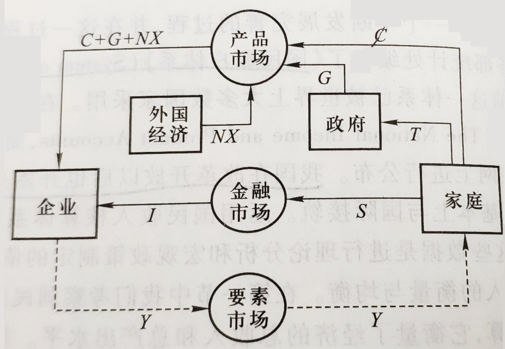
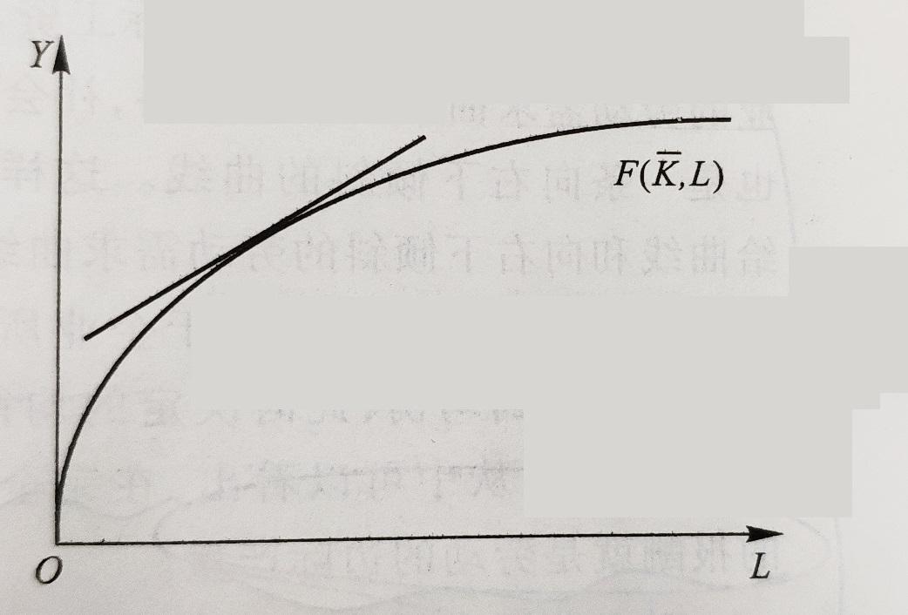
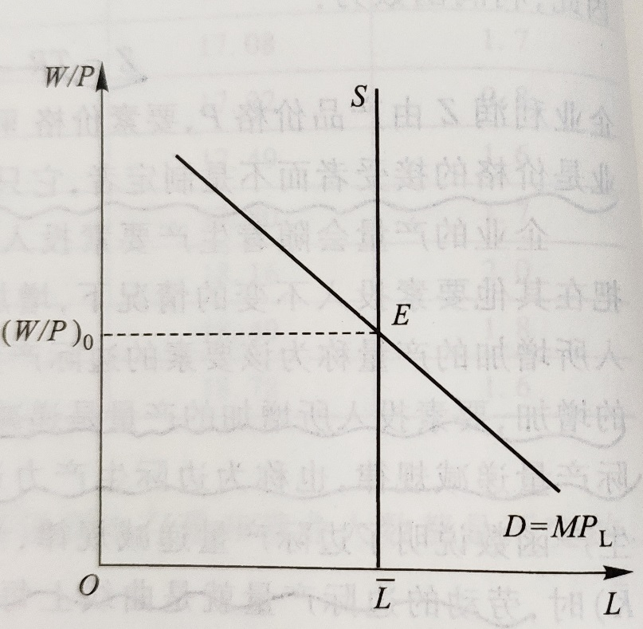
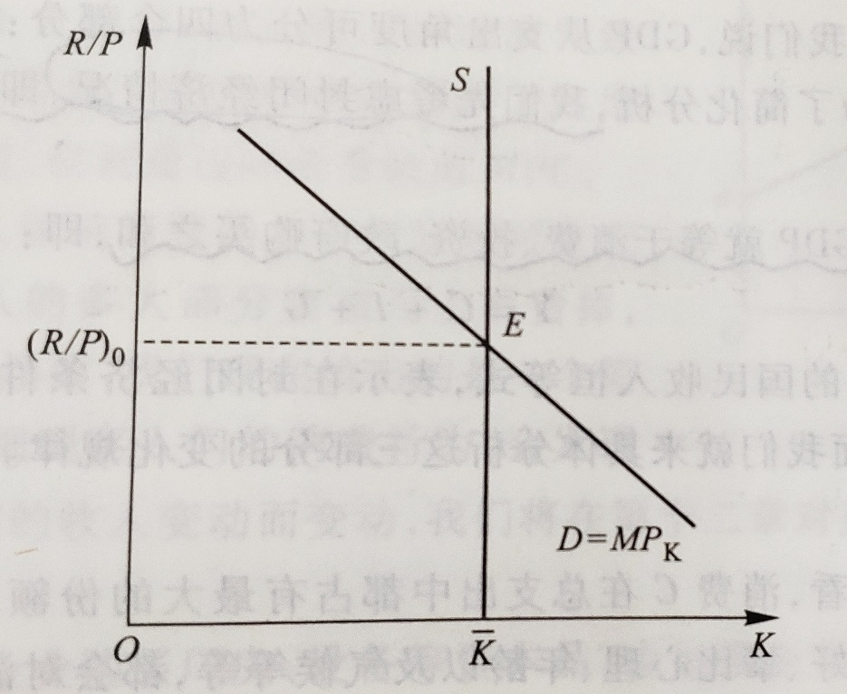
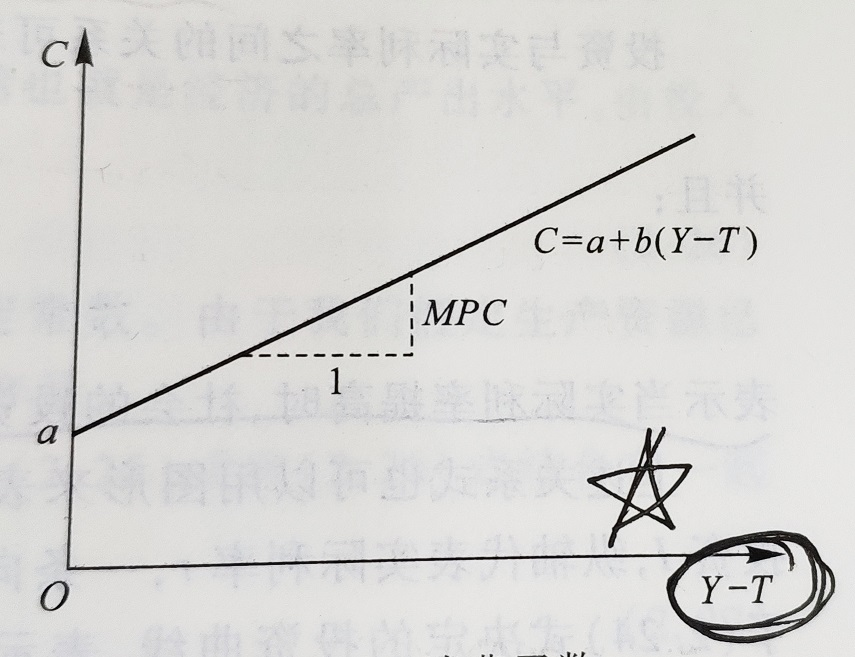
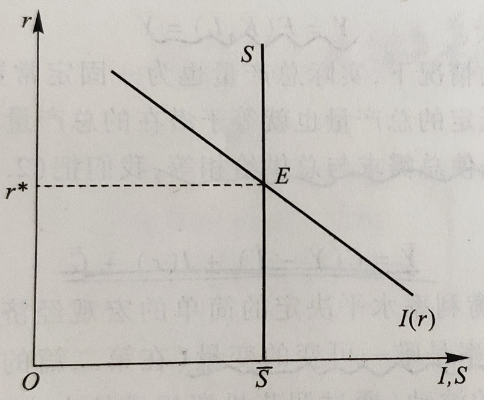
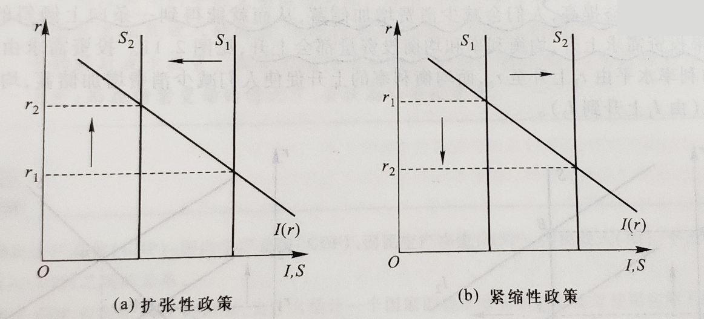

宏观经济学 1
笔记 | 经济学
宏观经济学，是指用国民收入、经济整体的投资和消费等总体性的统计概念来分析经济运行规律的一个经济学领域。宏观经济学是相对于古典的微观经济学而言的。 宏观经济学是约翰·梅纳德·凯恩斯的《就业、利息和货币通论》发表以来快速发展起来的一个经济学分支。
2018-10-8

[宏观经济学 2](blog.php?id=35)

## 导论

### 宏观经济学的研究对象和方法

#### 什么是宏观经济学

宏观经济学这一学科研究的对象主要是`大型经济单位`，通常是指一国的`国民经济`。涉及的内容是`整个社会的价格水平、总产量、就业水平以及其他经济总量`的决定。

- 微观经济学：个人 / 家庭 / 企业（追求目标：效用、利润）
- 宏观：国家 / 社会（社会福利）

#### 宏观经济学的研究对象

##### 经济增长

`储蓄率、资本积累、技术进步、教育`都是取得高增长的重要条件

长期增长是得益于不断增加的人口为经济发展提供了稳定的`劳动力来源`，但更重要的是在劳动力数量既定的情况下的产出增长，也就是`人均产出的增长`。

##### 经济周期

经济运行过程中出现的阶段性的不规则的上下波动；通常用实际国内生产总值（GDP）和其他一些宏观经济指标的波动来衡量。

一个经济周期分成四个部分：收缩期，谷底，扩张期，顶峰

在特别的情况下，当一个收缩期缩得过于严重，就可能出现经济衰退（Recession）。经济衰退以实际 GDP 增长率`连续两个季度`的下降为标志，严重经济衰退之后的低谷被称为经济萧条（Depression）

1. <u>**失业率与经济周期**</u>

在经济周期的收缩期，失业率通常会上升；在扩张期，失业率则会下降

2. <u>**股票价格与经济周期**</u>

同失业率相比，股票价格与经济周期的吻合型稍显逊色。总的来说，股票价格能够反映经济周期的演变，并且由于其往往领先于经济活动的变化，因而具有一定的预测性（比如日本的股市「崩盘」揭示了「泡沫经济」的破灭）

3. <u>**通货膨胀与经济周期**</u>

当经济步入收缩期时，通货膨胀率往往随之下降，严重时甚至出现负数，也就是通货紧缩

##### 失业（重点）

1. <u>**失业的衡量**</u>

失业：是指在当前工资水平下愿意工作的人无法找到工作。一个国家的失业总人口被称为失业人口，有工作的人口总数被称为就业人口，而这之和是一国的劳动人口。

一个人被计入失业人口的先决条件是其必须`能够愿意工作`，同时满足以下条件任意一个：

- 没有工作，但在此前四周中进行过寻求工作的努力；
- 离开了原先的工作岗位，但正等着被召回原职；
- 期待着在 30 天内开始新的工作

2. <u>**`失业的类型`**</u>（重点）

- 摩擦性失业：来自劳动市场`正常变动`的失业被称为摩擦性失业。
- 结构性失业：这一类失业来自于`经济结构变动`导致特定地区或行业就业机会减少。
- 周期性失业：由于`经济扩张步伐变慢`或者`经济周期`而产生的失业被称为周期性失业。

3. <u>**充分就业**</u>

任何一个特定的时点，都有正在找工作的人和想雇人的企业。指的是`工作机会与失业人口数量相同`的状态。

充分就业下的失业率被称为自然失业率，**所谓自然失业率就是指那些与市场经济运行机制无关，由「自然」因素（如劳动市场人口流动、技术变化等）决定的失业人口**

4. <u>**失业的危害**</u>

- 产出和收入减少
- 人力资本流失：人力资本指个人所受教育和所掌握的技能的价值
- 犯罪率上升
- 人格尊严流失

##### 通货膨胀

简称通胀，指的是一国平均价格水平（三个指数来衡量：消费者价格指数 CPI、生产者价格指数 PPI、GDP 平减指数）的上升，与它相反的是通货紧缩。

1. <u>**通货膨胀率与价格水平**</u>

通货膨胀率是价格水平的百分比变化
$$
今年通货膨胀率 = \frac{今年的价格水平 - 去年的价格水平}{去年的价格水平} \times 100\%
$$

$$
通常来说：百分比变化 = \frac{即期 - 基期}{基期} \times 100\%
$$

上面公式中的价格水平通常选用`消费者价格指数`（CPI）的数字。

汇率的决定：购买力平价：绝对 / 相对

2. <u>**通货膨胀的货币的价值**</u>

当存在通货膨胀时，货币就会贬值，货币的实际购买力就会下降。

3. <u>**预期到的通货膨胀和未预期到的通货膨胀**</u>

##### 开放经济

任何一个有一定规模的国家的经济都是一个与其他国家有着大量贸易和金融联系的经济体，或者说是开放经济。

宏观经济学的研究范围就包括国与国之间经济纽带的联结方式以及由此产生的的各国经济的相互依存关系。

经济周期会借助国与国之间的贸易和借贷关系在世界范围内传导。

当一国的出口大于进口，称为贸易顺差；当进口大于出口，则是贸易逆差。出现贸易逆差的国家将不得不向其他国家借钱，用以支付进口的商品和服务超出出口的部分。出现贸易顺差的国家则可以把钱储备起来，或者购买其他国家的金融资产。

一国的对外借贷关系会发生货币的支出和收入，对外贸易也需要用货币进行交易和结算，因此，我们可以运用`国际收支`的概念来表示一国经济的总体对外收支平衡状况。

一国在一定时期所有对外收支总额的对照表称为`国际收支账户`。

对整个国际收支账户来说，收入和支出总是相等的，既国际收支账户总是平衡的。

1. <u>**经常项目**</u>

商品和服务的进口、商品和服务的出口、净利息收入、净转移支付、经常项目余额

净转移支付：一国对其他国家单方面的净支出，其中包括汇款、年金、赠与、援助等项目。

2. <u>**资本项目**</u>

外国在本国的投资、本国在外国的投资、统计误差和其他、资本项目余额

3. <u>**官方结算项目、官方储备**</u>

为了弥补经常项目的赤字，有两个办法，一是借钱（相当于「引进外资」）；二是动用银行存款（相当于「官方储备」，官方储备是指外汇储备）

##### 宏观经济政策

`财政政策`和`货币政策`是两种最主要的宏观经济政策形式。财政政策是通过`改变政府的支出和税收`对宏观经济的运行施加影响。

国债：既属于财政工具，又是货币工具。

**<u>三大货币政策工具</u>**：`存款准备金率、再贴现率，公开市场业务`

货币政策主要是指通过中央银行这一政策机构`控制货币供应量和利率水平`，进而影响宏观经济的运行。

政府宏观经济政策的目标主要应该包括以下五个方面的内容：

- 促进增长
- 稳定经济：就是减少经济周期的波动，这是宏观经济政策的基本目标之一。
- 减少失业
- 控制物价
- 对外平衡（国际收支平衡）

政府宏观经济政策的治理对象主要就是两个：失业和通货膨胀。但失业和通货膨胀往往存在者此消彼长的反向变动关系。

我国的目标：`在币值稳定的情况下实现经济增长。`

#### 宏观经济学的研究方法

由于研究对象和范畴的差异，宏观经济学的研究方法有其自身的特点。

- **三个市场划分**：金融市场、产品和服务市场、要素市场
- **行为主体的划分**：家庭、企业、政府
- **总量分析**：我们采取的是总量分析方法，也就是从总体上来考察个体的经济行为。
- **以微观经济分析为基础**：宏观经济学与微观经济学的区别仅在于`研究对象不同`，在`研究方法`上并没有本质区别。

### 宏观经济学的基本概念

#### 国内生产总值

国内生产总值是一定时期内（通常是一年）一国境内所产出的全部`最终`产品和服务的价值总和。这里的「最终产品和服务」指的是由最终使用者购买的物品和服务，而不是用作投入品以生产其他产品和服务，与之相对的叫做「中间产品和服务」。

国民生产总值，即一国公民在一定时期内所产出的全部最终产品和服务的价值总和。

`净要素支出`等于本国公民的国外收入减去外国公民在本国的收入：
$$
GNP - GDP = NFP
$$

#### 名义价值与实际价值

- 名义价值：以现时的货币作为衡量产品和服务价值量的标准。
- 实际价值：反映的是产品和服务的实际购买力。

$$
PV = A[\frac{1}{(1 + i)} + \frac{1}{(1 + i) ^ 2} + \ldots + \frac{1}{(1 + i) ^ n}]
$$

实际 $GDP$ 的公式：
$$
实际 GDP = \frac{名义 GDP}{价格水平} \times 100
$$

#### 流量与存量

流量是特定时间段中发生的经济量值，存量是特定时间点上现存的经济量值。

1. **储蓄与财富**：储蓄作为一个流量概念，其数量恰好等于与之相对应的财富存量的变化量。
2. **投资与资本**：显然，资本是一个特定时点上的存量概念，与之相对应的是投资，即一定时期内用于维持或提高资本存量的产出流量。
3. **经常项目与净国际投资地位**

#### 利率与现值

现值需要考虑货币的时间价值；`任何资产在进行价值比较时一定要放在同一时间进行比较`

### 宏观经济学的理论体系

#### 宏观经济学的形成与发展

##### 凯恩斯宏观经济学的形成与完善

宏观经济学形成一个相对独立的理论系统，是从英国经济学家凯恩斯 1936 年出版的《就业、利息和货币通论》一书开始的。推翻了之前的古典学派（亚当斯密，马歇尔，庇古）

20 世纪 30 年代的经济大萧条使古典经济理论收到了挑战。

凯恩斯理论的核心是`有效需求`，由于市场机制本身存在`某种缺陷（如价格、工资刚性）`，供给并不一定就能创造需求；总需求的大小又主要取决于三个`心理因素`，即「边际消费倾向」，「资本的预期收益」，和「流动性偏好」；国民经济就会偏离充分就业的自然水平。

谈论长期无意义。

> 在长期，我们都会死去。

因此政府通过有效运用`财政政策`来刺激总需求能够使经济回到充分就业的自然水平。

1. **<u>IS-LM 模型</u>**

IS-LM 模型将决定总需求的四个因素，消费（或储蓄 S）、投资（I）、货币需求（L）、货币供给（M）结合在一起，从而把产品市场和货币市场的均衡统一在一个理论框架中，较好地诠释了凯恩斯的总需求理论。

薄弱点：IS-LM 模型没有考虑到预期因素

2. **<u>消费、投资和货币需求理论</u>**

消费理论的发展以「生命周期假说」以及「永恒性收入假说」为代表；这两个理论的重大贡献在于都把预期因素引进了消费函数。

投资理论发展与托宾分不开；托宾的 $q$ 理论研究了实际资本存量和意愿资本存量之间的关系，强调了资本的预期收益在投资决策中的作用。

托宾还提出了资产选择理论，研究了投资者在不同金融资产中的选择行为，得出了风险和预期收益的对称关系，是宏观经济货币理论的重大发展，也是现代金融学的基本理论。

3. **<u>增长理论</u>**

凯恩斯的理论基本不涉及经济的长期发展问题。索洛的增长理论分析了决定均衡经济增长的因素。

4. <u>**宏观经济计量模型**</u>

以凯恩斯理论为基础的宏观经济学和以古典理论为基石的微观经济学并行成为这一时期经济学教科书理论体系的一大特色。

##### 新古典学派和新凯恩斯学派的论战

发的国家出现的「滞涨」即失业和通货膨胀并发的现象，严重地动摇了凯恩斯主义经济学的统治地位。

古典学派和凯恩斯理论的「综合」因而受到了许多经济学家的怀疑，其中以货币主义和理性预期学派影响最大。货币主义以弗里德曼为代表，理性预期学派以美国芝加哥大学教授卢卡斯为代表。

其争论内容主要集中在以下两个方面。

1. <u>**市场机制的有效性**</u>

市场机制是否是有效的核心是价格、工资是否具备`充分伸缩性`。如果具备完全伸缩性，市场就会通过自我调节达到`出清状态`。新古典学派从理性预期触发，对价格、工资的伸缩性作了新的解释。世纪经济周期模型解释了经济波动的原因在与技术变化。

新凯恩斯学派则认为，即是理性预期存在，价格、工资的刚性仍然是一种较为普遍的现象，从而导致市场不能出清。

> 市场出清：商品工资和价格具有充分的灵活性，能使需求和攻击迅速的达到市场平衡

2. <u>**政府干预的必要性**</u>

- 新古典学派认为价格、工资具有充分伸缩性，市场能够自我出清，因此政府干预经济是没有必要的。理性预期相信，由于此预期存在，政府的政策就有可能事先被人们预料到，人们会做出相应的对策从而使政策失效；
- 新古典学派还认为，最好的政策不是「最优」政策，而是「时间一致性」政策。政府要`保证政策的连贯性和波动性`，否则良好的愿望可能导致灾难性的后果。

而新凯恩斯学派则认为，由于市场机制本身存在着缺陷，市场出清只是一种理想状态，因此政府要负担起市场出清的任务，政府对经济进行干预是必要的。

##### 本书的理论结构

除导论外分为三部分：

- 第一篇考察宏观经济的长期模型
- 第二篇分析宏观经济的短期模型
- 在第三篇中我们对宏观经济模型中某些基础性问题进行进一步讨论

经济学中，`短期和长期是一对相当重要的概念`。

大多数宏观经济学家都认为，区分长期和短期的关键在于对不同的价格行为的假设。

## 宏观经济的衡量与均衡

我国在改革开放以后采纳 SNA（《国民账户体系》System of National Accounts） 体系。

#### 国民收入的衡量

##### 收入和支出的循环流动

国内生产总值（GDP）是指一个国家在某一时期（通常为一年）内所生产的所有最终产品和服务的价值总和，这是从`生产`的角度定义的 GDP。

在这里，我们运用一个国民收入流量模型来描述宏观经济的运行情况，然后从不同的角度来进一步讨论 GDP 的构成和测算问题。

如下是简单的收入和支出循坏流动图：

循环流动图中：

- 假设：金融市场只有借贷市场，即只有银行
- 政府的购买支出（G）只考虑购买性支出，不考虑~~转移性支出（再分配）~~

从循环流动图中可知，我们可以用另外两种方法来预测 GDP（之前定义的是`生产法`），一种方法是从`收入的角度`出发，GDP 是指所有生产要素收入的总和，在图中，它等于家庭提供生产要素的全部收入，也就是国民收入；另一种方法是从`支出的角度`出发，利用家庭提供的生产要素，企业生产产品和服务供给给市场。
$$
\begin{align}
&\;\;\;\;\;\;\;\;支出法 \equiv 收入法 \equiv 生产法 \\
&\;\;\;\;\;\;\;\;\;\;\;\;↑\\
&\;\;\;\;\;\;\;\;\;\;基准\\
&收入法与支出法的差异称为错误与遗漏
\end{align}
$$

`生产法一般不涉及核算问题，只给出定义`

##### 总支出的方法

从循环流量图可以看出，用总支出的方法来计算国民收入，GDP 可以分为是大部分：消费支出（C）、投资支出（I）、政府购买（G）和净出口（NX），用国民收入 Y 来表示 GDP：
$$
Y \equiv C + I + G + NX
$$
这是一个无条件成立的恒等式，以上式子的左边是总收入，右边是总支出，因此我们又把它称为国民收入恒等式。

1. **<u>消费支出（C）</u>**

消费支出指的是本国居民对最终产品的服务和购买。

消费支出进一步又可以分三类：耐用消费品、非耐用消费品和服务支出

`注意：耐用消费品不包括住房，住房支出在总支出中作为投资处理`

2. **<u>投资支出（I）</u>**

投资支出由企业固定投资、住房投资、和`存货投资`。

- 企业固定投资是指购买新增资本品的支出，比如设备、厂房、办公楼的支出
- 住房投资是指购买新居民住宅的支出
- 将存货的变动作为企业存货投资来处理，是为了使企业的支出与生产要素得到的收入一致起来。如果企业的存货增加，存货投资就是正的；反之就是负的。

3. **<u>政府购买</u>**

指各级政府购买产品和服务的支出，其中的转移支付不计入 GDP 中。

4. **<u>净出口（NX）</u>**

净出口指的是出口额减去进口额的差额

是净出口而不是净进口是因为：`国外购买国内的生产`

##### 总收入的方法

1. <u>**国民生产总值**</u>

GNP（国民生产总值）等于家庭的全部收入，也就是一国所有生产要素收入的总和。

2. <u>**国民生产净值**</u>

从 GNP 中减去折旧，就可以获得国民生产净值。折旧是对一定时期内因经济活动而引起的固定资产消耗的补偿。
$$
NNP = GNP - 折旧
$$

3. <u>**国民收入**</u>

国民收入（National income，简称 NI，注意：这里的国民收入是值的狭义的国民收入，而广义的国民收入 Y 一般就代表 GNP 或 GDP）等于国民生产净值减去企业间接税：
$$
NI = NNP - 间接税
$$

> 间接税，主要指比较好转嫁的税，比如增值税。

国民收入包括参加生产过程的所有生产要素所有者的收入，由五部分收入组成：劳动收入、业主收入、租金收入、企业利润、净利息收入，即：
$$
NI = 劳动收入 + 业主收入 + 租金收入 + 企业利润 +净利息收入
$$

- 劳动收入：工人工资、补贴以及雇主向社会保险机构交纳的社会保障金。
- 业主收入：非公司制小企业的收入，以及不受人雇佣的独立生产者的收入，包含企业收入和劳动收入
- 租金收入：出租土地、房屋等资产的租金收入
- 企业利润：销售收入扣除工资、租金以及其他成本项目后的利润
- 净利息：个人从企业所获得的因资金借贷所产生的净利息，`不包括个人之间因借贷关系而发生的利息和由购买政府公债而得到的利息。`

4. <u>**`个人收入`**</u>

用个人收入这个概念来表示个人实际得到的收入
$$
PI = NI - 公司利润 - 社会保障金 + 政府转移支付 + 红利 + 利息调整
$$

- 政府转移支付：退休金、失业保险金、社会救济金
- 红利：现金红利、股票红利
- 利息调整：个人总的利息收入减去上述净利息收入后的余额（比如国债利息，私人借贷利息）

5. <u>**个人可支配收入**</u>

$$
DPI = PI - 个人所得税 - 非税收性支付
$$

非税收性支付：行政事业性收费

##### GDP 衡量中的其他问题

1. <u>**增加值法**</u>

>  为了避免重复计算，GDP 中只包括最终产品的价值，因为最终产品价值已经包括了中价产品的价值。

但是在实践中，中间产品和最终产品有时候很难进行区别。`解决这个问题的方法是运用增加值法来避免重复计算。`把每一生产过程的增加值加总即等于这个产品的最终价值。

2. <u>**本期产出**</u>

GDP 是本期生产的产品和服务的价值构成的。因此，GDP 应该排除那些在过去生产的，当前又重复交易的产品。

3. <u>**市场价格**</u>

一国经济中有些经济活动不进入公开市场交易是因为没有市场价格，也就无法计入 GDP 之中，这主要有两种情况。

- 地下经济：为了逃避政府管制所从事的经济活动，为逃税或逃避法律， 或本身的就属于非法行为。
- 非市场经济活动：公开的但是没市场交易行为的经济活动

4. <u>**社会福利**</u>

- 闲暇
- 自然资源资源和环境
- 收入分配：收入分配是否平均

#### 价格指数和失业率

##### 名义 GDP 和实际 GDP

- 名义 GDP 是指一定时期内`以当前市场价格`来测算的过国内生产总值。
- 实际 GDP 是以`过去某一年（称为基年）`的价格为标准，测算 GDP 数值。

实际 GDP 可以衡量两个不同时期经济中物质产量的变化。实际 GDP <u>剔除了名义 GDP 中的价格变动因素</u>，它能准确地反映一国实际产量的变化。

##### 价格指数

1. <u>**GDP 消胀（缩减）指数**</u>

是给定年份的名义 GDP 和实际 GDP 之间的比率，即：
$$
GDP 缩减指数 = \frac{名义 GDP}{实际 GDP} \times 100
$$

2. <u>**消费者价格指数**</u>

CPI 是衡量价格水平的另一个重要指标。

通常是通过抽样调查的方式得到的。以一些具有代表性的产品和服务为样本，比较根据当年价格计算的商品总价值和根据基年价格得到的商品总价值，得到的比值就是消费者价格指数。

`与 GDP 缩减指数的区别：`

- GDP 缩减指数组合更广泛，包含所有的商品和服务的价格信息
- 进口品不计入 GDP，但如果进口品在消费中占有比较重要的地位，就会被计入 CPI
- CPI 所衡量的商品组合的数量是固定的，而 GDP 缩减指数所涉及的商品组合的数量是变动的。

假设某经济体只生产 A、B 两种商品，那么：
$$
\begin{align}
GDP 缩减指数& = \frac{名义 GDP}{实际 GDP} \times 100\\
& = \frac{当年 A 价格 \times 当年 A 产量 + 当年 B 价格 \times 当年 B 价格}{基年 A 价格 \times 当年 A 产量 + 基年 B 价格 \times 当年 B 价格} \times 100
\end{align}
$$

$$
CPI = \frac{当年 A 价格 \times 基年 A 产量 + 当年 B 价格 \times 基年 B 价格}{基年 A 价格 \times 基年 A 产量 + 基年 B 价格 \times 基年 B 价格} \times 100
$$

其中 GDP 缩减指数是帕氏指数，而 CPI 是拉氏指数。

值得一提的是，生产者价格指数（PPI）是被经常使用的第三个价格指数，与 CPI 相似，使用固定的商品组合（包括原材料和中间产品），衡量的不是消费者实际支付的零售价格，而是生产过程中开始阶段的价格水平。

> PPI 和 CPI 之间的联动关系不是必然的，比如中国 21 世纪初，产量过剩导致形成「完全竞争市场」，任何厂商只要提高一点价格，就会被逐出市场。

如果我们用 $P_t$ 表示 $t$ 期的价格，$\pi_t$ 表示 $t$ 期的通货膨胀率，那么有：
$$
\pi_{t + 1} = (P_{t +1} - P_{t}) / P_{t}
$$

##### 失业的计量

$$
劳动年龄人口 = 劳动人口 + 不在劳动人口
$$

以下人员一般不被列入劳动年龄人口：

- 军队人员
- 在校学生
- 家务劳动者
- 退休或因病退职人员以及丧失劳动能力、服刑犯人等不能工作的人员
- 不愿工作的人员
- 在家庭农场或家庭企业每周工作少于 15 小时的人员

$$
\begin{align}
失业率& = \frac{失业人口}{劳动人口} \times 100\%\\
& = \frac{失业人口}{就业人口 + 失业人口} \times 100\%
\end{align}
$$

失业人口：

- 有劳动能力但没有工作
- 当前准备工作
- 正在寻找工作

失业率的测算是比较复杂的，因为就业人口、失业人口和不在劳动人口三者间处于变动之中。

##### 奥肯定律

失业率的上升会随着实际 GDP 的下降。

根据`美国`的经验数据显示：

$$
实际 GDP 变化的百分比 = 3\% - 2 \times 失业率变化率
$$

因为用的美国数据，系数不一定具有普适性，但是线性关系确实存在。

#### 国民收入的生产、分配和消费

##### 国民收入的生产

国民经济的产出水平或者说总收入由两个因素决定：

- 投入的生产要素
- 各种生产要素与产出之间的技术关系

通常用生产函数来表示。

生产要素是指生产或服务生产过程中投入的投入品，如劳动、资本、土地等。其中资本和劳动是最重要的生产要素（土地相对既定），我们分别用 K 和 L 来表示一个经济中的资本存量和就业人数。

生产函数具有如下一般形式：

$$
Y = F(K, L)
$$

很多生产函数都具有规模报酬不变的性质。所谓规模报酬不变是指当投入的生产要素增加或减少一定比例，产出也变化相同的比例，用数学公式表示，就是：

$$
\lambda Y = F(\lambda K, \lambda L), \lambda > 0
$$

现在我们以`柯布 - 道格拉斯生产函数`为例来考察规模报酬情况，它的表达式是：
$$
Y = F(K, L) = AK^{\alpha}L^{\beta}
$$

- A 表示综合技术水平：
  - 经济管理水平
  - 劳动力素质
  - 引进先进技术
- $\alpha$ ：资本产出贡献 / 弹性，可以表示为资本投入变化引起产出变化的速率
- $\beta$：劳动产出贡献 /  弹性，可以表示为劳动投入变化引起产出变化的速率

证明：$\beta$ 可以表示劳动投入变化引起产出变化的速率
$$
\begin{align}
劳动的边际产量：mP_L &= \frac{\partial Y}{\partial L} \\
&= AK^{\alpha} \cdot \beta L^{\beta - 1} \\
&= \frac{\beta A K^{\alpha} \cdot L^{\beta}}{L} \\
&= \frac{\beta Y}{L}
\end{align}\\
\therefore \beta = \frac{\partial Y / Y}{\partial L / L}
$$
同理可证 $\alpha$ 表示资本投入变化引起产出变化的速率。

<u>**柯布 - 道格拉斯生产函数的三种情况**</u>：

- $\alpha + \beta > 1$：递增报酬型，按现有技术扩大生产规模，对增加产出是有利的
- $\alpha + \beta < 1$：递减报酬型，按现有技术扩大生产规模，对增加产出是不利的
- $\alpha + \beta = 1$：不变报酬型，产出随生产要素犹如增加而增加相同比例

不变报酬型证明：
$$
\begin{align}
F(\lambda K, \lambda L) &= A(\lambda K)^{\alpha}(\lambda L)^{1 - \alpha}\\
&= \lambda(AK^{\alpha}L^{1 - \alpha}) \\
&= \lambda F(K, L) \\
&= \lambda Y
\end{align}
$$

国际上 $\alpha$ 在 0.2 ~ 0.4 之间波动，我国在 0.2 ~ 0.3 之间波动

$\alpha, \beta, A$ 计算方法：根据历史数据，和线性方程：
$$
ln Y = ln A + \alpha lnK + (1 - \alpha)ln L
$$

##### 国民收入的分配

生产要素的价格就是要素所有者的收入，因此，我们要讨论国民收入的分配，也就是要分析生产要素价格是如何确定的。

为了简化我们的分析，首先假定产品市场和要素市场都是完全竞争的。同时我们还假定企业生产只需要投入两种生产要素：资本和劳动，即企业的生产函数仍然是：
$$
Y = F(K, L)
$$

`企业生产的目的是为了利润最大化`，利润（Z）等于收益减去成本，企业的总收益（TR）等于销售量（即产量 Y ）乘以价格（P），企业的总成本（TC）由劳动成本和资本成本两部分构成，其中劳动成本等于劳动数量乘以工资（W），而劳动成本等于资本资本数量乘以租金（R），我们用数学表达式表示收益和成本的关系，得到：
$$
TR = PY = PF(K, L) \\
TC = WL + RK \\
\begin{align}
\therefore Z &= TR - TC \\
&= PF(K, L) - WL - RK
\end{align}
$$
问题一：劳动的价格为多少时，使利润最大化？

由于完全竞争企业是价格的接受者而不是制定者，它只能通过选择不同的要素投入量来使自己的利润最大化。

随着要素投入量的增加，要素投入所增加的产量是递减的，这就是要素的边际产量递减规律，也称为边际生产力递减规律。

当资本投入不变时（$K = \bar{K}$）时，劳动的边际产量就是曲线上每一点的斜率，随着劳动投入量的增加，曲线越来月平坦，表明劳动的边际产量不断减少。

所以，利润最大化时，就是 Z 在 L 上的导数为 0 时：
$$
\frac{\partial Z}{\partial L} = P \frac{F(K, L)}{\partial L} - W = 0 \\
\because \frac{F(K, L)}{\partial L} = MP_L （MP_L 为边际产量）\\
\therefore P \times MP_L － W = 0 \\
即：MP_L = \frac{W}{P}
$$
即企业利润最大化要求劳动的边际产量等于实际工资。

因此劳动的边际产量曲线实际上就是企业对劳动的需求曲线，由于边际产量递减，劳动需求曲线就是一条向右下倾斜的曲线。

假定一定时期劳动总供给量为 L，根据利润最大化，可决定出均衡的实际工资水平，在完竞争市场上，劳动的报酬就是劳动的边际产量。

问题二：资本的价格为多少时，才使利润最大化？ 

同上理可证：资本的边际产量等于资本的实际租金。类似的，由于资本边际产量递减，企业的资本需求曲线也是一条向右下倾斜的曲线。

综上所述：

工人的实际工资等于劳动的边际产量，资本的实际租用价格等于资本的边际产量，因此，总的工资收入是 $MP_L \times L$，而总的资本收入是 $MP_K \times K$。

总收入中扣除工资收入和资本收入后余下的部分是企业的利润，即：
$$
利润 = Y - MP_L \times L - MP_K \times K \\
可得：Y = MP_L \times L + MP_K \times K + 利润
$$
国民收入就被分为三个部分：劳动的报酬、资本的报酬和利润。

在完全竞争的条件下，如果生产函数具有规模报酬不变的性质，国民收入将正好分配给各种生产要素，这时利润就等于零（利润 = 经济利润 + 会计利润，此利润指经济利润），这一规律被称为欧拉定理。

$$
Y = f(K, L) = MP_L \times L + MP_K \times K
$$

##### 国民收入的消费

为了简化分析，我们先考虑`封闭经济情况`面，即假定不存在外国经济部门，这时 NX 就等于零。在封闭经济中，实际 GDP 就等于消费、投资、政府购买之和，即：
$$
Y = C + I + G
$$
下面就来分析这三部分的变化规律

1. <u>**消费**</u>

实际影响人们消费水平的是个人可支配收入，我们可以用国民收入 Y 减去税收 T 来表示，因此我们可以把消费与收入之间的关系表示为：
$$
C = C(Y - T) \\
（并且 \frac{d C}{d(Y - T)} > 0）
$$
【重要方程】 `消费函数经常被写成线性方程的形式`：
$$
C = a + b(Y - T)
$$
常数 $a$ 为自生消费，是指不随收入变化的那部分消费，通常是指为了生存而必需的消费。$bY$ 为派生消费，是指由于收入增加而导致的消费。$b$ 的边际消费倾向，是指每增加一元收入所增加的消费部分。

注意上图函数，`横坐标为 Y - T`，而不是 Y.

2. <u>**投资**</u>

利息构成投资的成本，当利率较低时，投资的成本就较小，投资者就会愿意增加投资；而利率高时，投资者就会因为营利机会减少而缩紧投资，因此投资需求与利率之间是一种反比关系。

我们用 $\pi$ 代表通货膨胀率，实际利率 $r$ 与名义利率 $i$ 有如下关系：
$$
r = i - \pi
$$
投资与实际利率之间的关系可表达为如下的投资函数：
$$
I = I(r) \\
（并且 \frac{dI(r)}{dr} < 0，负相关关系）
$$
表示当实际利率提高时，社会的投资水平随之下降。

3. 政府购买

在这里，我们可以把 $T$ 解释成税收减去转移支付后的净值，或者净税收，这是家庭的可支配收入仍可以用 $Y - T$ 来表示。

事实上，$G$ 和 $T$ 的变化由政府的经济政策所决定，与经济模型本身无关，因而我们在下面的分析中，$G$ 和 $T$  被作为外生变量。

#### 宏观经济的均衡

##### 产品市场的均衡

总需求由消费、投资和政府购买三部分组成，并且消费取决于可支配收入，投资取决于实际利率，政府购买和税收都是外生给定的。我们就有总需求的函数：
$$
Y = C + I + G = C(Y - \bar{T}) + I(r) + \bar{G}
$$
总供给也就是经济的总产出水平，有投入的生产要素决定：
$$
Y = F(\bar{K}, \bar{L}) = \bar{Y}
$$
产品市场的均衡条件就是使总需求与总供给相等，结合上两式：
$$
\bar{Y} = C(\bar{Y} - \bar{T}) + I(r) + \bar{G}
$$
实际利率是唯一可变的变量。实际利率的波动（通过调节投资规模的大小）能使总需求发生变动，从而使总需求与潜在实际国民收入水平相当。

##### 金融市场的均衡

我们仍从封闭经济的国民收入恒等入手，并将它改写成：
$$
Y - C - G = I
$$
其中（$Y - C - G$）是总收入扣除消费和政府购买后剩余的部分，称为国民储蓄。

`隐藏假设：在不改变消费条件下，有闲置资金，就储蓄`

国民储蓄又可以分为两部分，即：
$$
Y - C - G = (Y - T - C) + (T - G)
$$
$Y - T  - C$ 表示可支配收入减去消费，称为私人消费。$T - G$ 表示政府收入减去支出后剩余部分，称为公共储蓄。

将已知的各项条件收入代入国民收入恒等式，得到：
$$
\bar{Y} - C(\bar{Y} - \bar{T}) - \bar{G} = I(r)
$$
此式左边表示国民储蓄 $S$，$S$ 也是不变的，由此可以得到金融市场的均衡条件为：
$$
\bar{S} = I(r)
$$

##### 财政政策的作用

1. <u>**政府购买的变动**</u>

由于潜在国民收入水平由投入的生产要素决定，是保持不变的，消费也是不变的，政府购买的增加只会引起投资相同幅度的减少，而投资的减少意味着利率肯定是提高了。
$$
\bar{Y} = C(\bar{Y} - \bar{T}) + I(r)\uparrow + G\downarrow
$$
政府增加的购买正好等于私人企业减少的投资，也就是说，政府购买「挤出」了私人投资。

（此句有争议，若政府购买企业的东西，企业增加资本和劳动力的投入，反而是增加了投资）

政府购买的增加减少了公共储蓄，由于私人储蓄保持不变，从而总的国民储蓄也降低了。

2. **<u>税收变动</u>**

$$
\bar{Y} = C(\bar{Y} - T\downarrow)\uparrow + I(r)\downarrow + \bar{G}
$$

减税的效果类似于增加政府购买。（是否「挤出」私人投资同样有争议）

##### 投资需求的变动

我们发现均衡的投资量并没有因为投资需求的上升而上升，这是因为储蓄在这里被定义为既定不变的，因此固定的储蓄量决定了固定的实际投资量，投资需求的增加只是使均衡利率水平从 $r_1$ 提高到 $r_2$（左图）。

我们假定随着利率的上升，储蓄的收益提高，人们会减少消费增加储蓄，从而就能得到一条向上倾斜的储蓄曲线。这时候，如果投资需求上升，均衡利率和均衡投资量都会上升（右图）。

