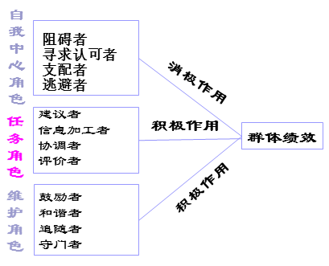

组织行为学 - 学习笔记
笔记 | 管理学 | 行为学
组织行为学（英语：Human Behavior in Organization），是通过研究一定组织体系内人的心理和行为表现及其规律，从而提高预测、引导和控制人的行为的能力，以实现组织既定目标的一种社会科学。
2018-10-9

## 案例分析要求

1. 案例简介
2. 问题及其原因
3. 解决方案及实施
4. 利弊分析
5. 总结归纳
6. 运用《组织行为学》的概念及理论
7. 参考文献的使用和标注使用

## 绪论

### 组织与组织行为

#### 什么是组织

是指两个或两个以上的人，通过有计划的协作所组成的为达到共同目标的正式结构（罗宾斯）

`人的集合 + 共同目标 + 正式结构 + 分工协作`

#### 组织和管理

管理：在`特定环境`下，对组织所拥有的`资源`进行有效的`计划、组织、领导、控制`，以达到既定组织目标的过程。

##### 两者的关系

1. 任何组织都需要管理
2. 管理的目标是保证组织目标的实现
3. 管理工作的效果是通过`组织效率和有效性`来衡量
4. 组织的发展演变是管理思想发展、管理技术提高的源泉

##### 法约尔的管理职能

计划、组织、指挥、协调、控制

##### 明茨伯格的管理角色

1. 人际角色：头面人物、领导者、联络者
2. 信息传递角色：监控者、传播者、发言人
3. 决策角色：创业者、混乱处理者、资源分配者、谈判者

##### 卡茨的管理技能

技术技能、人际技能、概念技能

##### 路桑斯的研究结果

1. 四种管理活动：传统的管理、沟通活动、人力资源管理、网络联系
2. 三类管理者：一般管理者、成功管理者、有效管理者

#### 组织与环境

环境：包括自然、技术、文化、经济、政治等方面的因素

组织与环境相互作用，不断进行物质、能量、信息的交换

- 组织依靠环境获得赖以生存的资源和发展机会
- 组织也会影响环境，组织的存在本身就是为了增强人们认识和改造世界的能力

#### 组织与组织行为学

行为：生命有机体由内在心里支配和外在目标驱使而形成的行动和作为

组织行为：组织的内部要素的相互作用以及组织与外部环境的相互作用过程中所形成的的行为和作用，包括：个体、群体、组织

##### 组织行为学的概念

> 是探讨个体、群体以及结构对组织内部行为的影响，目的是应用这些知识改善组织绩效的研究领域

- 研究对象：决定组织中行为的三类因素：`个体、群体、结构`
- 研究范围：一定组织中人的心理与行为规律
- 研究目的：`解释、控制、预测`

##### 组织行为学的研究内容

- 研究人在组织中的行为
- 揭示组织有效整合、个人规范自律的规律
- `组织对其成员活动的协调方式决定了组织在完成其自身目标时是否会成功`

1. 个体：了解人性，理解行为，把自己当人，把别人当人
2. 群体：改变自己，适应环境，不要把自己当人
3. 领导：保持自我，完善自我，成为真人
4. 组织：理解组织，把握变革

### 组织行为理论的历史沿革

1. 20 世纪初的法约尔 —— 组织制度的创新
2. 1920s，`梅奥`等人的「霍桑实验」 —— 人群关系理论
3. 1949 年的跨学科会议 —— 确定行为科学学科的正式形成
4. 1960s 中后期重视研究组织内人和群体的行为，及围绕组织行为的一些课题 —— 组织行为学的产生
5. 人力资源学派：
   1. 阿基雷斯：《个性和组织》
   2. 麦格雷戈：《企业的人的方面》X，Y 理论（X：大多数人天生懒惰，尽一切可能逃避工作）
6. `权变观点`进入管理领域 —— 组织行为学的形成
   1. 遵循权变理论，并不等于没有理论，而是告诉人怎样从错中复杂的情境中寻找关键性变量
   2. 例如：科学管理的人性观：理性 —— 经济人，人群关系学派 —— 社会人，人力资源学派 —— 自我实现人。
7. 组织文化的兴起 —— 组织行为学的深入

#### 复杂人假设（权变管理理论）

1. X 理论（经济人假设）：以金钱满足其需求 → 生理、安全的需要
2. 参与管理理论（社会人假设）：以社会承认满足其需求 → 感情、受人尊敬的需要
3. Y 理论（自我实现人假设）：以工作的合理安排满足其需求 → 受人、自我实现的需要

#### 21 世纪组织的特点

扁平化、灵活化、多元化、网络化、全球化

1.  因对经济压力
2.  回应全球化
3.  管理劳动力多元化
4.  改善顾客服务
5.  改善人际交往技能
6.  在网络化组织中工作
7.  提升员工昂幸福感
8.  创造积极的工作环境
9.  改善道德行为

### 组织行为学的研究方法

<u>**常用术语**</u>

变量：自变量、因变量、中介变量、调节变量

#### 研究方法

<u>**观察法**</u>

- 按观察者与被观察者划分：参与式 & 非参与式
- 按观察情景差异划分：自然观察法 & 控制观察法

<u>**调差法**</u>

- 全面调查 & 抽样调查

电话调查、问卷调查（选择法、是否发、计分法、等级排列法）

<u>**实验法、访谈法、案例研究法**</u>

#### 常用统计方法

回归分析，相关分析，方差分析，因素分析

## 个体行为基础

个人传记特点：年龄、性别、婚姻状况、工作年限（个体特点）

能力、人格 / 个性、情绪、价值观、态度、知觉、学习

能力：个体在某一工作成功完成各种任务的可能性

##### 分类

1.  一般能力 和 特殊能力：
    1.  一般能力：反映每一个个体完成一切活动都必须具有的共同能力。主要包括： 思维能力、观察能力、语言能力、想象能力、记忆能力、操作能力
    2.  特殊能力：指个体从事某种专业活动应具备的各种能力有机结合而形成的能力。如教学能力、管理能力、数学能力、音乐能力等等
2.  智力 和 体力：
    1.  智力：从事心理活动所需要的能力，包括：算术能力、言语理解、知觉速度、空间视知觉、记忆力、演绎推理、归纳推理
    2.  躯体能力：
        1.  力量因素：动态力量、躯干力量、静态力量、爆发力
        2.  灵活性因素：广度灵活性、动态灵活性
        3.  其他因素：躯体协调性、平衡性、耐力

##### 能力与行为 —— 影响了能力发展的因素

1.  素质
2.  环境和教育
3.  社会实践
4.  其他方面如：个人的勤奋程度、兴趣爱好等

##### 能力与行为 —— 能力与组织管理

1. 合理招聘人才，量才录用
2. 人的能力要与职务相匹配
3. 组织中人的能力要互补
4. 有效地加强员工能力培训
5. 用人艺术的关键是发挥人的能力
6. 建立有效的人才竞争选拔制度

#### 人格

**<u>人格</u>**：就是人的一组相对稳定的特征，这些特征决定特定的个人在各种不同情况下的行为表现

特点：特征性、一致性、稳定性、独特性

##### 人格的类型

1.  <u>**机能类型说**</u>

培因 & 李波特：依据理智、情绪、意志三者各自在人格结构中所占的优势不同来确定

2.  <u>**向性说**</u>

荣格：按照个体心理活动的倾向来划分

3.  <u>**独立顺从说**</u>

阿德勒：按照个体的独立程度来划分人格类型

4.  <u>**迈尔斯 - 布里格斯类型指标（MBTI）**</u>

- 社交倾向：偏爱把精力 / 注意力集中在哪方面：
    - 外倾型（E）：外部世界
    - 内倾型（I）：内部世界
- 资料收集：获取信息、认识世界的方式：
    - 感觉型（S）：关注事物的表面特征，通过各种感官获得信息
    - 直觉型（N）：注重于内涵、联系与意义，有全局观
- 决策偏好：做决定的方式：
    -  思维型（T） ：注重逻辑性、客观性
    -  情感型（F） ：以人为中心、以价值观为依据
- 决策风格：适应外部环境的方式：
    - 判断型（J） ：有组织、秩序，作决定
    - 感知型（P）：更灵活和自然地看待世界

5.  <u>**五维度模型（OCEAN）：**</u>「重要」

- 经验的开放性（openness to experience）：幻想、聪慧以及艺术的敏感性方面
- 责任心（conscientiousness）：责任感、可靠的、持久的、成就倾向
- 外倾性（extraversion）：善于社交的、善于言谈的、武断自信的
- 随和性（agreeableness）：脾气随和、合作且信任方面
- 神经质（neuroticism / emotional stability）：平和、热情、安全、以及紧张、焦虑、失望和不安全方面

五维度特制 → 与工作的关系 → 所影响的方面

经验的开放性 → 更好的学习，更具有创造性，更灵活自主 → 提高培训效果，增强领导力，更灵活地适应变化

责任心 → 努力，自律，调理和计划 → 绩效，领导力，有助基业长青

外倾性 →  人际交往，社会优势，善于表达情绪 → 绩效，领导力，工作和生活满意度

随和性 → 受欢迎，顺从并准守规范 → 绩效，减少工作异常行为

情绪稳定性 → 减少消极思维消极情绪，减少过分警觉现象 → 提高工作和生活满意度，降低压力

##### 与组织行为学相关的人格特征

1.  <u>**高马基雅维利主义者**</u>

1. 特点：操纵他人、赢得利益、难以说服
2. 有力的环境因素：与他人直接面对交往，无明确的规则和限制，有即兴发挥的余地，成功与情感无关
3. 适合的工作：较好的谈判技巧，高度奖酬的岗位

2.  <u>**自恋**</u>

1. 更有魅力
2. 高工作动机、生活满意度，更敬业
3. 适应能力强，浮躁情况作出更好的商业决策
4. 与反生产力联系更紧密
5. 以其他一些负面结构相关

3.  <u>**核心自我评价**</u>

对自己才能、能力及价值的判断

判断自己是否高效、是否有能力控制周围的环境

1.  拥有高核心自我评价者：认为自己高效、有能力并能控制周围的环境
2.  拥有低核心自我评价者：讨厌自己，质疑自己的能力，认为自己无法控制周围的环境

4.  <u>**自我监控**</u>

根据外部情景因素而调整自己行为的能力

高自我监控者：

- 关注他人活动
- 灵活应变，得到更多的晋升机会，能在组织中占据核心地位
- 成功地处理角色冲突

**<u>冒险性</u>**：接受或回避风险的倾向性

**<u>A、B 型人格</u>**

A：做事（走路、饮食）速度快，容易不耐烦，不知道如何打发时间，关注数字，同时思考两个以上事情

B：不耐烦，不愿意参加有限时间内做更多事情的活动，自如休闲而感内疚

**<u>霍兰德 —— 性格与职业相配理论</u>**：

实际型（现实型） —— 社会型

研究型 —— 企业型

传统型 —— 艺术型

`当职业与人格相配时，会产生最高的满意度的最低的流动率`

#### 情商

一个人能够成功处理与面对环境压力的非认知性技能或能力

- 自我意识
- 自我控制
- 自我激励
- 感情投入
- 社交能力

## 知觉

知觉：是个体对直接作用于自己感觉器官的客观事物赋予意义并解释感觉印象的过程

知觉的过程：环境刺激 → 各种感觉 → 选择性注意 → 知觉的组织和翻译 → 情感和行为

影响知觉准确性的因素：

- 情景因素：时间、工作环境、社会环境等
- 知觉者因素：兴趣爱好、需要动机、知识经验等
- 知觉对象因素：颜色、形状、声音等

### 知觉经常会发生的偏差

**<u>选择性知觉</u>**：个体根据自己的经验、背景、兴趣和态度进行主动选择观察到的信息而造成的错觉

**<u>第一印象效应</u>**：人们在第一次接触时对对方的综合感知

**<u>近因效应</u>**：人们根据他人当前的行为来判断他人而造成的错觉

**<u>晕轮效应</u>**：个体以事物的某一特征为依据，忽视或扭曲事物其他特征而造成的错觉

**<u>对比效应</u>**：对两个事物进行比较而使知觉失真的现象

**<u>投射效应</u>**：由人及人，以己度人

**<u>刻板效应</u>**

**<u>期待效应 / 自我实现预言 / 罗森塔尔效应</u>**：期望和赞美能产生奇迹（海底捞）

### 组织中的印象管理

印象管理：一个人通过一定的方式影响别人形成的对自己的印象的过程

**<u>获得性印象管理</u>**：试图使别人积极看待自己的努力

**<u>保护性印象管理</u>**：尽可能弱化自己的不足或避免使别人消极地看待自己的防御性措施

**<u>个体的印象管理</u>**

**<u>组织的印象管理</u>**：包装；炒作

具体应用：招聘面试、自我实现语言、绩效期望、绩效评估

### 归因理论

<u>**归因理论**</u>：是说明和分析人们行为活动因果相关系的理论。人们用它来`解释、控制和预测`相关的环境，以及随这种环境而出现的行为

研究的基本问题：

1. 心理活动归结为什么
2. 行为归因：根据人们的外部行为和内部行为表现对其内心的心理活动进行推论
3. 对未来行为的预测

#### 理论内容

- 区别性：同一个体，不同情境下
- 一致性：不同个体，同一情境
- 一惯性：同一个体，不同时间

#### 归因偏差

- 基本归因错误：在评价他人，低估外部因素，高估内部或个人因素
- 自我服务偏见：评价自己，相反

## 价值观、态度和工作满意度

### 价值观

<u>**价值观**</u>：一个人对周围的客观事物（包括人、事、物）的意义、重要性的总评价和总看法，是一个人基本的信念和判断。

<u>**价值观体系**</u>：一个人对于各种事物的看法和评价在心目中的主次、轻重的排列次序。

<u>**价值观影响**</u>：

- 对他人及群体的看法
- 个人所选择的决策
- 个人对所面临的形势和问题的看法
- 确定有关行为的道德标准
- 对个人及组织的成功和成就的看法
- 个人目标和组织目标的选择
- 对管理和控制组织人力资源的手段

#### 价值观的种类

##### Allport

1. 理论型：重视以批判和理性的方法寻求真理
2. 经济型：强调有效和实用
3. 审美型：重视外形与和谐匀称的价值
4. 社会型：强调对人的热爱
5. 政治型：重视拥有权力和影响力
6. 宗教型：关心对宇宙整体的理解和体验的融合

##### Rokeach

- 终极性价值观
  - 理想的终极存在状态
  - 人希望通过一生而实现的目标
- 工具性价值观
  - 个体更喜欢的行为模式或实现终极性价值观的手段

##### 霍夫斯泰德

1.  权力距离：指的是一个国家的人们在多大程度上接受机构和组织中的权力分布不均等的现象。权力距离高意味着即使权力和财富分布非常不平等，在该文化下也能为人们所接受。
2.  个人主义和集体主义：个人主义指的是人们在多大程度上愿意以个人的方式做事，而不是一群体成员的方式做事，或者在多大程度上认为个人权利高于一切。集体主义强调一种紧密的社会联系，人们期望群体中的其他人能够照顾和保护自己。
3.  阳刚和阴柔：阳刚是指一个社会在多大程度上偏好传统男性角色，其对立面是男女平等的理念。高度阳刚的文化对男女角色区分程度较高，而男性占主导地位。高度阴柔则意味着文化对男女角色区分程度不大，在各个方面对待两性都很平等。
4.  不确定性规避：一个国家的人们在多大程度上更偏好结构化的情境，而避免非结构化的情境。
5.  长期导向和短期导向：在长期导向的文化中，人们期待未来、崇尚节俭、毅力和传统。而在短期导向的文化中，人们更重视此时此地的感受，更容易借接受变革，并且不将承诺视为变革的障碍。

### 态度

<u>**认知成分**</u>：对一类人或事物性质和特征的认识或拥有的信息，如信念与价值观念。

**<u>情感成分</u>**：对一类人或事物的具体好恶感受或评价。

**<u>行为成分</u>**：根据具体的认识与感受，对一类人或事物的行为意向。

认知、情感与行为的关系

- 认知（评估）→ 情感（不满）→ 行为（行动）
- 积极的态度与成功：There is no harm trying.

#### 主要的工作态度

- 工作满意度指个体对工作特点进行评估后产生的对工作的积极态度。
- 工作参与：一个人从心理上对其工作的认同程度，并将工作绩效视为评价其自我价值的重要指标。
- 心理授权：员工关于自己能对工作环境产生影响，工作能力、工作意义以工作自主性的认知和信念
- 组织承诺：
  - 员工对特定组织及目标的认同，并希望维持组织成员者身份的一种状态。
  - 情感承诺（I want to stay）、持续承诺（I have to stay）、规范承诺（I ought to stay）
- 组织支持感：是指员工组织在大多程度上重视他们贡献、关心他们的福祉的看法。
- 员工敬业度：个体对自己工作的投入程度、满意度和热情
  - 员工敬业度高，则客户满意度、工作效率，利润就高，离职率和事故发生率低于其他公司

### 工作满意度以及决定因素

- 工作因素：绩效、工作挑战性、工作内容多样化、奖励公平性、工作环境好
- 个体因素：核心自我评价、大五人格特质、性格工作搭配、兴趣爱好

#### 员工如何表达不满

- 建议：采取主动的、建设性的努力来改善工作条件（建设、积极）
- 忠诚：被动但乐观地等待环境有所改善（建设、消极）
- 怠工：被动地听任事态越来越糟（破坏、消极）
- 退出：直接离开组织，包括寻找新的工作岗位或辞职（破坏、积极）

#### 工作满意度对工作的影响：

- 工作满意度与工作绩效（不一定，比如带薪假，提高满意度，不提高绩效）
- 工作满意度与组织公民行为（正相关）
- 工作满意度与客户满意度（正相关）
- 工作满意度与缺勤率（不一定）
- 工作满意度与离职率（负相关）

#### 工作压力

工作压力是指个人对工作环境中新出现的或不良的因素做出的反映

当一个人察觉到外在环境的要求超出自身的能力而个人无法达成此要求、同时他预期个人会因此要求的达成与否而获得不同程度的奖惩（结果）时，则个人会感受到压力的存在。

##### 压力的特点

- 不可避免性
- 个体对压力的反应不一

##### 压力的来源和后果

- 潜在的压力来源：环境（经济、政治、技术），组织（要求、领导等），个体（家庭、经济、个人特点）
- 由于个体差异（认知，工作经验，社会支持，控制点观念，敌意）
- 结果：生理状况（头痛、高血压），心理症状（焦虑、情绪低落、满意度降低），行为症状（生产效率、缺勤率，离职率）

##### 控制点（Locus of control）

个体认为自己的命运是否能够自己掌控，分为**内控型**（Internal），**外控型**（External），内控型工作满意度高，离职率也高，感受到的压力小

##### 压力和绩效的关系

在某压力之内，压力增加，绩效增加，当超出某个压力之后，压力增加，绩效反而降低。

##### 工作压力的调适

- 个人调适
  - 如锻炼，放松，限制饮食，开放自己，专家帮助，行为自我控制手段
- 组织调适
  - 组织的健康计划
  - 工作再设计
  - 减少角色冲突
  - 良好的组织氛围

#### 论点回顾：

- 快乐的员工效率总是高的（×）
- 招聘面谈可以有效区分出未来的高绩员工与低绩效员工（×）
- 人们在稍有压力时，才会把工作做好（√）

## 激励

#### 需要、动机与行为

- 需要：个体缺乏某种东西时产生的一种主观状态
- 动机：愿意时引起动作，心理学上把引起个人行为，维持该行为并将此行为导向满足某种需要的欲望、愿望、信息等心理因素叫动机
- 行为：
  - 个人有意识的活动
  - 人通过一连串动作实现其预定目标的过程

#### 激励

##### 动机激励

行为发生的基本模式：

动机与行为：

- 动机是产生行为的动力
- 行为是动机的外在表现

##### 激励的定义

能够解释个体为了达到组织的某个目标所体现的`工作强度`、`工作取向`和`工作持久性`等特征的过程

- 工作强度：为实现目标所付出努力和程度
- 工作取向：个体付出的努力是为了实现组织目标
- 工作持久性：能够持续努力多长时间

### 内容型激励理论

#### 马斯洛需要层次理论

生理需要、安全需要、社交需要、尊重需要、自我实现需要

需要层次差异：

- 只要一种需要大体上获得满足，就不再具有激励作用
- 低层次需要主要从外部获得满足
- 高层次需要主要从内部获得满足

对马斯洛的批评：

- 没有实证的支持
- 过于机械（按层次变化，固定程序）
- 但符合知觉逻辑和生活经验

#### 奥尔德弗的 ERG 理论

- 存在（Existence）需要
- 关系（Relatedness）需要
- 成长（Growth）需要

#### 赫茨伯格的双因素理论

传统观念：满意 $\iff$ 不满意

赫茨伯格认为：

- 激励因素
  - 满意 $\iff$ 没有满意
  - 晋升机会、责任感、个人成长的机会、成就感、认可度、工作的挑战性和兴趣
- 保健因素：
  - 没有不满意  $\iff$ 不满意
  - 管理能力、生理工作环境、薪酬、人际关系、公司政策、工作安全感

##### 双因素理论的贡献与启示

- 贡献：
  - 工作设计理论：工作扩大化；工作多样化
- 启示：
  - 采取某项激励措施后，不一定就带来满意，更不等于生产率的提高。
  - 满足各种需要所引起的激励深度和效果是不一样的。物质需求的满足是必要的，没有则会引起不满意；但即使满意也无法持久。
  - 要调动人的积极性，应注意物质利益和工作条件等外因，但更重要的在于内因。

##### 多赫兹伯格的批评

- 研究方法具有局限性
  - 依靠的是组我报告，不同情景下人们的归因方式不同。
- 研究方法的信度问题
  - 评估者可能用不同的方法解读相似的回答而导致研究结果失真。
- 没有对满意度进行整体的测量
  - 一个人可能讨厌工作的某一部分，但仍然可以从事这项工作。
- 没有验证满意度与生产率之间的假设关系。

#### 麦克利兰的成就需要理论

- 成就需要
  - 追求卓越，根据设置好的标准来实现目标。
- 权力需要
  - 使他人以某种方式行事而不是以其他方式行事的需要（控制别人）。
- 归属需要
  - 建立友好、亲密的人际关系的愿望。

##### 高成就更偏好具有如下特征的工作：

- 个人责任感
- 能够获得工作反馈
- 适度的冒险性

高成就需要的人并非就是一个优秀的管理者；归属需要和权力需要与管理者的成功有密切关系

四种激励理论对比：

### 过程型激励理论

- 需要转化成动机还会受到其他内心因素的制约
- 过程型激励理论主要研究如何激发人的内心的因素来影响人的动机形成及其行为改变
- 主要的过程型激励理论
  - 目标设置理论
  - 公平理论
  - 期望理论

#### 目标设置理论

Edwin Loeke 指出：目标可以告诉员工需要做的事情以及为此需要付出的努力。

如果目标具有如下特征，就能够提高绩效：

- 明确具体的（Specific）
- 可衡量的（Measurable）
- 困难的，但能够达到并且被员工所接受（Attainable）
- 结果导向的（Result-arrived）
- 时间节点（Time-bound）

目标设置理论的特殊情况：

- 目标承诺 —— 公之于众的目标更好
- 人物特点 —— 简单、熟悉的任务更好

##### 目标设置理论的启示

- 管理者一定要善于给员工设定目标
- 个员工定目标一定要有具体数字指标，并落实到人
- 给员工及时工作绩效和反馈
- 建立个人目标和组织目标的关系

#### 公平理论

- 员工常常将其对工作的付出（投入）与工作所得（产出）进行权衡
- 他们将自身的投入产出比与其他相关员工的投入产出比进行比较

$$
\frac{我的产出}{我的投入} = \frac{你的产出}{你的投入}
$$

员工感到不公平时的情况

1. 心理挫折和失衡
2. 改变投入
3. 要求改变产出
4. 改变对自身的看法
5. 改变对他人的看法
6. 改变比较对象
7. 辞职

##### 产生不公平的原因

- 组织因素
  - 分配不合理
  - 组织中的一些绩效等考评和奖励制度不透明，暗箱操作
- 个体因素
  - 不同员工在投入和所得上存在不可比性
  - 人总是过多估计自己的投入和别人的所得
  - 个形特征

`公平是一种感觉`

##### 公平理论对我们的启示

- 要重视了解员工的公平感
- 建立赏罚分明的制度
- 实行量化管理，增加透明度
- 战略为主平衡为辅，加强对员工的教育

#### 期望理论：

##### 员工为什么缺乏工作积极性

- 如果我付出了最大努力，能否在绩效评估中表现出来？
- 如果我获得了良好的绩效评估结果，能否得到组织的奖励？
- 如果我得到了奖励，这种奖励对我个人来说是否具有吸引力？

##### 期望理论：

$$
个人努力\quad \xrightarrow{关系1} \quad 取得绩效 \quad \xrightarrow{关系2} \quad 组织奖励 \quad \xrightarrow{关系3} \quad 个人需要满足
$$

- 努力与绩效的关系
- 绩效与奖励的关系
- 奖励与满足个人需要的关系

`重赏之下必有勇夫`

##### 期望理论的启示

- 根据员工的需要设置报酬和奖励措施
- 给员工创造良好的工作条件，增强其达到目标的信心
- 建立有功必赏的奖励分明制度，提高员工的工作热情

#### 强化理论

当行为的结果有利于个体时，这种行为就可能重复出现，行为的评率就会增加，这种状况在心理学中被称为`强化`，凡能影响行为频率的刺激物，即为`强化物`。

因此，人们可以通过控制强化物来控制行为，求得员工行为的改造，这一理论就被称为`强化理论`。

##### 强化的方法

- 积极强化：一种反应之后伴随着愉快的事件
- 消极强化：一种反应之后人们做出的是终止或逃离不愉快的行为
- 惩罚：设置了令人不快的条件，并且实施
- 忽视（消退）：取消维持某一行为的所有强化物的办法

##### 强化的全变：

##### 强化给我们的启示：

- 强化方式的准确选择
- 正确选择强化物
- 正确选择强化时间
- 强调员工的社会学习（间接行为改造）

##### 波特和劳勒的综合型激励模式

综合激励模式把激励过程看作是外部刺激、个体内部条件、行为表现、行为结果的互相作用的统一过程。

波特和劳勒的综合激励模式的启示

- 对员工的激励问题是一个十分复杂的问题
- 任何一种综合激励模式...

#### 论点回顾

- 大多数人对别人薪酬的关系程度胜过对自己薪酬的关心 ✔
- 每个人都可也以用金钱来激励 ✘

##### 本讲要点回顾

- 激励的三个关键要素
- 早期的激励理论
- 现代激励理论

## 群体心理和群体行为

### 群体概念

##### 定义

群体是指由两个或两个以上成员组成的，具有共同目标 / 任务 / 活动，在行为上相互作用，在心理上相互影响的人群的集合体。

##### 特征

- 成员之间的相互依存
- 行为上相互作用，相互影响
- 共同关注的目标和利益

##### 群体的四种类型

- 正式群体
  - 命令性群体：由组织结构图确定
  - 任务型群体：为完成某项工作而作为一同工作的个体组成
- 非正式群体（梅奥提出）
  - 利益型群体：团结起来去实现与每个个体都有切身利益的具体目标
  - 友谊型群体：成员具有一个或几个共同特征而形成的群体

##### 人们为什么要加入群体

- 安全需要
- 地位需要
- 自尊需要
- 归属需要
- 权力需要
- 实现目标的需要

#### 塔克曼群体发展模型

五阶段模型的关键点和批判

- 群体有效性
  - 一般来说，群体工作的有效性是逐渐提高的
  - 这种情况的原因是复杂的
- 群体冲突
  - 有些群体需要冲突，尤其是在第二阶段最有效率
- 模糊阶段
  - 各个阶段并不总按顺序来的
  - 几个阶段可能同时进行
  - 可能退回到前一阶段

#### 群体的属性

- 角色
- 规范
- 地位
- 规模
- 凝聚力

##### 属性 1：角色

定义：占据某个社会单元特定职位的某人所应当具有的行为模式

<u>**角色的种类**</u>：

- 自我中心角色：阻碍者、寻求认可者、支配者、逃避者
- 任务角色：建议者、信息加工者、协调者、评价者
- 维护角色：鼓励者、和谐者、追随者、守门者

自我中心角色会对组织绩效有`消极作用`，任务角色和维护角色对组织绩效有`积极作用`

<u>**角色知觉**</u>：

个体对自己在特定情境中应该如何表现的认识和了解

<u>**角色期待**</u>：

在一个特定的情境中别人认为你应该表现出什么样的行为

>  心理契约：雇主和员工期望对方做什么的一种不成文的协议

<u>**角色冲突**</u>：

如果多个角色的要求不相容时即产生角色冲突

例：津巴多的模拟监狱实验

<u>**关于角色的研究研究结论**</u>：

- 人们扮演多种角色。
- 人们从周围的刺激中学习角色。
- 当人们认识到情景及要求明显需要重大变化时，通常有能力做出迅速的角色转变。
- 人们对某一角色的遵从和另一角色发生矛盾时，经常发生角色冲突。

##### 属性 2：规范

- 群体成员共同接受的一些行为标准
- 从个体角度看，群体规范意味着在某种情境下群体对一个人行为方式的期望

<u>**类型**</u>：

- 绩效规范：与群体绩效方面的活动关系
- 形象规范：群体成员的形象方面
- 社交约定规范：非正式的社交约定
- 资源分配规范：与资源的分配有关

<u>**规范的形成**</u>：

- 群体成员所做的明确的称述
- 群体历史上的关键事件
- 私人友谊
- 过去经历中的保留行为

<u>**从众**</u>：

阿希实验：结论：群体规范能够给群体成员形成压力，迫使他们的反应趋向一致

<u>**羊群效应**</u>：

- 羊群是一种很撒乱的组织
- 经济学里常用「羊群效应」来描述经济个体的从众跟风心理
- 因此，「羊群效应」就是`比喻人都有一种从众心理`，从众心理很容易陷入骗局导致失败

<u>**从众行为**</u>：

- 从众与不从众的几种组合：
  - 表面从众，内心接纳
  - 表面从众，内心拒绝
  - 表面不从众，内心接纳
  - 表面不从众，内心拒绝
- 影响个体从众行为的因素
  - 个体特征
  - 群体特征
  - 情绪因素
  - 民族文化特征

##### 属性 3：地位

他人对群体或群体成员授予的一种清晰定义的位置或者阶层

<u>**决定因素**</u>：

- 个体驾驭他人的权利
- 个体对群体目标做贡献的能力
- 个体的个人特征

<u>**地位的影响**</u>：

- 地位高的成员：
  - 通常比其他群体成员拥有更多背离规范的自由
  - 更能抵制从众压力
- 群体成员间的互动受到其地位的影响
  - 地位高的成员更自信
  - 地位低的成员可能不大积极参与
  - 群体创造力可能受损

##### 属性 4：规模

- 小群体完成任务的速度比大群体快 —— 成员执行力更强
- 在解决问题方面，大群体比小群体做得更好。
- 

<u>**社会惰化**</u>

> 个体在群体中工作不如单独一个人工作时努力的一种倾向
>
> —— [德] 瑞格尔曼（Max Ringelman）拔河实验

<u>**原因**</u>

1. 个人对群体缺乏责任心
2. 公平思想
3. 分配上的平均主义
4. 职责不清
5. 群体规模

<u>**减少群体中惰化行为措施**</u>

- 设立群体目标
- 增加群体间的竞争，使各群体更关注自己的绩效
- 展开同事评估，让每个人对其他成员的贡献进行评价
- 挑选愿意在群体中工作、积极性高的成员
- 使群体成员确信其个人贡献是可鉴别的，有意义的。

<u>**社会促进效应**</u>

> 指个体活动的效率在群体其他成员面前提高的一种倾向

<u>**产生的原因**</u>

- 尊重、赞许及某种程度的自我实现
- 工作上或心理情绪上的帮助
- 群体的反馈

对管理群体过程的意义 —— 学习与培训

<u>**社会抑制作用**</u>

> 来自于个体非良性的心理紧张时对完成工作造成的不良影响。

产生原因：个体希望从群体中得到尊重和赞许的愿望与自身对工作的信心之间的差距。

##### 群体决策的利弊

<u>**利**</u>

- 信息来源广
- 信息具有多样性
- 决策结构易被接受
- 决策过程更为合法

<u>**弊**</u>

- 浪费时间
- 群体从众压力大
- 多数人控制局面
- 责任不清

##### 群体决策的偏差 —— 群体思维

<u>**群体思维**</u>

1. 由于群体中从众压力的影响，严重抑制了那些不同寻常的，有少数派提出的或不受欢迎的的观点
2. 经常发生于群体成员热衷于保持意见一致的情况下
3. 一致性的规范压制了群体采取行动来客观评估各种备选方案
4. 由于群体压力的作用，个体的心理能力、对事实的认识以及对道德的判断出现了衰退现象。

<u>**主要表现**</u>

- 对自己的所做的加以理性化
- 对提出异议的人施加压力
- 在决策中，为了迎合多数人的意见而保持沉默
- 决策中存在一种「一致意见错觉」，把没人发言看成是一致同意

**<u>克服群体思维</u>**

- 监控群体规模
- 群体领导者扮演公正的角色
- 认命一名群体成员扮演「吹毛求疵」角色
- 运用练习激发人们对于各种备选方案的积极讨论
- 分组讨论议题
- 提供二次决策机会

##### 群体决策的变差 ——群体转移

1. 群体转移：群体讨论会使群体成员倾向于发达自己的最初的立场或观点
2. 保守转移：群体决策比个体决策更为保守
3. 冒险转移：群体决策比个体决策更冒险，激进

原因：

1. 随着群体成员相互之间变得更加熟悉、融洽，他们会变得更加勇敢和大胆
2. 群体决策分散了责任

##### 属性 5 ：凝聚力

内涵：群体对成员的吸引力，以及群体成员之间的相互吸引力

凝聚力强的一般特点：

1. 信息交流畅通频繁，气氛民主，关系和睦
2. 成员有较强归属感
3. 成员愿意更多地承担推动群体发展的责任和义务
4. 关心群体、维护群体权益

<u>**影响群体凝聚力的主要因素**</u>：

1. 群体成员在一起的时间
2. 加入群体的难度
3. 群体规模
4. 群体成员的性别构成（女群体 > 男群体）
5. 以前的成功经验
6. 外部威胁
7. 奖酬体制
8. 与外界的隔离
9. 领导作风

<u>**凝聚力与生产率**</u>：

有明确的绩效规范时：凝聚力越强的生产率越高

没有明确的绩效规范时：生产率只会维持在较低的水平

<u>**提高群体的凝聚力**</u>：

1. 让群体小型化
2. 鼓励成员对群体目标习形成一致意见
3. 增加成员相处的时间
4. 提高群体地位并增加人们加入群体的难度
5. 激励与其他群体的竞争
6. 群体而非对个体给予奖酬
7. 将群体与外界隔离

## 组织行为学主要内容回顾

#### 第一讲 绪论

1. 组织与组织行为学：
   1. 概念
   2. 组织与管理的关系
2. 组织行为与组织行为学
3. 组织行为理论的历史演变
4. 21 世纪的组织特点
5. 组织行为学的研究方法

#### 第二讲 个体行为基础

1. 能力
2. 人格
   1. 人格类型
   2. 与组织行为学相关的人格特征
3. 情商

#### 第三讲 知觉

1. 知觉与知觉过程
2. 影响知觉准确性的因素
3. 知觉经常会发生的偏差
4. 归因理论
5. 知觉与个人决策

#### 第四讲 价值观与态度与工作满意度

1. 价值观与组织行为
2. 价值观分类
3. 文化差异与价值观
4. 态度及其基本要素
5. 主要的工作态度
6. 工作满意度的决定因素
7. 工作压力

#### 第五讲 激励

1. 需要、行为与动机：概念及其关系
2. 激励的概念及其三个关键要素
3. 主要的内容型激励理论
4. 主要的过程型激励理论
5. 强化理论
6. 波特和劳勒的综合型激励模式

#### 第六讲 群体心理与群体行为

1. 群体的概念与群体的类型
2. 群体形成的理论模式
3. 群体属性
   1. 角色
   2. 规范
   3. 地位
   4. 规模
   5. 凝聚力
4. 群体决策

