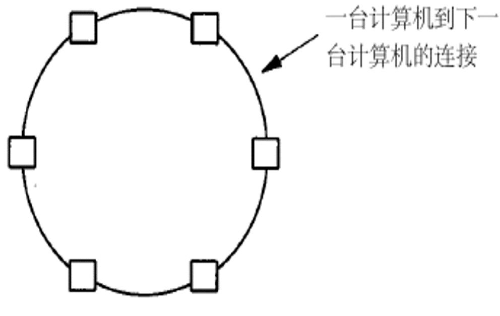

管理信息系统 - 学习笔记
笔记 | 管理学 | 计算机
管理信息系统（Management Information System，MIS）是一个以人为主导的，利用计算机硬件、软件和网络设备，进行信息的收集、传递、存储、加工、整理的系统，以提高组织的经营效率。管理信息系统是有别于一般的信息系统，因为它们都是用来分析其它信息系统在组织的业务活动中的应用[1]。学术上，管理信息系统通常是用来指那些和决策自动化或支援决策者做决策有关的信息管理方法（例如决策支持系统，专家系统，和主管支援系统）的统称。未完结。
2018-10-17

## 学习内容

##### 第一部分 信息系统概念基础

- 管理新系统概述（定义与结构）
- 业务流程 —— 信息和信息系统
  - 信息系统与决策
- 组织战略 —— 信息系统和竞争优势
  - 知识管理与专家系统

##### 第二部分 信息系统技术基础

- 硬件和软件
- 数据库应用
  - 数据库设计
- 数据通讯
  - 互联网工作原理

##### 第三部分 信息系统应用 —— 面向组织的运营管理

- 业务流程管理
  - 职能流程：应用与系统
  - 跨职能流程：应用程序与系统
  - 跨组织流程：供应链管理
- 电子商务系统
  - 社会媒体系统
- 商务智能和信息系统
  - 报告与联系分析处理（OLAP）

##### 第四部分 信息系统管理

- 信息系统开发
  - 小型企业的系统开发
  - 系统开发项目管理
- 信息系统管理
  - 信息系统外包
  - 信息系统预算
- 信息安全管理

##### 第五部分 信息系统发展前沿（技术发展前沿和应用前沿等）

## 第一部分 信息系统概念基础

### 管理信息系统概述

#### 全球视角下的信息系统学科

##### 信息系统的定义

- 信息系统（IS）是`硬件、软件、数据和流程`以及生成信息的`人员`的集合
- 管理信息系统（MIS）是帮助组织实现战略管理系统的应用

##### 信息系统学科的发展

- 始于 1976 年前后，是一个相对较新的学科
- 为了传递知识主体和提供有助于事业准备的信息
- 从全世界来看，其自然也因为当地环境如主主题、传递方式、学校所在地、学院和学生背景等而有所不同

##### 世界各国的关注点

- 美国：管理信息系统和医疗信息系统在应用程序的应用
- 加拿大：知识管理，部分在商务分析
- 欧洲
  - 芬兰：商务分析和大数据，同时伴随着 Mongo 计算
  - 瑞士：电子商务，还有小部分关注集中于云计算
  - 乌克兰：软件工程
- 亚洲
  - 中国：商务分析和大数据
  - 香港：信息系统和知识管理
  - 台湾：信息管理、信息系统
  - 新加坡：信息系统、医疗信息学和商务分析
- 澳大利亚：电子健康、信息系统

##### 结论

- 全世界来看，关注点并不相同，但是确实存在着相同的准则和相同的历史
- 在信息系统和管理信息系统的各个领域中都有着很多的衔接和整合
- 增强灵活性以满足不断变化的需求，这是一个继续不断探索的领域
- 还有不断发展的网络并且专注于网络
- 更多地关注个人和社会问题
- 移动设备为中心

##### 关注的必要性

- 信息系统无处不在
- 全球都在关注并受到影响
- 明白和接受我们跟信息系统和管理信息系统的联动很重要
- 你的职业会被信息系统和管理信息系统所影响

#### 管理信息系统

##### 学习目标

- 怎样理解管理信息系统和概念？
- 管理信息系统是服务于谁的？
- 从哪些角度进行认知？
- 管理信息系统有什么功能？如何看待？
- 管理信息系统的主要构成是什么？

##### 管理信息系统定义 1

管理信息系统是有`人、计算机、通信设备等硬件和软件`组成的，是能进行管理信息的`收集、加工、存储、传输、维护和使用`的系统。

- 可以实测企业生产经营活动中的各种运行情况
- 能利用历史的数据预测未来
- 能从全局出发辅助管理人员做出科学的决策
- 可以利用信息控制企业的生产经营活动
- 帮助企业实现规划的业务目标

##### 管理信息系统定义 2

美国明尼苏达大学企业管理研究院教授 G.B.Davis：

> 管理新系统是一种以计算机为基础、集成化的人 - 机系统，是用来提供信息，支持组织机构内部的作业、管理和决策职能的系统，该系统使用计算机的软件、硬件和通讯设备，手工规程（流程），分析、计划、控制和决策采用的模型及数据库。

##### 基本概念解释

1. <u>管理信息系统的功能</u>

- 基本功能：数据处理功能
- 核心功能：运营管理
  - 计划功能
  - 预测功能
  - 控制功能
  - 决策优化功能
- 最终目的：帮助企业实现规划的业务

2. <u>人机系统</u>

人：系统开发者和系统用户，影响着他们知识需求和应具有的能力

3. <u>集成化系统</u>： 组成 MIS 的各功能子系统可以在总体开发计划指导下分别开发，并通过数据库合为一体。

4. <u>手工规程</u>：信息系统执行和操作程序（方法、流程、规章制度等）

##### 信息系统系统定义 3

David M.Kroenke 教授，美国华盛顿等大学任教：

1. 系统：系统是一系列要素的集合，通过要素间的相互作用实现相应目标
2. 信息系统：信息系统是一系列要素的集合，通过要素间的交互来产出信息
3. 信息系统的五个基本组建：`硬件、软件、数据、规程（流程）、人`
4. 管理信息系统：可理解为信息系统的开发和使用，以帮助企业实现业务目标
5. 管理信息系统的关键要素：
   1. 信息系统
   2. 开发和使用
   3. 业务目标

##### 开发和使用信息系统

- 管理信息系统的开发和构建：扮演主动角色，了解系统是如何构建的，能够清楚地说明对信息系统的要求
- 信息系统的使用：
  - 学习如何使用，以实现你的目标
  - 新的需求与责任 —— 保证系统和数据的安全，对数据备份，准确完全的系统恢复等
  - 面对信息系统使用的伦理道德问题

<u>实现业务目标：管理信息系统帮助企业实现（组织）业务目标</u>

#### 管理系统结构

##### 物理结构组成

硬件设备、软件、数据、流程、操作人员

##### 硬件设备

- 硬件设备是物质基础
- 硬件设备实现数据输入、传输、存储、输出等的计算机设备
- 数据的采集、准备和网络通讯设备等等

##### 软件

- 软件包括系统 MIS 赖以运行的程序系统，系统软件、应用软件
- 系统软件，例如操作系统，数据库管理系统等
- 应用软件，例如订票系统，企业生产管理系统等

##### 数据

- 按一定的组织结构存储起来的各种原始数据和信息
- 包括记录在计算存储介质上的数据库或数据文件，额也包括计算机输出的报表和人工记录的原始单据等等

##### 流程

- 流程流程指保证系统有效运行的流程和规章制度、说明等
- 包括指导系统运行、数据录入、系统维护等方面的说明书和确保系统安全而制定的各种管理规程

##### 操作人员

- 操作人员就是用户和指从事系统开发、系统维护和宝保证系统正常运行的人员
- 世界上只有两类人：系统开发人员和系统使用人员

结构组成的相互关系


#### 系统的实施问题 MIS 应用系统的逻辑结构

##### 基于活动的 MIS 子系统

- 组织活动分为 3 个层次：战略规划（高层），管理控制和战术计划（中层），作业计划与控制（基层）
- 三个层次信息上存在着上传下达这样的交互作用
- 三个层次数据（信息）特点从来源、范围、概括性、时间性、流通性、需求的精度、使用频率上的存在差异

##### 三个层次级别的子系统概述

- 用于作业控制的信息子系统
  - 用于作业控制的基本活动主要三类，事物处理、报表编制和查询处理
- 用于管理控制的信息子系统
  - 管理控制是基于运行情况，比照计划、预算、指标等，行业对标等，来进行业务的分析，进而给出决策、进行相应的运作方式
- 用于战略计划的信息子系统
  - 该系统为战略计划制定过程提供信息源及通用查询和分析工具。战略制定过程比较非结构化

##### 基于职能的 MIS 子系统

定义：它是各个职能子系统的联合体

- 每个子系统又分为四个主要信息处理部分：即事务处理、作业控制的信息辅助、管理控制的信息辅助和战略计划的信息系统的辅助
- 具有各职能子系统为各自编写的应用程序及供其使用的专用数据文件
- 具有为多个职能部门服务的公共应用程序及供多个职能子系统存取、检索使用的公共数据文件
- 具有为多个应用程序公用的分析和决策模型


#### 信息系统的逻辑结构

##### 基于活动的 MIS 子系统

<u>**组织的活动层次**</u>

- 战略规划
- 战术计划和管理控制
- 作业计划与控制

<u>**层级的关系结构**</u>

- 三个层次信息上存在上传下达的交互作用
- 金字塔模型 —— 反映了业务量大小


不同层级决策特点不同（由下至上结构化程度越低）

<u>**不同层级的信息特点**</u>


<u>**不同层级子系统特点**</u>

**作业控制子系统**：

- 事务处理
- 报表编制
- 查询处理

**管理控制的信息子系统**：

- 处理程序（各种模块）来进行分析预算决策等等
- 对任何组织基本都适用

**战略计划子系统**：

- 需要丰富的信息源的支持和很强的查询分析工具的支持

##### 基于职能的子系统

<u>**总体概念结构**</u>

- 概念结构：基于它支持的、组织的不同的职能及其活动和它使用的主要的数据、模型和一些通用文件来理解的结构
- 职能的定义：在活动上具有某种独立性，在管理上规定了不同的职责任务
- 功能：事务处理、作业控制、管理控制和战略计划

**例如市场销售子系统**

- 事务处理：有关销售订单，推销订单，合同等的处理
- 作业控制：销售人员的雇佣与培训，编制日销售与推销计划，按地区、产品、客户对销售量作定期的分析
- 管理控制：对总体成绩总体绩效与销售计划的对比，所用信息可能涉及到客户、竞争对手、竞争产品和销售人员
- 战略计划：开辟新的市场、制定信的经销战略

基于职能的子系统的定义：是各个职能子系统的联合体

各个职能子系统的特点：<br>①每个子系统分成四个主要信息处理部分：即事务处理、作业控制的信息系统辅助、管理控 制的信息系统辅助和战略计划的信息系统的辅助<br>②具有各职能子系统为各自编写的应用程序及供使用的专用数据文<br>③具有为多个职能部门服务的公共应用程序及供多个职能子系统存取、检索使用的公共数据 文件<br>④具有为多个应用程序共用的分析和决策模型 

**<u>实际运行结构</u>**

实际结构会根据实际的需要有针对性的设计子系统，例如需要考虑成本和效益，开发很快产 生价值的、很快提高效益的、成本相对比较低的、成本效益比较高的子系统 。

组织的综合系统 ：

- 公共正式的管理信息系统
- 公共非正式系统
- 私人正式的信息系统
- 私人非正式系统 

##### 名词解释：

- 组织的职能：在活动上具有某种独立性，在管理上规定了不同的职责任务 
- 概念结构和实际结构的区别：概念结构是基于它支持的、组织的不同的职能及其活动和它 使用的主要的数据、模型和一些通用文件来理解的结构，是理想的完整的结构；而实际结构 会根据实际的需要有针对性的设计子系统，例如需要考虑成本和效益，开发很快产生价值的、 很快提高效益的、成本相对比较低的、成本效益比较高的子系统，所涉及的子系统的职能可能是概念结构中涉及的众多职能中的一部分。
- 公共正式的管理信息系统：是指组织机构内有关的人员和一切有权使用信息的人所拥有， 具有预先规定的规程，基于统一计划、标准和规程建设的应用程序是其组成部分，在组织上 是公共的。
- 共非正式系统：是指组织机构内有关的人员和一切有权使用信息的人所拥有，但极少有 事先制定的规则，只为组织机构内与之相关的所有人服务。
- 私人正式的信息系统：个人所有，至少可以供拥有者本人和帮助维护系统的人员使用，有 统一的标准，不是根据职能和职位，而是根据个人意愿建立
- 私人非正式系统：个人所有，主要是通过个人联系和保持信息，这些信息对个人决策十分 关键。 

### 业务流程 信息与信息系统

#### 人工智能 机器学习 机器人技术

<u>**人工智能（机器开始模仿「认知」功能）**</u>

现状：有难题，但随着计算能力的提高，人工智能正在崛起

**<u>机器学习（计算机在不显示编程的情况进行学习的能力）</u>**

功能：数据预测、辅助决策（监督或无监督）

##### 机器人技术

- 现状：与人工智能结合，目前持续发展
- 问题：会不会将来取代人类
  - 在工业上中、危险较高危险的工作：机器人可以
  - 需要人际沟通的工作：不一定
  - 较专业的工作（如律师、教授、医生等）
    - 简单重复性工作：机器可以
    - 非日常工作：如管理、规划、创业、制定政策等：目前人类胜于机器

<u>**举例**</u>

- 未来医院的可能性：借助穿戴设备，可以远程进行检测，减少不必要的住院问题，节省资源
- 自动化办公并未实现：这并非技术问题，而是人、流程等改变困难，如政府办公

<u>**展望未来**</u>

一些工作将由机器来做，机器学习、人工智能、机器人的进步将引领未来。

#### 信息系统的两种技术


##### 传感器

**<u>定义</u>**：是一种检测装置，能感受到被测量的信息，并能将感受到的信息，按一定归来吧变换成为电信号或其他所需形式的信息输出，以满足信息的传输、处理、存储、现时、记录和控制等要求

<u>**应用**</u>：

- 工业和商业领域：食品生产、工厂机械、飞机飞行、天气预报、温度控制、环境安全、污染、煤气泄漏、爆炸、交通检测、导航、GPS 等
- 可用于可穿戴设备：医疗保健方面、健康保健方面
- 技术问题：
  - 设备数量过多，缺乏标准
  - 无法准确矫正测量数据，可能导致疾病、负担过大
  - 数据隐私和安全性问题

##### 物联网

定义：物联网通过各种传感器和其他设备，实时采集任何需要检测、链接、互动的物体和过程等各种需要的信息，与互联网结合形成一个巨大网络实现物与物，物与人，物与网络的连接，方便识别、管理和控制

<u>**关键技术**</u>：

- 传感器技术
- FRID 标签
- 嵌入式信息系统

<u>**应用环境**</u>

- 食品供应效率
- 食品质量保证
- 可穿戴设备
- 智能家居监控

##### 云

##### 云的定义

基于互联网的计算的一种形式，可以根据需要向计算机和其他设备提供共享的计算机处理资源和数据，允许具有各种职能的用户和企业更容易，可靠地存储和处理数据

#### 云的分类

- 按规模分为小型的云和巨型的云
- 公司私有的云
- 由第三方提供的对外开放的云

##### 云的优势

- 提供了更高的灵活性
- 为公司节省了前期基础架构成本
- 使组织能够专注于其核心业务，专注于产品和市场营销，并为人们提供意愿中的优质产品
- 帮助企业更快的起步和运行
- 是信息技术团队能够更快速地调整资源供给以满足不断变化的业务需求

##### 云的应用

一种按需访问共享的计算资源池，这些资源可以是网络、服务器、存储、应用程序、服务、软件，可以以最少的管理成本快速提供和发布。

##### 云的运作方式

- 云计算提供有限选择的服务
- 使用既定的标准的最佳做法
- 可以以标准化的方式轻松地访问全球的云服务
- 利用效用计算的概念为所使用的服务提供指标
- 执行自动故障恢复

##### 云的现状：

- 云计算由于规模经济而更便宜，换句话说，服务于大量的客户，由此可以利用规模经 济，从而减少成本
- 云提供商可能不符合组织的法律需求
- 管理政策取决于云供应商

##### 云的安全性

- 云比其他存储库（如组织或笔记本电脑）更安全，因为它们会不断更新其安全功能并 主动监控访问
- 现在公司都有所担心，因为所有的竞争对手都可能在同一个云中，而公司根本不知道 他们的数据在哪里（以及如何）存储
- 政府在追踪犯罪活动时可以随时要求访问

##### 对云所做的思考

- 你的数据到底存储在哪里？
- 你真的能够管理你的数据吗？
- 你的数据有多少个副本？
- 你是否可以彻底删除一些东西？
- 谁有合法的访问？是否存在非法访问？
- 你会真正知道谁在何时访问了你的数据吗？
- 风险是否大于收益？

##### 关注云的必要性

- 你的生活处处都有云
- 你的职业也会跟云计算联系起来
- 数据会发送到我们日常交互的信息系统中，有时候我们甚至毫无察觉
- 这是一个极佳的创新创业机会
- 这其中还存在着很多需要权衡和考虑的问题，还有管理上的问题

#### 业务流程，信息和信息系统（上）

##### 业务流程基本概念

- 流程的概念：按照条理和顺序做事情的过程
- 业务流程的概念：从组织行运营视角来看，业务流程通常就是一组活动，这些活动有利于一个或者多个输入要素，对其进行转换并使其增值，向用户提供一种或者多种输出。
- 业务流程的定义：业务流程也可看作是活动、资源、设施和信息构成的网络，通过交往来实现特定的业务功能。
- 一个业务流程也是一个业务系统

##### 业务流程的构成系统

- 活动：就是将一种类型的资源和信息转化为另一种类型资源和信息
  - 完成活动形式：
    - 手动 —— 人按照规程完成活动
    - 自动 —— 软件指导硬件来完成活动
    - 手动自动相结合
- 资源：资源可以看作具有价值的外部项目
  - 供应商和客户都被看作是资源，因为他们都对流程产生了价值
- 设施：业务流程内部的装置，可以看作业务流程中的存储部件，通常用来放置资源和信息
  - 典型设施：仓库、数据库
- 信息：是活动用来决定如何将获取得到的输入转化为要产生的输出
  - 特点：被活动所使用、决定如何将输入化为输入、很难被定义

#### 业务流程，信息和信息系统（中）

<u>**信息**</u>

定义 1：信息是取自数据的只是<br>定义 2：信息是在有意义的情境中展示的数据<br>定义 3：信息对数据的汇总、排序、平均、分组、比较或其他类似的操作，即信息是通过对数据的加工处理而产生的<br>定义 4：信息能够带来重要的差异

<u>**数据**</u>：数据是被记录下的事实或图像，本身没有意义。

<u>**数据和信息的关系**</u>：通过信息的定义，我们可以看到信息取自数据，通过对数据的处理，使其在特定情境中具有意义，信息是在有意义的情境中展示的数据。

<u>**业务流程**</u>：从组织运营视角来看，业务流程通常就是一组活动，这些活动利有一个或者 多个输入要素，对其进行转换并使其增值，向用户提供一种或者多种输出。

<u>**业务流程和信息的关系**</u>：业务流程产生信息，即将情景中的数据整合在一起，使其具有 更高的层次，有利于管理层和决策制定使用。

<u>**业务流程，信息，数据三者的关系**</u>：业务流程通过将重要的数据项集合在一个特定的情 境中而产生信息;业务流程可以在更高的层次产生信息。

<u>**好信息**</u>：好信息是具有准确，及时性，相关性，恰好充分，体现成本价值的特性

#### 业务流程，信息和信息系统（下）

<u>**信息系统如何来支持业务流程**</u>：不断地将流程自动化以人为主的业务处理转变为计算机为主的处理模式。

<u>**每个信息系统都伴随着流程**</u>

如：

- 支持柜台销售的信息系统流程特征：全自动；收银机中的计算机与存有库存数据 的计算机进行交互来获取需要的信息；程序记录销售信息并更改
- 支持付款活动的信息系统特征：支付活动接收到收货数量和发票，并产生了供应商付 款数据；大部分人手工操作
- 支持采购活动的信息系统特性：采购人员用计算机运行库存应用程序，决定库存水平 并产生采购订单；设计员同时考虑计算机自动化和人为手工操作工作量的的平衡 

<u>**作为信息系统里的人的角色可能是**</u>：人是管理信息系统五要素之一，也是最重要的要素 。人的角色重要性体现在即使信息系统是完美的，但如果操作信息系统的人不知道如何利 用其产生的数据进行决策，就是在浪费时间和金钱，所以人的判断质量是信息系统质量的 重要组成部分。

### 组织战略 信息系统和竞争优势

#### 组织战略怎样决定信息系统构架

- 组织战略：在管理学中，组织战略是指组织对有关全局性，长远性，纲领性目标的谋划和策略。即组织为适应未来环境的变化，对生产经营和持续，稳定发展中的全局性，长远性，纲领性目标的谋划和决策
- 组织战略如何影响信息系统：首先，组织的业务目标是其自身的竞争优势决定；其次，竞争优势决定了价值链，并进一步影响了业务流程；最后，业务流程决定了信息系统的结构，特点和功能，如下所示：

$$
行业结构 \to 战略竞争 \to 价值链 \to 业务流程 \to 信息系统 \\
（组织战略决定信息系统）
$$

- Porter 三个不同的模型：行业结构的五力模型；竞争决策模型；价值链模型。
- 行业结构：指行业内部各参与者的特性及议价能力。
- 行业结构的五力模型：五种力量模型将大量不同的因素汇集在一个简便的模型中，以此分析一个行业的基本竞争态势。五种力量模型确定了竞争的五种影响力的主要来源，即供应商和购买者的讨价还价 能力，新进入者的威胁，替代品的威胁，以及最后一点，来自目前在同一行业的公司间的 竞争。一种可行战略的提出首先应该包括确认并评价这五种力量，不同力量的特性和重要 性因行业和公司的不同而变化。如下图：


- 竞争战略：一个公司的竞争战略是指公司管理层所指制定的长远的发展规划和具体的目标措施，其目的在于发展公司的业务并建立公司的市场地位。即组织对于其行业竞争结构（五种力量模型）的对应措施。
- Porter 的 4 种竞争策略：整个行业的成本优势；（聚焦）行业特定区域（人群）的成本优势；行业的差异化；（聚焦）行业特定区域（人群）的差异化。如下：


#### 信息系统以及竞争优势 —— 价值链与业务流程再造

##### 价值链

- 价值的定义：价值就是买房愿意为一种资源、产品或服务岁支付的费用。
- 价值链与价值的关系：一个价值链是能够产生价值的活动网络（价值链系统）。
- 波特的一般价值链模型：通常包括五个主要活动和三个辅助支持活动（从系统的角度）。


<u>**价值链中的主要活动**</u>：


- 价值链上的每个阶段都会使产品积累成本，增加价值。
- 总利润就是这些活动所累计的总价值与所产生的总成本之间的差

<u>**价值链中的辅助活动**</u>


<u>**辅助的作用**</u>：辅助活动主要对产品的生产、销售和售后服务等起间接作用

<u>**价值链活动间的联系**</u>：通用价值链及它们活动之间是紧密联系的。

#### 业务流程再造

概念：波特的思想是以通用价值链及活动间的联系为基础，建立集成的，跨部门的业务系统（基于活动），而不要自动化现在系统或者改进现有系统。

<u>**具体措施**</u>：

- 创建新流程（更有效的）
- 集成所有部门的活动
- 建立在整个价值链上

#### 价值链与业务流程的关系

- 业务流程就是完成价值链的全部活动或部分活动
- 每一个价值链都是由一个或更多的业务流程所支持的
- 业务流程所产生的价值必须要远远大于其成本，否则价值链的利润为负。

#### 基于信息系统的竞争优势

<u>**组织战略与信息系统的关系**</u>

组织策略决定信息系统：组织面临行业中五种竞争力（波特的五力模型），基于竞争力来明确竞争战略，基于竞争战略确定组织价值链模型，基于价值链模型，可决定组织业务流程，业务流程可由信息系统来支持。

<u>**组织的竞争战略应用原则**</u>

通常有两类：

- 产品实现原则
- 流程实现原则

信息系统支持的`产品`竞争优势，通过使自己和其他竞争者之间的服务`差异化`，可以：

- 创新产品或服务
- 提升已有的产品或服务
- 形成具有特色的产品或服务

信息系统支持的`流程`竞争优势，组织可以借助于提高业务系统来获得竞争优势，可以：

- 锁住客户：提高顾客转换成本
- 锁住供应商：是供应商更容易方便进行沟通联系和工作
- 增加新进入者的障碍：让新的竞争者进入市场需要高昂的成本
- 建立联盟：设立标准、提升品牌知名度
- 降低成本：提高收益率

<u>**举例**</u>：ABC 公司使用信息系统获取竞争优势

- 产品上，提升了产品性能，差异化了自己产品（提供邮件功能）
- 流程上：
  - 可以锁住客户（方便的信息，降低了工作强度，减少了出错率）
  - 提升了客户的转换（到递送企业）的成本
  - 提高了新进入者的门槛
  - 递送了流程节约了的成本（录入打印等）

#### 回顾

本章知识如何帮助 Dee：

行业结构的知识提供了背景和视角，更容易与高层经济交流对接，使得 Dee 能理解组织竞争优势，将组织竞争策略体现在计划中，建立更高的博客

Dee 的应用竞争策略：

- 建立的博客可以及时通告最新信息，典型病例，技术以及治愈成功的案例等等
- 当一个销售人员完成销售后，Dee 可以对其在博客行发表和广播
- 以高性价比方式，对销售人员听准确及时的信息，支持竞争战略中「应如何最好地传达最新的信息」从流程上提升竞争优势，降低成本。

Dee 的报告可以：

- 帮助销售团队实现与竞争对手差异化
- 锁住顾客群体（获取更有利的说服数据）
- 增加市场进入者的障碍

## 第二部分 信息系统技术基础

### 硬件与软件

#### 开篇案例：

- 因为业务需要，迪伊要建立博客系统来支持销售业务
- 迪伊不了解技术细节，邀请信息系统专家唐.格担任技术 顾问
- 唐.格知道最好不要抛给迪伊技术性的问题

##### 为了解需求，唐.格需要问一些基本问题：

- 你的博客是基于内部环境运行还是与外部的服务机构合作运行？
- 你会选择WINDOWS或者LINUX 系统？ 
- 你想怎么样编码你的整个博客？
- 你是想要用软件还是让我给你建立一个 HTML编译器在你的博客软件里？ 
- 你想使用哪种网页浏览器？IE、Firebox、Chrome，还是其他的？ 
- 你是否介意你的博客在某一浏览器里不能被完美地呈现出来？

##### 迪伊的困惑

- 迪伊不知道这些问题的答案
- 她甚至不知道其中某些问题的意思
- 她公司里的IT人员曾经告诉过她这个工程几乎不可能按 时完成。他们也不会为迪伊提供任何技术支持
- 由于潜在的利益冲突，唐.格不可能免费解答迪伊提出 的所有问题

#### 本章学习目标

- 作为一个经理需要掌握哪些计算机硬件和软件的知识？
- 计算机由哪几部分组成？
- 客户机和服务器之间的区别有哪些？
- 计算机中的数据是如何存储的？
- 如何理解胖客户端和瘦客户端？
- 有哪些常见的操作系统？
- 如何对应用软件进行分类？
- 本章学习的知识如何帮助迪伊？

#### 计算机硬件的知识

##### 硬件

由电子元件及相关配件组成的,能根据编入计算机程序和 软件中的指令实现数据的输入、处理、输出和存储。

<u>**计算机的一般组成**</u>：


中央处理器（CPU）：计算机的大脑：能够从`主存储器(内存)` 中调用指令、处理指令 、执行运算并将结果写 入到主存储器中。

特殊功能卡：提升计算机性能的特殊 功能卡。 例如显卡，提高计算机 显示器的清晰程度。

<u>**计算机的工作原理**</u>


CPU 把程序或数据从磁盘或光盘等设备读取到`内存`中

内存：

- 包含操作系统指令
- 包含程序指令

CPU 通过数据信道或总线从内存中读出指令和数据并处理

缓存：CPU 中有小容量的能快速存储的存储系统，使用频率较高的指令要求保存在缓存

CPU 处理完后通过 输出设备如显示器 把结果反馈给用户

#### 计算机中的数据

##### 二进制数字

- 计算机中存储的数据可以是数字、字符、金额、图片、录音等多 种格式
- 计算机用二进制表示数据，称为比特（Bit），一比特不是 0 就是 1
- 用 0 表示开关「开」的状态
- 用 1 表示开关「关」的状态

##### 字节是计算机中的最小存储单位

- 8 个比特构成一个字节（Byte）
- 主存、磁盘或者其他计算机设备容量大小都就是用字节表示
- 存储量规格：
  - 1 KB = 1,024 Bytes
  - 1 PB = 1,024 TB
  - 1 EB = 1,024 PB
  - 1 ZB = 1,024 EB

#### 为什么管理者需要了解计算机原理

- CPU 的性能：
  - 运行速度用 Hz 表示：1.8G Hz or 3.6G Hz or …… ?
  - 单核 or 双核 （个人计算机） or 四核（服务器）?
  - 只处理简单文字的员工不需要速度快的CPU
  - 处理复杂任务占用更多CPU
- 需要多大的内存空间？
- 内存太小导致经常交换内存。
- 缓存和内存是易失的 ：管理者需要及时保存
- 磁盘和光盘是稳定的

#### 客户端和服务器端


##### 区别

- 客户端计算机
  - 用于文字处理、数据库访问、应用程序请求、网络连接等操作
- 服务器端计算机
  - 执行复杂、大容量的任务
  - 更快的处理速度和处理能力
  - 更大的数据存储容量
  - 没有视频显示，通过网络远程读取

##### 瘦客户端和胖客户端

- 瘦客户端
  - 客户端仅仅需要安装浏览器
  - 不需要安装和管理客户端应用软件
  - 绝大部分工作由服务器承担，对服务器要求较高
  - 客户端维护与升级的成本较低
- 胖客户端 
  - 在客户端计算机需要安装并运行应用软件
  - 客户端和服务器端都能够处理任务
  - 对客户机的要求较高，但可以减轻服务器的压力
  - 客户端软件安装、维护和升级成本较大困难

##### 服务器农场

- 由大量相互协作的服务器构成。
- Google全球有36个数据中心，搭建了几十万台服务器。
- 一次Google调查可能会涉及到700-1000台服务器。
- 当一台服务器出现问题，由其他服务器处理剩下的任务。
- 用户不需要知道其中的细节

#### 计算机软件的知识

##### 两种类型的计算机软件

- 操作系统：控制计算机资源的软件 
- 应用软件：执行特定用户任务的软件 

##### 软件的兼容性 

不同的操作系统版本适用于不同的硬件类型

- Windows 只能在 Intel 处理器的硬件环境下运行
- IOS只能运行在苹果的手机上

应用程序运行于特定的操作系统（应用程序和操作系统的兼容性） 

- 微软的ACCESS只能在Windows操作系统上运行 
- 基于Android系统开发的手机应用程序和IOS不兼容

##### 计算机操作系统

- Windows
  - 应用于世界上85%的台式机
  - 95%的商户使用
  - 由微软开发
  - 有许多不同版本
  - 运行在Intel处理器上
-  Mac OS
  - 易于使用、友好的界面
  - 主要为绘图艺术者和艺术社区使用
  - 早期需要运行在 IBM 的 PowerPC 处理器上
  - 2005 年以后同时兼容 PowerPC 和 Intel 的 CPU 处理器
- Unix
  - 20世纪70年代贝尔实验室开发的操作系统
  - 科学和工程学上的黑马
  - 运行在 Sun Microsystems 公司的处理器上
  - Unix 用户需要了解应用处理软件的程序语言
  - 不适合于商业用户
- Linux 
  - 开源社团开发，开源社区拥有所有权
  - 用户可以免费使用 Linux 操作系统
  - 一群独立又相互联系的程序员资源编写程序代码
  - IBM 是其主要倡导者
  - 支持所有处理器的指令

##### 应用软件

<u>**应用软件分类**</u>

- 水平市场应用软件 
  - 提供的功能通用于所有组织和行业，例如：Word, Excel, PowerPoint, Acrobat 
- 垂直市场应用软件 
  - 适用于特定行业需求的软件 ，例如： 医院的预约系统；酒店的点餐系统 
- 特制应用软件 
  - 针对特定、唯一的需求开发的 ，例如： 某制造型企业的生产计划系统（有色玻璃的生产加工）

<u>**应用软件来源**</u>

- 购买现成的软件（off the shelf）
- 对现成的软件加以更改（off-the-shelf with alterations）
- 定制开发的软件（customized）


#### 管理者需要做出怎样的决定

- 大型组织往往依赖于组织的政策 
  - 大型组织通常有规范的信息系统（IS）部门
  - IS 部门规定了选择客户端硬件和软件的标准
- 中小型组织往往依赖于管理者的决策 
  - 经理在确定应用软件方面可能会扮演重要角色
  - 通常会考虑业务合作伙伴使用的应用软件


<u>**管理者需要跟上技术的发展**</u>

- 技术不断地变化
  - 云计算、物联网、移动互联网、大数据
- 如果你跟不上，就不能获得竞争优势
  - 经理们需要了解哪些技术是必要的
  - 不要只依赖专家
  - 懂得运用 IT 技术获取竞争优势

**<u>管理者需要做什么？</u>** 

- 不要忽略技术
- 参与研讨
- 阅读文章，广告
- 参与专业事件
- 作为一个用户代表参加技术会议

### 数据库

<u>**数据处理**</u>：数据处理是指将数据转换成信息的过程。它包括对数据的收集、存储、分 类、计算、加工、检索和传输等一系列活动。

<u>**数据管理**</u>：数据管理是指数据的收集、组织、存储、检索和维护等操作。

#### 数据管理的几个阶段

- 人工管理阶段（1940s-1950s）
- 文件系统阶段（1950s-1960s）
- 数据库管理阶段（1960s-） 

#### 数据库的基本概念 

##### 数据（Data）

人类生存的世界是一个物质的世界，同时也是一个信息的世界，描述 现实世界信息最准确的工具是数据。

- 定义：描述事物的符号记录
- 种类：文本、图形、图像、音频、视频、学生的档案记录、货物的运输情况等
- 特点：数据与其语义是不可分的

##### 数据库（Database）

- 定义：数据库（Database，简称 DB）是长期储存在计算机内、有组织的、可共享的大 量数据的集合。数据（Data）是数据库中存储的基本对象
- 基本特征：
  - 数据按一定的数据模型组织、描述和储存
  - 可为各种用户共享冗余度较小
  - 数据独立性较高
  - 易扩展

##### 据库管理系统（DBMS）

- 定义：位于用户与操作系统之间的一层数据管理软件，是基础软件，是一个大型复 杂的软件系统
- 用途：科学地组织和存储数据、高效地获取和维护数据

##### 数据库系统（DBS）

- 定义：在计算机系统中引入数据库后的系统构成
- 数据库系统的构成：
  - 数据库
  - 数据库管理系统
  - 应用系统
  - 数据库管理员

#### 数据库管理系统的主要功能 

##### 数据定义功能 

- 提供数据定义语言（DDL）
- 定义数据库中的数据对象 

##### 数据组织、存储和管理

- 分类组织、存储和管理各种数据
- 确定组织数据的文件结构和存取方式
- 实现数据之间的联系
- 提供多种存取方法提高存取效率

##### 数据操纵功能 

- 提供数据操纵语言（DML）
- 实现对数据库的基本操作  （查询、插入、删除和修改）

##### 数据库的事务管理和运行管理 

- 数据库在建立、运行和维护时由 DBMS 统一管理和控制
- 保证数据的安全性、完整性、多用户对数据的并发使用
- 发生故障后的系统恢复 

##### 数据库的建立和维护功能

- 数据库初始数据装载转换
- 数据库转储
- 介质故障恢复
- 数据库的重组织
- 性能监视分析等

其他功能：DBMS 与网络中其它软件系统的通信、两个 DBMS 系统的数据转换、 异构数据库之间的互访和互操作

#### 数据库与管理信息系统（MIS）

- 数据处理系统
- 数据管理工具
- 应用方式（桌面系统，中央数据库，分布式数据库）

#### 数据库应用

<u>**案例**</u>：

迪伊 和她的顾问经过反复商量，最终为她的博客选择了一款叫做 Movable Type 的应用软件。尽管这个软件操作起来有一点复杂，但是在博客的用户界面管理方面却有独到之处。她的顾问介绍说这是一款专业级别的软件。

选择这个应用软件不久后， 唐.格 提醒她需要装 MySQL 数据库。他解释「你需要一个数据库管理系统来存储博客信息。」

唐.格 提醒她应该先询问IT部门是否安装了MySQL。而她询问以后被告之，「我们是按 Oracle 的标准配置的，我们没有安装其他的数据库产品。」

 迪伊 将这个情况告诉了 唐.格 。 唐.格 解释说，Oracle 在大型数据库应用方面有特殊优势，但是它使用起来非常麻烦。如果使用 Oracle 的产品，那将不得不改变各方面的预算，而且还要确认是否有适合 Oracle 的 Movable Type 软件。

 唐.格 建议迪伊再和 IT 部门谈谈。然而当迪伊再一次给 IT 部门打电话时，遭到了强烈的反对，IT 部门的反对理由包含了很多她听不懂的术语，看来迪伊需要本章的知识了。

#### 本节学习目标

- 数据库的用途是什么？
- 数据库都有什么功能？
- 数据库管理系统（DBMS）是什么，有什么用途？
- 数据库的应用包括哪些方面？
- 企业 DBMS 和个人 DBMS 的区别是什么？

#### 数据库的用途

数据库的用途是保存事物记录

- 电子表单
  - 记录单一主题的事务
- 数据库
  - 记录多个主题的事务

#### 数据库的构成

$$
数据库 = 表或文件 + 表中各行的关系 + 元数据
$$

##### 表或文件

- 数据库是表格的集合
- 数据库表格


- - 关键字（主键）
    - 可以在表中确认唯 一行的字段
    - 每个表有一个主键
    - 学号是学生信息表的主键
    - 邮件号是电子邮件表的主键
    - 访问号是来访记录 表的主键


##### 表中各行的关系

学号在表与表之间 建立起来联系（如上图）

- 外部关键字（外键）
  - 表中的一个字段是另一个表的关键字
  - 通过外键建立起表 中各行的关系
  - 上图中「电子邮件表」的`学号`是「学生信息表」的关键字

##### 元数据

- 描述数据库中的数据
  - 数据类型
  - 数据的存储长度
  - 是否是主键

#### 数据库管理系统

##### 数据库管理系统（DBMS）

用来建立、处理和管理数据库的程序

通常从软件提供商购买许可
- Oracle
- MySQL
- Access
- DB2

DBMS 的第一个功能是建立数据库中的表、关系以及结构

DBMS 的第二个功能是处理数据库

- 用户通过 DBMS 完成：
  - 数据访问
  - 数据插入
  - 数据修改
  - 数据删除

##### 结构化查询语言（SQL） 

- SQL 是处理数据库的国际标准化语言, 被美国国家标准化组织确定，为数据库系统的工业标准
- 大部分的 DBMS 产品都支持 SQL 语言
- 基于 SQL 的 DBMS 产品可以运行在各种计算机系统上，具有良好的可移植性
- 利用 SQL，用户可以用相同的语句在不同的数据库系统上执行同样的操作

**<u>数据表的创建</u>**


```sql
Create Table  表名 (字段 1 数据类型 1, ..., 字段 n 数据类型 n)

Create Table Student
(stu_id varchar(8), stu_name varchar(8), stu_sex varchar(2), stu_birthday date)
```

<u>数据表的删除</u> 

```sql
Drop Table  表名

Drop Table Student
```

**<u>数据表的修改</u>** 

在表名为「student」的数据表中增加 stu_depart 的字段。

```sql
Alter Table Student Add stu_depart varchar(8) 
```

在表名为「student」的数据表中去掉 stu_birthday 的字段

```sql
 Alter Table Student Drop stu_birthday date
```

将表名为「student」的数据表中的 stu_name 字符长度修改为 10

```sql
Alter Table Student Alter stu_name varchar(10)
```

**<u>数据的插入</u>**

```sql
INSERT INTO 表名 (字段 1, 字段 2, ...) VALUES(字段 1 的值, 字段 2 的值, ...)

INSERT INTO Student
(stu_id, stu_name, stu_sex, stu_birthday) VALUES (‘1021001’, ‘Lei Wang’, ‘Male’, ‘19890210’)
```

**<u>数据的修改</u>**

```sql
UPDATE 表名 SET 字段 1 = 表达式 1， SET 字段 2 = 表达式 2
WHERE 条件

UPDATE  Student, stu_birthday = ‘20010210’
WHERE stu_id = ‘1021001’
```

**<u>数据的删除</u>**

```sql
DELETE FROM 表名 WHERE 条件

DELETE FROM Student WHERE stu_id = ‘1021001’
```

<u>**数据的查询**</u>

```sql
Select 列 From 表 Where 条件

SELECT stu_name FROM Student WHERE stu_sex = ‘Female’
```

##### DBMS 的第三个功能是管理数据库 

- DBMS用来定期备份数据库、移除不再需要保存的数据
- DBMS建立、管理并维护用户账号并设置密码
- DBMS根据用户的等级设置操作权限，保证数据安全性 

例如：

- 老师可以读取学生数据库中的所有考试记录
- 学生只可以读取自己相关的考试记录

#### 数据库应用程序

##### 数据库应用

- 是产生数据库的表单、报表、查询和应用程序的集合
- 是用户和 DBMS 之间的中间层
- 可以面向企业或个人的需求

##### 报表

在结构化的表中显示经过处理的数据。


##### 查询

面向个人的需求，从数据库数据中得到需要的信息。

##### 面向企业特定的需求，针对特定的业务需求开发


##### 网络服务器应用程序

用户使用浏览器通过互联网连接到网络服务器上，由网络服务器上的 应用程序处理用户的请求，执行必要的数据库操作。


##### 多用户处理

- 多用户同时访问数据库时，会产生数据冲突问题
- 数据冲突产生不确定的结果
- lost-update（丢失 - 更新）问题
- 加锁用来协调多用户的活动
  - 如错误提示

#### 企业级 DBMS 和个人 DBMS

##### 企业级 DBMS

- 处理大型组织和工作团队的数据
- 支持多用户（成千上万）和不同的数据应用
- 支持全天候运作
- 能够管理GB、TB字节的数据库
- 例如：
  - IBM 的 DB2，微软的 SQL Server, 甲骨文公司的 Oracle

##### 个人 DBMS

- 针对小型的简单数据应用设计
- 大多数情况下用户少于 100 人
- 大多个人 DBMS 往往只有一个用户
  - 如教授建立并维护的学生信息表
- 例如：微软的 Access，dBase，FoxPro，Paradox

#### 本章的内容对 Dee 有什么帮助

- 迪伊将了解什么是 DBMS 以及它的作用
- 她要建立一个以 MySQL 为数据库的独立系统

#### 案例讨论

Kelly 主要负责服务器维护和数据库的存储备份

- 拷贝了数据库资料来练习
  - 访问SQL Server中的元数据
  - 发现表中关于订单、客户和销售人员的数据
  - 揭示异常：一个记录员给予一个买主其他人没有的 折扣
- 向那个记录员提起这件事
- 因访问数据库被解雇

思考：

- Kelly 的问题出在哪里了？
- Kelly 把数据带回家是违法的吗？
- 公司应该如何处理 Kelly？
- 公司是否应该和 Kelly 一起承担过失？

道德指南：

- 数据隐私
- 数据使用权限的问题

### 数据通信

这一部分不知道考不考。

#### 计算机网络

##### 为什么要用到计算机网络？（功能）

1.  共享数据
2.  共享计算机资源（处理器、内存等）
3.  传输数据

##### 怎么完成计算机网络的链接（要素）

1.  网络设备
2.  传输介质
3.  网络技术
4.  网络协议
5.  网络软件

##### 传输介质

1.  双绞线
2.  同轴电缆
3.  光纤
4.  无线电波

##### 计算机链接方式

1.  直接点对点通信
2.  局域网
3.  广域网

##### Internet 的产生

1.  50 年代末，美国成立了高级研究计划署（ARPA）
2.  60 年代后期，ARPA承担了开发一个不易遭破坏的计算机通信网络系统的任务，这个网络被叫做 ARPANET，目标是该通信系统在核战争中仍然能发挥作用。
    1.  每个节点具有独立的功能
    2.  资源共享
    3.  异种计算机实现通信
3.  1969 年 9 月，斯坦福研究所、加州大学圣巴巴拉分校、加州大学洛杉矶分校和犹他大学之间开始利用网络进行信息交换

##### Internet 的发展

1.  90 年代，Internet 从一个科研应用的计算机联网系统，发展为全面商业化的信息全球信息网。
2.  1993 年 9 月克林顿政府正式宣布了「国家信息基础设施」（National Information Infrastructure，简称 NII）计划，人们将其通俗地称为「信息高速公路」计划。
3.  NII 计划的基本原则
    1.  鼓励私人投资
    2.  促进并保护竞争
    3.  为消费者和信息服务者提供对 NII 的公开访问
    4.  确保全方位服务的可靠性和灵活性
    5.  使信息系统能够跟上技术和市场的飞速发展

计算机网络和管理信息系统（MIS）的关系

在管理信息系统的视角下，计算机网络是实现 MIS 的物理平台，MIS 要落在计算机软件、计算机硬件和一定的计算机网络环境中才能实现，在这个平台上，一个多任务看、多用户的应用系统才能够完成大规模的数据处理和传输。

#### 网络拓扑结构

##### 星型拓扑

所有计算机都连在一个中心站点上：


##### 环状拓扑

将计算机连接成一个封闭的圆环的网络



##### 总线拓扑

用一根链接计算机的共享电缆链接的网络


##### 三种拓扑结构的有点和缺点

1.  星型拓扑：
    1.  优点：能保护网络不受一根电缆损坏的影响
    2.  缺点：每根电缆只链接一台机器
2.  环状拓扑：
    1.  优点：计算机容易协调使用并且容易检测网络是否正确运行
    2.  缺点：如果其中一根电缆断掉，整个环状网络都要失效
3.  总线拓扑：
    1.  优点：所需的布线比星型拓扑少
    2.  缺点：如果总线被切断，网络就要失效

##### 总线网络实例

<u>**以太网：采用总线拓扑**</u>

1.  分类：
    1.  传统以太网：运行宽带为 10 Mbps
    2.  快速以太网：运行宽带为 100 Mbps
    3.  千兆以太网：运行宽带为 1000 Mbps 或 1 Gbps
2.  共享：
    1.  以太网使用总线拓扑，多台计算机共享单一的传输介质
    2.  当一台计算机向另一台计算机传输帧时，所有其他计算机必须等待
        1.  局域网技术中的共享并不意味着多个帧可以同时传输
        2.  在帧的传输过程中发送计算机独占使用整个电缆 —— 其他计算机必须等待
        3.  在此计算机完成传输后，共享电缆才能为其他计算机使用


3.  多路存取载波侦听（CSMA）
    1.  定义：没有计算机发送帧时，以太中不含有电子信号，在帧的传输过程中，发送计算机传输用于对位串进行编码的电子信号（也成为载波）。为了确定电缆中是否正在被使用，计算机可以检测载波，如果当前没有载波，计算机就能传输一帧，如果当前存在载波，计算机必须等待其他计算机发送完成。从技术上讲，检测载波叫做载波侦听。这种利用信号的存在来确定何时传输的想法叫做多路存取载波侦听。
    2.  冲突检测（CD）：两台分别位于空闲电缆两端的计算机同时准备发送帧时，两台计算机降同时检测载波，同时发现电缆是空闲的，然后同时开始发送帧，当两台计算机发送的电子信号在电缆上同一点相遇时，他们将会相互干扰。两个信号的相互干扰称为冲突。为了确保没有其他计算机同时传输，以太网标准要求每个发送站检测电缆上的信号。如果电缆上的信号不同于该站发送出去的信号，意味着出现了冲突。当一台正在发送的计算机检测到冲突，它立即停止传输。这种在传输的过程中监测电缆的方法成为冲突检测
    3.  载波侦听多路存取/冲突检测（CSMA/CD）：在一个冲突发生后，计算机必须等待电缆再次空闲后才能传输帧。为了避免多次冲突，以太网要求每台计算机在冲突后延迟一段时间才开始传输。标准指定了最大延迟d，并且要求每台计算机选择一个小于 d 的随机延迟，在大多数情况下，当计算机随机选择一个延迟时，它将选一个与其他计算机所选的值都不相同的值，选择到最小延迟的计算机将开始发送帧，网络将恢复正常运行。如果有两台或多台计算机在冲突后恰好选择几乎相同的延迟，那么它们将几乎同时开始传输，导致第二次冲突。为了防止一连串的冲突，以太网要求每台计算机在每次冲突后把选择延迟的范围加倍。在几次冲突后，一些计算机选择了较短的延迟而无冲突传输的概率就变得很大。
        1.  无线局域网和 CSMA/CA：无线局域网：无线局域网硬件并不在电缆上传输信号，而是利用天线空中广播其他计算机能接收的 RF 信号。无线局域网也采用共享方式。无线局域网中的所有计算机都使用相同的无线电频率，它们也必须轮流发送包。无线传播的方式导致了有线局域网和无线局域网在管理共享上的一个区别。尽管电磁波向各个方向传播，但无线局域网的发送器功率较小，使得它只能传播很短的距离，并且金属障碍物会阻碍信号的传播，所以，相距很远或被障碍物阻隔的无线设备不能接收对方发送的信号
        2.  防止冲突的多路存取载波侦听（CSMA/CA）：为了保证传输介质
            能正确的被共享。在传输一个包之前先由接收者发送很短的控
            制消息，发送方接收到响应的控制消息后，它就可以开始发送
            帧。在 CSMA / CA 中，控制消息的传输可能会发生冲突，但能
            够很容易地处理


<u>**Local Talk**</u>

1.  每个 Local Talk网络是一根总线
2.  使用一个版本的 CSMA/CA：和无线局域网类似，计算机在传输数据前先发送一个特殊的短消息来预订介质。如果预定成功，在发送计算机传输帧时，所有其他计算机被禁止使用介质（预定消息所需时间可与忽略）
3.  缺点：
    1.  带宽：只能以 230.4 千位 / 秒（Kbps）的速度发送数据，只是 10 Mbps 以太网宽带的 2.3 %
    2.  距离限制
4.  优点：
    1.  价格：Local Talk几乎都是免费的，因为每台计算机 Macintosh 计算机都有连接 Local Talk 网络所需要的硬件。

##### 环状网络实例

<u>**IBM 令牌环**</u>

1.  令牌环：运行在单个共享介质上。如果一台计算机需要发送数据，在存取网络之前必须等待许可。一旦它得到许可，发送计算机完全控制令牌环—不会有其他传输同时发生。当发送计算机传输帧时，位串从发送计算机向下一个计算机发送，然后再向下一个发送，如此继续，直到位串走遍整个环并传回发送计算机


2.  如何获得传输许可：使用一种叫令牌的特殊的保留报文协调来保证许可按顺序传输给每台计算机
3.  令牌传输：令牌是一种不同于普通数据帧的位模式。在计算机发送一帧之前，它必须等待令牌的到来。当令牌到达时，计算机从环上临时去除令牌并且使用环来传输一帧数据，然后传输令牌。不像数据帧那样在发送时完全在环上传输，令牌从一台计算机直接向相邻的一台计算机传输，然后相邻计算机才能使用网络来发送帧
4.  缺点：容易失效。因为连接在环上的每台计算机必须向下一台计算机传输帧，所以一台机器的失效能使整个网络都失效

<u>**光纤分布数据互连**</u>（FDDI）

1.  以 100Mbps 速率传输数据
2.  使用冗余克服错误：一个 FDDI 网络中包含两个完整的环。当所有的器件都正常工作时使用一个环发送数据，当第一个环失效时才会用到另一个环
3.  反旋转：第二个环中的数据流方向与主环中数据流方向相反


##### 星型网络实例

<u>**异步传输模式**</u>（ATM）

1.  基本部件：电子交换机，可以连接多台计算机


2.  星型拓扑：一个或多个互连的交换机组成一个中心集线器，所有计算机连接在上面，除了通信的那对计算机以外不向任何计算机传播数据。
3.  优点：
    1.   星型拓扑，使 ATM 网络比使用环状拓扑的网络更少地依赖于单个计算机的连接
    2.  提供高带宽：计算机与 ATM 交换机之间的典型连接以 155Mbps 或更高的速度运行
4.  光纤连接：为了能有较高的数据速率，一根光纤不能很容易地同时在两个
    方向传输数据，所以每条连接使用一对光纤


#### 计算机网络- 网络协议

##### 计算机网络协议

通信涉及的所有部分都必须认同一套用于信息交换的规则（例如使用的语言和信息发送规则），规定消息的格式以及每条消息所需的适当动作的一套规则称之为网络协议（network protocol ）或计算机通信协议（computer communication protocol）。

##### 协议的必要性

1.  基本的通信硬件包括了点到点的位串传送机制，但是，使用裸硬件来进行通信就象用二进制位 1 和 0 来编程一样笨拙不便；
2.  为方便程序员，联网计算机使用了复杂的软件，为应用程序提供方便的高层接口，这种软件自动处理部分低层通讯细节和问题，使应用程序间的通信变得很容易；
3.  大多数应用程序依靠网络软件通信，并不直接与网络硬件打交道，通信的过程中就有必要认同一套有效的信息交换协议。

##### 保证协议很好地协同工作

在于一个完整的设计方案：不是孤立地开发每个协议，而是将协议设计、开发成完整、协作的集合，称为协议系列（protocol suite ）或协议族（family）。

##### 分层模型

本质上说，分层模型描述了把通信问题分为几个子问题（称为层，layer）的方法，一个协议系列可通过对应每一层规定一个协议来设计.

##### 七层参考模型（ISO 模型）

在早期网络历史中，国际标准化组织（International Organization forStandardization，ISO）定义了一个七层参考模型（7 – layer Reference Model ），即物理层，数据链路层，网络层，传输层，会话层，表示层，应用层。

##### 每层的作用

1.  物理层：第一层对应于基本网络硬件。例如 RS-232 规范属于第一层，给出了局域网硬件的详细规范；
2.  数据链路层：第二层协议规定怎样把数据组织成帧及怎样在网络中传输帧。例如，帧格式、充填的位或字节以及校验和的计算都划归第二层；
3.  网络层：第三层协议规定怎样分配地址。例如怎样把包从网络的一端转发到另一端编址和转发细节都属于第三层；
4.  传输层：第四层协议规定怎样处理可靠传输的细节，是最复杂的协议之一。例如基本的传输问题；
5.  会话层：第五层协议规定怎样与远程系统建立一个通信会话。例如，怎样登录到一台远程分时计算机。第五层规范了安全细节，例如，通过口令获得授权；
6.  表示层，第六层协议规定了怎样表示数据。需要这层协议是因为不同品牌的计算机对整数和字符使用不同的内部表示。因此，需要第六层协议把在一台计算机上的表示翻译成在另一台计算机上的表示；
7.  分层软件：栈。当根据分层模型设计协议时，目标协议软件按层次组织，每台计算机上的协议软件被分成许多模块，每个模块对应一层。更重要的是，分层决定了模块间的相互作用，理论上说，当协议软送或接收数据时，每个模块只同它紧邻的上层模块和下层模块通信。因此，送出的数据向下通过每一层接收的数据向上通过每一层。如下图


正如图中所显示的那样，每台计算机包含了为实现整套协议的软件。

## 第三部分 信息系统应用 —— 面向组织的运营管理

### 业务流程管理

#### 开篇案例

1.  Majestic River Venture（MRV）公司是一家漂流旅游公司。MRV 公司有两个永久设施:位于爱达荷州博弈西市的一间小办公室,以及位于俄勒冈州贝克市的设备仓库。
2.  苏 • 约霍诺（Sue Yoholo） 是 MRV 的创始人和老板,她和一位办公室经理长年在博伊西市的办公室办公。兼职导游在制定旅行计划时也在此办公。所有的管理和会计工作都是在该办公室完成的。
3.  位于俄勒冈州贝克市的设备仓库在不使用时主要用来储存 MRV 公司的设备。仓库中存放了筏、桨、船、球拍、救生衣、防水袋、炊具和其他设备。食物也会短期存放在仓库中,此外在淡季,一些设备的修理工作也会在仓库中进行。
4.   仓库由哈里 • 芒森（Harry Munsen）管理,他喜欢挑战,拥有漂流领域物流管理方面的丰富知识,但是在他眼中,工作并不是最重要的事。
5.   MRV 公司雇佣导游 —— 自由职业者，不隶属相应公司
    1.  导游—自由职业者，聪明，很有经验，风趣幽默并热爱工作喜欢与顾客在一起；拥有生物，历史，艺术等方面的高的学历或其他与河流探险以及户外探险相关方面的知识。
6.  河流探险行业具有较强的竞争性：进入壁垒较低 MRV 的竞争战略就是如何与人们建立起好的互动关系，并通过这些关系树立良好的口碑，通过服务使顾客能够开心并满意。

**如何通过信息系统来帮助企业实现竞争战略？**

场景：略。

1.  MRV 公司面临一个问题。一位顾客需要并购买了一个帐篷，但由于某种原因帐篷并没有被送往河边而现在再进行补救已经晚了。
2.  丢失的帐篷只是一个征兆，实际上 MRV 在业务流程上存在一定的缺陷，若不及时补救，将会在将来造成类似的问题。

#### 本章学习目标

1.  掌握组织中业务流程的类别（职能/跨职能/跨组织）
2.  理解职能、跨职能和跨组织业务流程的优缺点
3.  掌握业务流程管理的四个步骤
4.  掌握业务流程优化的三种方法
5.  掌握信息系统在业务流程中扮演的角色