国际商务 - 复习笔记
笔记 | 经济学
国际商业是指跨越国界，在全球或跨国层面上的商品，服务，技术，资本和/或知识的贸易。 它涉及两个或更多国家之间的货物和服务的跨境交易。经济资源的交易包括资本，技能和人员，用于国际生产实物商品和服务，如金融，银行，保险和建筑。国际业务也被称为全球化。 要在海外开展业务，跨国公司需要将独立的国家市场连接到一个全球市场。未完结。
2018-10-20

## 国际商务（贸易）

### 第一讲 全球经济一体化

#### 全球一体化

> 不断扩大产品销路的需要，驱使资产阶级奔走于全球各地，他们必须到处落户，到处创业，到处建立联系，由于开拓了国际市场，使一切国家的生产和消费都成为世界性的了。
> ——马克思

##### 尼格尔 · 特里福特地把全球一体化概念划分成五个过程：

1. 信贷资金的筹集、发放和使用日益集中化，并由此产生金融业对于生产的通知日益加强这一后果
2. 「知识结构」与「专家系统」的作用日益增长
3. 全球范围内卖主控制市场的局面日益发展
4. 一个跨国经营者阶层的发展
5. 一种跨国经济外交的出现，以及民族国家权力的全球化

##### 例：Intel 的成长

**<u>摩尔定律</u>**：摩尔定律是由英特尔(Intel)创始人之一戈登·摩尔(Gordon Moore)提出来的。其内容为:当价格不变时，集成电路上可容纳的元器件的数目，约每隔18-24个月便会增加一倍，性能也将提升一倍。

<u>**改变是我们终身的热爱：INTEL的成长**</u>

- 1957年，诺伊斯和摩尔等离开了肖克利实验室创办仙童公司；
- 1968年，诺伊斯和摩尔由于无法忍受企业惰性选择了离开并创办了英特尔（Intel）；
- 从半导体存储器芯片起步，逐步确立了自己的巨人地位。；
- 1981年受到日本公司的冲击，1985年转型专注于微处理器；
- 1985年，英特尔推出了386微处理器 后被IBM采用，走出了存储器劫难的死亡之谷；
- 1990年提出“Intel Inside”，开始“奔腾”，1992年确立自己的市场领导地位；
- 错过了手机芯片的市场机会，给了ARM、高通、联发科发展的机会，2016开始裁员 。

#### 经济全球一体化的发展阶段

1. 第一阶段：以商品贸易为体的世界市场初步形成，出现了「生产和消费都成为世界性」的全球化发展趋
2. 第二阶段：出现了贸易的繁荣并开始了大规模的资本和劳动的流动
3. 第三阶段：自由贸易的发展和投资的涌流，跨国公司的作用日益增强，但只是「半全球化」
4. 第四阶段：
   1. 放松管制增强了企业的竞争力；
   2. 新技术革命改变了生产过程和管理体制；
   3. 冷战结束使各国纷纷效力于以经济为核心的综合国力的竞争；
   4. 新工业化国家迅速崛起；中国、印度等国也先后实行对外开放。越来越多的跨国公司迅速发展；
   5. IMF（国际国币基金组织） 和世界银行的作用增强，关贸总协定日益完善

#### 市场全球一体化

1. 市场全球一体化基于不同的国家消费者偏好向全球标准趋同，这一发展趋势覆盖从日用消费品到文化各个领域
2. 市场全球一体化的受益者可以是大型的跨国集团，也可以是中小型企业
3. 市场全球一体化并不排斥民族市场
4. 全球市场一体化的作用在工业产品和原材料市场乃至金融市场上表现的更为突出
5. 市场全球一体化扩大了企业的竞争空间，加剧了竞争。

##### 世界货物贸易额的增长情况

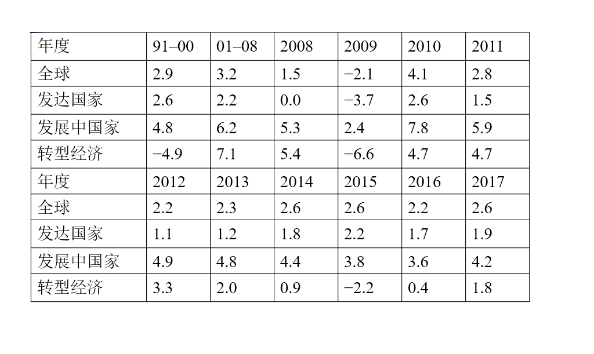

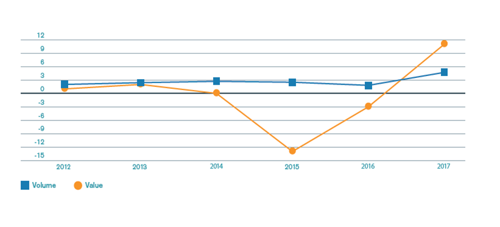

##### 国际贸易格局：

- 十大出口国：中国，美国，德国，日本，荷兰，韩国，香港，法国，意大利，英国
- 十大进口国：美国，中国，德国，日本，英国，法国，香港，荷兰，韩国，意大利

##### 例：花旗银行在中国

<u>**花旗银行**</u>：花旗银行前身是1812年6月16日成立的「纽约城市银行」（City Bank of New York），经过近两个世纪的发展、并购，已成为美国最大的银行，在全球近14个国家开展业务，设有4,600家分支机构，存款超过8360亿美元。

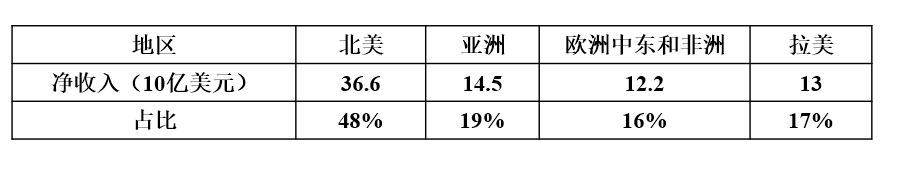

花旗银行是在中国开办业务的第一家美国银行。1902年5月15日，花旗银行的前身之一「国际银行公司」（International Banking Corporation）在上海开设分行，是花旗银行在亚洲的第一家机构。1995年，在离开45年后，花旗银行重新在中国大陆常规办理业务。到目前，分别在北京、上海、广州、深圳、天津、成都、杭州、大连、重庆、贵阳、南京、长沙和无锡拥有13家分行，47家零售银行网点。

<u>**花旗银行在中国的发展**</u>：

1. 02 年首家开设零售银行
2. 03 年上海浦发银行战略合作伙伴，首家面向中国客户开办外汇业务
3. 04 年首家发行联名双币种信用卡
4. 06 年首家开设私人银行办事处
5. 08 年人民币借记卡
6. 09 年「幸福时贷个人无担保贷款」登陆北京；手机提供掌上服务外资银行；推出私人服务，提供高净资产人群提供专属财务管理服务
7. 11 年实现银联卡受理，寻求在移动支付领域的合作

##### 例：他山之石：西式快餐的发展

特许经营、福特主义、家庭感、浪漫感、新鲜、快；食品原材料来自世界各地

生产过程以市场为导向，以分工和专业化为基础，以较低的产品价格作为竞争手段的刚性生产模式。（就像组装车间）

**<u>麦当劳的生产过程</u>**：

麦当劳的厨房很像一个组装「车间」，将原料如面包、牛肉饼、脱水新鲜洋葱（1/4盎司）、酸黄瓜片、芥茉酱、蕃茄酱等按流程操作，最后制成汉堡包：先取出面包——将面包的顶层和底层分别放在面包烤盘上。顶层的截面朝上，底层的截面朝下——放入专门的烤箱，烤制x秒——将面包顶层取出（此时，牛肉饼已在双面煎炉上烹制），送到调理台——用盛装芥茉酱的标准容器芥茉酱分配器在面包上打一枪，接着用蕃茄枪打一下，然后把脱水的 1/4盎司的新鲜洋葱放上，再放上两片酸黄瓜，再放上吉士片，然后将其送至煎区。这时，牛肉饼已烹制完成，将牛肉饼放上，再把面包的底层放上，接下来进行包装，最后放到中央输送槽中等待客人购买。

<u>**中式快餐的出路**</u>：

经营的连锁化与规模化、适度的工业化、产品的标准化与多样化兼顾、就餐环境的清洁卫生、膳食平衡、分餐制

##### 例：鼎泰丰

堪称餐饮界台湾之光的「鼎泰丰」，目前分别在台湾、日本、美国洛杉矶、西雅图、澳洲、大陆上海、北京、杭州、宁波、天津、青岛、新加坡、香港、印度尼西亚、马来西亚、韩国、及泰国等10个国家和地区，共拥有80余间店面，近年来不但将台湾美食带至全世界，更是获奖不断；除了台湾信义店荣获 THE MIELEGUIDE 2010/2011 亚洲最佳餐厅评鉴，香港鼎泰丰更是连续三度荣获米其林一星的殊荣。美国有线电视新闻网（CNN）旅游网站27日选出全球最佳的连锁企业，台湾的鼎泰丰名列第2(亚洲第一)，成为唯一登上前三甲的华资企业。排名第一位的就是从美国起源的7-Eleven（7-11）便利商店。

<u>**鼎泰丰的成功秘诀**</u>

- 一般的小吃店：门外经常大排长龙；价格不贵；装潢贫乏、座位狭窄；店内闹哄哄。
- 鼎泰丰：点菜上菜极有效率；服务礼貌周到；食物新鲜；店内干净卫生；作业流程IT化。

<u>**鼎泰丰的信息系统**</u>

1.  鼎泰丰自2000年推行作业信息化后，门外等候的顾客，不管是几十人或上百人，都能在半小时内消化。因此多数的顾客不会见到一片人海而打退堂鼓，愿意一等。而信息化也使得店内点菜、上菜、结帐的流动加快，顾客平均用餐时间只有四十分钟。这种高效只有顾客在柜台点取餐饮的的快餐店可相比拟，一般餐厅只要生意忙点，顾客进来三十分钟还没点好餐之例比比皆是。
2.  鼎泰丰信息化后的工作流程是：客人勾选菜单、服务员将其输入计算机，进入各分店服务器的数据中心、厨房分区,依此抓码与出菜，并加上打印出来的单据，再将出菜送到各桌顾客。
3.  而厨房分区所指的就是将厨房分成前厨一、前厨二、后厨一、后厨二，各自负责不同的食物。例如甜点区只处理甜品，也只从计算机叫出甜品的部分，同时打印出每份点心该送到那张桌子的纸条。使得厨房整体处理的速度大幅增快。
4.  鼎泰丰这套系统还有十几个特殊键，例如有客人点牛肉面不要葱、有观光客不敢吃鸡爪，甚至有些人吃炒饭不要放胡椒等等，每种情况都配有一个特殊编码，可以直接按键处理。既节省人力，也不易出错。

#### 生产全球一体化

1. 生产全球一体化的动机是降低成本并改善质量和功能，进而取得竞争优势
2. 生产全球一体化的受益者可以是大型的跨国集团，也可以是中小型企业
3. 生产全球一体哈的结果使产品成为世界产品

##### 跨国公司国际生产的决策过程

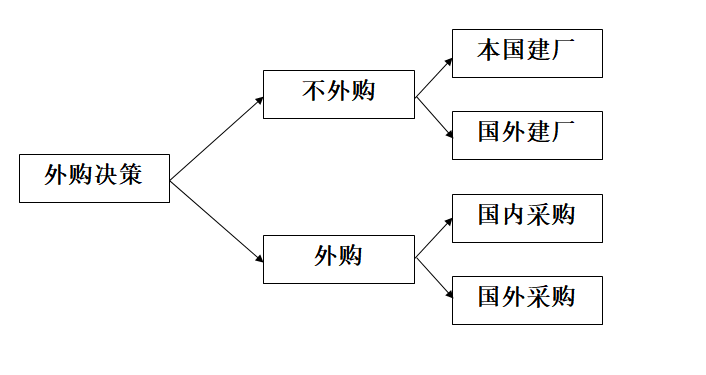

##### 例：苹果 iPhone 的生产

在竞争激烈和需求快速变化的市场，苹果公司较早放弃了传统上集设计、制造、营销于一体的经营方式，而是集中打造自己的专利、商标和版权，iPhone 的设计、制造、组装最大程度地采取生产分割和外购的方式进行。iPhone 由苹果公司拥有，并负责产品设计和营销。除软件和产品设计之外，iPhone 生产制造主要在美国之外进行。依靠海外采购，零部件在多个国家和地区生产，所有 iPhone 部件运输到富士康在深圳的工厂组装成最终产品，然后再出口到美国和其他国家，苹果公司有效地控制了产品成本。在 iPhone 供应链中，每个生产者购买上游原料或中间产品，经过加工提高附加值，经过加工的零部件销售后转化为下一生产阶段的成本。所有生产阶段的附加值加在一起等于该最终产品价格。

<u>**苹果：从 3G 到 iPhone X**</u>

一台 iPhone X 的组件成本约为 370 美元，其中 110 美元流入屏幕生产商韩国三星电子，44.45 美元归入存储芯片生产商日本东芝和韩国 SK 海力士。其他来自台湾、美国和欧洲的供应商也各自分羹，中国大陆实现的增值仅占成本的 3-6%。按 2017 年向美国市场供应 6100 万部计算， 为中美贸易逆差增加了 157 亿美元，约占总数的 4.4%。

<u>**富士康血汗工厂与社会倾销**</u>

- 美国公共国际广播电台王牌节目《美国生活》2012年1月6日播出了39分钟的揭露台资企业富士康 「血汗工厂」内幕的单元，包括荧屏清洁剂正己烷中毒工人因中毒手颤抖到无法握住杯子、年仅12岁的童工每天重复同样动作数千次以致关节变形童工关节变形、工厂有持枪保安全，宿舍不但拥挤如棺材，还遍布监视器等。但《美国生活》在当地时间3月16日声明宣布许多内容与事实不符，从而撤回该单元。
- 社会倾销原指利用犯人劳动或其他苦役劳动生产产品，从而能以极低的价格在国外销售。现在普遍是指一个高工资的工业化国家进口相对低廉的外国产品，而这些产品之所以廉价是因为出口国没有提供合理的工资、利益及对工人其他方面的保护。

**<u>世界第八大奇迹：富士康</u>**

- 2018 年 6 月 29 日，富士康在美工厂在威斯康辛州快乐山丘开工，特朗普出席典礼；
- 项目投资 100 亿美元，承诺创造 1.3 万个就业岗位；
- 美国较高的人力成本和技术工人的短缺，是富士康无法回避的风险；
- 威州和地方政府提供高达 30 亿美元的税收减免、约 7.64 亿美元的设厂公共开支补贴以及约 1 亿美元的相关基建设施兴建费用。

##### 全球经济一体化的推动者

1.  贸易和投资壁垒的降低
2.  技术不断发展
3.  国际投资和跨国公司的发展
4.  全球性机构的出现和区域经济一体化

##### 贸易和投资壁垒的降低

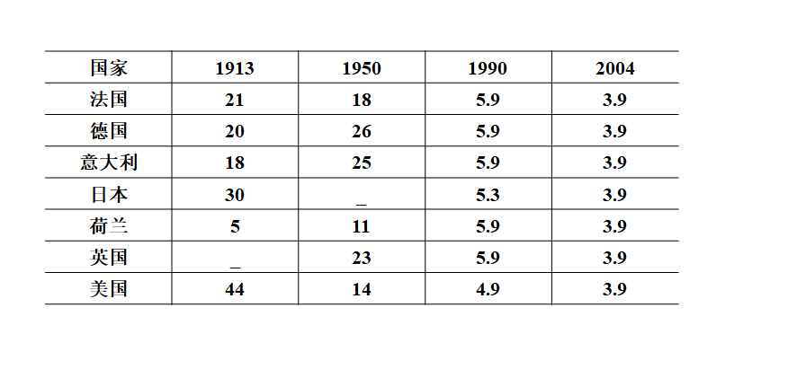

##### WTO 下关税的进一步变化

- 美国：美国政府指定的取消关税的方案。到 2010 年已没有超过 8％ 的关税；到 2015 年逐步取消所有关税；2010 年前废除以前低于 5％ 的税收；加快清除各行业如化学、造纸、木材、建材等的关税等。
- 美国加权平均关税水平一直维持在 2-3% 之间。
- 中国：2011年中国进口算数平均关税已降至 9.8%，加权平均关税 3% 左右
- 世界银行估计，2014 年加权平均关税 3.2%

#### 美国的关税结构

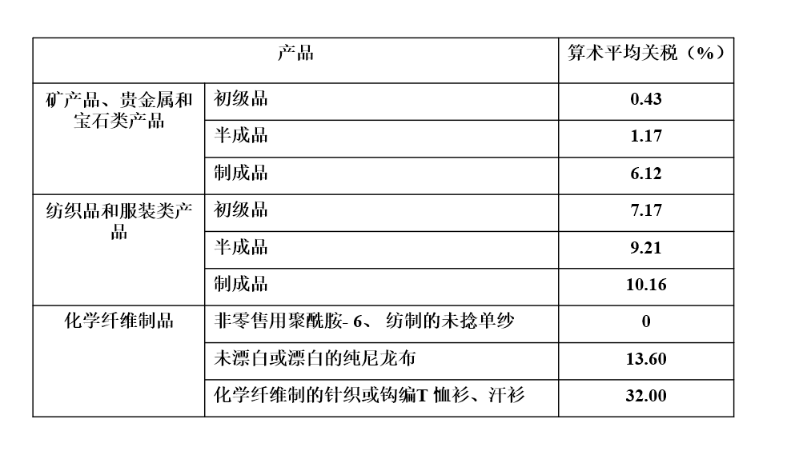

##### 技术不断发展

- 帆船 10 英里 / 小时
- 蒸汽机车 65 英里 / 小时
- 螺旋桨飞行器 300 - 400 英里 / 小时
- 喷气式货机 600 - 700 英里 / 小时

##### 集装箱船的变迁

1.  第一艘集装箱船是美国于 1957 年用一艘货船改装而成的。装卸效率比常规杂货船大 10 倍，停港时间大为缩短，减少了装卸中的货损。
2.  第一代集装箱船出现于 20 世纪 60 年代，横穿太平洋、大西洋的 17000 - 20000 总吨集装箱船可装载 700 - 1000TEU。
3.  第二代集装箱船出现于 20 世纪 70 年代，40000 - 50000 总吨集装箱船的集装箱装载数增加到1800 - 2000TEU，航速也由第一代的 23 节提高到 26 - 27 节。
4.  第三代集装箱船出现于 1973 年以后，航速降低至 20 - 22 节，船体尺寸增大提高了运输效率，装载数达到了 3000TEU。
5.  第四代集装箱船出现于 20 世纪 80 年代后期，集装箱装载总数增加到 4400 个。高强度钢使船舶重量减轻了 25%；大功率柴油机降低了燃料费，自动化程度的提高，减少了船员人数。
6.  第五代集装箱船可装载 4800TEU，这种集装箱船的船长 / 船宽比为 7 / 8，使船舶的复原力增大。
7.  第六代集装箱船标志是 1996 年春季竣工的 Rehina · Maersk 号集装箱船，最多可装载 8000TEU，随后10000 个集装箱的巨轮在欧洲问世，2014 年，我国的「中海环球」号能一次运送 19100 个 20 英尺标准集装箱，比普通的 1 万箱级别的集装箱船节省 1 / 5 的油耗。

#### 互联网的发展

2017 年，全球互联网用户同比增长 7%，低于 2016 年 12% 的水平。2018 年，全球互联网用户数量将达到 36 亿人，会超过全球总人口的 50%。

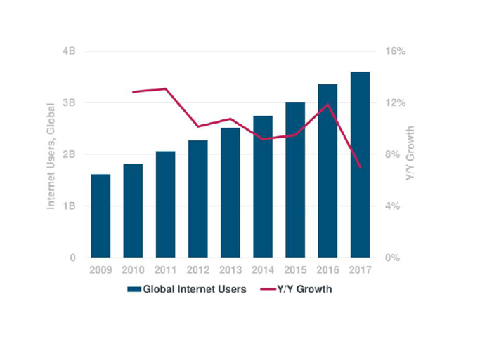

##### 互联网广告

左侧为用户在媒体上的适用时间占比和广告商营销费用占比，右侧为互联网广告费用的增长情况。

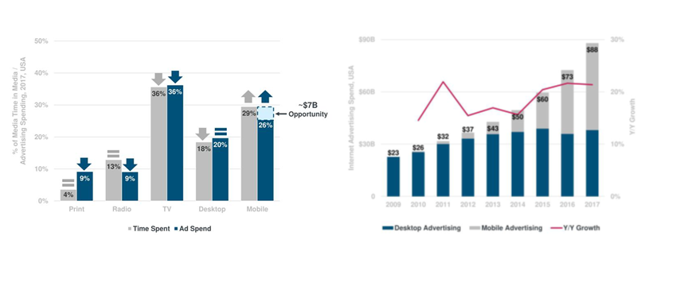

#### 国际投资和跨国公司的发展

- 更多的非美国公司开始直接投资，一方面可以寻求较低的劳动力成本，另一方面可以绕过贸易壁垒
- 国际直接投资的规模迅速膨胀且大起大落
- 发达国家仍然是直接投资的双重主角，但发展中国家发展迅速，美国在全部国际直接投资种的份额下降，日本、法国等其他发达国家的份额不断增加
- 跨国公司在直接投资中扮演重要角色且跨国并购成为重要方式
- 国际直接投资转向服务业和高新技术产业

##### 国际投资的发展

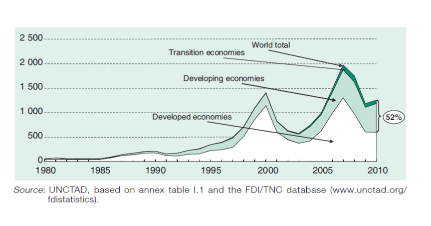

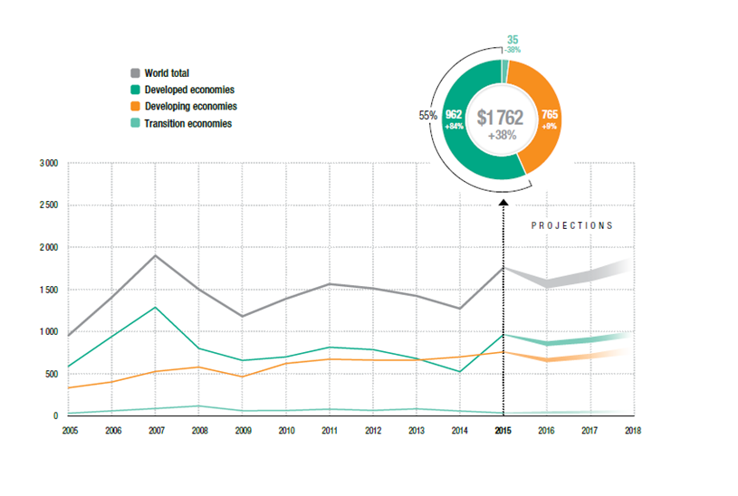

##### FID中的输出国和输入国

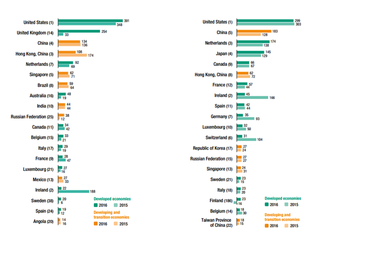

##### 跨国公司的发展变化

- 跨国公司的规模日益扩大
- 跨国公司中非美企业不断增长
- 跨国公司成为技术创新的主要来源
- 小型跨企业不断发展

##### 例：关于《财富》的排名

《财富》杂志正式发表全球最大企业的排名始于 1955 年，并随着时间的推移，对排名的方法、标准、数量和范围进行不断调整。1955 年，《财富》只列出美
国最大 500 家工业企业的排名。1956 年，《财富》开始发布美国 250 家最大服务业企业的排名，1983 年增加到服务业 500 家排名。1990 年，《财 富》将美国最大的 500 家工业企业与美国以外的最大 500 家企业合并，产生全球工业 500 强。1991 年，《财富》推出全球服务业 500 强。从 1995 年起评选包括服务业在内的每年世界 500 家最大企业，并在每年 8 月刊登上一年度的排名，排名主要依据营业收入额。

<u>**500强最新排名（百万美元）**</u>

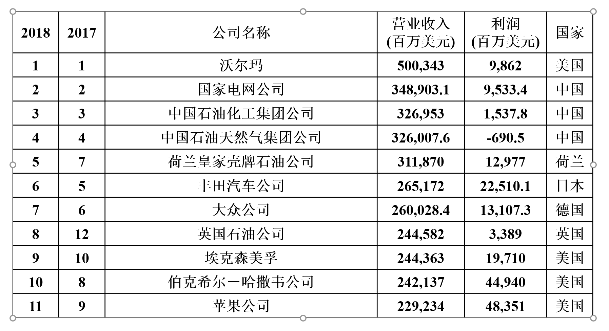

#### 全球性机构的出现和区域经济一体化

- 联合国及安理会 1945.10.24
- IMF和世界银行 1945.12.27 
- GATT和WTO 1945.4.21/1995.01.01

##### 例：关于世界贸易组织（WTO）

- 管理职能  世界贸易组织负责对各成员国的贸易政策和法规进行监督和管理，定期评审，以保证其合法性。 
- 组织职能  为实现各项协定和协议的既定目标，世界贸易组织有权组织实施其管辖的各项贸易协定和协议，并积极采取各种有效措施。 
- 协调职能  世界贸易组织协调其与国际货币基金组织和世界银行等国际组织和机构的关系，以保障全球经济决策的一致性和凝聚力。 
- 调节职能   当成员国之间发生争执和冲突时，世界贸易组织负责解决。 
- 提供职能   世界贸易组织为其成员国提供处理各项协定和协议有关事务的谈判场所，并向发展中国家提供必要的技术援助以帮助其发展。 

**<u>累计的有效特惠贸易协定数量（1950-2010）</u>**

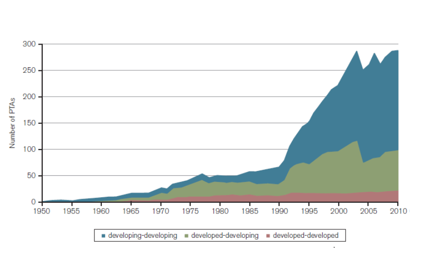

#### 反全球化

> 全球化有许多好处：人们可以享用许多来自世界各地的大量新型和比较便宜的商品和服务；能操纵经济信息、受过高度训练的工作人员可以得到与王公俸禄相比的薪水；特别是比较贫穷的国家的成百上千万工人有机会过上体面的生活。但是，所有这一切都带来高昂的代价，而其中大部分代价是由工业化国家——即所谓第一世界——的人民和社会付出的。
>
> 摘自《经济革命的痛苦代价——工业化国家面临的令人头痛的变化》 

##### 反全球化的主要观点

- 对就业与收入的影响
- 对劳工制度与环境的影响
- 对主权的影响

##### 特朗普

- 因为中国,我们失去了5万个制造业工作机会,甚至是700万个工作机会。
- 我们与中国的贸易是非常不平衡的,今年我们对中国的贸易赤字是5050亿美元。
- 我们的经济实力比他们强大,我们的商品来自中国。我们同中国有那么大的贸易量,在和中国做生意时,他们向我们征税。
- 要对来自中国的进口商品征收45%的税。
- 墨西哥就是新中国！

##### 美墨边境的「新长城」

- 美国总统特朗普 8 月 27 日在社交媒体上再次称墨西哥是世界上犯罪率最高的国家之一，并表示美墨间需要修建一堵「墙」，而墨西哥将通过偿付或其他方式支付修建费用。
- 墨西哥外交部 27 日发布公告，重申墨西哥不会支付美墨边境墙的修建费用。公告说，墨西哥「将不会在任何条件下、以任何形式支付美国在美境内建设两国边境墙或物理屏障的相关费用」，并指出这一决定「并非墨西哥的谈判策略，而是维护主权和国家尊严的原则之一」。

#### 经济全球化给中国带来的影响

##### 机遇

- 国际环境和世界经济发展趋势总体上有利于中国的和平发展；
- 世界经济增长方式和经济结构进入调整期为中国在全球经济分工中的新定位提供机会；
- 国际经济动能转换为中国抢占科技和产业竞争制高点提供新机遇；
- 中国具有有更广阔的舞台积极参与国际体系改革。

##### 挑战

- 金融危机直接影响到中国对外贸易的发展；
- 贸易保护主义抬头中国对外贸易环境不断恶化；
- 国际资本流动受到限制， 不利于中国继续扩大吸引外资；
- 发达国家特别是美国的货币政策和财政政策， 对中国经济造成诸多负面影响。

### 第二讲 国别差异

#### 经济制度差异

##### 三种经济制度

- 市场经济（Market Economy）下，一个国家所生产出来的商品和服务的数量是由供需关系所决定并通过价格体系给厂家发出信号来实现的。
- 指令性经济（Command Economy）下，一个国家所生产出来的商和服务的数量和售价是由政府计划并指令企业完成的。
- 混合经济（Mixed Economy）是介于市场经济和指令性经济之间的经济制度。

##### 三种经济制度的区别

- 市场经济下，生产是由供需关系所决定并通过价格体系来加以调整的，即通过市场实现资源的有效配置。在这种方式下，对供应一般不加限制，除非产生垄断。
- 指令性经济下，是通过政府计划的形式按社会利益实现资源配置的。这种计划的合理性在于可以消除由市场供需带来的价格波动以及由此产生的社会资源的浪费，但这一切又必须以计划的精确性为前提。

- 混合经济下，当政府认为某些部门的私有制不符合社会最大程度的利益时，就会进行干预，这样就会限制一些私人企业在该领域的发展。

##### 例：挪威：混合经济的代表

- 挪威经济一般被看作是混合经济 ： 资本主义市场经济加显著的国家干预成分。
- 挪威产业的大部分以私有财产和私营经济为主导。国家也拥有和管理着某些工业活动。使挪威形成了一个市场与计划混合的经济
- 国家通过税收、关税与补贴的方式施行管理。国家的干预还体现在发放许可证和管理劳动环境、财会程序、污染和产品等方面。在90年代，国家的产业所有权更加集中于纯粹的财政投资领域。
- 国家是一些最大的挪威公司，如国家石油公司和挪威海德鲁公司的最大股东
- 在银行业内，国家拥有最主要的产业银行、城市银行、地区发展银行、住房建设银行和教育银行
- 国家对挪威工业的介入正在日益减少。这与工业化世界普遍的经济自由化和私有化进程保持着一致

<u>**挪威得天独厚的资源优势**</u>

- 20 世纪 70 年代发现海洋石油以来，油气工业在挪威经济中占据主导地位。挪威油气资源总储量相当于 136 亿标准立方米油当量，其中已开发 60 亿，已探明 50 亿，还有约 26 亿未探明，世界排名第 18 位。 2012 年油气产业产值占挪威 GDP 的 23%、出口占挪威总出口的 52%、投资占总投资的 29%
- 在挪威国内，由于大量利用水力发电，可再生资源占能源总量的比重很大，水力发电排全球第六位。
- 挪威的海岸线曲线长达 21000 公里。沿海岛屿 15 万个，其水产捕捞和养殖区域为挪威大陆面积的 6 倍。水产品总产量世界排名第14位，95%出口，是世界第二大水产品出口国。

#### 政府对经济的干预

- 规则型模式
- 强干预模式

##### 规则型模式：美国政府对经济的干预

- 以市场机制为主，以政府干预为辅
- 主要用财政和货币政策来调控市场
- 完备的法律体系是实现政府经济职能的保障
- 在教育投入、基础设施、社会保障、政府消费、农业等方面有影响力的政府经济行为

<u>**美国规范经济行为的法律体系**</u>

- 调节国家基本经济关系
- 调整市场结构和促进企业之间公平竞争
- 维护消费者权益和保障健康安全
- 保护自然环境和资源

<u>**美国的反托拉斯法（Antitrust Law）**</u>

- 1890 年生效的《谢尔曼法》(Sherman Act) 
- 1914 年生效的《克莱顿法》(Clayton Act) 
- 1914 年生效的《联邦贸易委员会法》(Federal Trade Commission　Act) 
- 1976 年生效的《哈特—斯科特—罗迪诺反托 拉斯改进法》(Hart-Scott-Rodino Antitrust Improvement Act) 
- 1982 年生效的《对外贸易反托拉斯改进法》(Foreign Trad e Antitrust Improvement Act) 
- 1993 年发布的《全国合作研究和合作生产法》(National Cooperative Research and Production Act) 
- 1994 年发布的《国际反托拉斯执行援助法》(Internationa l Antitrust Enforcement Assistance Act)

##### 谢尔曼法的由来

> 如果我们不能忍受作为政治权力的皇帝，我们也不能忍受统治 我们各种生活必需品的生产、运输和销售的皇帝。我们不能屈服于一个皇帝，我们也不 能屈服于以势力阻碍竞争和固定各种商品价格的贸易大亨。
>
>  
>
> ——John sherman  美国参议员，谢尔曼法的提出者

**<u>谢尔曼法的主要内容</u>**

谢尔曼法第 1 条规定，任何妨碍州际或者对外贸易的商业合同、托拉斯或者其他任何形式的联合或 者共谋，都得被视为违法。第 2 条规定，任何人若从事垄断或者企图垄断，或者与他人 联合或者合谋以实现对州际或对外贸易或商业的任何部分的垄断，都得被视为违法。根 据上述条款，谢尔曼法主要反对以下三种有碍于州际或者对外贸易的行为：

(1)以合同 或者企业联合的方式组建托拉斯或者类似的垄断组织；
(2)订立限制竞争的协议；
(3)垄 断行为和谋求垄断的行为。

##### 例：微软垄断案

微软公司的产品 windows 操作系统在同类的操作系统市场上占有高达 90% 的市场份额，而且这种市场份额受到极高的进入壁垒的保护，在操作系统软件这一「相关市场」上，微软具有垄断力。

当 1995 年微软发现网景公司的 Navigator 网络浏览器在未来有可能发展成操作平台从而威胁其对操作系统市场的垄断时，微软开始采用反竞争的手段遏制 Navigator 的发展。

由于微软公司推出的 IE 浏览器功能上与 Navigator 相差无几，微软为了迅速打败对手，利用自己在操作系统市场上的垄断地位，将 IE 与 windows 捆绑销售。该行为导致网景公司的 Navigator 在浏览器市场上的份额急剧下降，最终在 1998 年被美国在线收购。

微软公司的一箭双雕，既消除了对其在操作系统市场上垄断地位的潜在威胁，又抢占浏览器市场，达到进军互联网的目的

<u>**微软垄断案一审结果**</u>

- 「维持垄断罪」，即以反竞争的手段维持其在操作系统软件市场上业已存在的垄断地位
- 「企图垄断罪」，即微软企图通过捆绑，使自己的 IE 浏览器在浏览器市场上占有垄断地位
- 微软的捆绑行为本身构成「搭售」，违反了谢尔曼法第 1 条的规定，应适用「本身违法原则」处理；
- 微软与制造商之间签订的排他性协议构成纵向限制，违反谢尔曼法第 1 条禁止合谋限制商业贸易行为的规定；
- 微软的反竞争行为同样违反了原告各州的反垄断法。

<u>**微软垄断案二审结果**</u>

- 同意地区法院对微软在操作系统市场上「维持垄断罪」的认定
- 撤销对微软「企图垄断浏览器市场」的裁决
- 关于「捆绑」本身违法的判决无效 

##### 日本的政府干预

- 用经济秩序法、经济组织法和经济活动法等法律约束企业行为
- 通过经济预测与经济运营的基本态度、经济自立五年计划、产业结构长期展望、全国综合开发计划等经济计划指导和引导
- 利用产业政策指导企业发展
- 利用利益机制诱导企业行为
- 通过劝说与交涉、信息交流和宣传教育等行政指导说服企业服从政府意图

<u>**安倍经济学**</u>

- 扩大公共支出
- 实行宽松的货币政策，扩大货币发行量，将短期通胀目标由 1% 提高到 2% 
- 日元贬值
- 实行「日本再兴战略」 振兴产业，刺激投资，激发民间活力。

<u>**安倍经济学下的经济增长**</u>

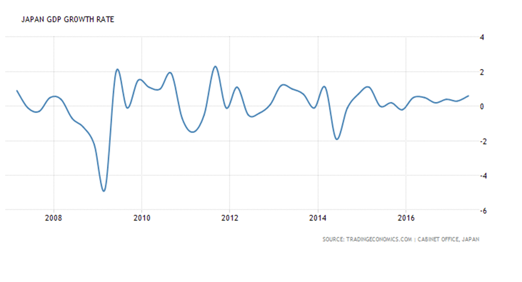

##### 中国式的政府与供给侧改革

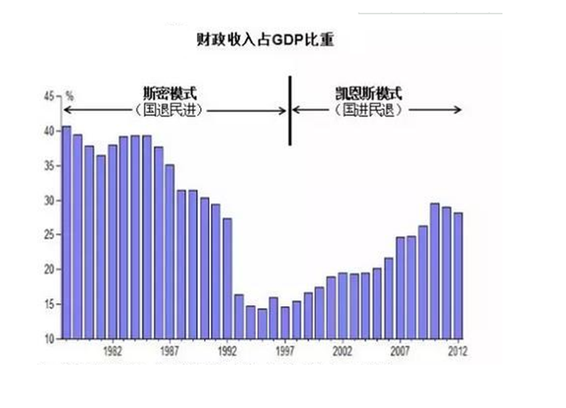

<u>**新常态**</u>

2014年11月9日，习近平在亚太经合组织工商领导人峰会开幕式上的演讲中进一步对「新常态」做了全面阐释：中国经济呈现出新常态，有几个主要特点。

- 一是从高速增长转为中高速增长。
- 二是经济结构不断优化升级，第三产业、消费需求逐步成为主体，城乡区域差距逐步缩小，居民收入占比上升，发展成果惠及更广大民众。
- 三是从要素驱动、投资驱动转向创新驱动。

**<u>供给侧改革</u>**

- 可以用「供给侧 + 结构性 + 改革」这样一个公式来理解，即从提高供给质量出发，用改革的办法推进结构调整，矫正要素配置扭曲，扩大有效供给，提高供给结构对需求变化的适应性和灵活性，提高全要素生产率，更好满足广大人民群众的需要，促进经济社会持续健康发展。
- 供给侧改革既不是需求紧缩，也不是计划经济

**<u>供给侧与需求侧</u>**

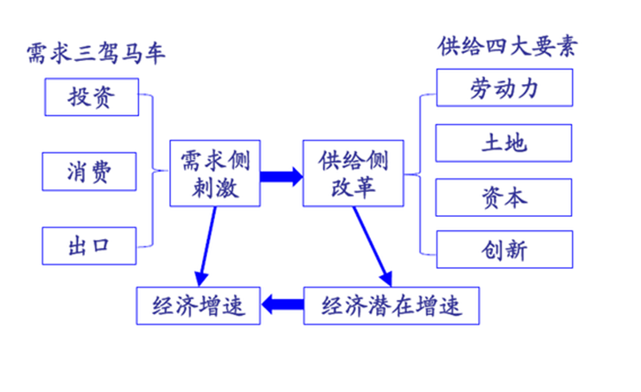

#### 产权制度：灯塔经济学

##### 英国的灯塔制度

英国建造和维修灯塔的机构是领港公会（在英格兰和威尔士）、北方灯塔委员会（在苏格兰）和爱尔兰灯塔委员会（在爱尔兰）。这些机构的开支由通用灯塔基金拨出。这项基金的收入来源是由船主缴纳的灯塔税。灯塔税的缴纳和报表管理由领港公会负责，而具体的征税由港口的税务局完成。从灯塔税得来的钱属于通用灯塔基金，由商业部控制。灯塔机构向通用灯塔基金领取它们的开支。

##### 灯塔与公有产权

二十世纪英国剑桥学派最后一名代表人物庇古（ Arthur Cecil Pigou ）以灯塔为例说明了市场的失灵，以及政府干预的必要性。无论庇古本人的原意是什么，从庇古的灯塔中得出的推论就是：公有产权是必要的。

**<u>庇古的灯塔：公有产权的必要性</u>** 

- 灯塔难以获得收益
- 避免搭便车
- 政府强行收费
- 公有产权一般都采用了国家所有的形式 

##### 灯塔与私有产权

科思的产权理论以交易费用理论为基础证明了私有产权的必然性与合理性，被认为是战后微观经济学的重大突破之一。针对灯塔这种公共物品收费的困难，科思在 1974 年发表了《经济学上的灯塔》一文，根据对英国早期灯塔制度的研究反驳了一般经济学家关于私营灯塔无法收费或无利可图的观点，证明即使是灯塔这样的公共物品，私有化也是可能的。

<u>**科思的灯塔：公有产权私有化**</u>

- 通过专卖权避免搭便车
- 私有产权有更高的效率
- 避免经营管理不善

##### 灯塔与俱乐部产权

美国经济学家詹姆斯 · 布坎南曾提出了著名的「公共选择理论」，并为此而获得了1986年诺贝尔经济学奖。布坎南并没有就灯塔问题提出什么理论，但他的俱乐部理论与解决灯塔问题的产权理论相关。因此把俱乐部理论作为灯塔经济学的一个部分，并冠之以「布坎南的灯塔」。

**<u>布坎南的灯塔：俱乐部产权</u>**

- 俱乐部产权介于公有产权和私有产权之间
- 俱乐部产权具有排他性
- 俱乐部产权具有比公有产权更高的效率
- 可以用脚投票

##### 国有化与私有化

自然垄断是市场失灵的一个重要原因，自然垄断的存在导致市场配置资源的低效率。为了增进资源配置效率，政府可以考虑将自然垄断行业实行国有化。

斯蒂格利茨说：「面对市场失灵，政府可以干脆由自己负起责任来。例如，如果政府认为，在提供医疗保健方面存在市场失灵，它可以对医疗部门实行国有化，就像第二次世界大战以后英国所做的那样。如果政府认为，在空运和铁路行业中存在市场失灵，它可以对这些行业实行国有化，或者，对这些行业中令人不满的部分实行国有化，由政府来经营。」

**<u>英国的国有化</u>**

在 1945 年的大选中，保守党大败于工党。1945～1951 年艾德礼工党政府执政期间，英国掀起了第一次国有化高潮。艾德礼政府对英国大工业，包括钢铁、煤炭、铁路、航空、电信和英格兰银行，实行国有化。1974～76 年威尔逊工党政府执政期间，英国又掀起了第二次国有化高潮。两次国有化高潮使国有工业在英国重要工业部门中的比重占据相当重要的地位。据英国《经济学家》1978 年 12 月的统计数字，国有经济在英国重要工业和交通部门中的比重是：石油 25%，汽车 50%，钢铁 75%，航空 75%，煤炭 100%，电力 100%，天然气 100%，造船 100%，铁路 100%，邮政 100%，电信 100%。

**<u>英国的私有化</u>**

1979 年 5 月，保守党在大选中获胜，撒切尔出任首相。撒切尔政府从 70 年代末 80 年代初开始大规模推行私有化。首先选择英国石油公司作为私有化的对象，这是英国大规模私有化开始的标志。后来，该公司股权出售给私人的比例逐步增大，英国政府和英格兰银行持股比例下降到51%。

继英国石油公司之后，1984 年秋，英国电信公司 50.2% 的股权被卖给私人。从 1979 年到 1988 年，英国国有经济已有 40% 实行了私有化，国有经济在GNP中的比重从 11.1% 下降到 6.5%。

到 1997 年保守党政府任期结束之际，英国私有化政策进入尾声，几乎所有国有事业单位都已经私有化，且国有企业的 GDP 贡献值也从最初的 10％ 以上降到 2％ 以下。

**<u>私有化与价格——水贫户与燃料贫户</u>**

- 英国自来水公司自 1997 年私有化后，经营成本变动其实不大，但价格却在私有化后的 17 年间上涨了245％。公司透过作帐来扩大账面支出金额，成功得到政府许可逐年调涨水价。在消费者负担飙涨两倍之多的水价的同时，公司的边际利润增加了六倍，负担不起高涨的水费而被断水的居民人数在 1991 年私有化后的一年内增加了三倍。
- 英国电力公司私有化后电力价格因燃料价格下滑而调降，但实际上，原料成本下滑所带来的经营利润，在私人公司以合并策略巧妙制造出私人寡占市场的情况下，全进了少数公司口袋。2008 年英国电价更高出法国与德国三成之多，而英国电力生产供应的成长率却在私有化后逐步下滑，远落后美国与法国将近 20％。在英国 2002 采用电费预付的购买规则下，2007 年有一成三英国家庭约 280 万人成为燃料贫户。

**<u>私有化与就业</u>**

- 自 1980 年代私有化政策开始推动到 1997 年为止，公部门受雇者锐减超过 150 万。
- 最惊人的缩编发生在英国钢铁公司（British Steel），私有化前的雇员 19 万，私有化准备阶段即阶段性缩编，受雇者人数从 1979 年的19万多降至 1988 年的 5 万多，1989 年正式私有化后，受雇人数持续下滑至 4 万人不到，缩编幅度非常惊人的趋近8成。
- 英国石油公司（Britoil）受雇人数于私有化后的 1982 - 1987 年 5 年内从 2,534 人缩减至 1,689 人。
- 英国瓦斯（British Gas）的雇用规模在私有化后从 8.8 万多缩减至近7万。
- 英国联合港埠公司（Associated BritishPorts）1981 年私有化后受雇者人数也从 1 万人以上下滑至 1994 年的2000 多人。
- 英国电信公司（British Telecom），1985 年被私有化后，2 万多名员工于 10 年间被裁的剩不到 15000 名。

<u>**英国铁路的私有化**</u>

- 到 1993 年，铁路运输业在客货运输量总量仅占 10% 左右。国家铁路重外部效益，轻内部管理，特别是英国工会力量很强，工资缺乏弹性，成本居高不下，亏损增加，铁路成为财政的沉重包袱。
- 1993 年 11 月，在保守党政府的推动下，英国议会通过铁路改革法案，1994 年实施，1997 年完成。改革的主要内容是网运分离和企业私有化，将铁路分拆为 1 个全国性路轨公司 (railtrack)、25 个客运公司、6 个货运公司、3 个机车车辆租赁公司以及多家设备改造、维修服务公司，原来的国铁公司被 120 多家私营企业取代。

##### 私有化的困惑：要安全还是要准点

-   私有化后，1997-2002 短短 5 年中，接连发生 13 起严重事故，其中造成重大伤亡的事故有 7 起，共导致 59 人死亡，数百人受伤。
-   1997 年 9 月 19 日，在伦敦西部，一列客车与一列货车相撞，造成 7 人死亡，39 人受伤
-   1999 年 10 月 5 日，一列特快列车与一列市郊往返列车在伦敦相撞，造成 31 人死亡，150 人受伤
-   2000 年 10 月 17 日，从伦敦开出的一列火车在哈特菲尔德出轨，造成 4 人死亡，35 人受伤
-   2001 年 2 月 28 日，英格兰塞尔比发生一起严重的火车相撞事故，至少 13 人死亡，75 人受伤。
-   2002 年 5月 10 日，一辆从伦敦出发的客车在伦敦北部巴特斯巴车站突然脱轨，一节车厢冲上站台，共造成 7 人死亡，20 多人受伤

<u>**私有化是罪魁祸首**</u>

英国《观察家报》2001 年 2 月 4 日发表署名文章，把欧洲的国有铁路与英国私有化后的铁路作了比较，认为「欧洲的铁路服务令英国相形见绌」。文章说：「欢迎体验欧洲的国有铁路服务。在这里，舒适、便宜、准时与安全是服务的四大宗旨。对于习惯了铁路部门平稳运行的乘客，误点是根本无法容忍的（每年英国铁路运送的 10 亿乘客大部分是乘火车上班的——引者）。私有化毫无意义，安全才是第一位的。」英国国有铁路实行私有化时，「铁路乘客曾经以为，铁路私有化可以带给他们新型的快速列车，以及准时、安全、便宜的旅行，实际上，他们不得不忍受陈旧、肮脏、拥挤不堪的车厢，加上全欧洲最昂贵的票价。」

<u>**私有化带来的安全隐患**</u>

私人企业重短期利益，忽视对基础设施的长期投资。英国铁路设施年代久远，急需更新。但路轨公司私有化后，优先照顾股东权益，过分注重眼前赢利。不断加大运量，但却没有安装欧洲各国早已普遍采用的新型路轨和列车安全控制系统。

铁路管理不善，安全漏洞多。路轨公司为节省成本，将一些路段的检修任务外包，因为「有 3000 多家代理处和 8 家铁路基建公司从事与铁路网有关的工作」，他们竞相杀价，且雇佣了不少缺乏经验和责任感的短期工，对安全构成极大威胁。

私营公司陷入财务危机，依靠政府补贴。私有化初期，路轨公司经营状况尚好，政府补贴减少到改革前的一半。但 1999 年后，经营每况愈下，最后资不抵债，靠政府补贴度日，负债总额高达 33 亿英镑。2001 年 4 月，政府向路轨公司拨付 15 亿英镑，后追加 5 亿英镑。而该公司要求政府继续追加 7 亿英镑，并要求继续保持私人控股、由政府资助。导致危机并造成股价暴跌。

#### 保护知识产权的法律制度

##### 国内法

包括纯粹在国内实施的知识产权法律，如 「专利法」「商标法」「著作权法」「计算机软件保护条例」等

有的国家例如美国还包括可以用来说服其他国家主要是发展中国家答应美国要求的对抗性或互惠性法律，如「1984 年贸易和关税法」和「1988 年综合贸易与竞争法」中的大量与知识产权有关的条款，最重要的是「特殊 301 条款」。

<u>**「特殊 301 条款」 —— 关于重点国家的标准**</u>

1.  采取最繁琐复杂、最恶劣的法律、政策与做法，拒绝对美国的知识产权给与充分、有效的保护，拒绝对受知识产权保护的美国企业或个人给与“公平与平衡的市场准入”
2.  该国上述法律、政策与做法对美国的有关产品造成了最不利的现实或潜在的影响
3.  该国尚未就上述问题与美国进行成新的谈判，或者在双边、多边谈判中未取得重大进展
4.  

<u>**「301条款」规定的报复措施**</u>

1.  终止、撤回或阻止适用于有关国家订立的贸易协定
2.  对来自有关国家的进口货物提高关税或采取其他进口限制
3.  对有关国家的服务征税或进行限制
4.  与被备报复国家签订协议以迫使其取消有关的法律或向美国提供补偿性的贸易利益

##### 国际公约

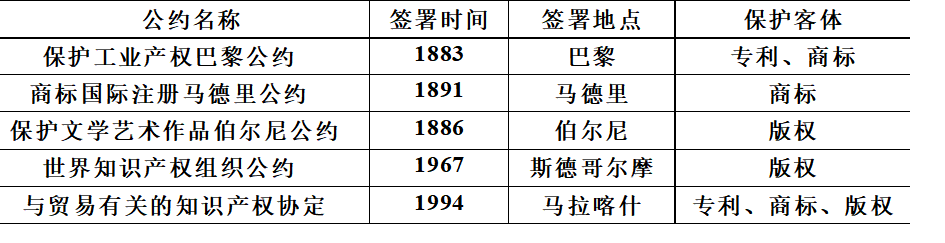

<u>**WTO 的 TRIPS**</u>

TRIPS 包括 7 个部分，共 73 条

1.  一般规定和基本原则
2.  知识产权效力、范围和使用的标准
3.  知识产权的执法
4.  知识产权的取得，维持和相关程序
5.  争端的防止和解决
6.  过渡安排
7.  机构安排和最后条款

<u>**WTO 的 TRIPS 与我国知识产权立法**</u>

以商标法为例，2001 年 10 月 27 日修改，从而保证与 WTO 的 TRIPS 的规定一致。主要的修改包括：

1.  放开权利主体 
2.  扩大保护客体 
3.  完善注册程序 
4.  加强司法监督 
5.  强化保护力度 
6.  完善司法程序 

<u>**艹，太多了。停更。**</u>

