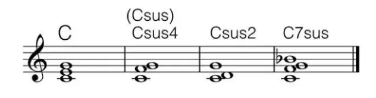

Guitar 和弦
音乐 | 吉他 | 和弦
在音乐中，吉他和弦是吉他上演奏的一组音符。和弦的音符通常同时播放，但它们可以在琶音中顺序播放。 吉他和弦的实现取决于吉他调音。流行音乐中使用的大多数吉他都有六首琴弦，配有西班牙古典吉他的“标准”调音，即E-A-D-G-B-E';在标准调音中，相邻弦之间的间隔是完美的四分之一，除了主要的三分之一。
2018-10-26

## 前言

阅读此篇文章，默认你拥有一些基本乐理的知识（`音律，音程，和弦`）和吉他（弦，品等）的基本知识，若未掌握可查看之前的文章的音律，音程，和弦的内容：[音乐理论基础](blog.php?id=16)

学习音乐理论基础。

## 吉他和弦的构成

从音乐理论基础中可以了解到，和弦是由三个及三个以上的音叠加而形成的。最低的音我们称为根音。

现在令根音为：C，构造一个`大三和弦`，为：C，E，G。

第六根弦不弹，从第五到第四个根线，分别为 C E G C E，都是此大三和弦的音。

所以，吉他和弦就是用按品的方式把和弦表现出来。

此和弦的`根音是 C`，又是个`大三和弦`，我们就称其为 C 和弦。

类似的，我们可以定义其他常用的吉他和弦的名字。

### 吉他和弦最常用三大类

`注意`：当和弦是三和弦，`不写出冠音 5`。

#### 属和弦

构成方式：`根音 + 冠音`：

-   三和弦没有属和弦。
-   C7：七和弦（大小七和弦）：C E G $\flat$B
-   C9：九和弦：C E G $\flat$B D

#### 小和弦 Min

构成方式：`根音 + m + 冠音`：

-   Cm：小三和弦：C $\flat$E G
-   Cm7：小七和弦（小小七和弦）C $\flat$E G $\flat$B
-   Cm9：小九和弦：C $\flat$E G $\flat$B D

#### 大和弦 Major

构成方式：`根音 + maj + 冠音`：

-   C：大三和弦：C E G
-   Cmaj7：大七和弦（大大七和弦）：C E G B
-   Cmaj9：大九和弦：C E G B D（常常只弹 C E B D）

吉他中最常用的和弦就属`大三、小三、属七、大七、属九`和弦了。

还有减三和弦 Cdim（Diminished），增三和弦 Caug（Augmented）。

### 其他和弦

#### 增加音 Add

在制定位置增加一个音。

构成方式：`根音 + 冠音 + add + 增加音数字名`：

-   Cadd2（常写作 C2）：C D E G
-   Cadd6（常写作 C6）：C D E G A
-   Cadd4：C E F G

#### 挂留音 Suspended

不要三音，换成四度或者二度音，

构成方式：`根音 + 冠音 +  sus + 挂留音数字名`：

-   Csus4（常写作 Csus）：C F G
-   Csus2：C D G
-   C7sus4（常写作 C7sus）：C F G $\flat$B

#### 省略音 Omit

不要那个音。

构成方式：`和弦名称 + （omit + 省略音）`：

-   Cmaj9（omit3）：C大九和弦省略三音

#### 转位 /

即转位和弦

构成方法：`根音 + / + 作为低音的音`：

-   C/E：三和弦的第一转位：E G C
-   C/G：三和弦的第二转位：G C E
-   C/F：低音在和弦中未出现时，在最下面加此音

####  括号 ( )

其他操作全写括号里面，想干嘛干嘛。

-   Cmaj9(#5)：降五音升高半音
-   C7(b9)：增加一个小九度

## 色彩

除了在构造上的不同，和弦很大的不同在于和弦的色彩上。

1.  大三和弦是 C E G，C 与 G 是完全协和音程，C 与 E 是不完全协和音程，没有不协和音程的存在，让大三和弦显得非常丰满，稳定，明亮。
2.  小三和弦中有一个 $\flat$E，虽然也是协调的，这会让这个和弦听起来不是那么的稳定，不明朗，很悲伤。
3.  七和弦中有不协和的七度音程，会使这个和弦听起来非常不稳定，有一种还没有把话说完，急于进入稳定和弦的状态。

所以大部分的歌一般会以稳定和弦开头，并以稳定的和弦结尾。根据歌曲的情感，在作品中加入不同色彩的和弦。

## 级数

在 C 调中，以 C D E F G A B 分别为根音构成的和弦就位 1 2 3 4 5 6 7 级和弦。

通常用罗马数字 Ⅰ Ⅱ Ⅲ Ⅳ Ⅴ Ⅵ Ⅶ 来表。

这七个和弦分别是：C, Dm, Em, F, G, Am, Bdim（最后一个减三和弦不常用）

而在 D 调中，这七个和弦分别是：D, Em, #Fm, G, A, Bm, #C，也就是把每个音升高两个半音再构成新的大三和弦。

余此类推。

## 简单的和弦编配

此节来自：[用心感受，和弦也有它们各自的色彩！](https://www.jianshu.com/p/7952aee61ae2)

这里介绍一下简单的编配规律：

1.  (1，3，5)：大调主和弦，常用在开头结尾，色彩明朗。
2.  (2，4，6)：常用在 9 和弦之前，色彩柔和。
3.  (3，5，7)：常用在 9 和弦之前，5 和弦之后，色彩暗淡。
4.  (4，6，1)：常用在 1 和弦与 5 和弦之间，影响坚挺，趋向不稳定，多用在乐曲高潮部分。
5.  (5，7，2)：常用在 9 和弦之前或 1 和弦之前，色彩热烈，烘托高潮。
6.  (6，1，3)：小调主和弦，用在开头和结尾，色彩暗淡，抑郁（但在巴洛克时期，有时小调式乐曲也用大三和弦结束，以求得更大程度的稳定感）。
7.  (1，3，5，$\flat$7)：常用在 1 和弦和 4 和弦之间，有倾向于 4 和弦的特点，功能近似于 1 和弦。
8.  (2，4，6，1)：常用在 1 和弦与 11 和弦之后，趋向不稳定功能近似于 2 和弦和弦
9.  (3，$\sharp$5，7，2)：常用在 1 和弦或 6 和弦之前，极不稳定，有趋向稳定的强烈要求，功能近似于 3 和弦。
10.  (5，7，2，4)：常用在曲调即将结束处，色彩最暗，最不稳定。
11.  (6，$\sharp$1，3，5)：常用在 2 和弦与 8 和弦之前，有倾向 2 和弦与 8 和弦的特点，功能近似于 6 和弦。
12.  (2，$\sharp$4，6，1)：常用在 5 和弦与 10 和弦之前，有倾向 5 和弦与 10 和弦的特点，功能近似于 2 和弦。

