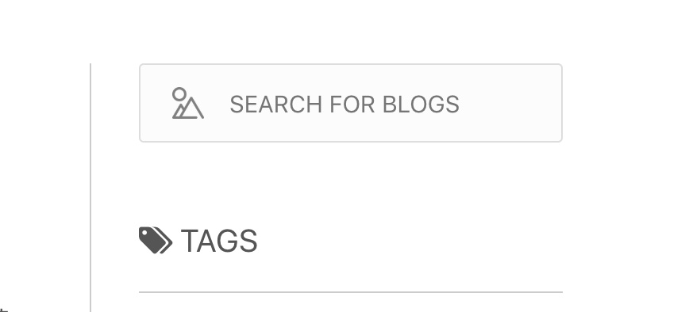

博客的重新设计
网页 | GitHub | 设计
重新设计一下网页的样式，从网上找到了一些好看的网站的素材。需要的部分有网页最上部分的幻灯片部分，没找到的称心的，就先随便做一个。文章的展示样式，考虑一下需不需要对文章进行分类展示。网页的页脚；主页面的导航栏，导航栏上的按钮，样式，是否固定在最上端，滚动页面是否发生改变，都需要重新设计。还有一些小功能键（比如移动到网页最上端等等）看看是否需要。
2018-11-16

上一版本本的博客样式在 GitHub Page 中还能看到。

[Mitsuyama GiHub Page](https://mittsuyama.github.io/)

舍弃的原因，一是因为是静态网站，不好做更多的功能；二是图片内容有点多，又是 GitHub Page，加载起来比较慢。

## 功能实现

点击图片在新窗口打开

```html

```

自定义字体 *font-family*：

```css
@font-face {
    font-family: font-name;
    src: url("../font/font-name.ttf") format("truetype");
}
```

## 样式设计

### 部件样式


上图的导航栏样式不错，再模仿一下图标 + 名称来做一个 logo。


搜索框也可以，小圆角矩形，浅色背景，左侧的 logo。



### 主页样式


主要模仿 [屠夫 9441 的博客](https://www.haomwei.com/) 来设计。

顶部为非固定的导航栏（会被卷入）。

接下来分成左右两个部分：左侧为博客简介，右侧为标签、推荐博客等栏。

左侧博客一页四个，底部用 *PHP* 实现分页功能，并加上按钮。

右侧实现标签（点击能使左边只显示包含此标签的博客），推荐博客（需要能链接）等。


左侧的博客简介，主体用黑白灰，从上大小为：标题、时间、标签、简介、READ MORE 按钮。


底部用分割线实现页脚，包含 Copyright，备案信息，邮箱。

### 博客页面样式

与主页样式相同，右侧标签栏换成目录（点击能跳转到标题）。

底部增加上一篇、下一篇博客，以及打赏作者按钮。

