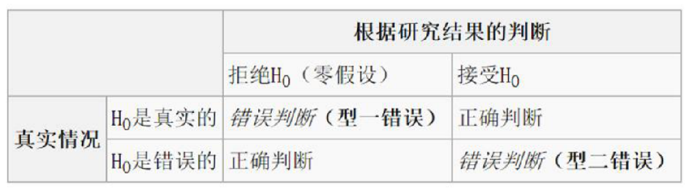

应用统计学 2
数学 | 笔记 | 经济学 | 统计学
应用统计学专业主要包括一般统计和经济统计两类专业方向，培养具有良好的数学或数学与经济学素养，掌握统计学的基本理论和方法，能熟练地运用计算机分析数据，能在企业、事业单位和经济、管理部门从事统计调查、统计信息管理、数量分析等开发、应用和管理工作，或在科研、教育部门从事研究和教学工作的高级专门化应用型人才。
2019-3-11

[应用统计学 1](blog.php?id=29)

## 第六章 参数估计

### 点估计

- 矩估计法（moment method）
- 最大似然估计法（maximum likelihood method）

评判估计量好坏的标准：

- 无偏性（unbiased），有效性（minimum variance），一致性（uniform）
- 综上：一致最小方差无偏估计

**优点**：简单直接

**缺点**：无法评估潜在的风险

### 区间估计

#### 区间估计原理

假定 $\theta$ 是待估计的参数，$\alpha$ 是 $0$ 到 $1$ 之间的数值，如果`由样本确定的两个统计量` $\theta_L$ 和 $\theta_U$ 满足：

$$
P(\theta_L < \theta < \theta_U) = 1 - \alpha
$$
就称随机区间 $(\theta_L, \theta_U)$ 是参数 $\theta$ 的置信度为 $1 - \alpha$ 的置信区间。

**定义**：置信上限，置信下限，置信度，置信区间，单侧置信区间

#### 区间估计

简单随机抽样，样本来自正态分布（或非正态分布）总体。

根据中心极限定理，$\bar{X}$ 服从正态分布，即 $\bar{X} \sim N(\mu, \sigma^2 / n)$
$$
z = \frac{\bar{X} - \mu}{\sigma / \sqrt{n}} \sim N(0, 1)
$$

$$
P(-1.96 \le z \le 1.96) = 0.95\\
P(\bar{X} - 1.96\frac{\sigma}{\sqrt{n}} \le \mu \le \bar{X} + 1.96\frac{\sigma}{\sqrt{n}}) = 0.95
$$

$(\bar{X} - 1.96\frac{\sigma}{\sqrt{n}} \le \mu \le \bar{X} + 1.96\frac{\sigma}{\sqrt{n}})$ 就构成了一个关于总体均值 $\mu$ 的置信度位 $95%$ 的`置信区间`

$\sigma / \sqrt{n}$ 称为`样本均值的标准误`。

##### 特点

1. 在样本容量一定的情况下：置信度越高，置信区间越宽，估计的精度也越低
2. 在置信度一定的情况下：增加样本容量可以使置信区间变窄，估计的精度变高

##### 如何估计

$\sigma$ **已知**：

$\mu$ 的置信度为 $1 - \alpha$ 的置信区间为
$$
n / N < 0.05, \quad \bar{x} \pm z_{\alpha / 2}\frac{\sigma}{\sqrt{n}} \\
n / N > 0.05, \quad \bar{x} \pm z_{\alpha / 2}\frac{\sigma}{\sqrt{n}}\sqrt{\frac{N - n}{N - 1}}
$$

$\sigma$ **未知**：

可以用样本标准差 $s$ 作为 $\sigma$ 的估计

样本标准差：
$$
s = \sqrt{\frac{\sum (x - \bar{x})^2}{n - 1}}
$$
如果总体服从正态分布，则：
$$
t = \frac{\bar{X} - \mu}{s / \sqrt{n}} \sim t_{n - 1}
$$
如果总体服从正态分布，$t$ 值表示样本均值距离总体均值多少个样本标准

$n - 1$ 是 $t$ 分布的**自由度**。

$s / \sqrt{n}$ 称为样本均值的**标准误**

参数 $\mu$ 的置信区间：
$$
\bar{x} \pm t_{n - 1, \alpha}\frac{s}{\sqrt{n}}
$$

### 确定样本量

$\sigma$ **已知**：

$令 e = \bar{x} \pm z_{\alpha / 2}\frac{\sigma}{\sqrt{n}}$

对于某个固定的 e，所需样本量为 $n = \left(\frac{z \sigma}{e}\right)^2$

$\sigma$ **未知**，如何确定样本量？

1. 用之前类似研究的最大样本标准差代替，这样可以使 $n$ 较大；
2. 做小范围的试点研究，计算样本标准差来代替 $\sigma$
3. 用样本极差来估计 $\sigma$

$$
\sigma = \frac{X_{max} - X_{min}}{4}
$$

### 总体成数的区间估计

当样本为随机抽取，且 $np > 5$，$n(1 - p) > 5$ 时，$p$ 的 $1 - \alpha$ 置信区间为：
$$
\hat{p} \pm z_{\alpha / 2}\sqrt{\frac{\hat{p}(1 - \hat{p})}{n}}\\
令 e = z_{\alpha / 2}\sqrt{\frac{\hat{p}(1 - \hat{p})}{n}}
$$
如果考虑修正因子，$n / N > 0.05$
$$
\hat{p} \pm z_{\alpha / 2} \sqrt{\frac{\hat{p}(1 - \hat{p})}{n}}\sqrt{\frac{N - n}{N - 1}}
$$
所需的样本量：
$$
n = \frac{z^2 \hat{p}(1 - \hat{p})}{e^2}
$$

### 两个总体参数的区间估计

`独立样本`：样本从两个或以上的总体中选取，一个样本中某些数值的发生对另一个样本中数值发生的概率没有影响。

#### 两个总体均值的区间估计

假定两个总体的正态分布，或两个样本量都较大（> 30）

假定**总体保准差已知**，样本互相对立。

两总体均值之差 $\mu_1 - \mu_2$ 的置信区间为：

$$
(\bar{x}_1 - \bar{x}_2) \pm z_{\alpha / 2}\sqrt{\frac{\sigma_1^2}{n_1} + \frac{\sigma_2^2}{n_2}}
$$

假定两个总体是正态分布

如果**总体标准差未知**，但已知样本相互独立，需要假定两个总体的标准差相等

两个总体均值之差 $\mu_1 - \mu_2$ 的置信区间为:
$$
(\bar{x}_1 - \bar{x}_2) \pm t_{n_1 + n_2 - 2, \alpha / 2}S_p\sqrt{\frac{1}{n_1} + \frac{1}{n_2}} \\
S_P = \sqrt{\frac{(n_1 - 1)s_1^2 + (n_2 - 1)s_2^2}{n_1 + n_2 - 1}} = pooled \; standard \; deviation
$$

#### 两个总体成数的区间估计

两个样本各自满足：$np \ge 5, n(1 - p) \le 5$

关于 $p_1 - p_2$ 的置信区间为：
$$
(\hat{p}_1 - \hat{p}_2) \pm z\sqrt{\frac{\hat{p}_1(1 - \hat{p}_1)}{n_1} + \frac{\hat{p}_2(1 - \hat{p}_2)}{n_2}}
$$

### 总体方差的置信区间

如果总体服从正态分布，即 $N \sim N(\mu, \sigma^2)$ 则：
$$
\frac{(n - 1)s^2}{\sigma^2} \sim \chi^2(n - 1)
$$

- 自由度为 $n - 1$ 的 $\chi^2$ 分布
- 置信度为 $1 - \alpha$ 的 $\sigma^2$ 的双侧置信区间

$$
\left(\frac{(n - 1)s^2}{\chi^2_{\alpha / 2}(n - 1)}, \frac{(n - 1)s^2}{\chi^2_{1 - \alpha / 2}(n - 1)}\right)
$$

#### 两个总体方差之比的置信区间

1. 如果两个总体服从正态分布
2. 从两个总体中，分别抽取样本容量为 $n_1$，$n_2$ 的独立样本
3. 样本方差为 $s_1^2, s_2^2$
4. 两总体方差之比服从 F 分布

$$
\frac{s_1^2}{s_2^2} / \frac{\sigma_1^2}{\sigma^2_2} \sim F(n_1 - 1, n_2 - 1)
$$

$\sigma^2_1 / \sigma_2^2$ 的置信度为 $1 - \alpha$ 的置信区间为：
$$
\left(\frac{s_1^2}{s_2^2} \times \frac{1}{F_{\alpha/2}(n_1 - 1, n_2 - 1)}, \frac{s_1^2}{s_2^2} \times \frac{1}{F_{1 - \alpha / 2}(n_1 - 1, n_2 - 1)}\right) \\
F_{1 - \alpha}(n_1, n_2) = \frac{1}{F_{\alpha}(n_2, n_1)}
$$

## 第七章 假设检验

##### 原假设和备择假设

原假设：欲验证其正确性的`零假设`（$H_0$）。

备择假设（$H_a$）:

1. 单侧假设检验
2. 双侧假设检验

可能产生的错误：

### 显著水平与临界值

假设我们用样本均值 $\bar{x}$ 来做判断：

1. $\bar{x} > $ 下临界值，$\bar{x} < $ 上临界值，拒绝 $H_0$.
2. 下临界值 $< \bar{x}$ 上临界值，不拒绝 $H_0$.

如果真实的总体均值是正确的，那么样本均值落在**拒绝域**的概率就是**犯第一类错误的概率**。

犯第一类错误的概率，也叫做`显著性水平` $\alpha$。

一般情况下，默认显著性水平为 $\alpha = 0.05$.

在给定了显著水平后，根据抽样分布就可以确定`临界值`，再根据临界值，确定拒绝域。

### 假设检验的一般步骤

1. 根据问题，确定总体参数，建立原假设和备择假设。
2. 选择适当的样本统计量，并确定 $H_0$ 为真时该统计量的抽样分布。
3. 计算 P 值（或临界值），进行判别，得出结论。