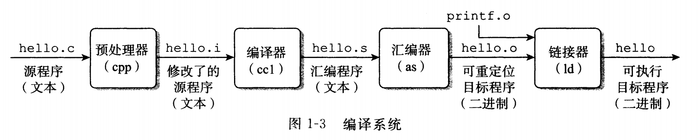

计算机系统基础
计算机 | 笔记
主要参考书目《深入理解计算机系统》。这本书的主要论题包括：数据表示、C 程序的机器级表示、处理器结构，程序优化、存储器层次结构、链接、异常控制流、虚拟存储器和存储器管理、系统级 I/O、网络编程和并发编程。书中所覆盖的内容主要是这些方面是如何影响应用和系统程序员的。主要选取书中非常识、重要或者难懂的部分。
2019-3-11

## 绪论

作者前言中，对读者应具备的背景知识的描述（节选）：

>文中包含大量已在 Linux 系统上编译和运行过的程序示例。我们假设你能访间一台这样的机器,并且能够登录，做一些诸如切换目录之类的简单操作 ……
>
>我们还假设你对 C 和 C++ 有一定的了解。如果你以前只有Java经验，那么你需要付出更多的努力来完成这种转换 …… 不过，有一些C语言的特性(特别是指针、显式的动态内存分配和格式化I/o)在Java中都是没有的 ……

这篇博客的内容砍掉了大部分在学习 C 语言就应该掌握的内容（逻辑运算、位运算、各种数据类型表示范围等）

### 程序编译

GCC 编译器的如何将一个源程序文件 hello.c（输出 "hello world" 的程序） 翻译成一个可执行目标文件 hello。



了解 GCC：[CNU Compile Collection](https://zh.wikipedia.org/wiki/GCC)

## 程序结构和执行

### 信息存储

#### 字数据

##### 位、字节、字

1. 比特：或称为位，最底层的二进制数字（数码）称为位（bit，比特），值为 0 或 1；
2. 位组合：把位组合在一起，采用某种规则进行解读
3. 字节：8-bit 块**（1bytes = 8bits）**
4. 字：CPU 中 ALU（Arithmetic Logic Unit）的数据位数 = CPU 中**通用寄存器的位数**，通常说计算机是 XX 位的，是指这台计算机 CPU 字的长度 OS 是 XX 位的，是指其 CPU 的工作模式，这与操作系统各 DLL [Dynamic Link Library] 库函数、编译连接环境有关

##### 字数据大小

每台计算机都有一个字长（word size），指明指针数据的标称大小（normal size）。因为虚拟机是以这样的一个字来编码的，所以字长决定的最终的系统参数就是虚拟地址空间的大小。

`字长`和`虚拟地址空间`我们常常称为**系统位数**（或者说**机器的字长**）和**内存大小**。

32 位系统（32 位字长机器）虚拟地址的范围为 $0 \sim 2^{32} - 1$，只能使用 4G 的内存（虚拟地址空间），而 64 位则能扩展到 16EB。


大多数 64 位机器是可以运行 32 位机器编译的程序，这是一种向后兼容。

若程序 `prog.c` 用如下伪指令编译后：

```bash
linux> gcc -m32 prog.c
```

该程序就可以在 32 位或者 64 位机器上正确运行。

但是如果用如下伪指令编译：

```bash
linux> gcc -m64 prog.c
```

那就只能在 64 位机器上运行。


##### 数据大小

基本 C 数据类型的典型大小（以字节为单位）


为了避免由于依赖「典型」大小和不同编译器设置带来的奇怪行为。ISO C99 引入了一类数据类型。其数据大小是固定的，不随编译器和机器设置而变化。其中就有数据类型 *int32_t* 和 *int64_t*，它们分别为 4 字节和 8 字节。

#### 寻址和字节顺序

##### 概述

某些机器选择在内存中按照从最低有有效字节到最高有效字节的顺序存储对象，而另一些机器相反。最低有效字节在地址前面的方式，称为小端法；最高有效字节在最前面的方式，称为大端法。

假设变量 x 的类型位 *int*，位于地址 *0x100* 处，它的十六进制值为 *0x1234567*。地址范围 *0x100 ~ 0x103* 的字节顺序依赖机器的类型：


##### 如何查看机器大小端


```c
#include <stdio.h>
#include <stdlib.h>

int main() {
    int val = 12345;
    unsigned char *start = &val;
    int len = sizeof(val);
    int i = 0;
    for(i = 0; i < len; i++)
        printf("%.2x ", *(start + i));
    printf("\n");
}
```

代码中，把 *int* 强制转换`无符号字符指针`，*start* 存放的这个 *int* 变量的初始地址，*sizeof* 获取 *int* 数据长度，*printf* 实现从数据低位向高位循环输出内容。

MacOS 上进行的试验，结果是：

```bash
39 30 00 00
```

其他机器的结果：


参数 *12345* 的十六进制表示为 *0x00003039*。发现 Windows、Linux、MacOS 都是先输出 *0x39*，说明它们都是小端机器，而 Sun 则是大端机器。

#### 整数表示

##### 补码编码

如图一个钟：


如果我们要将时间拨到 4 点，我们可以将时针逆时针往回拨 4 个刻度到 4 点。

但是，我们也可以将时针顺时针**顺时针往前拨** 8 个刻度，利用时针的循环表示规则（我们称之为自然溢出，12 点 + 1 = 1 点）。


补码编码则基于这个原理。

我们假设一个数据类型：*short short int*，只有 4 位（0 表示为 0000）。

1. 首先规定：最高位为 1 时时负数，0 为正数。那么最大的正数 0111 十进制下等于 7。
2. 我们设定：负数 x 的补码为：取绝对值，然后取反 + 1（0110 取反为 1001），比如 7（1111）表示为 0001。

这就是补码编码，`绝对值取反加一`。

下面解释这样做的理由，计算 4 - 2：

1. 4 = *0100*
2. 4 - 2 = 4 + (-2)
3. -2 = *1110*
4. 4 - 2 = *0100 + 1110* = *0010* = 2（最高位进位自然溢出）

##### 有符号数和无符号数之间的转换

```c
short int v = -12345;
unsigned short uv = (unsigned short) v;
```

结果：*v = -12345, uv = 53191*

强制类型转换的结果保持位值不变（二进制下相同表示），只是改变了解释这些位的方式。


C 语言在处理无符号和有符号的运算时，都是隐性地把有符号数转成无符号数来处理。比如小于操作 *-1 < 0U* 的结果（0U 指无符号数 0）为 *TRUE*。

##### 扩展一个数字的位表示

当我们把一个**短字长数据类型**变量强制转换成一个**长字长数据类型**时，如何表示：

1. 无符号数的扩展：高位填满 0
2. 有符号数的扩展，高位填符号位（即正数填 0，负数填 1）

##### 截断数字

当我们把一个**长字长数据类型**变量强制转换成一个**短字长数据类型**时，如何表示：

1. 无符号数截断：直接截断，高位丢掉
2. 有符号数截断：同样直接截断，但是按照有符号数解释

```c
#include <stdio.h>
#include <stdlib.h>

int main() {
    int x1 = 0b11111111111111110000000000000000;
    int x2 = 0b00000000000000001000000000000000;
    short y = x1;
    short z = x2;
    printf("%d, %d\n", y, z);
    return 0;
}

```

结果：*0, -32768*

有符号数截断同样是直接截断，不管符号位。

#### 浮点数

##### 原理

表示成有理数的形式：
$$
FLOAT = (-1)^S \; 2^E \; M
$$
其中：

1. S（符号 Sign）：决定正负
2. E（Exponent）：用 $2^E$ 将数值加权
3. M（位数 Significant）：二进制小数

##### IEEE 浮点编码

1. Sign 字段：符号位 S
2. Exp 字段：编码 E（E 与 exp 不相等，后面会解释）
3. Frac 字段：尾数 M

32 位浮点数：


注：图中 Mantissa 等同于 Frac 字段

##### 阶码 Exp

阶码用`移码`表示。举个例子，当 E = -126，Exp 如何表示：

1. E 的真值：-126
2. 负数，先改为补码，正数不用此操作：10000010
3. 移码 + 127：00000001


这么做，有两个原因：

**第一个原因**：负数和正数能够直接当做无符号数来进行比较，-126 移码后变成 1，-125 变成 2，-1 变成 126，0 变成 127，1 变成 128。

*-126 < -125 < -1 < 0 < 1*：*1 < 2 < 126 < 127 < 128*


**第二个原因**：空出 00000000 和 11111111

为什么？为了表示非规格化数。

##### 非规格化数

1. Exp = 000...0，Frac = 000...0：表示 0（**注意**：有 *+0*  和 *-0* 之分）
2. Exp = 000...0，Frac ≠ 000...0：表示最接近 0.0 的那些数，比如 32 位浮点数：$FLOAT = frac * 2^{-126}$
3. Exp = 111…1，Frac = 000...0：表示正负无穷
4. Exp = 111…1，Frac ≠ 000...0：表示这不是个数（比如除以 0 等）， Not a Number (NaN)

##### 规格化数

条件：Exp ≠ 000…0 且 Exp ≠ 111…1

阶码采用偏置值编码：E = Exp - Bias，比如 32 位浮点数，E = Exp - 127

$FLOAT = (-1)^S \times 2^{E - Bias} \times M$

##### 默认的舍入模式

1. 恰好在两个可能数值中间时（中间值）：舍入后，最低有效位的数码位偶数
2. 其他的时候，像最近的数值舍入（类似于四舍五入，比中间值小向下舍入，比中间值大向上舍入）

举个例子：

7/8：10.11**110** → 11.0**0** → 3

5/8：10.10**110** → 10.1**0** → 2

### 程序的机器级表示

#### 数据格式


汇编代码后缀：*b (bytes) → w (word) → l (double words) → q (quad words)*

#### 访问信息

一个 x86-64 的中央处理单元（CPU）包含一组 16 个存储 64 位值的通用目的寄存器。这些寄存器用来存储整数`数据和指针`。

1. 名字都以 %r 开头
2. 最初的 **8086** 处理器是 8 个 16 位的寄存器，从 %ax 到 %bp
3. 后来扩展到 **IA32** 构架，寄存器扩展到 32 位寄存器，标号从 %eax 到 %ebp
4. 再扩展到 **x86-64** 构架，寄存器扩展到 64 位，标号从 %rax 到 %rbp，除此之外，还新增了 8 个新的寄存器，标号用新规定命名，从 %r8 到 %r15


如图中嵌套的方框标明的，指令可以对这 16 个寄存器的低位字节中存放的不同大小的数据进行操作。字节级操作可以访问最低的字节，16 位操作可以访问最低的 2 个字节 32 位操作可以访问最低的 4 个字节而 64 位操作可以访问整个寄存。

#### 操作数指示符

大多数指令有一个或多个`操作数`（operand），指示出执行一个操作中要使用的源数据值，以及放置结果的目的位置。


`立即数`：用来表示常数值。在 ATT 格式的汇编代码中，立即数的书写方式是 「\$」后面跟一个用标准 C 表示法表示的整数，比如：S-577 或 \$0x1F。

`寄存器`：表示寄存器的内容。我们用符号 $r_a$ 来表示任意寄存器 $a$ ，用引用 $R[r_a]$ 来表示它的值，这是将**寄存器集合看成一个数组** R，用寄存器标识符作为索引。比如 %rax 获取 rax 寄存器中的内容。

`内存引用`：它会根据计算出来的地址（通常称为有效地址）访问某个内存位置。因为将内存看成一个很大的字节数组，我们用符号 $M_b[Addr]$ 表示对存储在内存中从地址 $Addr$ 开始的 $b$ 个字节值的引用。为了简便，我们通常省去下标 $b$。

内存引用举例：

1. *0x80567f* 表示获取地址 $\text{0x80567f}$ 中的内容。
2. *0x80567f(%rax)* 获取地址 $\text{0x80567f + %rax}$ 中的内容。
3. *0x80567f(%rax, %rbx, 4)* 表示获取地址 $\text{0x80567f + %rax + (%rbx * 4)}$ 中的内容。

#### 数据传送指令

这时最频繁使用的指令：*MOV S, D*：D ← S

同时后缀 b、w、l、q 传送字节、字、双字、四字

源操作数指定的值是一个**立即数，存储在寄存器中或者内存中**。目的操作数指定一个位置，要么是一个**寄存器或者，要么是一个内存地址**。 x86-64 加了一条限制，传送指令的两个操作数`不能都指向内存位置`。

其他传送：MOVZ（零扩展）、MONV（符号扩展）

##### 压入和弹出栈数据

根据惯例，栈是倒过来画的。在 x86-64 中，栈向低地址方向增长，所以压栈是减小栈指针 %rsp 的值。


*pushq %rax* 等价于：*subq $8, %rsp*，*movq %rax, (%rsp)*

*popq %rdx* 等价于：*movq (%rsp), %rdx*，*addq $8, %rsp*

#### 算术和逻辑操作


这些指令都有各种带不同大小操作数的变种，比如：ADD 有 addb、addw、addl、addq。**例外**：leaq 没有其他大小的变种


加载有效地址 leaq 是 movq 指令的变形，实际操作是将有效地址写入目的操作数。

假设 *%rdx = x​*，那么指令 *leaq 7(%rdx, %rdx, 4), %rax* 的结果是：*%rax = 5x + 7*


其他移位指令：

ROL 指令（Rotate Left）：向左移位，并将最高位同时拷贝到 CF 和最低位中。同理 ROR

RCL 指令（Rotate Carry Left）：向左移位，将 CF 拷贝到有效最低位，将最高有效位拷贝至 CF 中

#### 控制

##### 条件码

除了整数寄存器，CPU 还维护着一组单个位的**条件码**。它们描述最近的运算或逻辑操作的属性。最常用的有：

*CF、ZF、SF、OF*

分别是：进位标志、零标志、符号标志（结果是否位负）、溢出标志


TEST 和 CMP

*CMP S D*：保存 D - S 的值，不改变 S 和 D

*TEST %rax, %rax* 用来检查 *%rax* 是否是负数、零、还是正数。

##### 访问条件码

条件码通常不能直接读取，常用的有三种方法：

1. 根据条件码的某种组合，将一个字节设置为 0 或着 1（SET 指令）
2. 可以条件跳转到程序的某个其他部分
3. 可以有条件的传送数据

##### 跳转指令

jmp 是**无条件跳转**，可以直接跳转也可间接跳转。

`直接跳转`：下图中的 *.L1* 标号，就是利用的直接跳转。

