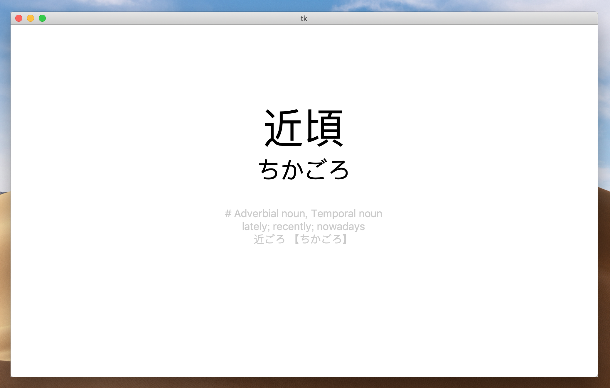
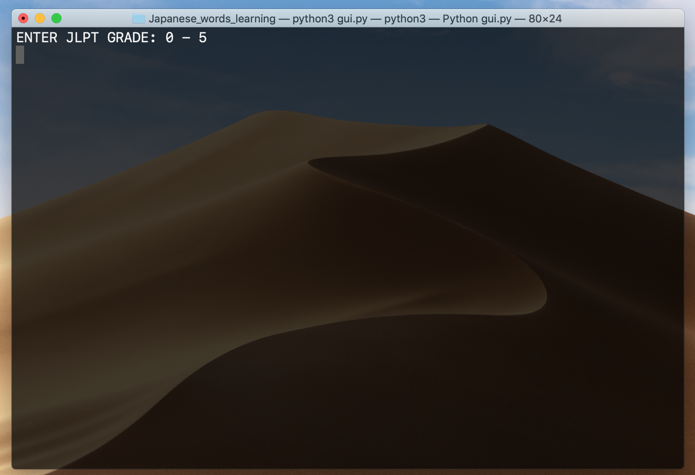
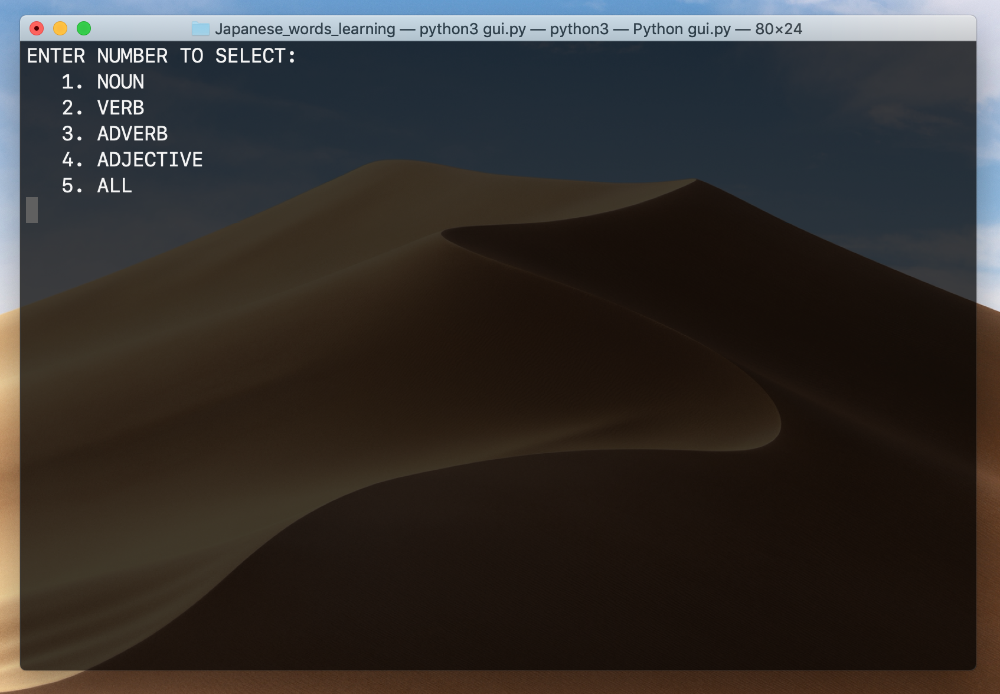

日语背词小程序
日语 | 计算机 | Python | GitHub
为了记背日语单词，用了很多方法，单词书，背单词的软件等，但是一直没有找到非常趁手的工具。最近发现了一个非常好用的电子词典，有单词的分类，JLPT 分级，词数比较多，解释也非常全。利用 Python 爬虫，抓取了这个网络词典上的单词、发音、意义等信息，做了一个自己的背单词的软件。
2019-3-29

## 先看效果



先来个最终效果图.

造好的 Repo：[Japanese_words_learning](https://github.com/Mittsuyama/Japanese_words_learning)

数据库是手动建的，clone 下来不能直接用，需要手动 `CREATE TABLE words`，详情看后文。


## 寻找单词库

第一步，是要找到一个单词库，N1 - N5 一共接近两万个单词总不能一个一个打上去，其实主要是在这一步耽误了很久。（想找一个能分 JLPT 等级的词典）

直到有一天发现了一个 Chrome 插件：[言葉 の Tab](https://chrome.google.com/webstore/detail/%E8%A8%80%E8%91%89-%E3%81%AE-tab/lacmiiahoideajihiclkhmdkikkbjcnb)

> 概述：A minimal Chrome / Firefox extension to help you learn Japanese words in each new tab.

可以在 Chrome 新建 Tab 显示日语单词，敲空格显示下一个，右上角四个选项分别是 JLPT 级数、收藏此单词、查看收藏、皮肤


其实用这个就可以了，但是我希望它能实现选择不同类型词汇、显示更多单词信息（比如同音词，近义词，其他形式等）、能够记录是否记住次单词，并且更高概率显示没有记住的单词等等功能。（要求有点多）

点击单词就能查看详细信息，然后就找到了非常贴合要求的电子词典：[jisho.org](https://jisho.org/)

这个网站中能通过 JLPT 等级搜词，比如搜索 `#jlpt-n3 #adjective`，一页能显示 20 个单词，有单词的基本信息（平假注音、词性、基本隐私、其他形式），一次 Request 能爬 20 个单词，效率还是比较高的（两万个单词也还是要爬一会）

## 爬数据

需要准备：BeautifulSoup 库、pyMySQL 库、MySQL。[Beautiful Soup 4.2.0 文档](https://www.crummy.com/software/BeautifulSoup/bs4/doc/index.zh.html)

熬一锅 Soup 然后爬数据。这个网站的 Request 也比较简单。

1. `https://jisho.org/search/%23jlpt-n3%20%23words?page=2` 修改网址中的 JLPT 等级和页码就能获取页面。
2. 查看此页面是否有 `<div class = "more"></div>` 来判断是否达到最后一页。
3. 标签也算是比较规范，爬起来比较放心，有一个特例，搜索一下 `可愛い` ，这个词的注音的标签就有点区别

建立数据库，新建 TABLE words

```mysql
CREATE TABLE words
(
    id int not null AUTO_INCREMENT,
  	kanji varchar(50) not null,
  	kana varchar(50) not null,
  	type tinytext not null,
  	meaning text not null,
  	grade int not null,
  	other text not null,
  	weight tinyint not null,
  	PRIMARY KEY (id),
  	CONSTRAINT kanji_kana UNIQUE (kanji, kana)
);
```

注意日语里面有很多多音词，需要用联合 UNIQUE 判重（汉字和平假注音）。

意思有些单词很长，比如 `掛ける` ，tinytext 可能不够。

```python
cursor.execute('''
    INSERT IGNORE INTO words(kanji, kana, type, grade, meaning, other)
    VALUES("%s", "%s", "%s", %d, "%s", "%s");
    '''%(kanji, kana, wType, grade, meaning, other))
connection.commit()
```

然后就可以愉快的跟新数据库了，记得 `INGORE` 去重。

## 软件制作

需要大概实现这些功能：空格显示单词信息，再按空格表示认识，F 表示不熟或不认识，Q 退出程序（不认识的单词权重会增加，认识的会减少，权重更大的单词更容易出现）

为了做起来简单，选择 JLPT 等级和词性在终端中进行。





用 Python 的 input 读入，获取信息后，使用 TKinter 来做 UI 界面。


需要准备：TKinter。这个 GUI 库 Python 内置，不需要再去获取。

其中比较重要的几个点：

##### 如何使权重大的单词更容易出现

```python
self.data = self.cursor.fetchall()
self.order = []
self.allNum = len(self.data)
for i in range(0, self.allNum):
    self.order.append(i)
  	self.order.sort(key = functools.cmp_to_key(self.myCmp))

def myCmp(self, x, y):
  	myRange = 0
  	if self.data[x][-1] > self.data[y][-1]:
    	myRange = 10
    else:
      myRange = 6
      result = random.randint(1, myRange)
    
    if result > 3:
        return -1;
    return 1;
```

根据 JLPT 等级和词性获得的单词放在 data 数组中，order 是一个顺序数组（长度和 data 相同），用 `fechall()`  得到的是个 `tuple` 无法修改，所以修改 order 的顺序，来改变 data 的顺序（调用方式：`data[order[i]]`）。


`myCmp` 是一个半随机的排序比较函数（单词的权重信息我放在最后一个位置，也就是 data[x][-1]）。这样能使权重大（也就是记得越不熟）的单词**更容易**出现在前面，但是权重小的单词**也可能**出现。

##### 修改单词权重

在获取单词信息的时候，请把 ID（也就是 PRIMARY KEY 约束的表头）也一并获取。

然后根据唯一确定的 ID 来修改单词的权重

```python
def changeWeight(self, order, value):
    self.cursor.execute('''
      SELECT weight from words
      WHERE id = %d
      ''' % (order))
  	now = self.cursor.fetchall()[0][0]
  	now += value
  	now = max(0, min(100, now))
  	self.cursor.execute('''
  		UPDATE words
  		SET weight = %d
  		WHERE id = %d
  		''' % (now, order))
  	self.connection.commit()
```

其他的逻辑和 UI 就是比较码农的东西，慢慢敲就行。


程序的编写非常简单，没啥建议。

主要是建议不要用这种方法来背单词，而是当做检验工具，从零开始背单词效果非常差，过一眼根本记不住，背单词最好还是结合文章、歌曲、漫画、动漫、TV 剧等，印象会更深。

当你差不多记住某一个阶段的单词，用作复习的话，效果会非常好，用来检查哪些单词还不太熟。

