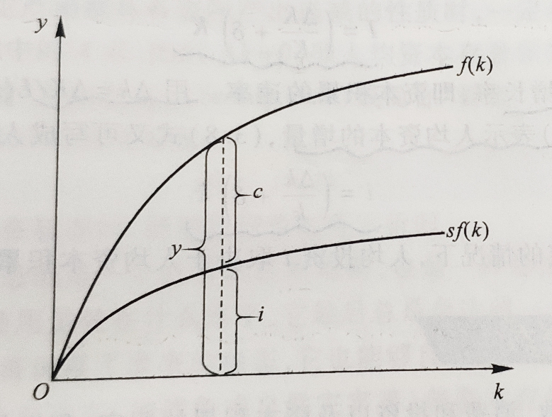
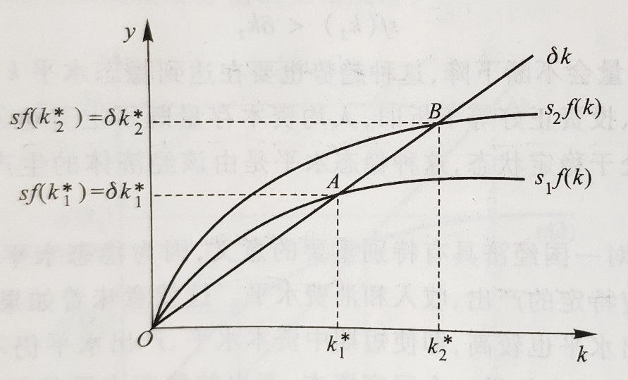
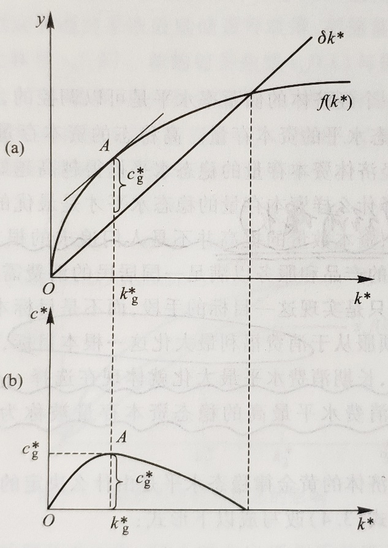
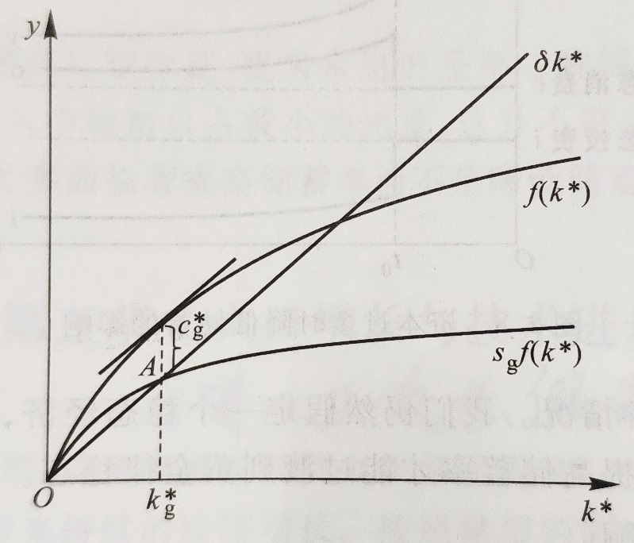
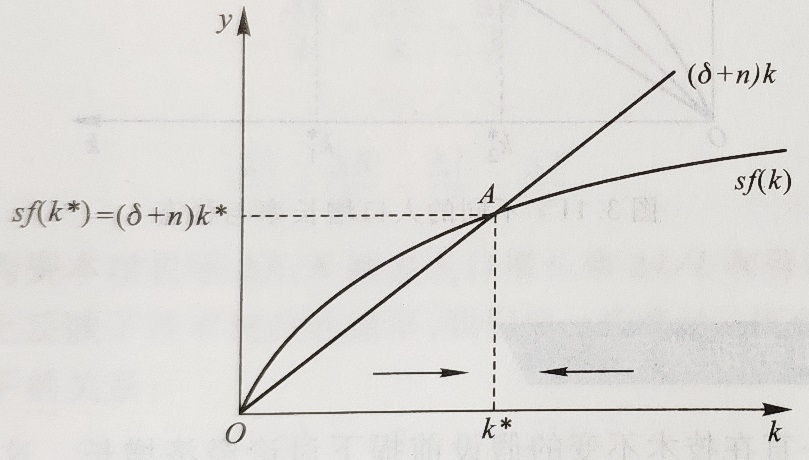
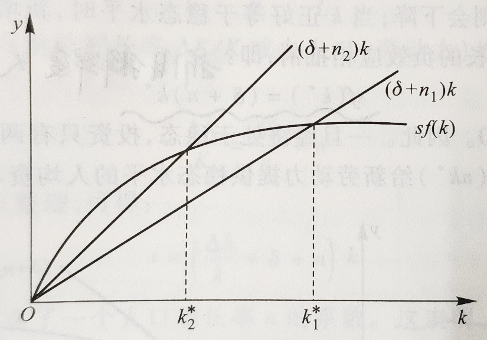
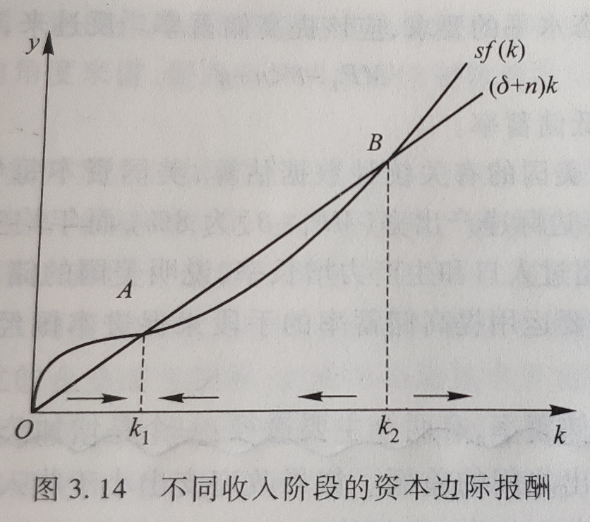
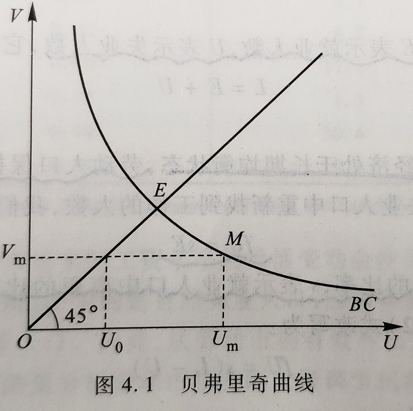

宏观经济学 2
笔记 | 经济学
宏观经济学，是指用国民收入、经济整体的投资和消费等总体性的统计概念来分析经济运行规律的一个经济学领域。宏观经济学是相对于古典的微观经济学而言的。 宏观经济学是约翰·梅纳德·凯恩斯的《就业、利息和货币通论》发表以来快速发展起来的一个经济学分支。
2018-10-8

[宏观经济学 1](blog.php?id=9)

[宏观经济学 3](blog.php?id=36)

## 经济增长

主要方法：归因模型、模型化

#### 资本积累

##### 基本假设

1. <u>**社会生产**</u>

新古典主义的生产函数

$$
Y = F(K, L)
$$

`第一个性质`是资本的边际产量（$MP_K$）劳动的边际产量（$MP_L$）大于零且`递减`，用数学语言来表示：

$$
MP_K = F_K = \frac{\partial F(K, L)}{\partial K} > 0, \frac{\partial MP_K}{\partial K} = \frac{\partial^2F(K, L)}{\partial^2K} < 0 \\
MP_L = F_L = \frac{\partial F(K, L)}{\partial L} > 0, \frac{\partial MP_L}{\partial L} = \frac{\partial^2F(K, L)}{\partial^2L} < 0 \\
$$

`第二个性质`就是`规模报酬不变`，即生产函数满足一次齐次性：

$$
\lambda Y = F(\lambda K, \lambda L)
$$

`第三个性质`就是资本（或劳动）趋向零时，资本（或劳动）的边际产量趋向无穷大；资本（或劳动）趋向无穷大时，资本（或劳动）的边际产量趋向于零，即：

$$
\lim_{K \to 0}F_K = \lim_{L \to 0}F_L = \infty\\
\lim_{K \to \infty}F_K = \lim_{L \to \infty}F_L = 0\\
$$

这个条件也成为「稻田条件」。

如 $y = Y / L$ 代表人均产出，$k = K / L$ 表示人均资本使用量，那么新古典生产函数可以写成：

$$
y = \frac{Y}{L} = F(\frac{K}{L}, 1) = F(k, 1) \\
（证明：规模报酬不变，令  \lambda = \frac{1}{L}） \\
于是我们得到：y = f(k)
$$

即`人均产出只与人均资本投入`有关，是人均资本使用量的函数。

2. <u>**消费、投资和储蓄**</u>

假设一个封闭的经济体系，而且在这个经济体系中不存在政府部门，那么第二章收入恒等式可以写成：

$$
Y = C + I
$$

用人均的概念来表示可得：

$$
\frac{Y}{L} = \frac{C}{L} + \frac{I}{L}
$$

或者：

$$
y = c +i
$$

也就是说，人均产出 $y$ 被分为人均消费 $c = C / L$ 和人均投资 $i = I / L$ 两部分。

如果不存在政府部门，国民储蓄 $S$ 就等于私人储蓄（$Y - C$），用 $s = S / Y$ 表示储蓄率。该经济体中的消费函数可以定义为：

$$
c = (1 - s)y
$$

用上式代替国民收入恒等式中的 $c$ 得：

$$
i = sy
$$

投资就成了人均资本量 $k$ 的函数（1 式）：

$$
i = sf(k)
$$

3. <u>**投资与资本积累**</u>

一个社会的投资会带来资本存量的变化，这是流量与存量的关系。但资本存量的变化不仅取决于投资，而且也取决于资本损耗即折旧。

我们假设一个经济中所有的资本都以一个固定的比例 $\delta$ 折损减少，我们称 $\delta$ 为评价折旧率。（投资 $I$ 是流量，资本 $K$ 是存量）

$$
资本存量变化量 \Delta K = 
\begin{cases}
+ \; 投资 \; I\\
- \; 折旧 \; \delta K
\end{cases}
$$

得到：

$$
I = \Delta K + \delta K
$$

即投资 $I$ 等于资本存量的变化量 $\Delta K$ 加上资本存量的折旧量 $\delta K$。

整理可得：

$$
I = (\frac{\Delta K}{K} + \delta)K
$$

其中 $\Delta K / K$ 为资本存量的增长率。用 $\delta k = \Delta K / L$（在劳动数量固定不变的情况下，$\Delta k = \Delta(K / L) = \Delta K / L$）表示人均资本的增量，又可以写成人均的表示形式（2 式）：

$$
i = (\frac{\Delta k}{k} + \delta)k
$$

因此，在人均资本存量既定的情况下，人均投资 $i$ 取决于人均资本积累的速率 $\Delta k / k$ 和折旧率 $\delta$。

##### 资本积累和稳态

将 2 式代入宏观经济均衡方程 1 式得：

$$
\Delta k = sf(k) = \delta k
$$

将 $sf(k) \; 和 \; \delta k$ 画入坐标图：

如图中的 $A$ 点，此时 $\Delta k = 0$，即人均资本存量保持稳定不变。我们称这个资本存量的`稳定状态`，简称`稳态`，记为 $k^*$。人均资本拥有量达到稳态时，即 $k = k^*$，则上式可以写成：

$$
sf(k^*) = \delta k^*
$$

也就是说，当一个经济处在稳态时，新增投资恰好等于折旧。

##### 储蓄对稳态的影响

如果储蓄率较高，那么长期中经济体会有较高水平的资本存量和产出，如果储蓄率较低，情况会相反。

但值得我们注意的是，较高的储蓄率导致较快的增长仅仅是暂时，因为在长期中，一个经济体一旦达到它的稳态，增长的动力就会消失。此称为`索罗模型的零增长结论`。

#### 资本积累的黄金律

##### 黄金律

对任何一个经济体来说，资本数量的提高（即经济增长）并不是人们追求的根本目标，而是消费福利最大化。

在一个稳态经济中，长期消费水平最大化就体现在选择一个消费水平最高的稳态资本存量。在索罗模型中，长期消费水平最高的稳态资本存量被称为资本积累的`黄金律水平`，记为 $k_{g}^{*}$.

我们把收入恒等式 $y = c + i$ 改写成：$c = y - i$，或者

$$
c = f(k) - i
$$

即消费等于产出减去投资。

有因为在稳定状态投资等于折旧 $\delta k^*$，因此可以用 $k^*$ 代替 $k$，用 $\delta k^*$ 代替 $i$，这样我们得到稳定状态的人均消费：

$$
c^* = f(k^*) - \delta k^*
$$

因此，只有资本存量等于黄金水平，也就是两条曲线的斜率相同，稳态水平的消费达到最大，整个经济体也就处在黄金律稳定状态。

因此，长期消费水平达到最大化，也就是黄金律稳态水平的基本条件是：

$$
MP_K = \delta
$$

即在资本的黄金律水平，资本的边际生产力等于折旧率。

##### 黄金稳态过程

一个经济会自动收敛于一个稳定状态，但不会收敛到一个黄金律的稳定状态。

政府可以通过改变储蓄率来改变一个经济的稳态资本存量，从而使达到黄金律的稳态水平。

#### 人口增长与技术进步

`放松假设进行研究`

##### 人口增长

劳动力数量不再是固定不变的，而是不断增长的。因此，人均资本变化率 $\Delta k / k$ 为：

$$
\frac{\Delta k}{k} = \frac{\Delta K}{K} - \frac{\Delta L}{L} \\
---------------\\
推导过程：\\
人均资本使用量 k = K / L \\
两边取对数：lnk = lnK - lnL \\
再对时间 t 求导：\frac{dk/dt}{k} = \frac{dK/dt}{K} - \frac{dL/dt}{L} \\
令 dX/dt = \Delta X 则可得人均资本变化率.
$$
即人均资本增长率为资本存量的增长率减去劳动力的增长率（用 $n$ 表示）。

代入 $I= (\frac{\Delta K}{K} + \delta)K$ 整理得：

$$
i = (\frac{\Delta k}{k} + \delta + n)k
$$

这表明，在资本存量一定的情况下，人均投资不仅取决于人均资本增长率和折旧率，而且还取决于人口增长率。

将上式整理得：

$$
i = \Delta k + (\delta + n)k
$$

我们可以把 $(\delta + n)k$ 项看作是一种`平衡投资`，即存在折旧和人口增长的情况下，为了保持人均资本不变需追加的投资。

将上式代入上上式：

$$
\Delta k = sf(k) - (\delta + n)k
$$

与之前的图一样，我们可以在图中画出人均投资曲线 $sf(k)$ ，再画出包括折旧和人口增长因素的平衡投资线 $(\delta + n)k$。

当 $k$ 正好等于稳态水平时，新增投资对人均资本存量的正效应，正好与折旧和人口增长的负效应相抵消，即：

$$
sf(k^*) = (\delta + n)k
$$

我们看到，引进人口增长模型在三个方面改变了基本的索罗模型：
1. 首先，人口增长使模型离现实的经济增长更近了一步。因为在有人口增长的稳态，虽然资本和产出不变，但是劳动力的增长引起了存本存量和总产出的增长。
2. 其次，人口增长提供了国家之间贫富差距的一种解释，可以用用下图解释，高的人口增长率的国家的消费水平更低。

3. 最后，人口增长改变了资本积累黄金率稳态水平，将曾口增长因素稳态水平代入之前的式子：

$$
c^* = f(k^*) - (\delta + n)k^*
$$

因此，能够使稳态消费最大化的黄金律资本稳态水平 $k_g^*$，必须满足：

$$
MP_k = (\delta + n)
$$

##### 技术进步和劳动效率

一般来说，如果技术进步发生，他会通过影响劳动和资本投入使用效率对产出产生影响。为了分析方便，我们`假定技术进步仅仅影响劳动和使用效率`，而不影响资本的使用效率。这样，我们可以定义体现技术进步的「有效劳动」：

$$
E = T \times L
$$

我们将有效劳动 $E$ 取代上述新古典生产函数的 $L$，就能得到反映有效劳动的生产函数：

$$
Y = F(K, E)
$$

有了有效劳动的概念，我们对人均的概念也要进行重新定义。我们仍用小写字母表示人均数量，但现在的「人」已经不是一般意义上的劳动 $L$，而是包含技术进步的有效劳动 $E$，因此，我们把 $k = K / E$ 称为有效人均资本，$ = Y / E$ 称为有效人均产出（`在考虑技术进步时，所有的人均变化量均为有效劳动人均变化量`）。

有效人均函数仍然可以写成：$y = f(k)$

虽然形式和之前的相同，但是内容已经发生了根本的变化。原来的人均生产函数的 $k$ 和 $y$ 可以看作劳动效率 $E$ 不变且等于 $1$ 时的特例。有效人均资本变化率 $\Delta k / K$ 可表达为：

$$
\frac{\Delta k}{k} = \frac{\Delta K}{K} - \frac{\Delta E}{E}\\
或者：\\
\frac{\Delta k}{k} = \frac{\Delta K}{K} - \frac{\Delta L}{L} - \frac{\Delta T}{T}
$$

劳动生产力增长率反映了技术进步的速率，我们用 $g$ 来表示。因此，有效人均投资与有效人均资本存量应该有如下的关系：

$$
i = \Delta k + (\delta + n + g)k
$$

平均投资项多了一个劳动生产力增长率即技术进步率 $g$.

##### 有技术进步的稳态

我们用分析人口增产的同样方法，按照之前人口增长的式子，可得：

$$
\Delta k = sf(k) - (\delta + n + g)k
$$
这表明技术和人口增长等一样，都会降低人均有效资本积累的速度，但是与人口增长方式不同的是，技术进步是通过每个劳动力分更多的资本存量来降低 $\Delta k$.

有效人均产出 $y = Y / E$ 的增长率可表达为：

$$
\frac{\Delta y}{y} = \frac{\Delta Y}{Y} - \frac{\Delta L}{L} - \frac{\Delta T}{T}
$$

经济体一旦达到稳态，有效人均资本的增长率等于零，有效人均产出增长率也等于零（$\Delta y = 0$），稳态形式为：

$$
\frac{\Delta Y}{Y} = n + g\\
或者\\
\frac{\Delta Y}{Y} - \frac{\Delta L}{L} = g
$$

其中 $\Delta Y / Y$ 为总产出增长率即经济增长率，$\Delta Y / Y - \Delta L - L$ 为人均产出增长率。

在稳定状态，虽然有效人均资本 $k = K / E$ 和有效人均产出 $y = Y / E$ 都不变，但是总产出 $Y$ 和人均产出 $Y / L$ 却分别以 $n + g$ 和 $g$ 的速率增长。

（图略，斜率改为 $\delta + n +g$ 即可）
很容易证明有效人均消费的稳态水平为：
$$
c^* = f(k^*) - (\delta + n +g)k^*
$$

因此，稳态人均消费实现的最大化的条件是：

$$
MP_K = \delta + n + g\\
或者\\
MP_K - \delta = n + g
$$

其中 $MP_K - \delta$  为资本的边际净产出或边际净收益率。在资本积累的黄金律水平，资本的边际净收益率 $MP_K - \delta$ 应该等于实际总产出的增长率 $n + g$.

#### 增长理论的应用

次节略讲

##### 增长的源泉

第二章介绍的柯布 - 道格拉斯生产函数：

$$
Y = AK^{\alpha}L^{1 - \alpha}
$$

其中 $A$ 是反映技术变动的自生增长因素，也称为全要素生产力。$A$ 与前面的「劳动增长型」技术进步有所不同，它不仅衡量了技术进步通过提高劳动效率对产出的产生影响，而且也衡量了技术进步通过提高资本效率对产出的产生影响。因此，$A$ 通常也称为中性技术进步，`表明了技术进步不偏向任何一个因素，其影响是中性的`。

我们把生产函数改写成增长率的形式，就能更清楚地了解两个要素以及技术进步在经济增长中的作用：

$$
\frac{\Delta Y}{Y} = \alpha \frac{\Delta K}{K} + (1 - \alpha)\frac{\Delta L}{L} + \frac{\Delta A}{A}
$$

也就是说，经济增长率 $\Delta Y / Y$ 取决于资本增长率的贡献 $\alpha (\Delta K / K)$、劳动增长率的贡献 $(1 - \alpha)(\Delta L / L)$ 和技术进步率 $\Delta A / A$。

$$
\frac{\Delta A}{A} = \frac{\Delta Y}{Y} - \alpha \frac{\Delta K}{K} - (1 - \alpha)\frac{\Delta L}{L}
$$

在这里，技术进步的贡献是根据产出增长率扣除要素投入量增长率贡献得出的余额，也称为「索洛余值」

##### 内生增长理论

首先，索洛模型假设条件的一个结论是，当资本存量增长时，经济会增长，但由于边际报酬递减，经济增长的速度会减慢，直到最终停止而达到一个稳定状态。因此，一旦一个经济体达到稳定状态，人均的资本存量和产出的增长就会停止，人均意义上的持续经济增长可是不能发生的。

这一结论并不符合工业化国家经济增长的现实。

索洛模型的另一个结论是，由于穷国的人均资本存量低于富国，每单位新增投资能产生较高的边际报酬，因此穷国应该比富国增长更快，各国经济应该有「趋同」的趋势。穷国的经济增长应该快于富国。

这一结论也不符合世界各国经济增长的现实。

索洛模型的某些结论与现实的偏离，关键在于模型中储蓄率、人口增长、资本折旧率和技术进步都是外生变量。

我们自然会想到将储蓄率、人口增长和技术进步等重要因素作为内生变量来考虑，从而可以由模型的内部来决定经济的长期增长。这种增长模型（通常也称为新增长理论）称为内生增长模型。

我们仍然从生产函数入手，假定生产函数采取如下形式（我们假定劳动力数量不变）：

$$
Y = AK
$$

内生增长理论理论把一国总资本的边际报酬不变主要归纳为以下两个原因：
1. 一个原因是人力资本。资本存量增长，不仅包括对物资资本的投资，而且也包括对人力资本的投资。人力资本的投资能够开发劳动者潜在的素质和技能，提高劳动的边际效率。
2. 另个一个原因是知识积累（技术进步）。知识是非竞争性的，具有外部溢出效应，这种效应不仅会使知识资本自身收益递增，而且也会提高物资资本和劳动其他要素的生产力，从而会抵消物资本边际产出递减效应。

和索洛模型一样，储蓄率 $s$ 是储蓄 $S$ 在总收入 $AK$ 所占的比重，因此储蓄 $S$ 为下式决定：

$$
S = sAK
$$

投资仍然由净投资资本存量的增量和折旧两部分构成，即：

$$
I = \Delta K = \delta K
$$

宏观经济学的均衡要求投资等于储蓄，因此：

$$
\Delta K + \delta k = sAK
$$

将上式加以整理可得：

$$
\frac{\Delta K}{K} = sA - \delta
$$

由于资本的边际产出不变，因此产出的增长率 $\Delta Y / Y$ 应该等于资本的增长率 $\Delta K / K$（$A = Y / K = \Delta Y / \Delta K \Rightarrow \Delta K / K = \Delta Y / Y$），因此上式意味着：

$$
\frac{\Delta Y}{Y} = sA - \delta
$$

此式中储蓄率 $s$ 决定着一个经济体的长期均衡增长；而在索洛模型中，长期均衡增长与储蓄率无关。

内生增长理论之所以强调储蓄在经济增长的决定作用，正是因为储蓄带来的人力资本开发，知识积累等因素构成了一国经济增长的内在推动力力。

把内生增长理论与索洛的外生增长模型结合起来，我们还可以回答世界各国经济增长趋同的问题。

`我们假定两个不同收入阶段`。

1. 收入较低时，新增的资本主要投资物资资产，不会过多地投资人力资本和只知识，因此，社会总资本基本上采用物资资本模式，具有边际报酬递减的性质。
2. 收入较高时，社会可以把较多的资本用于人力资本的开发和知识的积累。因此社会总资本是物质资本和人力资本、知识的结合体，具有`边际报酬不变`的特点。

产出一开始以递减的速度上升，到一定阶段后转为递增的速度，最终以一个固定的比率不断增加。

因此， $k_1$ 代表了资本存量大于零且小于 $k_2$ 的一个经济零增长的资本存量稳定水平。如果资本存量大于 $k_2$，新增投资将持续大于平衡投资，资本存量会出持续增长，人均经济也会持续增长。因此，$k_2$ 代表了一个由稳态零增长过渡长期增长的临界资本存量水平，也就是说，只要资本存量大于 $k_2$，一个经济体就会从稳态的零增长走向长期持续增长。

这样看来，穷国的经济增长速度慢于富国主要是由两个原因造成的：

1. 一是人均资本存量的水平偏低，达不到长期增长的临界水平  $k_2$；
2. 二是人力资本开发和知识积累不足，导致要素的边际产出递减。

##### 促进增长的政策

1. <u>**储蓄率政策**</u>

在索洛模型中，通过储蓄率的调整不仅可以影响和决定一个经济体的稳态资本存量和产出水平，而且还可以实现一个经济体的黄金律稳态消费水平。

一国通过政策提高国民储蓄率，有两个主要途径：一个增加公共储蓄，二是鼓励私人储蓄。

2. <u>**促进生产力政策**</u>（考研题：三点 + 五十字扩展）

- 鼓励研究开发
- 开发人力资本
- 完善基础设施

## 失业

#### 自然失业

##### 自然失业与周期性失业

按古典学派的观点，劳动市场的运行是有效的，因为实际工资水平具备充分伸缩性。失业只可能是摩擦性失业和结构性失业，人们往往也就把这两种类型的失业称为古典失业（自然失业）。

凯恩斯学派认为，劳动市场的运行不一定有效，因为实际工资水平并不具备充分伸缩性。在凯恩斯看来，引起失业的根本原因是周期性的经济萧条，因此周期性失业往往也称为凯恩斯失业。

这样看来，自然失业（古典失业）可以认为是一个长期现象，二周期性失业（凯恩斯失业）则是一个短期行为。

用  $\bar{Y}$ 表示充分就业的 $GDP$，

1. $Y = \bar{Y}$，不存在周期性失业，所有失业为自然失业。
2. $Y < \bar{Y}$，存在周期性失业，周期性失业为正，反之为负。

我们用横轴表示劳动市场的失业率 $U$，用纵轴表示岗位空缺率 $V$，曲线 $BC$ 为贝弗里奇曲线，表示在一个给定的劳动市场结构中岗位空缺率与失业率之间的负相关关系。

从原点出发做一条 $45^{\circ}$ 的斜线，这条线上的每一点都表示岗位空缺数与失业人数相等的情况。

假如一个经济的劳动市场当前处于曲线 $BC$ 上的 $M$ 点，那么失业率为 $U_m$，岗位空缺率为 $V_m$，其中 $OU_0$ 等于 $V_m$，为摩擦性或结构性的失业，而 $U_0U_m$ 则为周期性失业。

##### 自然失业与劳动人口变化

我们用 $L$ 表示劳动人口，$E$ 表示就业人数，$U$ 表示失业人数：

$$
L = E + U
$$

失业率可以用 $U / L$ 来表示。
为了简化分析，我们假定经济处于长期均衡状态，劳动人口保持不变。因此就业人口中游离出来的失业人口数应该等于失业人口中重新找到工作的人数：

$$
fU = sE
$$

其中 $f$ 表示失业人口中再就业的比率，$s$ 表示就业人口中离职的比率。
利用 $L = E + U$ 式，改写为：

$$
fU = s(L - U)\\
U = \frac{sL}{s + f}
\\
因此，失业率决定式：\frac{U}{L} = \frac{s}{s + f}
$$

离职率越高，意味着从就业队伍中游离出来的失业人口越多，失业率就会越高；再就业率越高，意味着从失业大军重新上岗的人员越多，失业率则会越低。

#### 职业搜寻

##### 岗位空缺与失业

在摩擦性失业和结构性失业中，岗位空缺市场和失业市场并存，劳动者并不能在这两个市场之间自由转移。

1. 同质性：劳动者并不能及时地在市场之间自由转移，就会形成岗位空缺和失业并存的现象。这种市场之间转移所需的时间和成本就是劳动者的市场转移成本，其产生的根本原因就在于劳动者在技能上的差异，也就是劳动的不同质性。
2. 完全信息：劳动市场的信息并不是完全的，劳动者在寻找工作中必然产生成本，也就是职业搜寻成本。

职业搜寻模型，失业保障（略）

#### 职业配给

（略讲）

实际工资水平的变动仍然起着配置劳动资源的作用。从`实际工资调节功能出现障碍`的角度来分析失业现象的理论也称为职业配给理论。这种理论认为，长期失业产生的原因是因为劳动资源在一些场合并不是通过劳动市场的实际工资进行调节，而通过某种制度或人为的因素进行分配。

宏观经济学的三个行为主体，政府企业和劳动者的行为都有可能对劳动市场的调节机制制造障碍。

##### 最低工资（政府行为）

在最低工资的条件下，愿意就业的劳动人数仍为 $\bar{L}$，劳动的供给大于需求，于是 $\bar{L} - L$ 便成了最低工资法带来的非自愿失业人口。

##### 有效工资（企业行为）

效率工资理论就是说明，企业为了提高劳动生产率，有可能主动地将实际工资水平定在高于市场出清的均衡水平上，从而导致了工人的失业。

##### 工会（劳动者行为）

工会是由一部分劳动者组成，借以增加工人市场力量的组织。有组织的工人与雇主就工资水平进行谈判时，讨价还价的能力大大加强，工会工人的工资水平就不再由劳动市场的供求均衡水平决定，而是由工会与企业的集体谈判决定。集体谈判决定的工资水平往往会高于市场的均衡工资水平。

#### 失业治理

##### 失业的时间结构

从失业的时间结构来看，失业大致可分为短期失业和长期失业。

短期失业一般是指摩擦性失业，主要原因是由于寻找工作需要一定的时间和成本。

而长期失业有可能是产业结构调整导致的失业，也有可能是实际工资调节机制出现障碍造成的劳动市场供大于求。

##### 失业的人口结构

1. 年龄
2. 受教育程度
3. 性别
4. 种族

##### 失业治理政策

分为两类：主动性失业治理政策和被动性失业治理政策。

1. 主动性失业治理政策是在劳动供给方面做文章，是劳动供给在数量、结构和质量上符合市场上对劳动的需求。
2. 被动性失业治理政策基于这样的概念，在市场经济条件下，要彻底消除失业现象是不可能的，既然不能消除，我们就应该实施被动的失业治理政策，对失业者进行救济，也就是建立起一套完善的失业保障体系。

## 通货膨胀

#### 货币的概念

##### 货币的职能

货币是指那些`流动性高`、人们普遍愿意接受的资产（货币 $\neq 现金$）。

流动性高：变现能力和速度

货币的基本职能

1.  交易媒介
2.  计价单位
3.  支付手段
4.  价值贮存

##### 货币的形态

其实，人们需要什么货币只是需要货币的几种职能，至于货币采取什么形式并不重要。

##### 货币的分类和数量

从`流动性`出发，货币可进行如下分类：

1.  C：流通中的现金
2.  M1：C + 旅行支票 + 活期存款
    1.  旅行支票：需要到银行进行交换
    2.  活期存款：支票类存款无利益
3.  M2：M1 + 储蓄存款 + 定期存款 + 零售型货币市场共同基金和其他存款
    1.  定期存款：企事业的长期存款

我国：

1.  C：流通中的现金（M0）
2.  M1： C + 企业的活期储蓄存款 + 政府部门、社会机构和部队的储蓄存款 + 农村储蓄存款 + 个人信用存款
3.  M2：M1 + 城市居民定期储蓄量存款 + 企业定期存款 + 外汇储蓄 + 信托储蓄

尽管在实际生活中，我们对货币资产的范围有不同的测算方法，但从最基本方面看，货币只由二部分构成：现金和存款。

存款在货币中占有绝大比重，现金只是起着辅助作用，这正是现代经济的一大特色。

支票和信用卡都不是货币。

#### 货币数量论

##### 数量方程式

$$
货币数量 \times 货币的平均流通速度 = 价格 \times 交易数量 \\
M \times V = P \times T
$$

方程式的右边反映了交易的情况。$T$ 代表一段时期内一个经济所有产品和服务`交易的数量`。$P$ 代表交易的平均价格。

方程的左边反映了用于交易的货币的情况。$M$ 代表一个经济的货币数量，$V$ 代表了货币的交易流通速度，用来衡量单位货币在一段时期内换手的速度。

将经济中的交易定位最终产品和服务即`当期产出的交易`，则可以得到数量方程的另一种形式：

$$
MV = PY
$$

$Y$ 代表当期`产出的数量`，即实际 GDP，$P$ 是当期产出的平均价格水平，$V$ 是货币的收入流通速度，代表 1 年中每一元钱用来购买最终产品和服务的平均次数。

将上式略作变换：

$$
\frac{M}{P} = \frac{1}{V}Y
$$

$M / P$ 表示一个经济实际货币的数量。

假定人们对货币的需求只是为了满足交易的需要，那么货币需求函数可表达为：

$$
\left(\frac{M}{P}\right)^d = kY
$$

<u>人们愿意持有的实际货币数量是实际收入的一个比例。</u>

货币市场的均衡：经济中实际货币的数量必须等于等人愿意持有的实际货币数量，也就是货币供给等于货币的需求：

$$
\frac{M}{P} = kY
$$

其中  $M / P$ 为实际货币供给。

##### 货币数量与通货膨胀

将货币数量方程式 $MV = PY$ 写成变化率的形式：

$$
\frac{\Delta M}{M} + \frac{\Delta V}{V} = \frac{\Delta P}{P} + \frac{\Delta Y}{Y}
$$

1.  $\Delta M / M$ 为货币数量的变化率，由中央银行决定。
2.  $\Delta V / V$ 为货币流通速度的变化率
3.  $\Delta P / P$ 为价格变化率，也就是通货膨胀率
4.  $\Delta Y / Y$ 为实际 $GDP$ 增长率

从分析价格水平如何变化的角度，上式又可写成：

$$
\frac{\Delta P}{P} = \frac{\Delta M}{M} + \frac{\Delta V}{V} -\frac{\Delta Y}{Y}
$$

决定通货膨胀率有三个因素，一是货币供给量的增长率，而是货币流通速度的增长率，三是实际 $GDP$ 增长率。

从短期来看，货币流通速度 $V$ 会受到某些制度和技术因素的影响而产生变化：但从`长期来看`，$V$ 相对稳定，一般不会随着时间的变化而变化，即 $\Delta V = 0$。因此：

$$
\frac{\Delta P}{P} = \frac{\Delta M}{M} - \frac{\Delta Y}{Y}
$$

中央银行的货币供给行为最终决定着经济中的通货膨胀率。

在实际经济增长率不变的情况下， 如果中央银行决定将流通中的货币供给量增长率 $\Delta M / M$ 提高 $1 \%$，通货膨胀率 $\Delta P / P$ 就会上升 $1\%$，通货膨胀纯粹是一个「货币现象」。

##### 古典两分法

`名义变量对实际变量没有影响`。名义变量是指由货币计量的一些经济变量，如价格水平、名义利率等等。实际变量是指经济中那些不依赖货币而存在的变量，如商品的相对比价、实际利率、总产出、就业量、失业量。

实际变量由经济中各市场的一般均衡来决定，而名义变量则取决于货币的供给数量。货币供给数量增加，只会导致普遍的价格水平的上升，而不会改变厂商和家庭的决策，也不会改变产出和就业这类实际变量。

由于上述观点将名义变量与实际变量分割开来犹如泾渭分明，互不影响，因此被称为古典的二分法。

长期均衡中名义经济和世纪经济的关系。

##### 货币政策与铸币税

货币数量论的政策含义也十分简单明了。既然通货膨胀纯粹是一种货币现象，那么，政府只要控制货币供给量就可以控制通货膨胀。

但实际上，政府要做到这一点很难。这是因为政府的行为并不是孤立的，而是受到一定的社会经济条件制约。

如果中央政府通过发行货币来为其预算开支进行融资的话，那么融资会导致物价水平的上升，使得公众手中货币的实际购买力下降。因此，发行货币以提高政府收入就如同向广大的货币持有者征收了一笔通货膨胀税，通常也被称为铸币税。当经济陷入恶性通货膨胀的时候，铸币税往往是政府的主要收入来源。

#### 通货膨胀与利率

##### 实际利率与名义利率

银行所支付的利率是名义利率，而`考虑了通货膨胀`因素的利率是`实际利率`。

用 $r$ 表示实际利率，$i$ 表示名义利率，$\pi$ 表示通货膨胀率：

$$
i = r + \pi
$$

该等式被称为费雪方程式。名义利率的变动可以由两方面的因素引起：一个是实际利率 $r$ 的变动，另一个是通货膨胀率 $\pi$ 的变动。

##### 事前和事后利率

对于实际利率而言，有一个重要的区分，即：事前实际利率和事后实际利率。

所谓事前实际利率，是指借款人和贷款人在签订借款合同利率。

事后实际利率，则是指按照借贷合同上的名义利率所最终实现的实际利率。

由于名义利率是人们在签订合同时所形成的，而在签订合同人们尚不知道未来的实际通货膨胀率，因此名义利率职能基于预期的通货膨胀率进行调整，用 $\pi^{e}$ 表示预期的通货膨胀：

$$
i = r + \pi^{e}
$$

其中 $r$ 由可贷资金市场的均衡所决定，因此，名义利率将随着预期通货膨胀率的变动而变动。

##### 名义利率和通货膨胀

货币不仅有交易媒介的功能，还有价值贮存的职能。

人们对货币资产的流动性有一种偏好。这部分拿在手头的货币满足了人们对流动性的需求。因此，人们持有货币，或者说选择流动性的机会成本就是名义利率。

由于持有货币的机会成本等于名义利率，因此，人们对货币或流动性的需求应该和名义成反比。将这一结论同货币数量论相结合，我们可以得到人们对货币的另一种需求函数：

$$
\left(\frac{M}{P}\right)^d = L(Y, i)
$$

从流动性偏好出发，货币需求是实际收入和名义利率的函数，这种需求也称为流动性偏好需求。

人们对实际货币的需求与收入同方向变化，与名义利率反方向变化。

将费雪方程式代入上式：

$$
\frac{M}{P} = L(Y, r + \pi^e)
$$

##### 货币增长与通货膨胀

我们将上式写成增长率的形成：

$$
\frac{\Delta P}{P} = \frac{\Delta M}{M} - \frac{\Delta L(Y, r + \pi^e)}{L(Y, r + \pi^e)}
$$

价格水平的上涨速度取决于货币供给量的增长率和实际货币需求量的增长速度。实际货币需求的增长率取决于两个宏观经济变量：实际 $GDP$ 和名义利率水平。

只要货币的增长速度保持稳定，名义利率水平就是一个相对稳定的常数，不会随着时间的变化而变化。因此，我们有充分的理由相信，长期中实际货币需求函数的变化最终取决于实际收入 $Y$ 的变化。

我们用 $\eta_Y$ 表示货币需求的收入弹性，即实际收入每变化一个百分点带来实际货币需求的百分比变化，那么上式可写成：

$$
\frac{\Delta P}{P} = \frac{\Delta M}{M} - \eta_Y\frac{\Delta Y}{Y}
$$

从长期来看，实际 $GDP$ 的增长速度趋于稳定。在长期中，一国的通货膨胀率仍然取决于货币供给量的增长速度。

> 通货膨胀无论在哪里都只是一种货币现象。
>
> —— 货币主义者 弗里德曼

#### 通货膨胀的社会成本

劳动者的实际收入取决于劳动的边际产出，而劳动的边际产出又取决于资本数量和技术水平，因此实际收入的决定与通货膨胀并没有关系。

那通货膨胀到底会造成哪些危害？

##### 预期到的通货膨胀

预期到的通货膨胀引发的问题的大小与通货膨胀的高低有很大的关系。

低通货膨胀不会对人们的决策行为产生太大的冲击。

在高通货膨胀率下。

1. 人们知道货币将以非常快的速度贬值，货币贬值的比率就是持有货币的机会成本。此种机会成本越高，人们持有货币的意愿就越低，也就越倾向于将收入转化为商品。对企业来讲，会以最快的速度将销售收入以工资付给工人。
2. 准确地预测通货膨胀将比发明一种新产品更加有利可图。大量的职业转向是对有限人力资源的极大浪费，这是通货膨胀的最大危害。
3. 税收的扭曲。税收条款都没有考虑到通货膨胀的后果。

##### 未预期到的通货膨胀

除了造成各种社会成本，还有另一个特征：产生财富再分配。

1. 借款者与贷款者：如果实际的通货膨胀率高于签订合约时预期的通货膨胀，则未预期到的通货膨胀为正，贷款者（消费者）受损失，而贷款者（银行）得益。反之相反。
2. 工人与雇主：与通货膨胀率超过人们的预期，原先定的工资就显得低了，无法买到与其数量的物品，而雇主的利润相应地高于原先的预期。由于大部分的人们都是风险规避的，因此这种由未预期到的通货膨胀所产生的不确定性降低了人们的福利，从而造成了社会成本。

##### 恶性通货膨胀

恶性通货膨胀一般是指月通货膨胀率超过 50% 的通货膨胀。

在恶性通货膨胀下：

1. 交易成本非常高，人们不得不花大量精力来管理自己的现金
2. 反映资源稀缺性的相对价格几乎失去了意义。
3. 价格也无法根据相对价格来做出消费决策，消费者为了避免损失，往往囤积商品。
4. 税收体系严重扭曲。政府收入来源不再是税收，而是靠发行货币，而这又会进一步助长通货膨胀。