宏观经济学 3
笔记 | 经济学
宏观经济学，是指用国民收入、经济整体的投资和消费等总体性的统计概念来分析经济运行规律的一个经济学领域。宏观经济学是相对于古典的微观经济学而言的。 宏观经济学是约翰·梅纳德·凯恩斯的《就业、利息和货币通论》发表以来快速发展起来的一个经济学分支。
2018-10-8

[宏观经济学 2](blog.php?id=35)

[宏观经济学 4](blog.php?id=37)

## 开放经济

#### 贸易与资本流动

##### 开放条件下的总支出

如果一国经济对外开放了，我们用 $X$ 表示本国的出口，即外国用于购买本国产出的服务的支出，用 $C^f$ 表示私人消费中用于购买国外产品和服务的支出；用 $I^f$ 表示私人投资中用于购买国外产品和服务的支出，用 $G^f$ 表示政府部门用于购买外国产品和服务的支出，那么，国民收入可写为：

$$
Y = (C - C^f) + (I - I^f) + (G - G^f) + X
$$

改写为：

$$
Y = C + I + G + X - (C^f + I^f + G^f)
$$

我们将一国所出口的产品和服务的价值总和减去所进口产品和服务的价值总和和后得到的净值定义为净出口，用 $NX$ 表示，即：

$$
NX = X - (C^f + I^f + G^f) \\
\therefore Y = C + I + G + NX
$$

##### 对外净投资与净出口

将上式改写为：

$$
Y - C - G = I + NX
$$

等式的左边 $Y - C - G$ 为国民储蓄，用 $S$ 表示国民储蓄，于是：

$$
S = I + NX
$$

此时 $NX$ 净出口，同时也是国外净投资，为什么呢？

原因：国际收支平衡。当一国净出口为正，即出口大于进口，因为国际收支平衡，国外相当于要借钱买我们的东西，此时也就相当于我们对国外的投资。

此式子表明，一国储蓄有两个用途：一是用于国内的投资，而是用于对外的投资。

#### 效果开放经济模型

##### 基本模型

1. 产出由投入要素的数量和生产函数所反映的技术关系决定。由于在长期中，投入要素的数量是固定的。同时我们认为这里的长期还没有长期足以使技术水平发生变化。因此，产出成了一个固定的值，我们得到：

$$
Y = \bar{Y} = F(\bar{K}, \bar{L})
$$

2. 我们假定私人消费与私人部门的可支配收入正相关，其间的函数关系用 $C$ 表示，表示如下：

$$
C = C(Y - T)
$$

3. 私人部门的意愿投资与实际利率成反比：

$$
I = I(r)
$$

4. 我们用 $r$ 表示这个小国的利率水平，用 $r^*$ 代表世界市场上的均衡纪律，于是有：

$$
r = r^*
$$

在开放经济中，国民收入账户体系中存在如下的恒等式：

$$
NX = Y - C - G - I
$$

由于储蓄等于私人储蓄加上公共储蓄，即 $S = Y - C - G$，因此：

$$
NX = S - I
$$

将上面的四个假设代入式子，则有：

$$
NX = [\bar{Y} - C(\bar{Y} - T) - G] - I(r^*)
$$

显然：

$$
NX = \bar{S} - I(r^*)
$$

按照我们的假定，$S$ 取决于财政政策，与利率无关，因此在图中都是一条垂直线。投资与市场利率 $r$ 负相关，因此是一条向右下倾斜的曲线。在封闭经济条件下，市场均衡利率 $r_c$ 由储蓄曲线 $S$ 和投资曲线 $I$ 的交点 $E$ 决定。而在小国开放经济模型下，利率是由世界市场上的均衡利率 $r^*$ 决定。

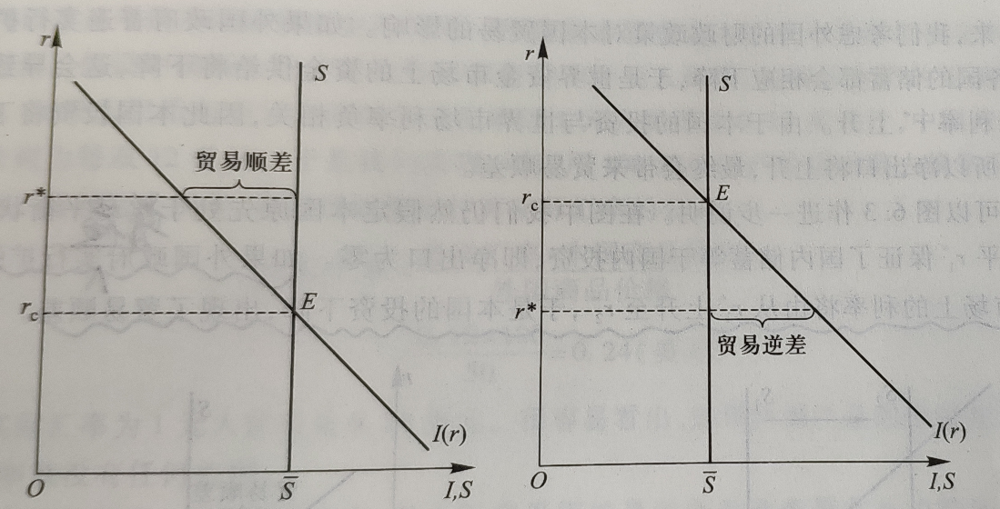

情况一：假定世界市场的均衡利率 $r^*$ 大于封闭经济的均衡利率 $r_c$，如上图 (a) 所示。本国的储蓄大于私人部门的意愿投资。但在开放经济条件下，利率水平由世界市场决定，当本国的储蓄大于私人投资时，多余的储蓄可以流向世界资金市场，形成对外国的投资。

情况二：世界市场的均衡利率小于封闭经济的均衡利率，同理。

也可由 $\bar{S} = I + NX$，推得，当世界市场利率大，对国内投资 $I$ 减少，$NX$ 增加。

##### 宏观政策与贸易

扩张性财政政策 & 紧缩性财政政策

假定本国政府实行扩张性财政政策，这时，政府支出增加，或税收减少，或者两者同时发生。由于 $S = Y - C(Y - T) - G$，都会导致储蓄下降，又由于 $NX = S - I$，因此，储蓄下降又会导致净出口下降，而净出口的持续下降将使一国的贸易收支出现赤字。

如果外国政策普遍实行扩张性政策（货币供给不足，利率增加），还是上图可知，世界市场上的利率上升，于是本国的投资下降，出现贸易逆差。

同理可推外国政策普遍实行紧缩性政策。

#### 汇率与净出口

##### 名义汇率与实际汇率

汇率是本国货币相对于外国货币的价格。

1. 名义汇率是指两国间`货币`的相对价格。
2. 实际汇率是指两国间`商品`的相对价格。

如果用 $e$ 来表示名义汇率，$P$ 表示本国物价水平（以本币计），$P^*$ 表示外国物价水平（以外币计），则实际汇率 $\varepsilon$ 可用下式表示： 

$$
\varepsilon = e \frac{P}{P^*}
$$

##### 实际汇率的决定机制

<u>实际汇率与进出口负相关</u>；根据小国开放经济模型，进出口又必须等于对外净投资，即国民储蓄 $S$ 减去投资 $I$ 后的净值。在小国开放经济中，国民储蓄取决于收入和政府政策；投资则取决于世界资金市场上的均衡的利率水平，两者都认为是事先给定的变量，于是，净出口与对外净投资相等便决定了均衡实际汇率水平。

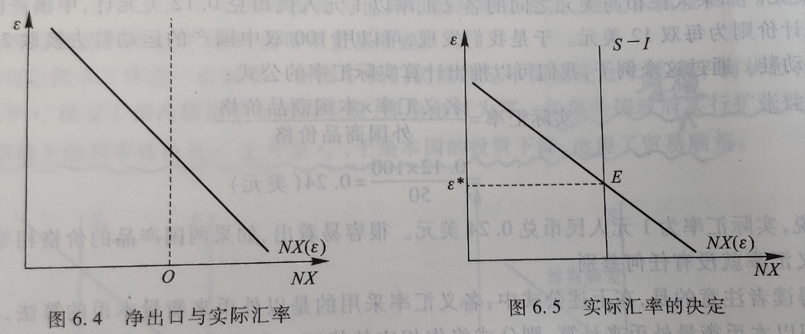

##### 经济政策的影响

如果政府通过增加支出或减税来实施扩张性的财政政策，则本国储蓄将下降，$(S - I)$ 也下降，从而导致实际汇率的上升和净出口的减少。

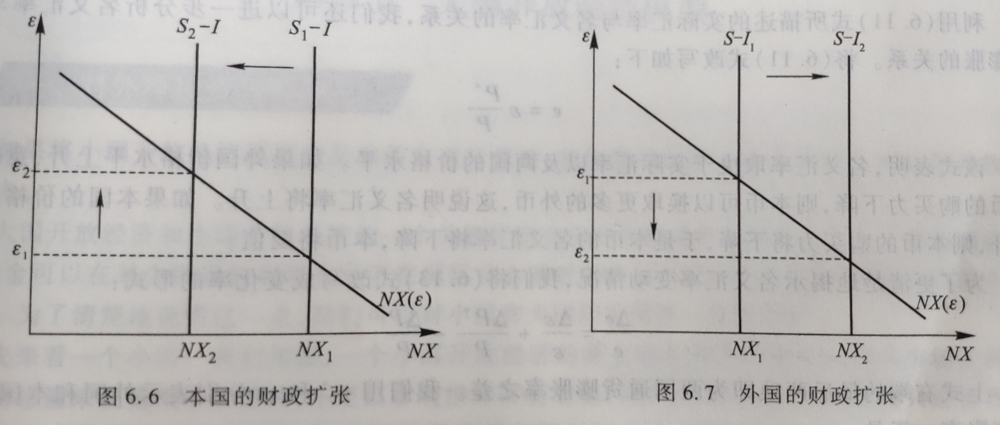

如果<u>外国</u>政府实施扩张性的财政政策，外国政府支出增加或税收减少，将提高世界世行的均衡利率水平，导致本国投资下降，于是出口产品的供给 $(S - I)$ 将增加

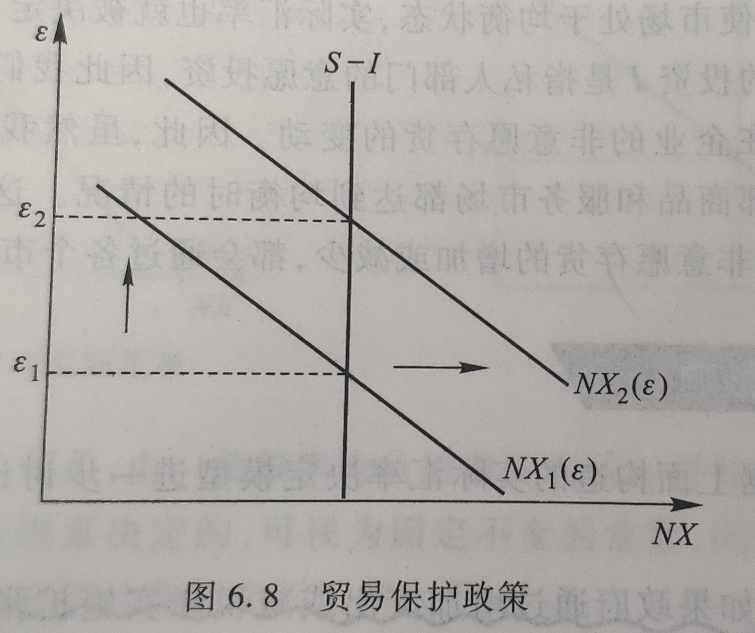

无论是<u>关税壁垒还是进口配额，都会使得净出口水平上升。</u>

从图中，就能得到一个有趣的结论：

`限制进口的贸易保护主义政策并没有增加进出口产品数量。`

这是由于限制进口导致了实际汇率增加 → 本国产品相对价格提高 → 本国出口数量减少，从而抵消了进口的减少。但是限制进口的贸易保护政策会影响一国贸易总额。虽然净出口数量不变，但是一国的进口和出口数量都同比例下降了，所以贸易总额下降了。

##### 名义汇率与通货膨胀

实际汇率 $\varepsilon$ 用下式表示：

$$
\varepsilon = e \frac{P}{P^*}
$$

为了更清楚地揭示名义汇率变动情况，可将上式改写成变化率的形式：

$$
\frac{\Delta e}{e} = \frac{\Delta \varepsilon}{\varepsilon} + \frac{\Delta P^*}{P^*} - \frac{\Delta P}{P}
$$

上式右端的最后两项即为两国同时膨胀率之差。我们用 $\pi^*$ 和 $\pi$ 分别表示外国和本国的通货膨胀率。于是：

$$
\frac{\Delta e}{e} = \frac{\Delta \varepsilon}{\varepsilon} + (\pi^* - \pi)
$$

上式表明，名义汇率的变化率等于实际汇率的变化率加上两国通货膨胀率之差。

通过以上分析，我们可以发现货币政策对名义汇率的影响。<u>在开放经济条件下，通货膨胀率的上升还将进一步导致本币的贬值</u>。因此，一国货币供给量的增加不仅会导致本国物价的普遍上涨，也是的本币衡量的外国货币的价格上升。

现在，我们可以将效果开放经济中不同经济政策对各种变重的影响总结在下表中：

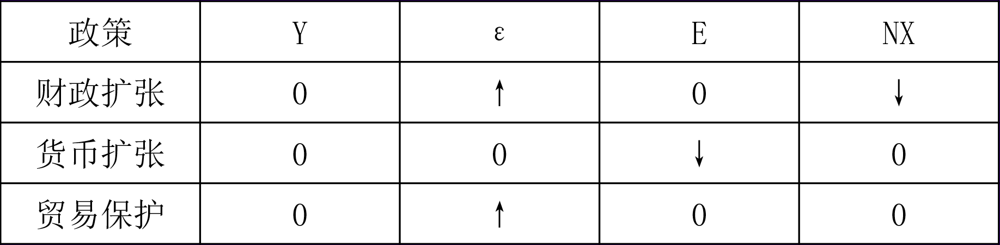

#### 大国开放经济模型

##### 对我净投资与利率

如果将小国开放经济模型的某些假定进行修改，我们就可以把上述分析推广到大国开放经济中去。

<u>大国开放经济和小国开放经济的一个关键区别在于对外净投资和利率的关系</u>。在小国开放经济中，利率是固定的，资本可以在国际间自由流动，因此小国在开放经济模型也称为`资本完全流动模型`；而在大国开放经济中，资本国际间流动会带来利率的变化，不能完全自由，因此大国开放经济模型也称为`资本不完全流动模型`。

##### 大国开放经济模型

与小国开放经济模型的分析类似，我们需要考察两个市场的的均衡情况：可贷资金市场和净出口商品市场。前者与利率的决定有关，后者则与汇率的决定相联系。

在可贷资金市场上，均衡可以用下式来表示：

$$
S = I + NFI
$$

上式可以改写为：

$$
\bar{S} = I(r) + NFI(r)
$$

在净出口商品市场上，国民收入账户的会计恒等式为：

$$
NX = S - I
$$

上式可以改写为：

$$
NX(\varepsilon) = NFI
$$

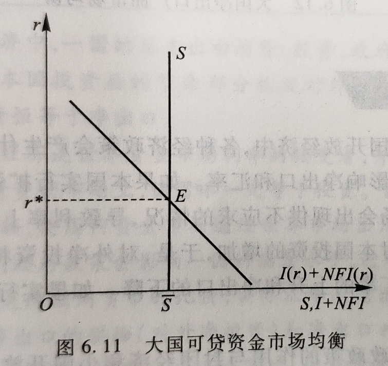

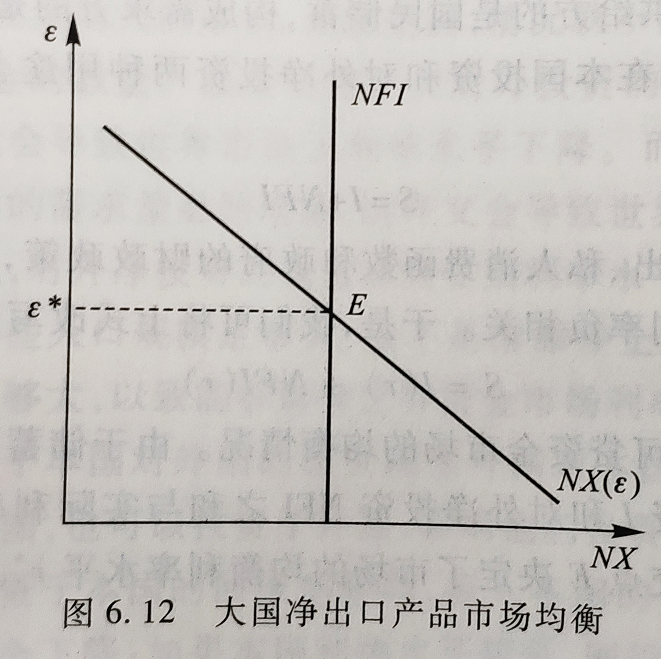

由于储蓄 $S$ 利率不相关，所以在图中用一条垂直线表示。国内投资 $I$ 和对外净投资 $NFI$ 之和与实际利率负相关，可用一条向右下倾斜的曲线表示。两条曲线的交点 $E$ 决定了市场的均衡利率水平 $r^*$。

图中向下倾斜的 $NX$ 曲线与垂直的 $NFI$ 曲线决定了均衡的实际利率水平 $\varepsilon^*$。

##### 经济政策效果

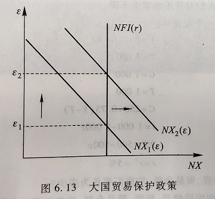

在封闭经济中，储蓄的下降导致投资的同比例下降，财政政策挤出了私人投资；在小国开放经济中，投资由世界市场上的利率水平决定在一个常数上，储蓄的下降导致净出口的同比例下降。而在大国的开放经济中，储蓄的下降同时导致国内私人投资的下降和净出口的下降。

本国货币政策仍然是中性的。限制进口的贸易保护政策对大国开放经济与小国开放经济的作用是类似的。

## 总需求与总供给

#### 总需求曲线

##### 总需求和总需求曲线

总需求是指社会在一定价格水平下所愿意购买的产品和服务的总量，也就在对实际国内生产总值（GDP）的需求。

按照总需求的定义，用 AD 代表总需求，总需求由以下四个部分构成：

$$
AD = C + I + G + NX
$$

$C$ 代表消费需求，是指国内居民对产品和服务的需求；$I$ 代表投资需求，是指企业购买资本品的需求；$G$ 表示政府需求，是指政府采购产品和服务的需求，$NX$ 代表净出口需求，是指外国购买本国产品的服务的净需求。

用纵轴代表一个经济总价格水平 $P$，用横轴代表总产量 $Y$，用 $AD$ 代表总需求曲线，就可以画出一条表示总价格水平和总需求量之间关系的总需求曲线。

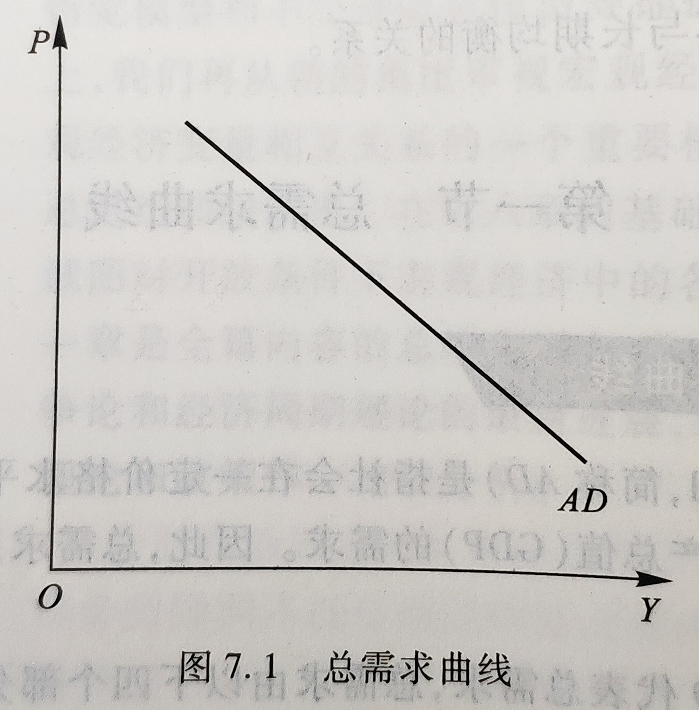

总需曲线：从图中可以看到，总需求曲线向右下方倾斜，表示随着价格水平的提高，人们愿意购买的产品和服务的总量不断下降；而随着价格水平的下降，人们愿意购买的产品和服务的总量不断上升。

总需求曲线向下倾斜主要取决于下列三个因素：

1. 财富效应
2. 利率效应
3. 开放效应

##### 总需求曲线的变动

1. 预期：

预期包括预期收入、预期利润率、预期通货膨胀等。

预期未来收入提高时会增加当前的个人消费需求，从而使总需求曲线右移。反之左移。

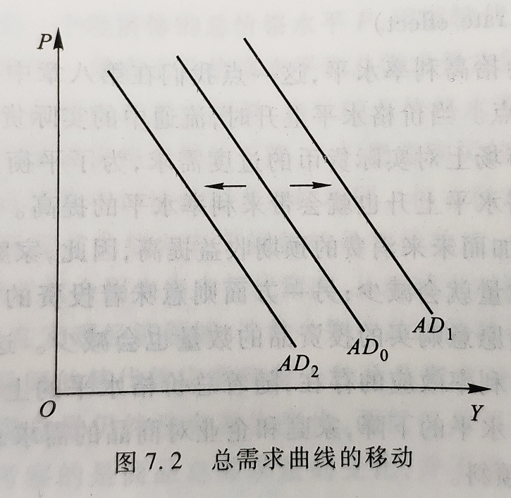

2. 政府政策

按照对总需求的不同作用，宏观经济政策可分为：

- 扩张性政策：增加政府支出、降低税收的财政政策会直接扩大总需求，使总需求曲线向右移动；扩大货币供应量、降低利率水平的货币政策会增加总需求，使总需求曲线向右移动。
- 紧缩性政策：减少政府支出、提高税收的财政政策会直接抑制总需求，使总需求曲线向左移动；缩小货币供应量、提高利率水平的货币政策会抑制总需求，使总需求曲线向左移动。

3. 世界经济

- 利率的变动：`汇率上升`意味着本国商品的相对价格上升，外国商品相对价格下降，本国人将扩大对进口的需求而外国人将减少对出口的需求，于是，`本国净出口将减少，总需求下降`，总需求曲线向左移动；汇率下降的作业相反。
- 外国收入的变动：`外国收入增加`会扩大对本国商品的需求，在进口不变的情况下`增加净出口需求，总需求上升`，总需求曲线向右移动，反之则相反。

#### 总供给曲线

总供给是指在任一价格水平下，企业所愿意提供的产品和服务的总量，因此，总供给曲线反映了价格水平和总供给量之间的关系。

1. 古典总供给曲线（垂直线）
2. 一般总供给曲线（向右上方倾斜）
3. 凯恩斯总供给曲线（水平）

##### 长期总供给曲线（LAS 古典总供给曲线）

垂直的长期总供给曲线表示了一个社会长期总产出 $\bar{Y}$ 不受价格变动的影响，而是由技术进步和资本、劳动等要素投入数量决定。（$\bar{Y}$ ：充分就业下的总产出水平）

由于生产要素都得到了充分利用，因此，在长期总供给水平上失业率等于自然失业率。（除了技术进步，不会受价格的影响）

在充分就业下，劳动等生产要素得到充分利用，总产出不随价格的变化而变化，工资与价格可充分调整，工资与价格同比例变动。

假定政府采取增加货币供应量的扩张性货币政策，使总需求曲线由 $AD_0$ 移动至 $AD_1$，相应的均衡点变为 $B$，价格水平从 $P_0$ 上升到 $P_1$ 而总产出 $\bar{Y}$ 仍然保持不变。

##### 短期总供给曲线（SAS 一般、凯恩斯总供给曲线）

凯恩斯总供给曲线：

工资具有绝对刚性，货币工资不会轻易变动，此时存在大量的失业人口生产能力（可能由于工会等原因，导致工资一直处于最低工资线）在既定的价格水平下，厂商愿意供给社会所需求的任何数量，即在现行工资水平下，厂商获得任意数量劳动力，若其提高价格，其他厂商可用原有价格提供足够的产量。

一般总供给曲线：

工资可适当调整，但相对价格变动存在滞后，即对价格上升不敏感，当价格上升时，企业利润增加，企业会扩大再生产，社会总产出增加。

##### 总供给曲线的变动

1. 长期总供给曲线的变动

人口和资本存量增加以及技术基本都会增加总供给。

长期总供给的增加意味着与之对应短期总供给也会增加。

2. 短期总供给曲线的变动

我们假定工会的成立增强了工人集体谈判的能力，使工人的工资水平上升。这样在产品价格不变的情况下企业利润会减少，因此企业会减少总产量，使短期总供给曲线向上移动。

值得注意的是，成本上升并不会造成一个社会人口和资本存量的变化，也不会改变当前技术状况，因此长期总供给曲线并不会发生变化。

#### 宏观总量的短期均衡

##### 短期均衡与经济波动

总需求曲线 $AD$ 和短期总供给曲线 $SAS$ 在 $E$ 点相交，此时，从短期来看，社会总需求量正好等于总供给量。

此时决定的均衡价格水平是 $P^*$，均衡总产量是 $Y^*$。

1. 失业均衡

失业均衡是指短期均衡产量低于长期潜在产量的均衡状态。

2. 充分就业均衡

充分就业均衡是指短期均衡产量正好等于长期潜在产量的均衡状态。

3. 超充分就业均衡（经济过热）

超充分就业均衡是指短期均衡产量大于长期潜在产量的均衡状态。

一个经济体可能出现哪种短期均衡状态不是一个随机的过程，而是由三种均衡状态依次不断转化构成的有一定规律的过程。

##### 总需求冲击

假定政府认为目前经济可能要转入衰退阶段，决定增加货币供应量以「刺激」经济。货币供应量的增加会扩大总需求，使总需求曲线向右移动。

通过以上的分析我们可以发现，正向的总需求冲击在长期内并不能改变社会的潜在产出，而只会提高价格水平，带来通货膨胀。

##### 总供给冲击

最典型的也是最具影响力的总供给冲击来自 20 世纪 70 年代初期石油输出国组织的限产提价政策。在这一政策支配下，世界石油市场的石油供给急剧减少，油价大幅度上涨，如 1971—1974 年间石油的实际价格上涨了四倍，从而导致了企业成本增加，使短期总供给曲线向左移动。

现在假设石油价格突然上涨，短期总供给曲线由 $SAS_0$ 移动到 $SAS_1$，短期均衡点从 $A$ 点移动到 $B$ 点，相应的均衡价格水平和均衡总产量分别变为 $P_1$ 和 $Y_1$。$B$ 点和 $A$ 点相比，价格水平上升，实际产出下降，失业率要大于自然率，整个社会处在失业均衡状态。这种通货膨胀与经济衰退并存的现象也称为「滞胀」。

政策制定者面临由于总供给波动而引起的滞涨时，一般有两种选择：

1. 选择是保持总需求曲线不变，等待市场机制进行调节
2. 扩大总需求，这样，经济可以避免长期衰退的痛苦，但必须付出通货膨胀的代价。

## 总需求理论

#### 国民收入的决定

##### 计划支出线

又叫意愿支出线、计划需求线、意愿需求线

一个社会中家庭、企业和政府所愿意购买的产品和服务的总量定义意愿或计划总支出，并用 $E$ 来表示，那么 $E$ 有三个部分构成：

$$
E = C + I + G
$$

消费 $C$ 是可支配收入 $(Y - T)$ 的函数，其中 $Y$ 代表收入，$T$ 代表税收：

$$
C = C(Y - T)
$$

为了简化分析，假定政府税收 $T$ 为零，消费函数可以用如下的线性方程表示：

$$
C = a + bY
$$

其中 $a$ 为自生消费，$b$ 为边际消费倾向。这样，计划支出 $E$ 可以进一步表示为：

$$
E = a + bY + I + G
$$

自生消费 $a$、投资 $I$ 和政府购买 $C$ 都与收入变动无关，它们属于自生支出，用 $A$ 来表示：

$$
A = a + I + G
$$

$bY$ 是随着收入增加而增加的支出，因此属于派生支出，用 $eY$ 来表示，$e$ 代表边际支出倾向，表示每增加一单位收入所增加的支出，即：

$$
e = \frac{dE}{dY}
$$

又可以表示为：

$$
E = (a + I + G) + bY \\
或者：E = A + eY
$$

这表明计划总支出由自生支出 $A$ 和派生支出 $eY$ 两个部分组成。

##### 国民收入的决定理论

在图上做一条 45° 线，此线上每一点都代表计划支出 $E$ 和实际支出 $Y$ 相等。

当实际支出为 $Y_1$ 小于均衡的支出 $Y_2$ 时，计划支出线 $E$ 在 45° 线的上方，表明此时计划支出大于实际支出，也就是说，人们愿意购买的商品数量要大于企业在正常情况下提供的商品数量，在这种情况下，企业会选择增加雇员，扩大产量的做法，使实际存货回到计划的水平。

##### 收入和支出的变动

在这里，我们假定政府购买增加使自生支出增加。

当政府购买增加 $\Delta G$ 以后，计划支出线由 $E_0$ 向上平行移动 $\Delta G$ 单位至 $E_1$，在新的均衡点 $B$ 点处，均衡国民收入也随之增加。

自生支出的增加对于总收入的扩张具有成倍的放大效应，我们把这种放大效应叫做自生支出乘数，用 $k$ 来表示：

$$
k = \frac{\Delta Y}{\Delta A}
$$

自生支出乘数也表现为政府购买乘数：

$$
k = \frac{\Delta Y}{\Delta A} = \frac{\Delta Y}{\Delta G}
$$

假定边际支出倾向 $e = 0.5$，政府购买一次性增加了 100 万元，我们考察这个额外增加的 100 万元对总收入的影响。首先，随着 100 万元的政府购买的投入，总支出直接增加了 100 万元，即人们的总收入也增加了 100 万元，在收入水平增加的情况下，由于边际支出倾向 $e = 0.5$，消费也将增加 50 万元，同时总支出或总收入也增加了 50 万元.....

所以：

$$
\Delta Y = \Delta G + e \times \Delta G + e^2 \times \Delta G + \ldots + e^n \times \Delta G
$$

设 $n \to \infty$，利用简单的等比数列求和公式和求极限原理，既可以计算出：

$$
k = \frac{1}{1 - e}
$$

乘数效应表明，在总需求不足的情况下，政府只需启动微小的政策变量，就可以对总需求的扩张产生较大的影响。

入股我们再引进税收 $T$，那么计划总支出为：

$$
E = C(Y - T) + I + G
$$

假定政府统一指征收比例税，即 $T = t \cdot Y$，其中 $t$ 为边际税率，即每增加一单位收入所增加的税收，上式可写成：

$$
E = C(Y - t \cdot Y) + I + G
$$

再假定消费函数是线性消费函数，则有：

$$
e = \frac{dE}{dY} = b(1 - t)
$$

边际支出倾向与边际消费倾向 $b$ 成正方向变化，而与税率 $t$ 成反方向变化。

这表明，在自生支出不变的情况下，税率的降低加大了边际支出倾向，从而导致了均衡的国民收入的增加。

#### 利率的决定

##### 货币的需求

`凯恩斯`理论认为，人们持有货币是由流动性偏好决定的。所谓流动性就是指持有货币在交易过程中的便利性，而人们愿意持有货币以保持这种便利性的倾向，就被称作流动性偏好。

流动性偏好产生的原因归结于人们的三个动机：

1. 交易动机：是指人们持有一定数量货币的目的是为了日常交易（与收入水平 $Y$ 相关）
2. 预防动机：预防动机是指人们为了应付意外事件而持有一定数量的货币（也与收入水平 $Y$ 相关）
3. 投机动机：投机动机是指人们持有货币是为了在证券市场上进行投机，利率 $r$ 则是持有货币的机会成本（此动机与利率 $r$ 负相关）

货币的需求函数可表达为：

$$
\left(\frac{M}{P}\right)^d = L(r, Y)
$$

如果我们假定收入不变 $Y = \bar{Y}$，横轴表示实际货币数量，纵轴表示实际利率水平，货币需求曲线 $MD$ 向右下倾斜。

##### 货币的供给

货币供给量 $M$ 是外生决定的，它是中央银行所独立控制的政策变量，因此，货币供给函数 $(M / P)^s$ 如下：

$$
\left(\frac{M}{P}\right)^s = \frac{\bar{M}}{P}
$$

$\bar{M}$ 表示由中央银行控制的现在货币数量。

货币的供给曲线 $MS$ 在图中就是一条与横轴垂直的直线，表示货币供给的数量与利率的高低无关。

##### 利率水平的决定

把货币需求曲线 $MD$ 和货币供给曲线 $MS$ 结合起来，就可以得到货币市场的均衡。

##### 利率传导机制

货币供给量的增加，会使利率水平下降，从而导致投资的增加，最终引起收入的上升，这被称作为「利率的传导机制」。

在计划总支出 $E$ 中再配上投资函数，即：

$$
E = C(Y - T) + I(r) + G
$$

计划总支出不仅是收入 $Y$ 的函数，而且也是利率的函数，$I = I(r)$。于是，就可以考察利率的货币传导机制。

中央银行扩大货币供给量 → 投资水平上升 → 计划支出线上升。

这样，整个经济就完成了利率传导机制的一个过程，通过利率的传导，扩张性的货币政策带来了均衡国民收入的增加。

### IS - LM 模型

也叫做二市场均衡模型：产品市场均衡（IS），货币市场均衡（LM）

#### 产品市场均衡 IS

假设条件：市场封闭

均衡条件：$Y_d = Y_s \Rightarrow$ 总支出 = 总收入

$C + I + G = C + T + S$

1. 三部门情况：$S + T = I +G$
2. 二部分情况：$S = I$

##### 推导

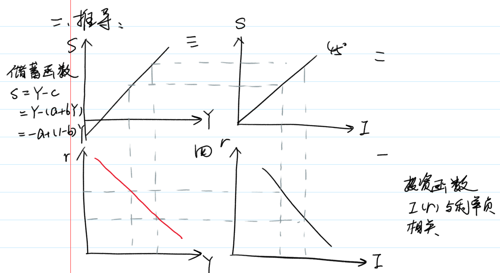

在保证市场均衡的条件下，IS 曲线上的每一点表现为利率与收入的组合，两者呈负相关关系（在二部门条件下）

例如：

$$
I = 1250 - 150r \\
S = -500 + 0.5Y
I = S \Rightarrow r - Y 的方程
$$

##### IS 曲线的斜率，影响因素有哪些

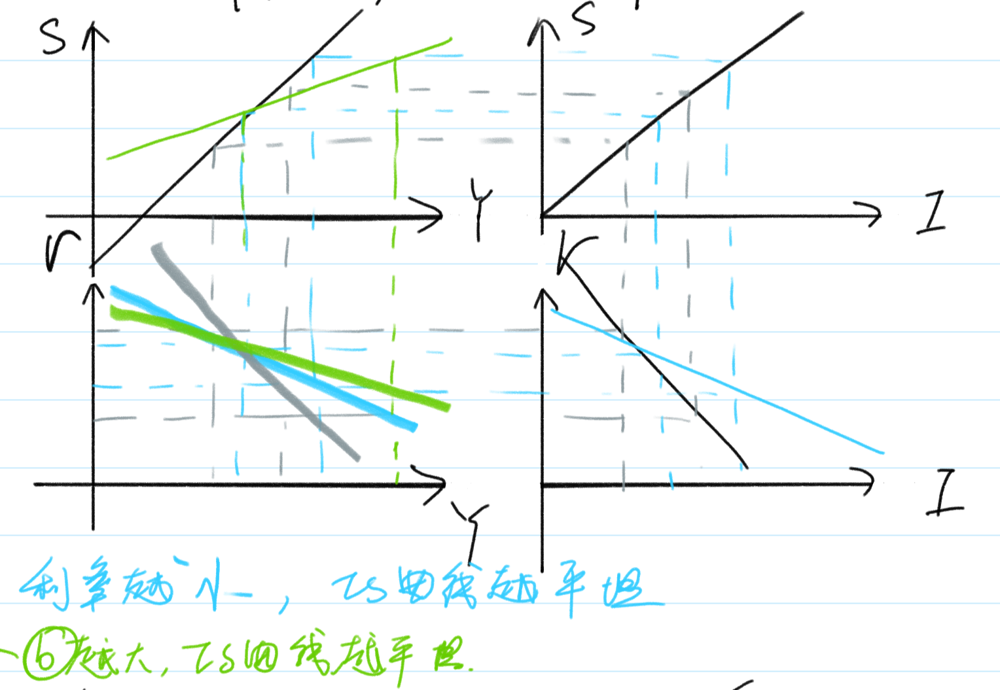

利率较小的变动，需求有较大的变动，与之相配合才能使产品市场均衡。

##### IS 曲线的移动

二部门：

1. 技术创新的产生、企业家预期提高，在利润既定的情况下，投资曲线向右移动，同时 IS 曲线向右移动。
2. 更节俭，储蓄意愿增加，储蓄曲线（三象限）向左移动，同时导致 IS 曲线向左移动。

三部门：

$$
Y = C + I + G = a + b(Y - T) + I + G \\
I = e - dr \\
Y = a + b(Y - T) + e - dr + G \\
Y = \frac{\bar{a} + \bar{e} + G - \bar{bT}}{1 - b} - \frac{\bar{dr}}{1 - b} \\
\Delta Y = \frac{1}{1- b} \Delta G \\（政府采购乘数效应，在投资不变情况下）
$$
结论：$G$ 增加，$Y$ 也增加，扩张性财政政策使 IS 曲线向右移动。

同理：在投资不变的情况下， 政府购买既定：

$$
\Delta Y = -\frac{b}{1- b}\Delta T
$$

税收的乘数效应。

结论：$T$ 增加，$Y$ 减少，IS 曲线向左移动，紧缩性财政政策使 IS 曲线向左移动。

#### 货币市场均衡 LM

##### 货币市场的均衡条件：

$$
货币供给 = 货币需求 \\
M_s = M_d \\
M_d 受到交易动机（Y），预防动机（Y），投资动机影响（r）（投资与利率负相关） \\
$$

##### LM 曲线的推导

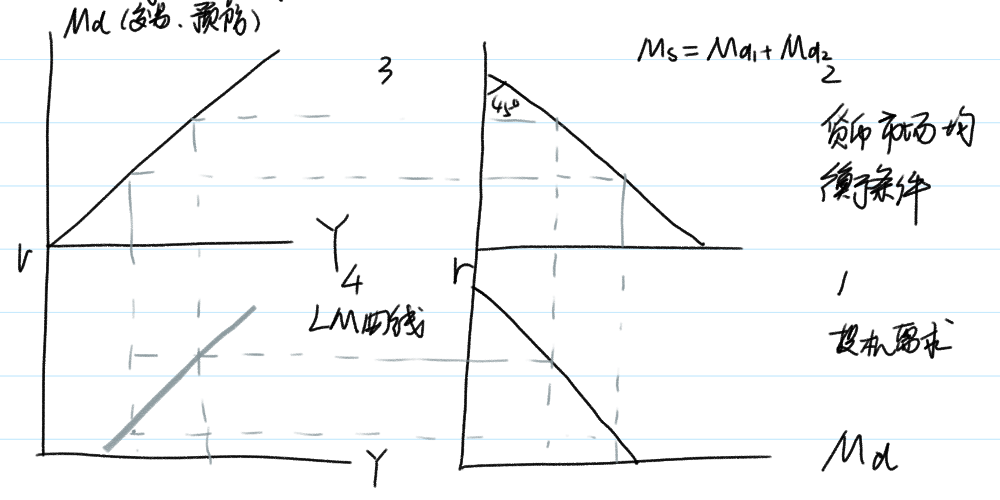

LM 曲线的定义：满足货币市场均衡条件时，LM 曲线上的点表达为国民收入与利率的组合，两者呈正相关系。

1. 投资需求平坦 → LM 平坦
2. 交易，预防需求平坦 → LM 平坦

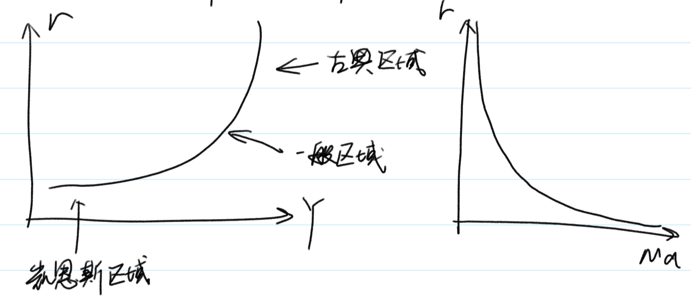

1. 凯恩斯区域又被称为凯恩斯陷阱，当 $r$ 降至很低时，货币的投资需求趋向于无限大，对应 LM 为水平状态区域。
2. 当 $r$ 很高时，货币的投资需求趋向于零，对应的 LM 曲线为垂直区域。
3. 两者之间为中间区域或一般区域

##### LM 曲线的移动

1. 投资需求曲线右移 → LM 左移
2. 交易、预防需求曲线右移 → LM 右移
3. 货币供给右移 → LM 右移

#### IS - LM 均衡

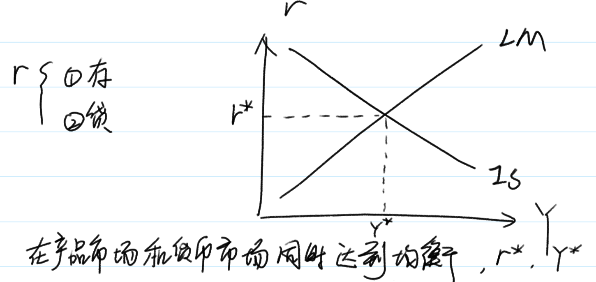

IS - LM 曲线均衡时，不一定是充分就业水平，仅靠市场自发调节无法达到目标，需要国家靠财政政策或货币政策来调节。

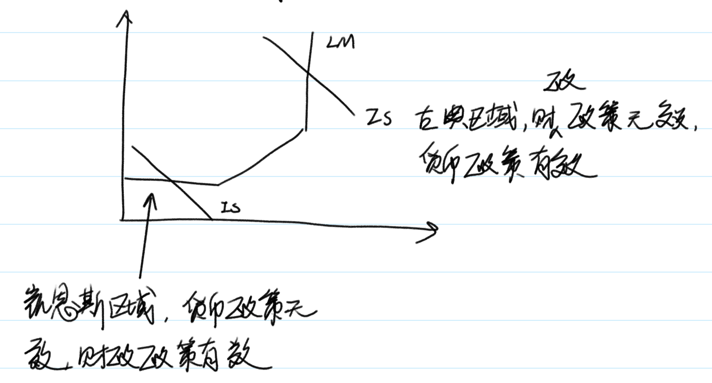

### 菲利普斯曲线

#### PC 线的提出（菲利普斯曲线的提出）& 修正

$$
\frac{W}{P} = MP_L
$$

修正公式：通胀率 = 货币工资增长率 - 劳动增长率（不是劳动生产率的增长率）

$$
lnW - lnP = lnMP_L \\
\frac{dW}{W} - \frac{dMP_L}{MP_L} = \frac{dP}{P}
$$

则有：

$$
\pi = -\beta(u - u_n) \\
（u 为实际失业率，u_n 为自然失业率，n = nature）
$$

#### PC 线的经济学推导

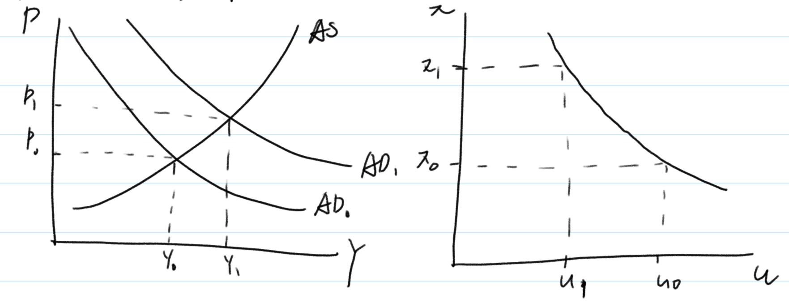

#### PC 线的政策含义

1. 若 $\pi$ 与 $u$ 组合落在安全区域，无需采取政策；
2. 若 $u$ 超过临界点，采取扩张性政策，$\pi \uparrow，u \downarrow$；
3. 若 $\pi$ 超过临界点，采取紧缩性政策，$\pi \downarrow，u \uparrow$；

#### 附加预期的 PC

$$
\pi = \pi_e - \beta(u - u_n)\\
\pi = \pi_e \Rightarrow u = u_0
$$

弗里曼德指数，PC 线忽略了工资变动的重要因素，即对通货膨胀的预期，人们关注的不是名义工资，而是实际工资，针对新一轮的通货膨胀，会进行预期并根据预期的通货膨胀，调整名义工资。

#### 通货膨胀产生的原因

1. 需求拉动型通货膨胀：
   1. 需求拉动不一定会带来通货膨胀，在 $AS$ 为凯恩斯总供给曲线时，总需求增加，只引起产出增加，不引起通货膨胀；
   2. 在 $AS$ 为古典总供给曲线时，总需求增加，只带来通会膨胀，不增加产出；
   3. 在 $AS$ 为一般总供给曲线时，总需求增加，既带来通会膨胀，产出也增加。
2. 成本推动型通货膨胀：供给方面成本的提高所引起的通货膨胀
3. 结构性的通货膨胀

$$
\begin{matrix}
& 通货膨胀 &= &货币工资增长率 &- &产增率 \\
&A \; 厂商 & &3.5\% & &3.5\% \\
&B \; 厂商 & &3.5\% & &0.5\% \\
&总通货膨胀率 &= &3.5\% &- &2\%  &= 1.5\%
\end{matrix}
$$

- 在没有需求和成本的推动下，由于经济结构因素变动形成的通货膨胀称为结构性通货膨胀；
- 一些部门生产率提高快，另一些部门慢，慢的部门需求公平，结果导致通货膨胀

#### 长期的 PC 线

1. 假定经济处于自然失业率 $u^*$，若政府采取扩张性政策，使通胀率提高，则失业率由 $u^*$ 下降到 $u$，这种情况是短期的，长期看，人们会调整通胀预期，失业率回到原来的 $u^*$。
2. 长期 PC 垂直，不存在失业与通胀的替换关系，适用扩张性政策，不能降低失业率，还会使通胀上升。