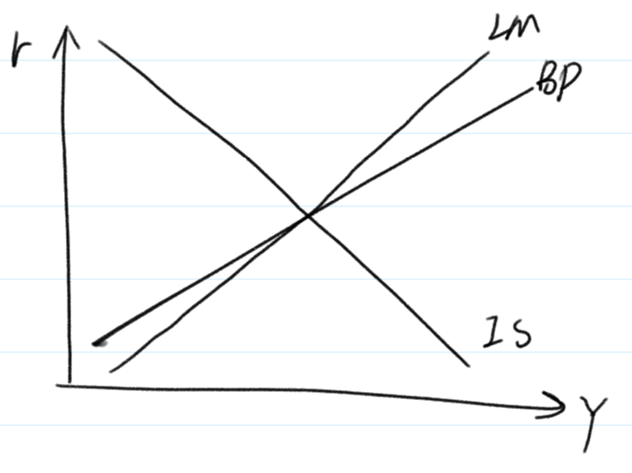

宏观经济学 4
笔记 | 经济学
宏观经济学，是指用国民收入、经济整体的投资和消费等总体性的统计概念来分析经济运行规律的一个经济学领域。宏观经济学是相对于古典的微观经济学而言的。 宏观经济学是约翰·梅纳德·凯恩斯的《就业、利息和货币通论》发表以来快速发展起来的一个经济学分支。
2018-10-8

[宏观经济学 3](blog.php?id=36)

## 开放经济的短期均衡

#### 蒙代尔 - 弗莱明模型

1. 与 IS - LM 模型银行，<u>假定价格在短期内是不变的，经济中的产出完全由总需求决定</u>。
2. 假定货币是非中性的，人们持有货币不仅有交易性动机，而且还有预防性和投机性的动机。货币的需求不仅与收入正相关，而且与实际利率负相关。
3. 假定商品和资本国际间完全自由流动，因此，国内的利率与世界市场上利率是一致的。

根据假设，得到三个方程：

$$
Y = C(Y - T) + I(r) + G + NX(e) \\
\frac{M}{P} = L(r, Y) \\
r = r^*
$$

得到收入和汇率的关系，向右下方倾斜的 IS 曲线。

考察效果开放经济中的 IS-LM 模型，如图：

由于小国开放经济的利润为常数，汇率取代了利率成为影响国民收入的变量，这与封闭经济条件下的 IS-LM 模型不同。还值得注意的是，坐标系的纵轴是名义汇率 $e$，而不是实际利率 $r$。

产品市场均衡时，收入 $Y$ 和名义汇率 $e$ 之间的关系，$IS$ 曲线时一条向右下倾斜的曲线，$IS$ 曲线之所以向右下倾斜，是由于净出口与汇率负相关。由于使货币市场达到均衡的收入水平与名义汇率没有关系，因此 $LM$ 曲线为一垂直线。于是，在小国开放经济条件下，均衡的名义汇率 $e^*$ 和收入水平 $Y^*$ 由两条曲线的交点 $E$ 决定。

#### 小国开放经济

##### 汇率制度

开放经济中的经济政策作用结果与汇率制度密切相关。

分类：浮动汇率 & 固定汇率

##### 浮动汇率的政策效果

1. 财政政策：

假设政府为了刺激国内总需求，采取了**增加政府支出**和减税的政策，这样必然导致 IS 曲线向右移动。结果是汇率上升，产出并不增加。

我们发现，在采取浮动汇率制的小国开放经济中，旨在刺激需求的财政扩张不能导致产出的增加和收入的上升。

2. 货币政策：

扩张性的货币政策意味着中央银行将增加货币供给。货币供给的增加将导致 LM 曲线右移，这将使名义汇率下降，收入增加。

可以推出，紧缩性财政政策将导致名义汇率上升，净出口下降，以及产出的减少。

3. 贸易政策：

限制进口会使得任一汇率水平下，净出口较以前增加。这意味着净出口曲线将向右移动。

由此看出，贸易政策的最终结果将导致汇率的上升，而产出并不会增加。

##### 固定汇率的政策效果

1. 财政政策：

当政府实行扩张性的财政政策时，政府支出的增加或税收的减少都会引起总需求的扩张，体现在图中就是 IS 曲线右移，会使名义汇率面临上升的压力，于是中央银行会在外汇市场上抛出本币，购入外币。中央银行稳定汇率的行动将会使货币供给增加。

体现在图中就是 LM 曲线不断右移，产出增加。因此，在固定汇率制度下，扩张性的财政政策将使小国开放经济的产出增加。这同浮动汇率下所导致的汇率上升，产出不变的结果是完全相同的。

2. 货币政策：

假设中央银行想实行紧缩性的货币政策以控制通货膨胀，那么中央银行利用公开市场操作这一政策工具，在政策债券市场上抛出债务，回收货币。

然而这一紧缩性货币的行为将会使 LM 曲线向左移动，使名义汇率面临上升压力。为了维持固定汇率制度，中央银行不得不在外汇市场抛售本币，购入外币。于是中央银行在债券市场上回收的货币又通过外汇市场释放了出来，而且二者在数量上必须相等。结果是 LM 曲线逐步右移，最后又回到原先的地方，经济中的货币数量不变。因此，旨在调控总需求的货币政策在固定汇率制度下式无效的。

3. 贸易政策

考虑政府通过关税和进口配合来限制进口，这将使任一汇率水平下的进出口都交易前有所增加。

于是进出口曲线右移，IS 曲线右移，名义汇率面临上升的压力，为了将名义汇率稳定在既定水平上，中央银行必须相应地在外汇市场上抛出本币，这导致 LM 曲线也随之右移，知道均衡汇率稳定在固定水平 $e^*$。这时，产出水平增加，增加的这部分来自进出口的增加。

总结：

#### 利率差异与价格变动

##### 利率差异

国际间的利率水平存在着差异，而利率水平的这种差异是由风险程度不同造成的。

1. 国家风险：政治经济文化环境不尽相同，投资者对不同国家掌握的信息也不同。
2. 汇率风险：预期货币名义汇率将发生变动，影响投资

由于投资与各种货币资金市场所需要的期望收益率应该是相同的，因此对于那些风险高的货币所要求的收益率就应该高一些。

为了使模型跟符合现实情况，我们在蒙代尔-弗莱明模型中考虑风险因素。我们将国际间的利率差异用下式表示：

$$
r = r^* + \theta
$$

其中，$r$ 是本国利率， $r^*$ 是世界资金市场利率，$\theta$ 是风险贴水系数。
将上式代入蒙代尔-弗莱明模型中产品市场均衡和货币市场均衡，可以得到带有风险系数的 IS、LM 方程：

$$
IS: Y = C(Y - T) + G + I(r^* + \theta) + NX(e) \\
LM: M / P = L(r^* + \theta, Y)
$$

给定该国的风险水平、财政政策、货币政策和贸易政策，我们可以计算出时商品市场和货币市场同时达到均衡时的产品水平和名义汇率。

如果其他外生变量不变，一国风险增加，本国利率上升。利率的上升将使投资下降，于是使产品市场均衡的产出 $Y$ 将下降，这表现为图中 IS 曲线左移。利率上升同时又会使维持货币市场均衡的产出水平上升，这意味着 LM 曲线右移。

这样，本国风险增加，将会导致产出增加和名义汇率的下降。这是因为，尽管利率上升使投资下降，但名义汇率大幅度贬值使出口大大增加，不仅抵消了下降的负效应，而且使实际产出增加。

由此可以得出一个有意思的结论：汇率预期具有「自证」的特点。

##### 价格变动

当价格可以变化的时候，实际汇率就不再是名义汇率的一个固定比例了，因此描述商品市场均衡的返程中进出口应该写成是实际汇率 $\varepsilon$ 的函数，而不再是名义汇率 $e$ 的函数。于是蒙代尔-弗莱明模型变为：

$$
IS: Y = C(Y - T) + G + I(r^*) + NX(\varepsilon) \\
LM: M / P = L(r^*, Y)
$$

如果允许价格的变动，我们就可以从蒙代尔-弗莱明模型中推导出总需求曲线。上图显示了需求曲线的推导过程。

图中，纵坐标不是名义汇率而是实际汇率。价格下降，实际货币余额增加，利率由世界市场给定，因此使货币市场均衡的产出水平必须增加，这意味着 LM 曲线右移，IS 不随价格下降发生变动，因此，价格下降导致产出增加和实际汇率下降。

将价格与产出的对应关系画到收入和价格的坐标系中，价格下降，收入上升，得到一条向右下倾斜的总需求曲线。

图中 A 是短期均衡点，E 是长期均衡点。长期的总供给曲线就是产出等于潜在产出的一条垂线。长期均衡点就是这条垂线和总需求曲线 AD 的交点 E。假定短期中价格固定不变，短期的总供给曲线 SAS 是一条水平线。短期均衡点就是这条水平线和总需求曲线的交点 A。

在图中，短期均衡点 A 在长期均衡点 E 左边，说明这时产出没有达到经济的潜在水平，存在着劳动投入要素的失业以及资本投入要素的闲置。需求不足使得价格水平难以在长期中保持不变，于是价格水平开始下降，LM 曲线右移，实际汇率下降，净出口增加，产出增加。短期均衡点将沿着总需求曲线 AD 向右下方不断移动，直到达到长期均衡点 E 为止。

#### 大国开放经济

IS 方程（产品市场）$Y = C(Y - T) + I(r) + G +NX(e)$

LM 方程（货币市场）$M/P= L(r, Y)$

国际收支平衡：$NX = NFI$（BP 线）

国际收支的顺逆差：一国一年对外经济往来的收入大于支出，叫做顺差，反之为逆差（NX > NFI）

题外话：

格兰杰因果检验：

$$
Y \uparrow \; \underleftrightarrow{双向} \; X \uparrow
$$

统计结果表明：收入不影响出口，但影响进口，国民收入上带来净出口的下降。

BP线：在国际收支平衡的条件下：$Y$ 与 $r$ 的组合，两者呈相关关系。

如果均衡，BP，IS，LM 线一定交在同一点上。

## 宏观经济政策和理论

### 主动性和被动性政策

#### 政策效果滞后

政策制定者会遇到时滞有三种：

1. 识别时滞
2. 行动时滞
3. 生效时滞

##### 识别时滞

这段用来掌握充分信息，以获取当前经济形式判断并识别经济运行中所出现问题的时间被称为识别时滞。

##### 行动时滞

从认清问题到实施政策之间所需的时间叫做行动时滞。

就<u>财政政策</u>来说，其行动时滞尤其长。

识别时滞和行动时滞加载一起，合称为内部时滞。

##### 生效时滞

与内部时滞相对应的是外部时滞，又称为生效时滞，指一项政策从形成之后到其真正对经济活动产生影响之间所用的时间。

生效时滞更显著地揭示出货币政策的弱点。

#### 宏观经济的不确定性

由于时滞的存在，宏观经济政策要到实施后很久才会起效。这就要求政策制定者能精确地预测将来的经济情况。

所谓<u>领先指标</u>就是一些列领先于经济活动的起伏而波动的数据，领先指标的大幅升降有可能是经济启动或降温的先兆。

大型经济模型是政府机构和一些企业通过计算机设计并运行的数字模型。

#### 卢卡斯批判

卢卡斯认为，传统的政策制定方法没有充分考虑预期对经济政策的作用。人们的预期会对经济政策的变动作出反应，并对经济政策形成反作用，从而抵消经济政策的效果。

每个家庭和每个厂商都会有意识地收集一切与自己的经济活动有关的信息并会对之做出恰如其分的反应。

这一论断又被称为「理性预期」，其核心思想正式人们胡根据经济情况的变化去调整自己的经济行为方式，同时会积极地收集与自身利益相关的信息并加以有效的利用。

### 有规则和无规则

#### 政策制定者的可信度

无规则情况下经济政策滥用的原因：

1. 政策制定者不称职
2. 机会主义的指导思想

##### 政策制定者不称职

1. 由于利益集团之间的权利争夺，政治局势漂泊不定，从而增加了经济政策制定的难度
2. 宏观经济运行本身是一件极其复杂的事情，而作为政治家的政策制定者通常并不具备足够的经济知识已做出正确的判断。
3. 普通的政策机制根本无法将这些经济「庸医」从真正称职的政治学家中剔除出去。

##### 机会主义的指导思想

政策制定中的机会主义行为来源于政策制定者的目标与与公众福利的冲突。（政治经济周期）

#### 时间不一致性

在特定时点上做出的相机抉择尽管在当时有可能是理性选择，但从长期来看却往往适得其反。

在很多情况下， 政策制定者希望以事前的声明来影响个人和企业的预期，进而使他们的行为选择向着政策制定者所希望的目标靠拢。但政策制定者频繁的事后反悔葬送了其事前声明的可信度。

真正有效的政策实际上是一种时间一致的政策，即从一开始就选择一个能实现希望目标的规则并遵循，而不是一个在每个时点都试图进行调整的政策。

#### 货币政策规则

货币主义的代表人物弗里德曼进一步指出，货币供应量的变动是造成经济活动剧烈波动的最阔祸首。要想取得稳定的产出、就业和价格水平，唯一的出路是使货币供应量保持一个稳定而缓慢的增长速率。

由于传导机制的原因，稳定增长的货币供应量并不总能带来稳定的总需求。

较为普遍的观点是，货币政策规则应当允许货币供应对经济活动中的冲击进行适当的调整。

货币政策规则应如何应对经济活动中的冲击：

- 麦卡伦姆规则：价格水平的变动取决于货币当局控制的货币供给量增长率，货币流动速度增长率和实际 GDP 增长率。

该规则源自于：$MV = PY$

- 泰勒规则：货币当局应该在目标通货膨胀率基础上确定一个中央银行的基准利率水平，并按照经济活动的波动情况不断调整这一利率水平。

基准利率水平调整公式：

$$
基准利率 = 目标通胀率 + 2.5\% + \frac{1}{2}（实际通胀率 - 目标通胀率）\\ + \frac{1}{2}（实际 GDP 增长率 - 潜在 GDP 增长率）
$$

#### 财政政策规则

预算平衡策略。政府的支出不得突破税收收入，进而维持财政收支的平衡。

反对预算平衡策略的理由：

1. 首先，预算赤字或盈余可以对稳定经济有所帮助
2. 其次，在税后体系的运作过程中常常会出现对经济施加不当刺激的扭曲，而预算赤字或盈余则可以用来消除这种扭曲。
3. 此外，政府可以借助预算赤字将税收负担从当前居民身上转移到下一代人，这在某些非常时期对维护宏观经济的平稳运行是十分有益的。

#### 经济波动理论的新发展（略）

1. 经济周期理论
2. 实际经济周期理论
3. 新凯恩斯理论

## 消费理论

### 凯恩斯消费理论

凯恩斯消费理论有三个重要的假设。

1. 「边际消费倾向」的假设：所谓边际消费倾向即消费者每多获得的一元钱收入，会用于消费的比例或数量。凯恩斯认为，根据基本的心理规律可以相信，当收入增加的时候人们会增加他们的消费，但消费增加的数量肯定比收入增加的数量要少，即边际消费倾向在 0 到 1 之间。
2. 平均消费倾向的假设：凯恩斯认为消费对收入的比率，即「平均消费倾向」，是随着收入的上升而下降的。
3. 决定消费因素的假设：决定储蓄的基本力量是收入而不是利率，利率在影响储蓄方面的作用不大。

凯恩斯的消费函数被写成：

$$
C = a + BY
$$

随着时间的推移，人们很快发现关于平均消费倾向随收入增加而下降的假设存在着问题。

实证研究结果表明，存在两种消费函数。使用家庭消费的短期时间序列数据，凯恩斯的消费函数得到了很好的证明。而使用家庭消费的长期实践序列数据，消费函数表现出有不变的平均消费倾向，凯恩斯的消费理论不在成立。

长期消费函数的公式：$C = KY$

大量的实证研究表明，长期实践序列的分析中，得到的是具有稳定的平均消费倾向的消费函数形式，亦即没有截距项的线性消费函数。

### 跨期选择理论（费雪）

#### 跨期预算约束

假定**消费者的一生可以分为两个时期**。第一个是青年时期，第二时期是老年时期。

第一时期，储蓄 = 收入 - 消费：

$$
S = Y_1 - C_1
$$

第二期的消费等于改期收入加上第一期的储蓄，以及第一期储蓄赚到的利息，即：

$$
C_2 = Y_2 + (1 + r)S
$$

其中 $r$ 是实际利率。

综合上述两个方程就可以导出该消费者的跨期预算约束：

$$
C_2 = Y_2 + (1 + r)(Y_1 - C_1) \\
整理得：C_1 + \frac{C_2}{1 + r} = Y_1 + \frac{Y_2}{1 + r}
$$

画出消费者跨期预算约束线。

其中 $E$ 点自然是预算约束线上的一点，这是，消费者既不借钱也无储蓄。E 点也往往称为「禀赋点」

#### 消费者偏好

由于消费者当前消费和未来消费都会带来效用，我们就可以用「无差异曲线」来分析跨期选择的时间偏好。

无差异曲线的这种形状代表不同时期的消费具有替代性。无差异曲线上每一点处切线的斜率就是在该消费水平组合上，第一时期消费对第二时期消费的「边际替代率」。（Marginal rate of substitution，简称 MRS）

#### 跨期消费的均衡及其调整

跨期预算约束反映了消费者有支付能力的跨期选择的客观条件，无差异曲线现实了消费者对不同时期消费组合的主观态度，把两者放在一起，我们就可以考察消费者跨期消费的最优选择。

消费者跨期选择的均衡条件为：$1 + r = MRS$

很明显，收入增加，预算曲线和无差异曲线上移。利率改变，预算曲线关于禀赋点选择，无差异曲线平移。

#### 借贷约束

上述跨期消费选择模型，既可以储蓄，也可以借贷，且利率相同。

考虑一种简单的借贷约束，当期消费不能超过当期收入。在上述模型中就是 $C_1 \le Y_1$ 必须成立。

### 生命周期假说

假设一个由工作消费预计可以活 $T$ 年，退休之前能工作 $R$ 年，每年工资收入 $Y$。退休以后不再有任何收入，并且利率为 $0$。该消费者的跨期消费选择为：

$$
C = \frac{RY}{T}
$$

生命周期模型认为**财产在某一时期的家庭消费行为中也起着重要作用**。假设消费者拥有一定数量的财产，平稳消费，用 $A$ 来表示，则上述消费函数可以表达为：

$$
C = \frac{A + RY}{T}
$$

啥价处理，$1 / T$ 记为 $\alpha$，$R / T$ 记为 $\beta$，则变为：

$$
C = \alpha A + \beta Y
$$

其中的 $\beta$ 是收入的边际消费倾向，$\alpha$ 则称为财产的边际消费倾向，分别是消费随着收入和财产变化而改变的边际比率。

由于长期中人们的财产 $A$ 随着收入的增长而一同增长。因此反映消费与收入之间关系的短期消费函数会发生平移。连接 $A$ 和 $B$ 两点，构成了一条长期消费曲线。该曲线的斜率，即平均消费倾向，始终为一常数。

这种长短期消费函数之间的差异，正是产生凯恩斯理论引出的消费之谜的原因。

### 永久收入假说

永久性收入假说考虑了人们的收入变动必然存在不确定性，将人们的收入分成了永久性收入 $Y^P$ 和暂时性收入 $Y^T$ 两个部分，即：

$$
Y = Y^P +Y^T
$$

弗里德曼认为人们的消费行为主要决定于永久性收入 $Y^P$，因为人们通常不喜欢消费水平的大幅波动，而希望消费水平相对稳定，所以会利用储蓄和借贷平衡收入水平的偶然波动，所以，永久性收入假说的消费函数是：

$$
C = \beta Y^P
$$

根据上述消费函数计算得到消费者的平均消费倾向为：

$$
\frac{C}{Y} = \beta \left(\frac{Y^P}{Y}\right)
$$

在图中，$C = \beta Y^P$ 是由原点出发的长期消费函数，具有平均消费倾向不变的性质。假定在某一年，消费者失业导致收入意外下降，实际收入小于永久性收入，暂时性收入为负。由于消费水平由永久性收入决定，与暂时性收入无关，因此消费者此时的消费水平，消费者的储蓄减少。反之相反。

## 投资理论

### 企业投资

#### 意愿资本存量的决定

##### 意愿的资本存量

资本的边际成本等于资本的租用价格。利润极大化的企业必然会把资本存量 $K$ 调整到这样一个水平：

$$
P \times MP_K = R \;或者\; MP_K = \frac{R}{P} 
$$

即资本的边际产量等于资本的实际租用价格。

**假定企业计划增加产量。**在生产过程中，资本和劳动是两种重要的生产要素，两者是可以相互替代的。**以相同的资本生产更多的产量，必须相应增加劳动，这会提高资本的边际产量**。

如图所示，当企业计划产量提高，资本的边际产量曲线右移，为了使边际产量和原有的实际资本租用价格相等，企业愿意的资本存量增加。

因此，企业的意愿资本存量取决于两个因素：资本的实际租金 $R / P$ 和计划的产出水平 $Y$:

$$
K^* = g\left(\frac{R}{P}, Y\right)
$$

其中 $K^*$ 表示意愿的资本存量。资本的实际租用价格越高，企业愿意的资本存量越低；而计划产量水平越高，企业愿意的资本存量越高。

我们可以利用具体的生产函数来思考上述问题。生产函数：

$$
Y = AK^{\alpha}L^{1 - \alpha}
$$

将上式对资本存量求导，我们可得到资本的边际产量：

$$
MP_K = \alpha AK^{\alpha - 1}L^{1 - \alpha} = \alpha \frac{Y}{K}
$$

企业最终选择意愿的资本存量 $K^*$，使资本的边际产量恰好等于实际租用价格：

$$
\frac{R}{P} = \alpha \frac{Y}{K^*} \\
即 \; K^* = \alpha \frac{Y}{R / P}
$$

##### 资本使用者成本

1. 利息收入：损失的利息收入，$P^K$ 表示价格，$i$ 表示名义利率，$iP^K$ 就是利息成本
2. 折旧
3. 资本品价格：资本品价格 $P^K$ 有可能发生变化，资本品价格的变化也会影响资本使用成本。当资本价格下降时，企业面临损失，意味着资本使用者成本的提高；反之相反。

所以，总的资本使用者成本 $C$ 就等于：

$$
C = iP^K + \delta P^K - \Delta P^K = P^K(i + \delta - \frac{\Delta P^K}{P^K})
$$

即资本成本取决于资本品的价格、利率、折旧率以及资本品的价格变动。

市场资本租用价格 $R$ 必须与资本使用者成本 $C$ 相等，也就是：

$$
R = P^K(i + \delta - \frac{\Delta P^K}{P^K})
$$

##### 资本使用者成本与意愿资本存量

由于资本的实际租用价格由实际使用者成本构成，企业利润最大化条件可以用表达式为：

$$
MP_K = \left(\frac{P^K}{P}\right)(r + \sigma)
$$

也就是说，利润极大化的企业会把资本存量的数量调整到资本的边际产量等于实际使用者成本的水平。

#### 投资的决定

##### 投资与利率

企业的投资函数：

$$
\Delta K = K^* - K_{-1}
$$

把意愿资本存量 $K^*$ 的确定方程代入得：

$$
\Delta K = g\left(\frac{R}{P}, Y\right) - K_{-1}
$$

投资反向地取决于资本的实际租用价格，正向地取决于产量水平。
我们可以进一步把投资函数写成如下的形式。

$$
\Delta K = g\left[\frac{R}{P}\left(\frac{P^K}{P}, r, \delta\right)Y\right] - K_{-1}
$$
总投资 $I$ 就等于净投资加上折旧，即：

$$
I = \Delta K + \delta K_{-1}
$$

因此，总投资函数由下式给出：

$$
I = g\left[\frac{R}{P}\left(\frac{P^K}{P}, r, \sigma \right)Y\right] - (\delta - 1)K_{-1}
$$

当计划产量提高时，企业的意愿资本存量提高，因此投资额也提高，使得投资曲线右外移动，在图中变现为投资曲线右移，在给定的利率水平上，计划产量提高使企业的投资增加。

##### 投资的滞后

企业意识到需要新增资本设备和新增的资本设备竣工投入使用之间有一段时期的滞后。

如果假定企业是逐步调整其资本存量的，就能反映投资过程中存在滞后性。

我们用企业在每一期选择意愿资本存量和期初资本存量之差的一个比例 $\lambda$ 代表投资的调整速度。当期的意愿资本存量和期初资本存量分别为 $K^*$ 和 $K_{-1}$，两者之间差额为 $K^* - K_{-1}$，企业的期末资本存量 $K$ 就等于：

$$
K = K_{-1} + \lambda(K^* - K_{-1})
$$

企业的净投资 $\Delta K = K - K_{-1}$，由此可以得到考虑投资过程中之后因素后修正的投资函数为：

$$
\Delta K = \lambda(K^* - K_{-1})
$$

图中反映了企业的资本存量由期初的 $K_{-1}$ 向意愿资本存量 $K^*$ 的逐步调整过程。图中横轴代表时间 $t$，纵轴代表资本存量 $K$。假定期初资本存量 $K_{-1} = 0$，资本调期速度 $\lambda = 0.5$，每一期新增投资额都是意愿资本存量和现有资本存量差额的一半。第一期的净投资额 $K_1$ 为 $0.5K^*$，第二期的净投资额 $K_2$ 只有第一期的一半，因为差额减少了一半。新增资本的投资过程按照这个速度一直持续到实际资本存量达到意愿的水平。由此可见，$\lambda$ 越大，这一过程越快，反之则相反。

#### 融资约束

企业往往面临融资约束，即企业有借款的意愿却无法筹集到资金。融资约束限制了企业的投资活动。这时企业收入就与其投资决策发生了密切的联系。如果企业需要资金时无法从外部筹集到，那么当前的收入就会影响它们投资的能力。
短期衰退对企业而言，衰退对投资的影响很小。如果面临融资约束，衰退引起的企业当期利润下降就会限制它们进行投资的能力，使它们物力投资于未来能获利的投资项目。融资约束投资对当前经济状况的敏感性增加。

### 住房投资

#### 住房投资的决定

我们的模型分为两部分：首先由住房的存量市场决定住房的均衡价格，然后由住房价格决定住房投资量。

图(a)：$K^H$ 表示住房的存量水平，$P^H$ 表示住房的价格，$P^H / P$ 表示住房的相对价格。曲线 $D^H$ 表示对住房存量的需求。

用垂直的 $S^K$ 曲线表示，因为既定的住房存量无法迅速改变。住房需求曲线和供给曲线的交点决定了住房资产的均衡的相对价格水平 $(P^H / P)_0$，均衡的住房存量则为固定不变的现存供给量 $K^H$。

图(b)：描述了住房的相对价格如何决定新住房的供给量。用 $I^H$ 表示新增住房的数量，$S^I$ 曲线表示住房相对价格函数的新增住房供给曲线。

#### 住房需求和投资量的变动

图(a)：假定国民收入的增加扩大了人们对住房的需求。

图(b)：描述了房价上升的结果。

#### 货币政策和税收的影响