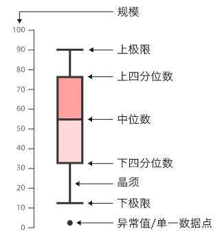
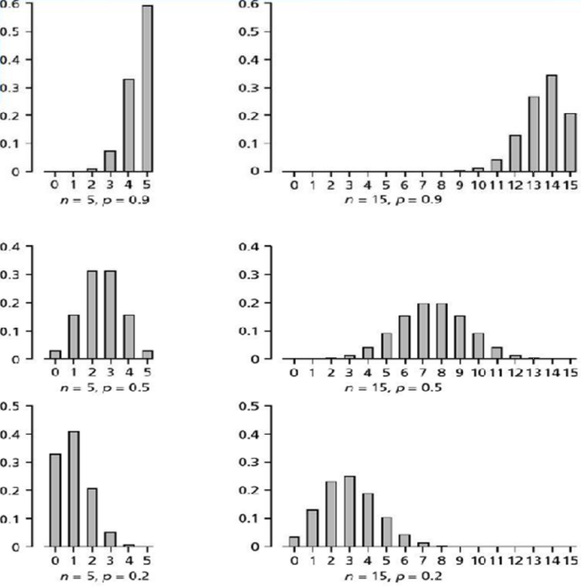
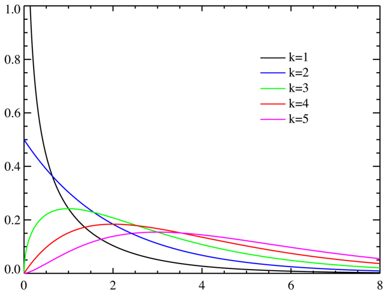
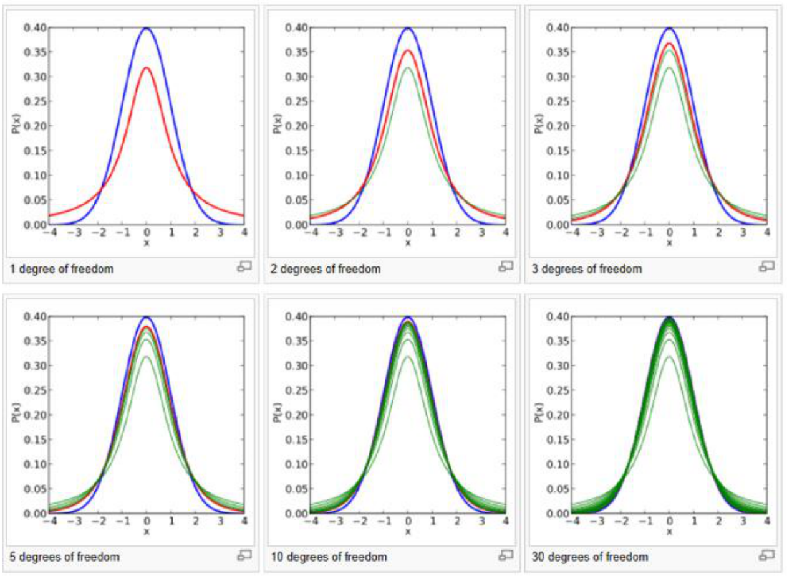
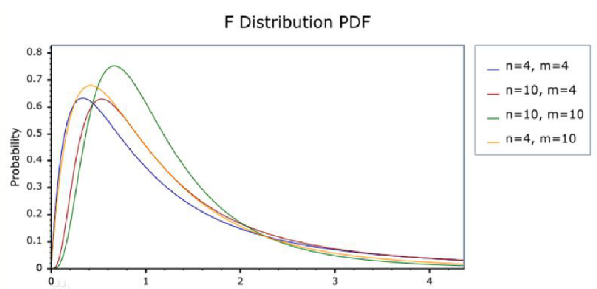

应用统计学 1
数学 | 笔记 | 经济学 | 统计学
应用统计学专业主要包括一般统计和经济统计两类专业方向，培养具有良好的数学或数学与经济学素养，掌握统计学的基本理论和方法，能熟练地运用计算机分析数据，能在企业、事业单位和经济、管理部门从事统计调查、统计信息管理、数量分析等开发、应用和管理工作，或在科研、教育部门从事研究和教学工作的高级专门化应用型人才。
2019-3-11

[应用统计学 2](blog.php?id=38)

## 第一章 统计学概述

什么是统计学（商务统计学）：把数据转为为有价值信息的一些做法和手段。

##### 统计学的分类

1. 描述统计学 & 推断统计学
   - 那些用来`描述数据`的图，表，和量化指标：描述性统计
   - 帮助决策制定者从少量数据中得出对全体数据特征`推断`的方法：推断统计
2. 理论统计学 & 应用统计学

##### 统计学的应用

- 根据统计学知识，合理地获取数据。（比如社会调查，国家统计局发布的数据；试验设计孟德尔遗传学试验）
- 根据统计学和概率论的知识，合理地做出判断。(线性回归；临床试验；时间序列分析；风险控制；空间分析)

## 第二章 数据收集与基本概念

### 数据收集

#### 数据收集的方法

1. 一手数据（原始资料）：试验方法；统计调查（电话，问卷，直接观察，访谈）
2. 二手数据（次级资料）：统计资料；爬下来的网络数据

#### 试验

验证`因果关系`需要排除其他因素的影响。个案不足以`科学地`证明药品的有效性，因为每个个体都具有`差异性`。

要使试验得出较为科学地结论须主要：

- 实验组 & 对照组（试验处理 & 安慰剂处理）
- 随机分组
- Blinding and double blinding

这样的试验也称为`随机对照试验`。

#### 调查方法

- 电话访谈：方便便宜；可能被拒接；时间要短，问题最好不是开放式；阶段介绍调查目的，告知保密；考虑时间，预算。

- 问卷调查：
    - `原则`：满足调查者需要，不要面面俱到；适合受访者；方便采集和数据处理；考虑时间和发放对象
    - `问卷中可以包含`：简介；调查者个人情况；开放式问题；封闭式问题
    - `避免的问题`：有倾向；概念不清；答案可能不一致

- 观察性研究
    - 观察性研究对象 / 个体在感兴趣的变量条件下进行`观察`，`且不试图去影响结果`。
    - 观察性研究的目的一般是对某个群体或情况进行`描述`。
    - 特点：通常，`只能得出相关关系而无法得出严谨的因果关系`；观察性研究往往会消耗更多的时间和资金
- 个人访谈：结构化和非结构化的访谈（是否有脚本）；问题可以是开放式的。

#### 数据收集相关问题

##### 偏差 bias

系统性的造成统计结构向某一方向扭曲的效应。`偏误和随机误差`不同，随机误差可能在某个观测上扭曲结果单最终这些扭曲都会抵消。

- 调查者误差：调查者提问方式，语气，眼神
- 不回复偏误
- 选择性偏误：受访者被选择方式不合理
- 观察者偏误：观察者之间的差别
- 测量误差
- 内部一致性：对照试验中保证单一变量
- 外部一致性：试验所得结论是否可以一般化。更换外部环境是否还成立。

#### 总结

数据收集的一般步骤：

1. 确定研究问题
2. 确定研究对象总体
3. 确定要采用的数据收集方式及具体问题
4. 进行小规模和抽样方法
5. 选择样本进行数据采集

### 基本概念

- 总体：调查目标的全部给他
- 样本：实际调差的从总体中选取的部分个体
- 普查：对总体进行的调差

基本数据的获取途径：`普查、抽样调查`

##### 抽样框

可以选择作为样本的`总体单位`列出名册或排序编号，以确定总体的抽样方法和结构。设计出了抽样框后，便可采用抽签的方式或按照`随机数表`

如：

- 对全校学生进行抽样，可以用全体学生的学号作为抽样框
- 我对全班同学抽样点名，全班同学的姓名就是我的抽样框

#### 抽样调查

`基本原则`：样本需要有代表性，要能够描述总体的主要特征。

1. 概率抽样，样本的选取以概率为基础：简单随机抽样、分层抽样、等距抽样、整群抽样
2. 非概率抽样，样本的选取不基于概率，而是根据认为判断或方便原则：方便抽样、主观抽样、配额抽样、滚雪球抽样

##### 如何保证样本有代表性

1. `总体`中的每一个`个体`都有相同的被抽到的可能
2. 每个个体被抽到的机会都是相等的

更加严格的简单随机抽样定义：

- 每个个体都是完全按照概率随机抽取的
- 每个个体在整个抽样过程中被抽到的概率都一致
- 每 k 个个体构成的子集和其他任意 k 个个体构成的子集被选择的概率都相等。

##### 简单随机抽样

方式：随机数表、电脑生成伪随机数、抽签

##### 等距抽样

1. 将总体所有个体按照一定的空间顺序排列起来进行编号
2. 计算抽样的间隔距离 $k = N / n$
3. 随机选取某个个体为起点，然后每隔 $k$ 个号码就抽取一个个体，直到抽完 $n$ 个样本

##### 分层抽样

1. 按照某个特征分成若干层
2. 计算各层中应抽取的个体单位数
3. 在各层中随机抽取

特点：关心分层的标志；层内差异小，层间差异大

##### 整群抽样

1. 将总体按照某特征分为不同群
2. 随机抽取几个
3. 对群中的所有个体进行调查

特点：适合群内差异大而群间差异小的总体（可以减少事前工作量，常用于区域抽样）

#### 数据类型和测度水平

按类型来说，数据可以分成下面四类：

- 定量数据：数量化的数据
- 定性数据
- 时间序列或纵观数据：同一个题不同时间的观测
- 横贯数据：同一时刻不同个体的观测

根据数据的测度水平分为四种，数据等级水平越高，所需要的分析方法也越高级。

- 名义数据（定类数据）
- 顺序数据（定序数据）
- 区间数据（定距数据）
- 比例数据（定比数据）

## 第三章　统计资料的描述

### 图形，图标描述

##### 散点图和折线图

散点图是用不同的位置的点来描述数据的一种图形，经常用来研究`两个指标`之间的`相关关系`。

折线图是利用曲线的升降来说明定量指标的图形，绘制简单，有很直观。

##### 条形图和饼图

条形图使用宽度相等的条形的高低或长短来表示数据变动特征的（还可以是横向和环状的）。图形宽度不表示数据大小，只需要选择与高度成恰当比例即可。主要用于对比。

1. 条形图的基点要从 0 开始
2. 条形宽度应该一致，且数据坐标的间距应相等
3. 条形的颜色要保持不变
4. 注意每个「条」之间是不接边的

饼图是以圆内扇形个数的多少盒圆内各扇形面积的大小来表示统计资料的图形。

主要用描述比例构成，有时也用于比较。

##### 直方图、频数统计表

将数据进行分组，就会形成不同的组别以及每一组分别相应出现的累计的`频数`，就是频数统计表。

也经常将分组的频数除以总的频数得到频率。

制作频数统计表要注意：

- 分组时要遵循「互斥原则」，每个数据只能属于一组；同时不能遗漏
- 尽量避免「空组」
- 分组最好不要太细也不要太粗略
- 组距要尽可能相等
- 因为经常会使组中值作为这个组的代表值，所以，尽量选择整数作为组中值。

##### 象形图和统计地图

象形图是利用形象直观的图像来表明统计资料的图形。（注意比例要与数据一致）

统计地图就是在地图上利用点，线，面等标志来比较各种指标数值的大小。

### 量化指标描述

`参数`：从**总体**计算得来的数值，只要总体不变，参数就是恒定的。

`统计量`：从**样本**计算得来的数值，样本抽取的不同，统计量一般不同。

总体参数通常是未知的，但是我们可以计算样本统计量，用样本统计量来估计总体参数。

##### 均值

$$
\mu = \frac{\sum_{i=1}^{N}x_i}{N}\\
\bar{x} = \frac{\sum_{i=1}^{n}x_i}{n}
$$

其中，$\mu$ 是总体均值，$\bar{x}$ 是样本均值。$N$ 表示总体大小，$n$ 表示样本大小。

##### 中位数

将所有数据从从小到大排列起来，正好处在中间的那个数字。

与中位数相似定义方法的还有各种分为点：

- 四分之一分为点
- 四分之三分为点

用极值，中位数，四分之一，四分之三分为点可以画出箱型图。（如下图）

##### 众数

全部数据中出现次数最多的数值。（主要众数和次要众数）

众数不仅可以代表数值的集中趋势，而且可以说明「典型性」，比如服装尺寸的确定。

当一个样本数据出现两个众数时，它提醒我们应该怀疑这样的数据是否来自两个总体。

只有在数据`比较多`，且集中趋势明显的情况下，众数才有意义。

##### 方差和标准差

总体方差 $\sigma^2$ 与样本方差 $s^2$
$$
\sigma^2 = \frac{\sum(x_i - \mu)^2}{N} \\
s^2 = \frac{\sum(x_i - \bar{x})^2}{n - 1}
$$
方差可以看作是`每个观测到平均值的平均距离`。

方差是描述`离散程度`的重要指标。

总体标准差 $\sigma$ 与样本标准差 $s$

##### 全距与变异系数

全距（range），一组数值中最大值与最小值的差。

变异系数：标准化了的标准差，或者说标准差与均值的比值：
$$
CV = \frac{\sigma}{\mu}(100\%)
$$

当比较两组均值差异较大的数值先对离散程度时，使用变异系数比标准差更合理。

样本的变异系数定义为：$CV = \frac{s}{\bar{x}}(100%%)$

在金融领域，变异系数 $CV$ 用来描述股票组合的相对风险。

##### 数据的标准化

$$
z = \frac{x - \mu}{\sigma}\\
z = \frac{x - \bar{x}}{s}
$$

数据标准化可以帮助我们比较两个来源分布有很大不同的数据。

## 第四章 概率，随机变量，分布

### 事件

产生单一但无法确定预知的结果的过程称之为`试验`。

试验所有可能出现的结果构成了一个`样本空间`。可以通过画树形图的方式列出样本空间中所有可能的结果。

在这个样本空间中，我们所感兴趣的单个或一些结果的集合就成为`事件`。或者说，事件是样本空间的一个非空子集。（单一事件 / 复合事件）

独立事件、互斥事件、独立事件与非独立事件

### 概率

本章大部分是「概率论数理统计」课的内容，在此简单记录。

概率的特点：[0, 1]，所有可能之和为 1，P(A) = 0 和 P(A) = 1 不一定表示不可能事件和必然事件。

如何确定事件的概率：

1. 古典概率法
2. 相对频数法
3. 主观观测法

概率的运算：

概率的两个特点；或并运算；$P(A | B)  = \frac{P(A | B)}{P(B)}$；独立事件；乘法法则 $P(E_1 and E_2) = P(E_1)P(E_2 | E_1)$；贝叶斯公式

### 随机变量

产生不可预知的结果的试验就称为`随机试验`（Random Experiment）。随机试验的结果称为`随机变量`（离散型随机变量 & 连续性随机变量）。

概率分布：随机变量的取值和其对应概率的罗列。

期望：$E(x) = \sum x \cdot p(x)$

方差：$Var(x) = \sum [x - E(x)]^2 \cdot p(x)$

#### 离散型概率分布

##### 二项分布 binomial distribution

如果一次实验满足以下条件，就称为「伯努利」试验：

1. 每次试验的结果只有两种
2. 每种结果在每次试验中中出现的概率相同
3. 每次试验都是独立进行的

如果进行 $n$ 次重复的伯努利试验，成功次数 $X$ 的概率就是二项分布。
$$
P(X = x) = C_{n}^{x}(1 - P)^{n - x}
$$
如果随机变量 $X$ 服从二项分布，则 $X \sim Bin(n, p)$

二项分布的数学期望为：
$$
E(X) = np
$$
方差为：
$$
Var(X) = np(1 - p)
$$
$n$ 越大，p 越接近 0.5，二项分布越趋于对称：

问题：二项分布中我们需要知道所有试验的次数；或者成功或者失败的次数。可有时候我们无法知道这些。

##### 泊松分布 Poisson distribution

1. 一个区间上成功次数的均值为 $\lambda$
2. 在一个区间上出现 $x$ 次成功的概率在其他相同大小的区间上都是相同的
3. 两个无交集区间内时间的发生都是独立的

$$
P(X = x) = \frac{\lambda^xe^{-\lambda}}{x!}
$$

若 $X \sim Poisson(\lambda)$，则 $E(X) = \lambda, Var(X) = \lambda$

##### 超几何分布 Hyper-geometric distribution

1. 试验的结果只有两种，{成功，失败}
2. 总体单位数有限并已知
3. 不放回抽样

假定 $N$ 个总体，其中 $X$ 个「成功」单位，进行 $n$ 次试验，$x$ 为 $n$ 次试验中「成功」的次数：
$$
P(X = x) = \frac{C_{N - X}^{n - x}C_X^x}{C_N^n}
$$

- **二项分布**中，如果 $n$ 很大，直接计算可能很困难，此时可以用**正态分布**做近似计算
- **二项分布**中，如果 $n$ 大于 $20$，$p$ 小于 $0.05$，可以用**泊松分布**做近似计算
- **超几何分布**总，如果 $N$ 很大，而 $n$ 很小，可以用**二项分布**做近似计算

#### 连续型概率分布

均匀分布（略）

指数分布：$f(x) = \lambda e^{-\lambda x}, \; x \ge 0$

正态分布：
$$
f(x) = \frac{1}{\sqrt{2 \pi} \sigma}e^{-(x - \mu)^2 / 2\sigma^2}
$$
标准化的 $z$ 服从标准正态分布：
$$
z = \frac{x - \mu}{\sigma} \sim N(0, 1)
$$
正态分布作为二项分布的近似：
$$
\mu = np \\
\sigma^2 = np(1 - p)
$$

## 第五章 抽样分布

`总体参数`：了解全体；抽样来了解这个总体比例，这个比例就是`样本统计量`；样本统计量由样本决定，是不确定的，是**随机变量**；样本统计量服从的概率分布就叫做`抽样分布`。

### 中心极限定理

当从均值位 $\mu$，标准差位 $\sigma$ 的总体中随机抽取一些列样本容量位 $n$ 的样本：$(X_1, X_2, \dots, X_n)$，那么：
$$
E\left(\frac{\sum_{i = 1}^n X_i}{n}\right) = \mu \\
Var\left(\frac{\sum_{i = 1}^n X_{i}}{n}\right) = \sigma
$$
通过简单随机抽样抽取一系列样本容量为 $n$ 的样本时，如果 $n$ `足够大`，样本均值的抽样分布可以近似为正态分布，即：
$$
\bar{x} \sim N(\mu, \sigma^2 / n)
$$

如果是从`正态总体`中抽取，同样近似上述正态分布，但是：

1. 可以为任意 $n$
2. 如果总体数量较少，或抽样比例占总体数超过 $5%$，且采取的是不放回抽样，那么抽样分布需要被修正为：

$$
\bar{x} \sim N(\mu, \frac{\sigma^2(N - n)}{n(N - 1)})
$$

### 其他的抽样分布

#### $\chi^2$ 分布

设 $X_1, X_2, \dots, X_n$ 为相互独立的随机变量，且都服从 $N(0, 1)$，则：
$$
\chi^2 = \sum_{i = 1}^n X_i^2
$$
服从自由度为 $n$ 的 $\chi^2$ 分布，记为 $\chi^2 \sim \chi^2(n)$

$\chi^2$ 分布是非负的**右偏分布**。

#### t 分布

设 $X \sim N(0, 1)$，$Y \sim \chi^2(n)$，并且 $X$ 与 $Y$ 相互独立，则：
$$
T = \frac{X}{\sqrt{\frac{Y}{n}}} \sim t(n)
$$
$T$ 服从自由度位 $n$ 的 $t$ 的分布

#### F 分布

$X \sim \chi^2(n_1)$，$Y \sim \chi^2(n_2)$，且 $X$，$Y$ 相互独立，则：
$$
F = \frac{X / n_1}{Y / n_2} \sim F(n_1, n_2)
$$
$F$ 分布有两个自由度，$n_1$，$n_2$
$$
F_{1 - \alpha}(n_1, n_2) = \frac{1}{F_{\alpha}(n_2, n_1)}
$$
