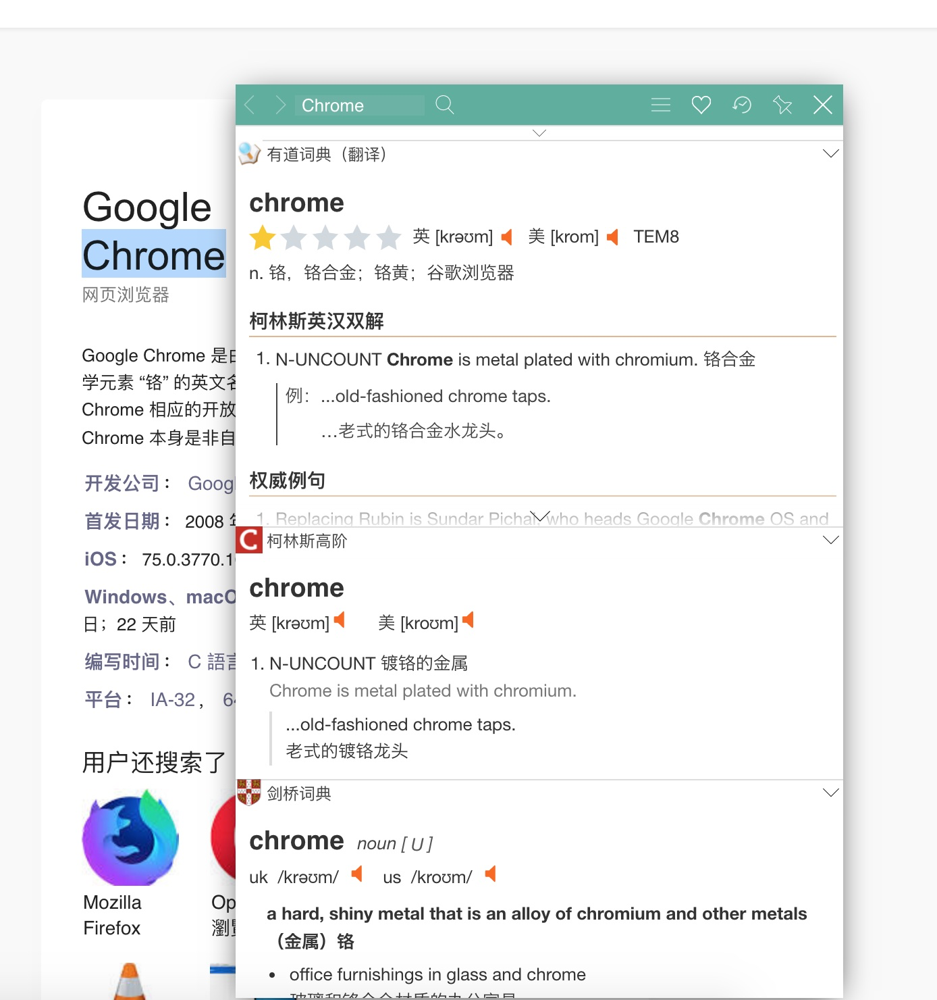
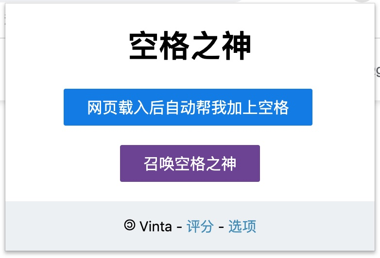
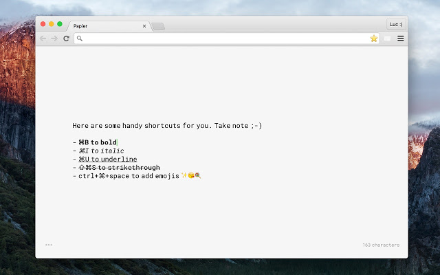
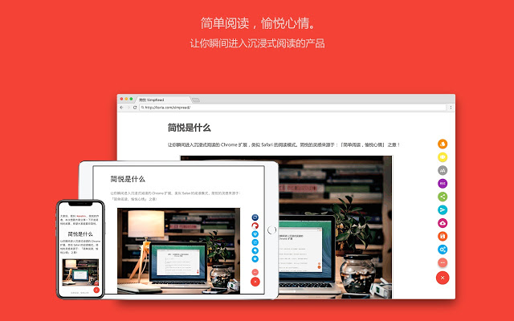
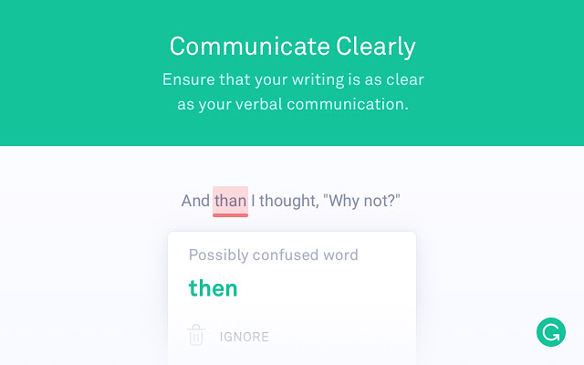
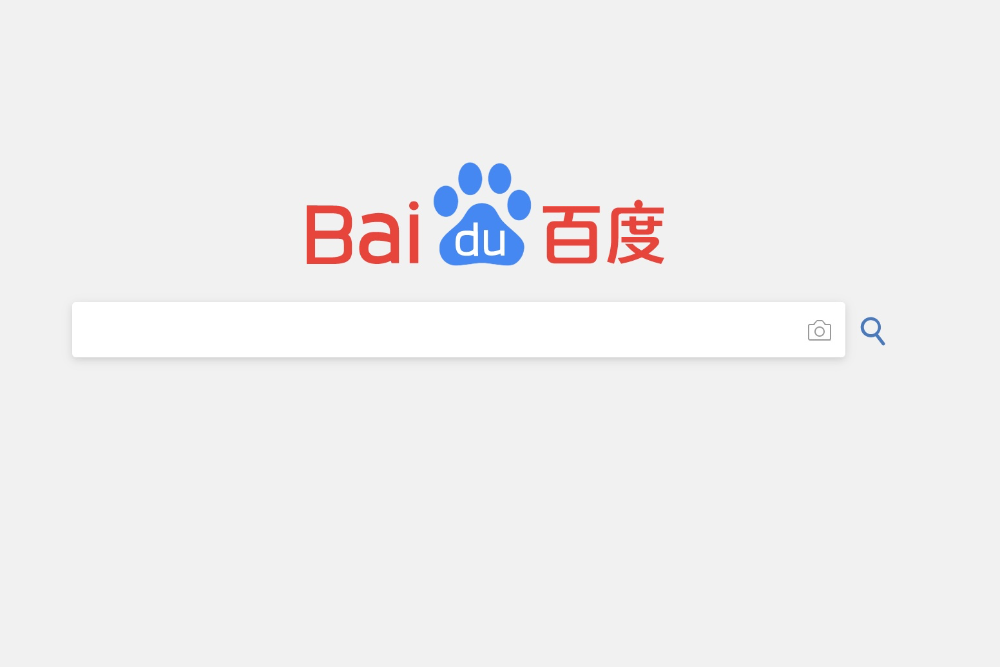
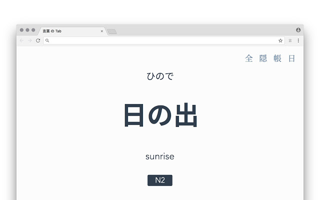
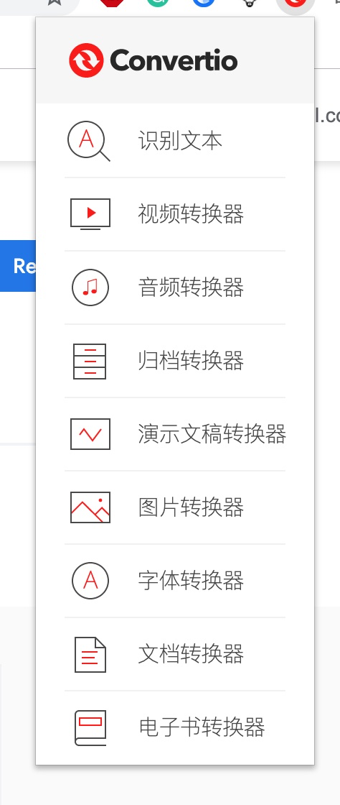

Chrome 插件推荐
Chrome | 浏览器 | 计算机 | 网页
Google Chrome 是由 Google 开发的免费网页浏览器。Chrome 是化学元素 “铬” 的英文名称，过去也用 Chrome 称呼浏览器的外框。Chrome 相应的开放源代码计划名为 Chromium，而 Google Chrome 本身是非自由软件，未开放全部源代码。
2019-7-14

推荐几个好用的 Chrome 插件。

热门：

1. Adblock Plus：广告拦截
2. OneTab：暂存标签
3. 下载 +：Chrome 下载标签
4. Evernote Web Clipper：印象笔记网页剪裁
5. Momentum：好看的新标签页

主要想推荐几个冷门的。（Chrome 插件商店需要科学上网哦）

## 沙拉查词 - 聚合词典划词翻译

Chrome web store: [沙拉查词 - 聚合词典划词翻译](https://chrome.google.com/webstore/detail/沙拉查词-聚合词典划词翻译/cdonnmffkdaoajfknoeeecmchibpmkmg)

>  Saladict 沙拉查词是一款专业划词翻译扩展，为交叉阅读而生。大量权威词典涵盖中英日韩法德西语，支持复杂的划词操作、网页翻译、生词本、PDF，以及 Vimium 全键盘操作。

之前孤陋寡闻，之前一直不知道这么好用的查词插件。

划词，点击查词、翻译整句，整合了例如有道词典，柯林斯高阶词典，必应词典，谷歌翻译等一系列网络词典，多种语言（其他语言需要在设置中调整哦）

## 为什么你们就是不能加个空格呢？

Chrome web store: [为什么你们就是不能加个空格呢？](https://chrome.google.com/webstore/detail/為什麼你們就是不能加個空格呢？/paphcfdffjnbcgkokihcdjliihicmbpd)

自动在网页中所有的中文字和半形的英文、数字、符号之间插入空白。

> 如果你跟我一樣，每次看到網頁上的中文字和英文、數字、符號擠在一塊，就會坐立難安，忍不住想在它們之間加個空格。這個 Google Chrome 的外掛正是你在網路世界走跳所需要的東西，它會自動替你在網頁中所有的中文字和半形的英文、數字、符號之間插入空白。
> 漢學家稱這個空白字元為「盤古之白」，因為它劈開了全形字和半形字之間的混沌。另有研究顯示，打字的時候不喜歡在中文和英文之間加空格的人，感情路都走得很辛苦，有七成的比例會在 34 歲的時候跟自己不愛的人結婚，而其餘三成的人最後只能把遺產留給自己的貓。畢竟愛情跟書寫都需要適時地留白。

## Papier

Chrome web store:[Papier](https://chrome.google.com/webstore/detail/papier/hhjeaokafplhjoogdemakihhdhffacia)

>  Did you know that the average person has about 60,000 thoughts a day? And that we spend about 7 hours looking at screens? Now with the Papier extension for Chrome, just open a new tab and trap your best thoughts. They'll be backed up directly to Chrome: no accounts, no syncing. 
>
> Simple, clean, and distraction-free, Papier declutters your thoughts so you can focus on the content. Let nothing get in the way of your notes.

能够把 Chrome 新标签当做临时的笔记本。

## 简悦 - SimpRead

Chrome web store: [简悦 - SimpRead](https://chrome.google.com/webstore/detail/simpread-reader-view/ijllcpnolfcooahcekpamkbidhejabll)

> 让你瞬间进入沉浸式阅读的 Chrome 扩展，类似 Safari 的阅读模式。

简悦原创功能自动提取标题、描述、正文、媒体（ 图片 / 视频 ）  等资源生成，符合中文阅读习惯的页面， 零干扰、沉浸式，适合深入阅读。独有的词法分析引擎，自动识别出 Wordpress、Hexo、Ghost、Discuz，只要是 结构良好的页面 均可自动生成阅读模式。

## Grammarly for Chrome

Chrome web store: [Grammarly for Chrome](https://chrome.google.com/webstore/detail/grammarly-for-chrome/kbfnbcaeplbcioakkpcpgfkobkghlhen)

帮你改正浏览器输入框中的英文语法错误，同时 Grammarly 还有配套的软件（多平台），英语课写作业神器。

## Stylus

Chrome web store: [Stylus](https://chrome.google.com/webstore/detail/stylus/clngdbkpkpeebahjckkjfobafhncgmne?utm_source=chrome-ntp-icon)

本来原来的插件叫 **Stylish**，但是因为涉嫌窃取用户隐私，曾被下架，stylus 就是一个免费的替代品，基于 Stylish 1.5.2 版本开发的分支，这是 Stylish 原作者维护的最后一个版本。在此基础上，Stylus 重写并优化了大部分代码来提升性能。

访问插件商店中免费下载各种网页样式，比如 Google 和 Wiki 的 Material Design、微博，百度 Lite，以及全局思源黑体等等。如果你掌握一些 CSS，就能够轻松修改网页样式。或者自己去除指定网页的广告（*display: none*）

下图是 百度 Lite 的样式：

## Eagle - 图片灵感收藏工具

Chrome web store: [Eagle - Save images faster than ever](https://chrome.google.com/webstore/detail/eagle-save-images-faster/lieogkinebikhdchceieedcigeafdkid)

其实这是一个软件的 Chrome 插件，这里推荐 [Eagle](https://cn.eagle.cool/) 这个图片管理工具。¥199 激活两台设备。

## 言葉 の Tab

Chrome web store: [言葉 の Tab](https://chrome.google.com/webstore/detail/言葉-の-tab/lacmiiahoideajihiclkhmdkikkbjcnb)

> A minimal Chrome / Firefox extension to help you learn Japanese words in each new tab.

新建标签页学习日语，相较于日常的日语单词来说，这个标签页可以选择 JLPT 不同等级的单词，难度更大，背词效率更高。

这个标签页基于的电子词典：[jisho.org](https://jisho.org/)

作者通过爬虫，爬取这个词典的所有词汇，制作了一个除了可以选择 JLPT 等级，还能选择词汇类型的背词软件，详情请见页面：[日语背词小程序](blog.php?id=31)

## Convertio

Chrome web store: [Convertio](https://chrome.google.com/webstore/detail/convertio/eppjkefeiehhflmgkhdooajgbkkegpcl)

在线将文件从一种格式转换为另一种格式. 支持超过 2500 种不同的转换。

