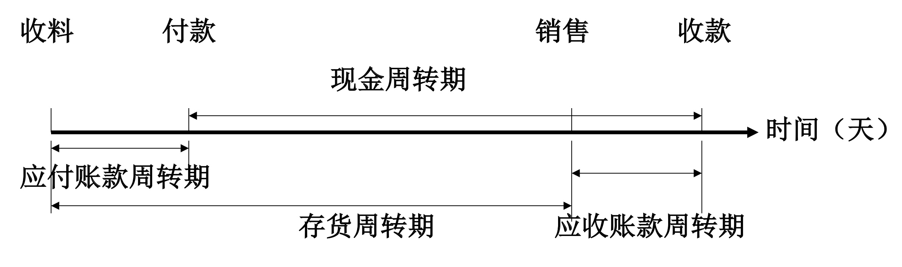

财务管理复习大纲 2
财务 | 管理 | 笔记
财务管理是在一定的整体目标下，关于资产的购置（投资），资本的融通（筹资）和经营中现金流量（营运资金），以及利润分配的管理。财务管理是企业管理的一个组成部分，它是根据财经法规制度，按照财务管理的原则，组织企业财务活动，处理财务关系的一项经济管理工作。简单的说，财务管理是组织企业财务活动，处理财务关系的一项经济管理工作。
2019-7-19

[财务管理复习大纲 1](blog.php?id=42)

## 投资决策原理

### 项目投资概述

项目投资：以特定项目为对象，直接与**新建项目**或**更新改造项目**有关的长期投资行为。

- 新建项目：以新增生产力为目的
- 更新改造项目：以恢复或改善现有生产力

特点：投资数额大， 建设期长，收益时间长，投资风险大

项目投资决策需要考虑的因素：资金时间价值、资本成本、现金流量，风险价值

项目投资的相关概念：

1. 项目计算期：$n = s + p$（计算期 = 建设期 + 经营期）
2. 原始投资额：为达到设计要求投入的（原始投资额 = 固定资产上的投资 + 流动资产上的投资 + 其他资产上的投资）
3. 投资总额 = 原始投资额 + 资本化利息

### 现金流量的内容即估算

现金流量：是指投资项目在计算期内，因资本循环而可能或应该发生的各项现金流入量与流出量的统称。

<u>与现金流量表的区别</u>：反映的时期、现金流量内容不同。

考虑现金流量的原因：

1. 资金时间价值
2. 摆脱权责发生制的弊端（由于会计方法不同，使利润指标没有可比性）
3. 不考虑非现金流量的运动，简化评价指标的计算

现金流量的分类：

- 初始现金流量：建设期支出。如投资钱费用，各种设备费用，建筑费用，营运资本垫支，不可预见支出
- 营业现金流量：营业期流入流出。如收入，付现成本
- 终结现金流量：发生在项目期满。如回收固定资产残值，回收流动资金，停止使用土地的变价费用

### 现金流量的计算

现金流量理论公式：

净现金流量 = 流入量 - 流出量
$$
NCF_t = CI_t - CO_t
$$

现金流量的简算公式

建设期：$NCF_t = -I_t$，其中 $I_t$ 表示第 $t$ 期原始投资额。

经营期：$NCF_t$ = 该期净利润 + 折旧 + 摊销额 + 利息费用 + 回收额

### 项目投资决策基本方法

按照是否考虑资金的时间价值进行分类：

1. 动态评价法：净现值、净现值率、现值指数、内含报酬率、动态回收期
2. 静态评价法：投资利润率、静态回收期、会计收益率

#### 静态评价指标

静态评价指标的特点：简单易行。

投资利润率：ROI（Return on Investment）

经营期年平均利润率占总投资的百分比。ROI 越高，经济效益越好

缺点：没有考虑项目计算期内的现金流量；没有考虑资金时间价值；

静态回收期：PP（Payback Period）

是指经营期净现金流量抵偿原始投资所需要的全部时间（包括建设期）。

缺点：没有考虑资金时间价值；没有考虑回收期以后的现金流量；

> 因此，静态评价指标只能作为辅助的评价指标，不能作为取舍项目投资的标准。

#### 动态评价方法

净现值：NPV（Net Present Value）

按照行业基准收益率或者其他折现率，计算各年净现金流量现值和。NPV 大于零则项目可行。

净现值率：NPVR（Net Present Value Rate）

NPVR = （净现值 / 原始投资额现值）的和，同理，大于零项目可行。

现值指数：PI（Present Index）

PI = **经营期**的的净现金流量现值和 / 原始投资额现值和（注意和净现值率区分）。PI 大于 1 项目可行。

内部收益率：IRR（Internal Rate of Return）

项目实际渴望达到的报酬率，即**净现值**等于零的折现率。
$$
NPV = \sum_{t = 0}^{n}\frac{NCF_t}{(1 + IRR)^t} = 0
$$
其实求出的 IRR 就是内部收益率。$IRR > i$ 则项目可行。（$i$ 是行业基准收益率或投资者希望的报酬率）

动态回收期：DCPP（Discounted Payback Period）

类比于静态回收期，计算时换成现值计算。

>对于一个项目，若 NPV > 0，则 NPVR > 0，PI > 1， IRR > i.

## 投资决策实务

### 固定资产更新改造决策

背景：旧设备还能用，但相比新设备耗能高，产量低等情况出现时，企业可以更换旧设备。

决策方法：净现值法、差量分析法

差量分析法：

原理：计算项目期内，新设备相比于旧设备能增加的净现金流量 $\Delta NPV$。

计算步骤：

1. 计算增加的原始投资额（因为是计算净现金流量，所以计算用负值）、每年增加的折旧额
2. 计算增加的净利润（营业收入变动 - 付现成本变动 - 折旧额变动 - 税）
3. 计算净现金流量现值变动

### 资本限量决策

背景：企业资金有限，不能投资于所有项目。

决策原则：净现值最大的项目（方法：获利指数法、应用净现值法）

获利指数法：

1. 列出每个项目的获利指数和原始投资额。
2. 接受 $PI > 0$ 的项目，如果资金足够，则资本没有限量，决策完成。
3. 列出所有在资本限量内的组合，然后计算组合的加权平均获利指数。
4. 接受加权平均最大值

应用净现值法：

1. 列出所有项目净现值和原始投资额。
2. 后面的步骤同上，但是统计 $NPV \ge 0$ 的项目

### 项目寿命周期不等的决策

背景：项目的寿命不同，所以不能对净现值、内部收益率等指标直接比较。

解决办法：最小公倍数法，年均净现值法

最小公倍数：将项目复制「经营期最小公倍数 / 经营期​」次。（建设期放在第一年经营期之前，与上一个经营期重叠无妨）

年均净现值法：把项目的总净现值转化为项目的每年平均净现值 $ANPV$.
$$
ANPV = \frac{NPV}{PVIFA_{i, n}}
$$

### 风险型决策

定义：考虑了影响投资项目的不确定因素的决策，叫做不确定性投资决策，或者风险投资决策。

方法：风险调整折现率法、肯定当量法、决策树法、敏感性分析、场景概况分析、蒙特卡洛模型分析。

肯定当量法：将不肯定的期望现金流量，按照**当量系数**折算成约当的肯定的现金流量，然后用无风险报酬率来进行风险投资决策分析。

1. 当量系数的确定：根据预期现金流量的标准率差，标准率差越大，风险越大，当量系数越低。
2. 确定约当的现金流量：约当的现金流量 = 肯定当量系数 $\times$ 净现金流量期望值

题目会给出：每年可能的 NCF 值以及每个值出现的概率，以及净现金流量离差率对应的肯定当量系数表。

解题步骤：

1. 计算净现金流量的期望值
2. 计算标准离差
3. 计算标准离差率 $R = \sigma / NCF$
4. 计算约当净现金流量
5. 用约当净现金流量计算净现值（求 IRR 比较也可行）

## 流动资产的管理

### 营运资本

营运资本广义：企业全部营运资本，即在生产经营活动中流动资产占用的资金。

营运资本狭义：企业的净营运资本，即企业的流动资产 - 流动负债的差额（通常营运资本指狭义）

经济含义：流动资产是资金的占用，流动负债是短期资本来源；用流动负债解决部分资金占用后，尚需**占用的资金**即是营运资本。

营运资本管理的目的：在满足生产经营的需要的前提下，尽量减少资金的占用，加快资金周转速度。

内容：流动资产的管理和流动负债的管理。

流动资产：可以在一年或者超过一年的营业周期内变现或者消耗的资产。

特点：周转快，变现能力强，财务风险小

流动资产的分类：

- 按存在形式分：现金、可交易性金融资产、应收账款、预付账款、存货
- 按生产经营所处的领域分：生产（原材料，在产品，低值易耗品），流通（产成品，现金），生息（银行存款，可交易性金融资产）

### 现金管理

现金：企业以各种货币形式占用的资产，包括库存现金、银行存款以及其他货币资金。

持有现金的动机：交易：日常交易目的；预防：应付意外事件（最低现金储备取决于：现金流预测的准确度、临时融资能力的强弱、对风险的偏好）

投机动机：投机目的

**持有现金**的成本：

1. 机会成本：保留现金余额增加的管理费用以及丧失的再投收益。
2. 转换成本：企业购入和转让有价证券时，换取现金时付出的交易费用
3. 短缺成本：现金量不足又无法及时转让有价证券以补充而给企业带来的损失

现金管理的**目的**：保证生产经营所需的现金，尽可能节约现金，减少持有量，将闲置现金用于投资获取一定的投资收益。

现金管理的**内容**：编制现金预算、确定最佳持有量、现金的日常管理

#### 编制现金预算

收支预算法：

将现金收支分类列入现金预算内。从而确定余缺并采取适当的财务政策。

现金预算编制的内容：期初现金余额；预测现金流入、流出量；确定现金余缺；（融通资金）；期末现金余额；

调整净收益法：在预计的利润表基础上，把净利润调整为净现金流量。

#### 最佳现金持有量的确定

##### 因素分析模式

根据上年实际占用率，和本年有关因素预测变动，来进行调整。（该方法认为：现金持有量**与销售收入成正比**）

最佳现金持有量 = （上年平均占用 - 不合理占用）* （1 + 预计销售收入变动）

##### 现金周转模式

最佳现金持有量与现金周转时期负相关。

现金周转期：现金从投入生产经营开始，最后又转化为现金的时间。

现金周转模式步骤：

第一步：计算现金周转周期：周期 = 应收账款周转期 - 应付账款周转期 + 存货周转期

第二步：计算**现金周转率** = 360 / 现金周转期（单位：次 / 年）

第三步：确定最佳现金持有量 = 年现金需求总量 / 现金周转率

##### 存货模式

原因：主要考虑现金的**转换成本**和持有成本中的**机会成本**，不考虑短缺成本和持有成本中的管理费用。

应用前提：现金需求量一定且可预知、现金支出稳定、现金可立即补充、证券投资报酬率和每次固定交易费用可预知。

计算原理：

年机会成本 = $\frac{1}{2}KQ$，年转换成本 = $\frac{T}{Q}F$

其中：$K$ 表示机会成本（有价证券收益率），$Q$  现金持有量，$T$ 预算期内现金需求总量，$F$ 每次转换成本

所以年总成本 = 年机会成本 + 年转换成本
$$
TC = \frac{1}{2}KQ + \frac{T}{Q}F \quad \quad K, T, F 已知
$$
求 $Q$ 为多少，$TC$ 最小。

所以
$$
Q^* = \sqrt{\frac{2TF}{K}} \\
TC = \sqrt{2TFK}
$$

##### 成本分析模式

只考虑现金持有成本中的**机会成本和短缺成本**。（加起来取决小持有方案）

##### 随机模式

将不确定因素引入现金管理中。（现金流量每日随机波动，无法准确预测）

应用前提：当日现金流入、流出量是随机变化不可预知的。

控制原理：将现金余额控制在一个较为理想的范围内。（通过买卖有价证券调节在一个上下限之间）
$$
Z = \sqrt[3]{\frac{3F\delta^2}{4K}} + L \\
H = 3Z - 2L \\
AVE = \frac{H + Z + L }{3}
$$
$Z$ 最佳现金余额，$H$，$L$ 上下限，$K, F$ 同存货模式，$\delta$  每日现金余额标准差。

### 应收账款管理

#### 应收账款的功能与成本

功能：促销、减小存货

##### 成本

机会成本

成本计算：**机会成本 = 平均余额 * 资金成本率**

是其中平均余额 = 年赊销额 / 360 * 平均收账天数；平均收账天数计算加权平均值；

管理成本：

对应收账款进行管理而消耗的开支，主要包括对客户的资信调查费、账簿记录费、收账费用

坏账成本：由于坏账带来的损失

#### 信用政策

是企业对应收账款投资进行规划与控制而确立的基本原则与行为规范。

##### 信用标准

是客服获得企业商业信用所具备的最低条件。通常以**预期的坏账率**来表示。

制定标准考虑的因素：

1. 同行竞争
2. 承担违约风险的能力
3. 资信程度

##### 信用条件

接受信用订单时，提出的付款条件，包含：

1. 信用期限
2. 折扣期限：客户可以享受现金折扣的付款期限
3. 现金折扣：在折扣期限内，享受的折扣百分比

表示方法：（2/10, N/30）

意为：（折扣百分比 / 折扣期限，全额付款 / 信用期限）

##### 收账政策

客户违反信用条件，企业所采取的的收账策略与措施

作用：计算相关损益来选选择不同收账政策。

计算包含：
1. 变动成本：变动成本率；
2. 应收账款成本：
   1. 坏账成本：坏账损失率；
   2. 机会成本：见「3.3.1 应收账款的功能与成本」；
   3. 收账费用

相关损益 = 年赊销收入 - 变动成本 - 应收账款成本

#### 应收账款的日常管理

##### 客户的信用调查

调查方法：

1. 直接调查：调查人员与被调查单位直接接触，通过当面采访、询问、观看、记录等方式
2. 间接调查（信息来源：财务报告、专业信用评估机构发布的评估报告、开户和提供贷款的银行、财务部门、消费者协会、工商管理部门等）

##### 客户的信用评估

评估方法：

1. 5C 评估法：品质（chracter）、能力（capacity）、资本（capital）、抵押品（collateral）、条件（condition）
2. 信用评分法：对财务指标、信用情况进行评分，然后加权平均

##### 应收账款的账龄分析

编制应收账款的账龄分析表，对应收账款的回收进行有效控制。

反应的信息：折扣期内付款次数、信用期限内付款次数、信用期限后、拖欠可能成为坏账

控制措施：调整信用政策：信用标准、条件；收账政策

## 存货管理

### 存货的功能与成本

功能：

1. 保证生产经营的正常进行；
2. 适应市场变化；
3. 降低进货成本；
4. 维持均衡生产；

成本：

1. 进货成本：采购成本、订货费用（办公费、差旅费、通讯费）
2. 存储成本：机会成本、仓储费用、保险费用、存货残损变质损失等。
3. 短缺成本：存货不足带来的损失

### 存货的控制方法

#### 存货经济批量模型

基本假设：

1. 进货总量可预测
2. 消耗和销售比较均衡
3. 价格稳定、不存在数量折扣、不用提前订货
4. 不允许出现缺货

该模型只考虑全年的**订货费用和存储成本**。

类似于最佳现金持有量的确定（3.2.2.3 存货模式）
$$
Q = \sqrt{\frac{2AB}{C}} \\
T_c = \sqrt{2ABC} \\
N = \frac{A}{Q}
$$
其中：$Q$：经基进货批量、$A$：年度计划进货总量；$B$：平均每次订货费用；$C$：单位存货年存储成本

> 如果存在数量折扣，如何制定经济进货批量？

考虑：

1. 采购成本与订货量相关；
2. 订货费用与进货量成反比；
3. 存储成本与进货量成正比；

做法：

1. 先确定无折扣的 $Q$
2. 再考虑不同批量下（用临界值计算）存货总成本 $T_C$（此时应该用进货成本 + 存储成本计算），找出最优解

#### 存货的 ABC 分类控制法

分类标准：金额标准、数量标准（金额标准是基础、数量标准作参考）

ABC三类存货**金额**占比比重大致为：
$$
A:B:C = 0.7:0.2:0.1
$$
ABC 三类存货**品种数量**占的比重大致为：
$$
A:B:C = 0.1:0.2:0.7
$$
三类存货具体划分步骤：

1. 列出全部存货明细表，计算每种存货价值总额和占全部存货金额百分比
2. 按存货金额由大到小排序并累加金额百分比
3. 累加到 70% 左右的所有存货为 A 类，70% - 90% 为 B 类，剩下 C 类

控制原则：

A 类存货：重点控制。按品种、类别进行经济批量和存储期分析等。

C 类存货：灵活掌握。不必进行上述各方面的测算与分析。

B 类存货：次重点控制。

## 股利分配政策

### 股份利分配原则与程序

股利分配含义：企业有了所得要依法记性分配；股份制企业叫做股利分配；非股份制企业叫做利润分配。

分配原则：

1. 依法分配原则
2. 兼顾各方面的利益原则：兼顾大股东、中小投资者利益
3. 分配与积累并重的原则：考虑企业发展对资本的需要，也要考虑对投资者的回报

分配程序：

1. 弥补亏损
2. 提取法定盈余公积金
3. 提取任意盈余公积金
4. 向投资者利润分配

### 股利分配政策的选择

影响因素：

1. 法律：资本保全、资本积累、偿债能力、超额积累利润约束
2. 股东：控制权、避税、稳定收入、规避风险
3. 公司：举债、未来投资、盈余稳定、资产流动
4. 其他：债务合同限制、通货膨胀

#### 常用分配政策

剩余股利政策：

1. 根据投资需求，确定投资需要资本
2. 根据公司最优目标资本结构，确定所需筹集的自由资本的数额
3. 最大可能利用留存收益来满足这一需要
4. 只有在其利益满足最优资本预算的需要还有剩余的情况下，才发放股利

优点：保持理想的资本结构，使加权平均资金成本最低

确定：股利支付水平不稳定，不利于股票价格上涨

固定股利政策：

在一定时期，每期支付的股利保持不变。

优点：向投资者传递公司经营业绩稳定的信息，有利于公司股票市价的稳定。

缺点：业绩不佳时，容易引起财务困难。

稳定增长股利政策：

保持每期有一个稳定增长的股利分配政策。

优点：传递稳定增长信号，股票稳定

缺点：易引起资金短缺，导致财务状况恶化

固定股利支付率政策：

股利支付率 = 股利 / 净利润

优点：不会造成较大财务负担

缺点：产生经经营不稳定印象，不利于股票

固定低股利加额外分红政策：

每次都支付稳定的、较低的正常股利，当企业业绩较好时在发放额外的分红。

优点：较大灵活性，给企业较大的弹性。

#### 股利支付的程序

1. 由公司董事会根据公司盈利水平和股利政策，制定分派方案
2. 提交股东大会审议，通过后生效
3. 想股东宣布
4. 在规定方法日派发

股利支付的重要日期：

- 股利宣告日
- 股权登记日：有权领取本期股利的股东资格登记截止日期
- 除息日：除权日，除息日当日以后买入的股票不再享有本次股利分配的权利
- 股利支付日：正式发放

#### 股利支付方式

现金、股票、财产（实物或者有价资产）、负债

我国上式公司只允许用前两种。